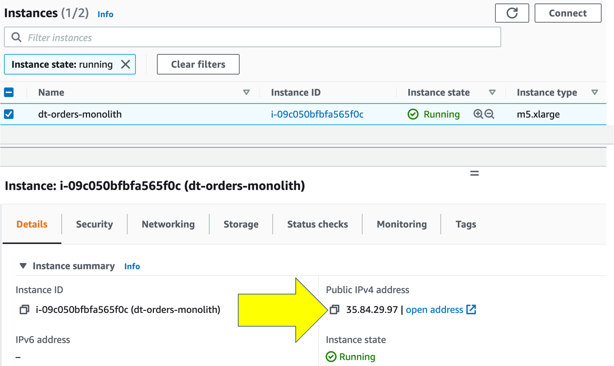
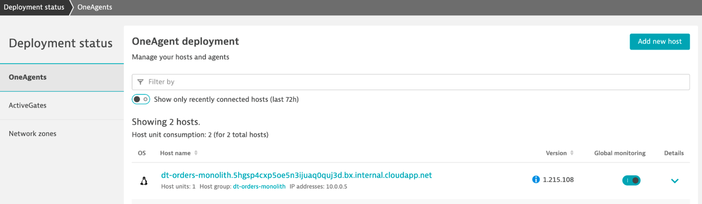
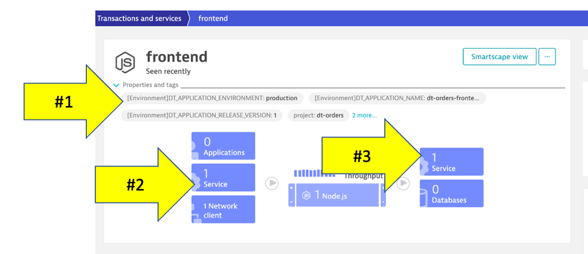
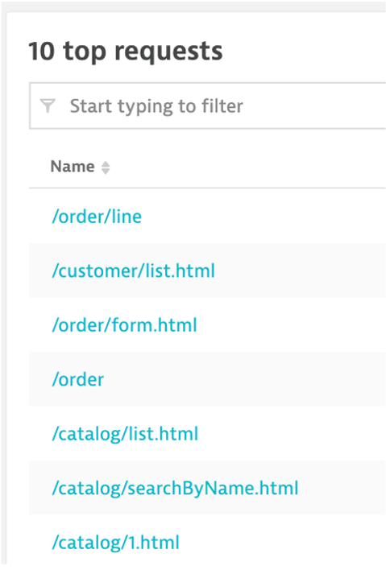
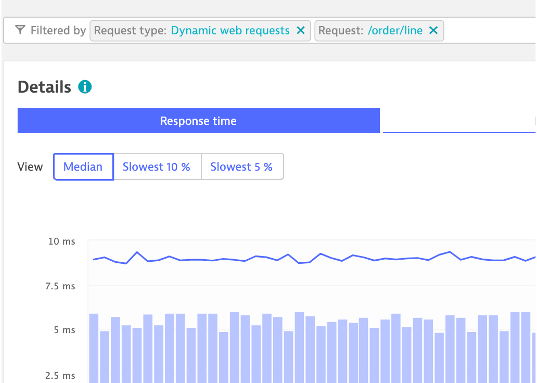
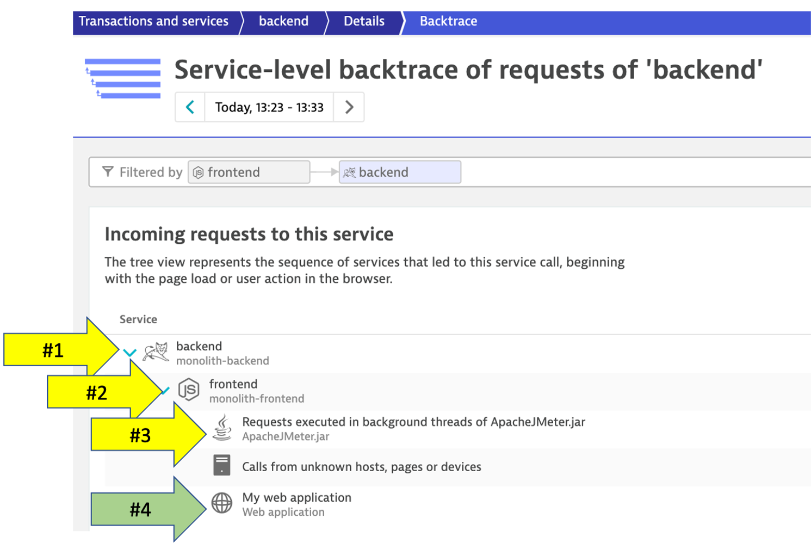

id: aws-lab1
categories: 
status: Published
tags: modernization
# Lab 1 - OneAgent Observability

## Overview

While choosing the right migration strategies, such as re-hosting or re-architecting, one must access the different risks, costs, and benefits. However, often the details of what is where and what is dependent on what within the technical stack is missing or poorly documented.  All that may exist is out of date diagrams and a mix of monitoring tool metrics that must be "stitched" together.

Not having enough details about the current environment is hindering organization's ability to make the right decisions when planning what to migrate and when.

To address this problem, Dynatrace’s OneAgent can automatically discover the application, services, processes and to build a complete dependency mapping for the entire application environment. So, let’s begin!

### Objectives of this Lab

🔷 Review Dynatrace OneAgent

🔷 Review real-time data now available for the sample application

🔷 Review how Dynatrace helps with modernization planning

## Lab Setup

For this lab you are going to setup an EC2 instance that runs a Sample application that you can use to learn the Dynatrace web UI and to review how Dynatrace brings tremendous insights all through the OneAgent.

Referring to the picture below, here are the components for lab 1.

**#1 . Sample Application**

Sample app representing a simple architecture of a frontend and backend implemented as Docker containers that we will review in this lab.

**#2 . Dynatrace monitoring**

The Dynatrace OneAgent has been installed by the workshop provisioning scripts and is communicating to your Dynatrace Tenant.

### 💥 **TECHNICAL NOTE** 

*Learn more about the various ways the OneAgent can be installed, in the <a href="https://www.dynatrace.com/support/help/setup-and-configuration/dynatrace-oneagent" target="_blank">Dynatrace documentation</a>*

**#3 . Load generator process**

A <a href="https://github.com/dt-orders/load-traffic" target="_blank">JMeter</a> process sends simulated user traffic to the sample app running within a Docker container. You will not need to interact with this container, it just runs in the background.

### 💥 **TECHNICAL NOTE**: 

*A real-world scenario would often start with the application components running on a physical or virtualized host on-prem and not "Dockerized". To simplify the workshop, we "Dockerized" the application into a front-end and back-end. In Dynatrace, these Docker containers all show up as "processes" on a host just like a "non-Dockerized" application will.*

### Sample app

The sample application is called Dynatrace Orders.  A more detailed overview can be found <a href="https://github.com/dt-orders/overview" target="_blank">here</a>.  All the source code can be found <a href="https://github.com/dt-orders" target="_blank">here</a>.

### Get the Public IP to the frontend of the Sample Application.

To get the Public IP, open the `EC2 instances` page in the AWS console. On the newly created host `dt-orders-monolith` find the `Public IP` as shown below.

### View the Sample app in a Browser

To view the application, paste the public IP using `HTTP` NOT `HTTPS` into a browser that will look like this:

Use the menu on the home page to navigate around the application and notice the URL for key functionality.  You will see these URLs later as we analyze the application.

* Customer List = `customer/list.html`
* Customer Detail - Each customer has a unique page = `customer/5.html`
* Catalog List = `catalog/list.html`
* Catalog Search Form = `catalog/searchForm.html`
* Order List = `order/list.html`
* Order Form = `order/form.html`

## Host view

In the next few sections, you will review what the OneAgent automatically discovered for the host, services, processes, and the complete dependency mapping for the sample application.  

### 👍 How this helps

As you plan your migration, each of these views will give insights into accessing the profile, consumption and dependencies to other systems and services.

### Review OneAgent Deployment Status

The host running the sample application were all created using scripts that installed the sample application and to install the Dynatrace OneAgent.  Since we don't have to install the OneAgent now, let's just review its status.

1. Login into Dynatrace

1. Choose the `Deployment status` option from the left side menu to open the OneAgent deployment page.

### Review Hosts

From the left-side menu in Dynatrace choose `Hosts` then click on the host with the name `dt-orders-monolith`.

On host page, you will see basic infrastructure information for the host.

1. Now expand the `Properties` section to see data about the host:
1. Host resource metrics (CPU, memory)
1. Host availability
1. Discovered processes. The sample app is Node and Java based

### About Smartscape

Enterprises have many hosts, services, and application that are ever changing. The ability to automatically discover and change as the environment changes is a key feature that Smartscape delivers.  

Dynatrace's near real-time environment-topology visualization tool, Smartscape, is where Dynatrace's auto-discovery is delivered into a quick and efficient visualization of all the topological dependencies in your infrastructure, processes, and services.

### 👍 How this helps

Smartscape shows all the dependencies of a given service. Those include connections to queues, web servers, app servers, and a native process. The host view shows historical and live time-series data for usage as well as the consuming processes. This information allows us to better plan the migration, as all depending services must be considered during the migration.

Referring to the picture above: 

* On the horizontal axis, it visualizes all ingoing and outgoing call relationships within each tier
* On the vertical axis, it displays full-stack dependencies across all tiers
    * Data center
    * Hosts
    * Process
    * Service
    * Application

## Review Smartscape

Let’s see how Dynatrace can visualize these processes using Smartscape.

1. Be sure you are on the `dt-orders-monolith` host page
1. Just click on the `...` box on the to the right of the host name
1. pick `Smartscape view` menu option
1. this will open Smartscape filtered to this Host Instance

Feel free to explore the Smartscape.

## Process

In the Smartscape view, we saw the visualizations of the relationships in vertical stack and as well as the relationships spatially. Now let’s view the processes and services running on the host.

As you plan your migration, you need more than just host level metrics.  Knowing the details for each service, **BEFORE** you change it, will lower the risk of impacting the business.

### 👍 How this helps

Very quickly we have seen what processes and services are running on a host AND more importantly, what processes and services call (outbound) and are being called (inbound).  Having a real-time picture is certainly more accurate that out of date documentation.

### Lets Review!

Return back to the host view for the host with the prefix of `dt-orders-monolith` and locate the `Processes and Containers` section.

Click on the `monolith-frontend` process to open the process detail view.

## Process view

You should be on the process page where you will see information for this process.  Follow the picture below to locate the following:

1. Click on the `Properties` line to toggle on/off to see additional data. Did you notice Docker?
1. On the info graphic, click to view the processes that call this process (Inbound)
1. On the info graphic, click to view the services that are served by this process. In this case there are multiple
1. On the info graphic, click to view the processes that this process calls (Outbound)

### 💥 **TECHNICAL NOTE**

_Dynatrace automatically recognizes many common processes like Tomcat and will capture process specific metrics such as JVM garbage collection. See a list of supported technologies, languages and containers in the <a href="https://www.dynatrace.com/support/help/technology-support/supported-technologies-and-versions" target="_blank">Dynatrace documentation</a>_

## Dynatrace and containers

In the picture above, the arrow shows the properties for Docker.

Our sample app was built as a Docker container and Dynatrace hooks into containers and provides code for injecting OneAgent into containerized process.  

### How Dynatrace monitors containers

Dynatrace hooks into containers and provides code for injecting OneAgent into containerized processes.

There’s no need to modify your Docker images, modify run commands, or create additional containers to enable Docker monitoring. Simply install OneAgent on your hosts that serve containerized applications and services. Dynatrace automatically detects the creation and termination of containers and monitors the applications and services contained within those containers.

### 💥 **TECHNICAL NOTE** 

_You can read more about Dynatrace Docker Monitoring <a href="https://www.dynatrace.com/support/help/technology-support/cloud-platforms/other-platforms/docker/basic-concepts/how-dynatrace-monitors-containers/" target="_blank">here</a> and technical details <a href="https://www.dynatrace.com/support/help/technology-support/cloud-platforms/other-platforms/docker/monitoring/monitor-docker-containers" target="_blank">here</a>_

### View a Service

Now Let’s review a specific service.

1. Click the `services` square above the host infographic to open the list of services
1. From the list of services, choose the `frontend`

### Service View

You should be on the service page where you will see information for this specific service.  Follow the picture below to locate the following:

1. Click on the `Properties` line to toggle on/off to see additional data
1. Click to view the services that call this service (Inbound)
1. Click to view the services that this service calls (Outbound)

## Services

Web applications consist of web pages that are served by web servers and web application processes, for example Tomcat. Web and mobile applications are built upon services that process requests like web requests, web service calls, and messaging. 

Such "server-side services" can take the form of web services, web containers, database requests, custom services, and more. Services may in turn call other services such as web services, remote services, and databases services.

### 👍 How this helps

As you plan your migration, it is important to gain a complete picture of interdependency to the rest of the environment architecture at host, processes, services, application perspectives. Since time is always scarce, being able to do this in a single place can shorten assessment timelines.

### Services

Let’s now take a look at all the services being monitored by clicking on the `Services` left side Dynatrace menu.

The filtered list should now look like this:

Choose the `frontend` service.

On the `frontend` service page, find the `Dynamic Web Requests` section on the right and click the `view Dynamic Requests` button to see what it calls. 

On this page you can view the transactions as time-series charts.

On this page you can view the "top requests" and their response time consumption.  You should recognize the URLs from the sample app!

By clicking on one of the requests, the time-series charts are filtered to just that one request.

### Analysis View

On the top if the page on the right is a button labeled `Create Analysis view`, click that.

Tryout the options available to view, filter and analyze data.

### Analyze Service Flow

We just saw one way to review process and service communication, but let’s look at how Dynatrace understands and visualizes your applications’ transactions from end-to-end using S`Service Backtraces` and `Service flows`

* With `Service flow`, you see the flow of service calls **FROM** a service, request, or their filtered subset. Along with the specific services that are triggered, you can also see how each component of a request contributes to the overall response time.

* With `Service backtrace`, you see the calls **TO** a service.

### 👍 How this helps

As you plan your migration, it is important to gain a complete picture of interdependency to the rest of the environment architecture at host, processes, services, and application perspectives. Since time is always scarce, being able to do this in a single place can shorten assessment timelines.

Knowing the type of access, executed statements, and amount of data transferred during regular hours of operation allows for better planning and prioritization of the move groups. In some cases, you may decide to not migrate this database in favor of other services or databases that are less complex to migrate due to fewer dependencies.

## Review Service Flow

1. Return to the `frontend` service.  You can use the `breadcrumb` menu as shown below.

    

1. On the `frontend` service page, locate the Understand dependencies` section on the right, and then click the `view Service flow` button.

    

### Response time perspective

You should now be on the **Service flow** page.

Right away, we can see how this application is structured:  

* Frontend calls backend
* Backend calls database

Refer to the numbers in the picture above:

1. The timeframe defaults to whatever you have your global timeframe selector set to, up to a maximum of 24 hours.
1. We are viewing the data from a **Response time perspective**. Shortly, we will review the **Throughput perspective**.
1. Click on the boxes to expand the response time metrics. We can see that most of the response time, most of the time is spent in the backend service.
1. Even though there are a few calls to the database for every backend service request, only a very small amount of the response time is spent in the database. 

### Throughput perspective

Refer to the numbers in the picture above:

1. The timeframe defaults to 10 minutes but can be adjusted
1. Change to the **Throughput** perspective by clicking on the box
1. Click on the boxes to expand the metrics to see the number of requests and average response times going to the backend sevice
1.  We can see the number of requests to `backend` database

### Analyze service backtrace

Dynatrace understands your applications transactions from end to end. This transactional insight is visualized several ways like the backtrace. 

The backtrace tree view represents the sequence of services that led to this service call, beginning with the page load or user action in the browser.

### 👍 How this helps

Using the service flow and service backtrace, these two tools give you a complete picture of interdependency to the rest of the environment architecture at host, processes, services, and application perspectives.

### Review Service backtrace

Let’s now take a look at the Services by clicking on the `Services` left side Dynatrace menu.

Pick the `backend` service.

On the `backend` service, click on the `Analyze Backtrace` button.

You should be on the service backtrace page where you will see information for this specific service.

This will get more interesting in the next lab, but for the monolith backend, we can see that the backtrace is as follows:

1. The starting point is the `backend`
1. `backend` is called by the `frontend` service
1. `ApacheJMeter` traffic from the load generator script
1. You may also see browser traffic to the **frontend** from the `My web application`.  If you don't that is OK.

_**If you click on any of the rows in the backtrace, the bottom portion of the page will expand.**_

## Databases

As you plan your migration, Database observability is critical to a successful plan. Knowing the type of access, executed statements, and amount of data transferred during regular hours of operation allows for better migration planning and prioritization of the move groups. In some cases, you may decide to not migrate this database in favor of other services or databases that are less complex to migrate due to fewer dependencies.

### 👍 How this helps 

When monitoring database activity, Dynatrace shows you which database statements are executed most often and which statements take up the most time. You can also see which services execute the database statements what will be direct input to migration planning and prioritization of the move groups.

Dynatrace monitors all the popular database SQL Server, Oracle, MongoDB to name a few. See <a href="https://www.dynatrace.com/platform/database-monitoring/" target="_blank">Dynatrace documentation</a> for more details on platform support.

### Navigate to the Database

To learn some out-of-the-box features of Dynatrace. Let’s do a quick review of the database that exists for the sample application.

1. Lets get back to the `backend` service. One way is to go back to the `Services` left side Dynatrace menu and then pick the `backend` service.

1. On the `backend` service page, click on the `[embedded]` database to open the database service page. 

### Database Review

The sample application uses an <a href="http://hsqldb.org/)" target="_blank">In memory Java relational database</a>.  On this page you can explore the database process like

1. What services call this database
1. Database availability
1. View individual SQL statements
1. Custom metric analysis 

## Technologies and processes

By default, Dynatrace gives you FullStack horizontal (who talks to whom) and vertical (what runs on what) dependency visibility as part of Dynatrace Smartscape! All without a single line of code or configuration change – just by installing the OneAgent.

Seeing which processes make up the monolith has been an eye-opener for many teams that have done this exercise. “Oh – we completely forgot about the dependency to this legacy process we introduced 5 years ago!” – that’s a common thing you hear!

As you plan your migration, knowing what technologies make up your eco-system is key so what you can decide whether to migrate, refactor or replace certain services.

The workshop is somewhat limited, so here is an example from another environment.

### 👍 How this helps

This is another out-of-the-box feature that helps you understand what technologies are in your environment with a heat map presentation to what degree they exist.

### Review Technologies and processes View

1. Click on the **Technologies and processes** link on the left side menu within Dynatrace to view the technologies that OneAgent was able to automatically discover and instrument.

    

1. In the filter box, type `tag`, choose `stage`, and the value of `production`. It should look like this:

    

### Planning Ahead

You can always click into the `Hub` menu within Dynatrace to learn about the many technologies that Dynatrace supports.  This list is in sync and constantly updated in conjunction with the <a href="https://www.dynatrace.com/hub" target="_blank">Dynatrace website hub page</a>

## Summary

By just installing the OneAgent, we have now gained a detailed topological view of sample application from the both the infrastructure and application tiers and we are now ready to tackle our adoption to the cloud armed with the answers we need.

* **Right Priority** - We now understand the complexity and interdependency of services and components to the rest of the environment architecture
* **Right-Sizing the environment** - We now understanding which resources are required to move along with their required resource consumption patterns
* **Best Migration Strategy** - We now understand the current end-to-end transactions through architecture and can choose the best migration strategy (rehost, refactor, rearchitect, rebuild)

### One more resource to review 

1 . Choose the `Dynatrace Hub` option from the left side menu to open the OneAgent deployment page. 

2 . Explore all the integration options of Dynatrace while you are in the Hub

### Checklist

In this section, you should have completed the following:

✅ Review Dynatrace OneAgent

✅ Review real-time data now available for the sample application

✅ Review how Dynatrace helps with modernization planning
