id: aws-lab4
categories:
status: Published

# Lab 4 - AWS Monitor

## Overview

For intelligent monitoring of services running in Amazon cloud, you can integrate Dynatrace with Amazon Web Services (AWS). AWS integration helps you stay on top of the dynamics of your data center in the cloud.

### Objectives of this Lab

🔷 Review how Dynatrace integrates with <a href="https://aws.amazon.com/cloudwatch/" target="_blank">AWS CloudWatch</a>

🔷 Review how <a href="https://www.dynatrace.com/support/help/how-to-use-dynatrace/problem-detection-and-analysis/problem-detection/metric-events-for-alerting/" target="_blank">Metric events for alerts</a>

## AWS Dashboard

In addition to monitoring your AWS workloads using OneAgent, Dynatrace provides integration with AWS CloudWatch which adds infrastructure monitoring to gain insight even into serverless application scenarios.

### 👍 How this helps

Dynatrace brings value by enriching the data from AWS CloudWatch extending observability into the platform with additional metrics for cloud infrastructure, load balancers, API Management Services, and more.

These metrics are managed by Dynatrace's AI engine automatically and this extended observability improves operations, reduces MTTR and increases innovation. 

Here is an example from another environment.


### Hosts regional page 

Notice the following details:
1. A summary of type and status is shown
1. A running average for virtual machines
1. A table of host with AWS monitor metrics summarized.  Notice that both hosts with and without an OneAgent are both shown

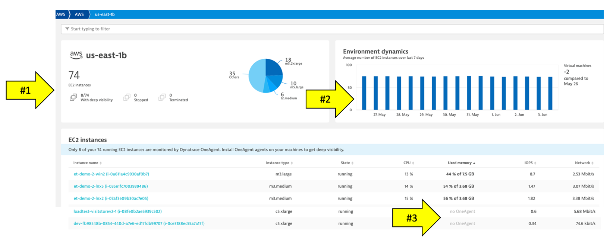

### EC2 example

Here is an example of a host with no OneAgent.

Notice the following details:
1. Expand the properties to see more details
1. All the AWS CloudWatch metrics are viewable as time-series data


### Lambda example

Here is a list of the Lambda functions.  Notice tags and time-series data.

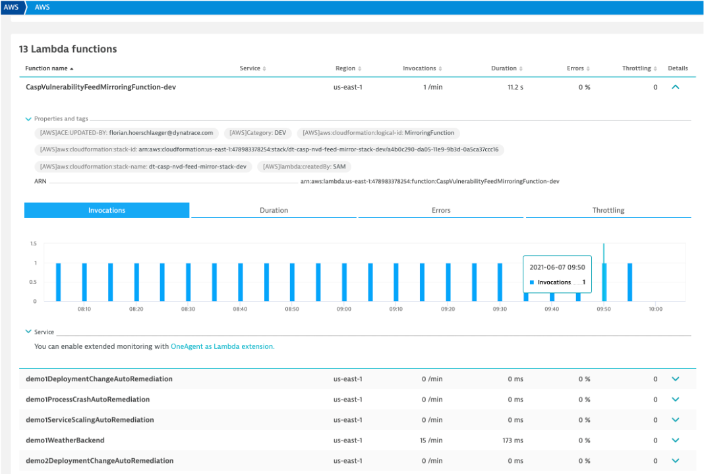

### Preset dashboards

As AWS services are enabled, Dynatrace will enable preset dashboards automatically.  These can be cloned and customized or hidden as required.  Here is one example:


To see more dashboards, navigate to this repository:
* <a href="https://github.com/Dynatrace/snippets/tree/master/product/dashboarding/aws-supporting-services" target="_blank">https://github.com/Dynatrace/snippets/tree/master/product/dashboarding/aws-supporting-services</a>

## Lab Setup

There are <a href="https://www.dynatrace.com/support/help/setup-and-configuration/setup-on-cloud-platforms/amazon-web-services/aws-monitoring-with-dynatrace-managed" target="_blank">several ways</a> one can configure the Dynatrace AWS monitor, but for this workshop we will use a quick solution using AWS Key based access following these basic steps:

1. Create AWS IAM policy for monitoring
1. Add an AWS user with Programmatic access
1. Create Dynatrace AWS connection with the user AWS User Access ID and Key 

### Step 1 of 3: Create AWS IAM policy for monitoring

The AWS monitoring policy defines the minimum scope of permissions you need to give to Dynatrace to monitor the services running in your AWS account. Create it once and use anytime when enabling Dynatrace access to your AWS account.

1 . Go to `Identity and Access Management (IAM)` in your Amazon Console.

2 . Go to `Policies` and click the `Create policy` button.


3 . On the new policy page, select the `JSON` tab and paste this predefined policy from the box below.


```
{
	"Version": "2012-10-17",
	"Statement": [
		{
			"Sid": "VisualEditor0",
			"Effect": "Allow",
			"Action": [
				"acm-pca:ListCertificateAuthorities", 
				"apigateway:GET", 
				"apprunner:ListServices", 
				"appstream:DescribeFleets", 
				"appsync:ListGraphqlApis", 
				"athena:ListWorkGroups", 
				"autoscaling:DescribeAutoScalingGroups", 
				"cloudformation:ListStackResources", 
				"cloudfront:ListDistributions", 
				"cloudhsm:DescribeClusters", 
				"cloudsearch:DescribeDomains", 
				"cloudwatch:GetMetricData", 
				"cloudwatch:GetMetricStatistics", 
				"cloudwatch:ListMetrics", 
				"codebuild:ListProjects", 
				"datasync:ListTasks", 
				"dax:DescribeClusters", 
				"directconnect:DescribeConnections", 
				"dms:DescribeReplicationInstances", 
				"dynamodb:ListTables", 
				"dynamodb:ListTagsOfResource", 
				"ec2:DescribeAvailabilityZones", 
				"ec2:DescribeInstances", 
				"ec2:DescribeNatGateways", 
				"ec2:DescribeSpotFleetRequests", 
				"ec2:DescribeTransitGateways", 
				"ec2:DescribeVolumes", 
				"ec2:DescribeVpnConnections", 
				"ecs:ListClusters", 
				"eks:ListClusters", 
				"elasticache:DescribeCacheClusters", 
				"elasticbeanstalk:DescribeEnvironmentResources", 
				"elasticbeanstalk:DescribeEnvironments", 
				"elasticfilesystem:DescribeFileSystems", 
				"elasticloadbalancing:DescribeInstanceHealth", 
				"elasticloadbalancing:DescribeListeners", 
				"elasticloadbalancing:DescribeLoadBalancers", 
				"elasticloadbalancing:DescribeRules", 
				"elasticloadbalancing:DescribeTags", 
				"elasticloadbalancing:DescribeTargetHealth", 
				"elasticmapreduce:ListClusters", 
				"elastictranscoder:ListPipelines", 
				"es:ListDomainNames", 
				"events:ListEventBuses", 
				"firehose:ListDeliveryStreams", 
				"fsx:DescribeFileSystems", 
				"gamelift:ListFleets", 
				"glue:GetJobs", 
				"inspector:ListAssessmentTemplates", 
				"kafka:ListClusters", 
				"kinesis:ListStreams", 
				"kinesisanalytics:ListApplications", 
				"kinesisvideo:ListStreams", 
				"lambda:ListFunctions", 
				"lambda:ListTags", 
				"lex:GetBots", 
				"logs:DescribeLogGroups", 
				"mediaconnect:ListFlows", 
				"mediaconvert:DescribeEndpoints", 
				"mediapackage-vod:ListPackagingConfigurations", 
				"mediapackage:ListChannels", 
				"mediatailor:ListPlaybackConfigurations", 
				"opsworks:DescribeStacks", 
				"qldb:ListLedgers", 
				"rds:DescribeDBClusters", 
				"rds:DescribeDBInstances", 
				"rds:DescribeEvents", 
				"rds:ListTagsForResource", 
				"redshift:DescribeClusters", 
				"robomaker:ListSimulationJobs", 
				"route53:ListHostedZones", 
				"route53resolver:ListResolverEndpoints", 
				"s3:ListAllMyBuckets", 
				"sagemaker:ListEndpoints", 
				"sns:ListTopics", 
				"sqs:ListQueues", 
				"storagegateway:ListGateways", 
				"sts:GetCallerIdentity", 
				"swf:ListDomains", 
				"tag:GetResources", 
				"tag:GetTagKeys", 
				"transfer:ListServers", 
				"workmail:ListOrganizations", 
				"workspaces:DescribeWorkspaces"
			],
			"Resource": "*"
		}
	]
}
```

4 . You can skip over the `Add tags` page

5 . One the `Review policy` page, use the policy name of `dynatrace_monitoring_policy`


6 . Click `Create policy` button.

### Step 2 of 3: Add an AWS user with Programmatic access

Dynatrace can use access keys to make secure REST or Query protocol requests to the AWS service API. You'll need to generate an Access key ID and a Secret access key that Dynatrace can use to get metrics from Amazon Web Services.

1 . On the IAM page in the AWS console, pick the `Users` menu

2 . On the new use page, click `Add User`.

* Enter a name for the key you want to create (for example, `Dynatrace_monitoring_user`). 
* In Select AWS access type section, select `Access key - Programmatic access` checkbox
* Click the `Next:Permissions` button

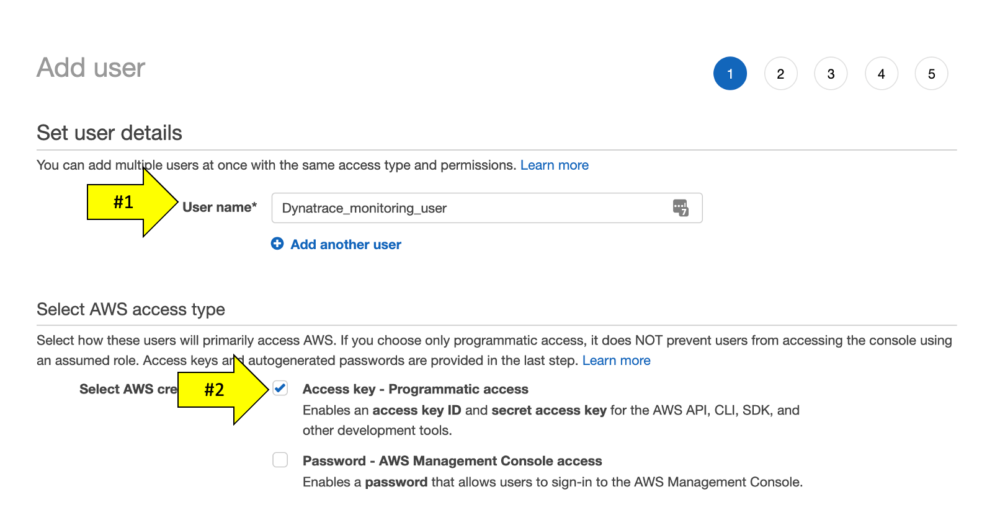

4 . On the set permissions page

* Click the `Attach existing policies directly` tab 
* Search and choose the monitoring policy you defined in the previous step, for example `dynatrace_monitoring_policy`
* Click the `Click Next: Review` button

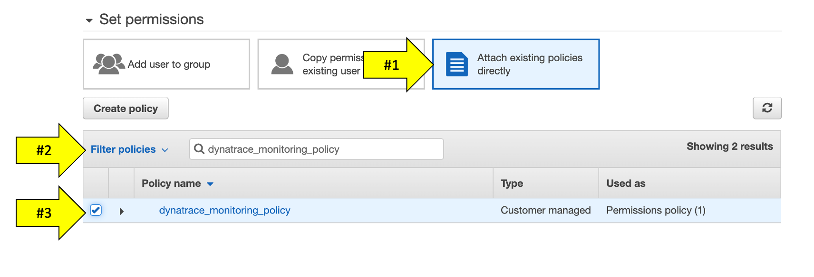

5 . You can skip over the `Add tags` page

6 . Review the user details and click `Create user`.

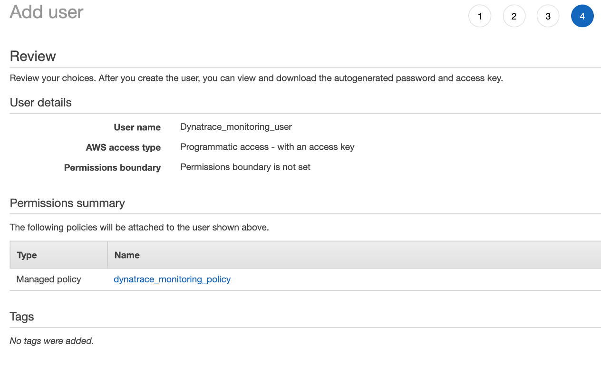

7 . Store the Access Key ID name (AKID) and Secret access key values.
You can either download the user credentials or copy the credentials displayed online (click Show)

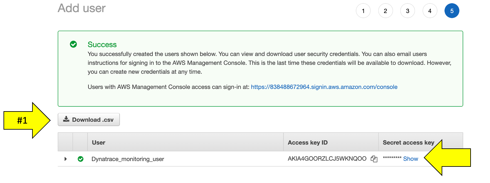

### Step 3 of 3: Start the creation of a Dynatrace AWS connection and generate connection token

Once you've granted AWS access to Dynatrace, it's time to connect Dynatrace to your Amazon AWS account.

1 . In the Dynatrace menu, go to `Settings > Cloud and virtualization > AWS` 

2 . Click `Connect new instance` button.

3 . Select `Key-based authentication` method.

* Create a name for this connection. This is mandatory. Dynatrace needs this name to identify and display the connection (For example: `dynatrace_workshop`)
* In the `Access key ID` field, paste the identifier of the key you created in Amazon for Dynatrace access.
* In the `Secret access key` field, paste the value of the key you created in Amazon for Dynatrace access.
* Click `Connect` to verify and save the connection.
* Leave the other settings as default


4 . Once the connection is successfully verified and saved, your AWS account will be listed in the Cloud and virtualization settings page. If successful, your should see the configuration now on the AWS connections page:

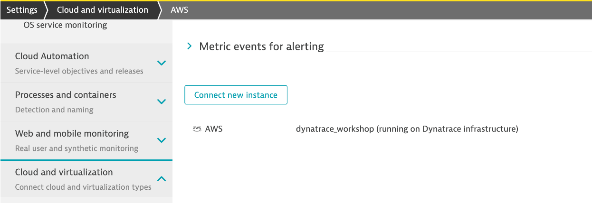

## Review AWS monitor

On the far left Dynatrace menu, navigate to the `Infrastructure -> AWS` menu.

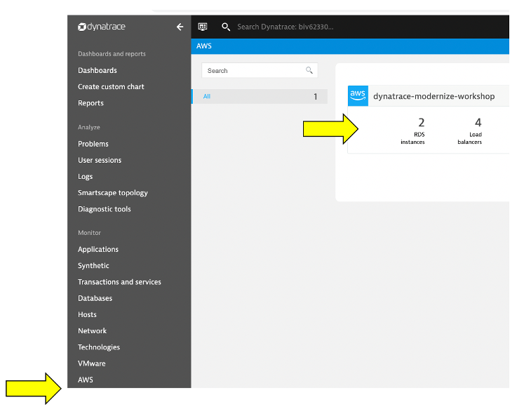

You may see `no data` initially as seen here. This is because Dynatrace makes Amazon API requests every 5 minutes, so it might take a few minutes for data to show until we are done with application setup on AWS.


Once data is coming in, the dashboard pages will look similar to what is shown below.


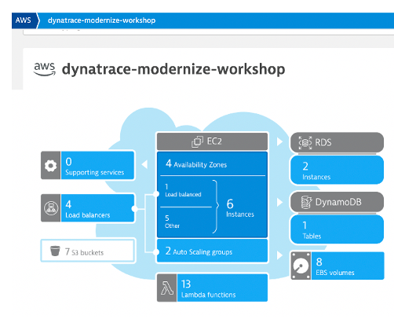

### Review collected metrics

Once data starts to be collected, click in the blue availability zone section located under the grey header labeled EC2 and you should see the list of availability zones below. Click on `us-west-2c` and the EC2 instances will be listed.


Click on an EC2 instance, and you will see how this host still is represented in the same Host view that we saw earlier with the host running the OneAgent. The basic CPU and memory metrics from CloudWatch are graphed for you. What is GREAT, is that this host is being monitored automatically by the Dynatrace AI engine and can raise a problem when there are anomalies.


### 👍 How this helps

The AWS monitor is a central way to get a picture and metrics for the AWS resources running against your accounts as you migrate.

Read more about how to scale your enterprise cloud environment with enhanced AI-powered observability of all AWS services in <a href="https://www.dynatrace.com/news/blog/monitor-any-aws-service/" target="_blank">this Dynatrace blog</a>

### 💥 **TECHNICAL NOTE** 

See the <a href="https://www.dynatrace.com/support/help/technology-support/cloud-platforms/amazon-web-services/aws-monitoring-with-dynatrace-saas/" target="_blank">Dynatrace Docs</a> for more details on the setup options.

## Custom Alerting

Dynatrace Davis automatically analyzes abnormal situations within your IT infrastructure and attempts to identify any relevant impact and root cause. Davis relies on a wide spectrum of information sources, such as a transactional view of your services and applications, as well as all on events raised on individual nodes within your Smartscape topology.

There are two main sources for single events in Dynatrace:

* Metric-based events (events that are triggered by a series of measurements)
* Events that are independent of any metric (for example, process crashes, deployment changes, and VM motion events)

Custom metric events are configured in the global settings of your environment and are visible to all Dynatrace users in your environment.

### 1. Setup Custom metric alerting for AWS

1 . To add custom alerts, navigate to `Settings --> Anomaly Detection --> Custom Events for Alerting` menu. 

2 . Click the `Create custom event for alerting` button.


3 . In the `Metric` dropdown list, type `EC2 CPU usage %` and pick the `Cloud platforms > AWS > EC2 > CPU > usage` option and Pick `Average`

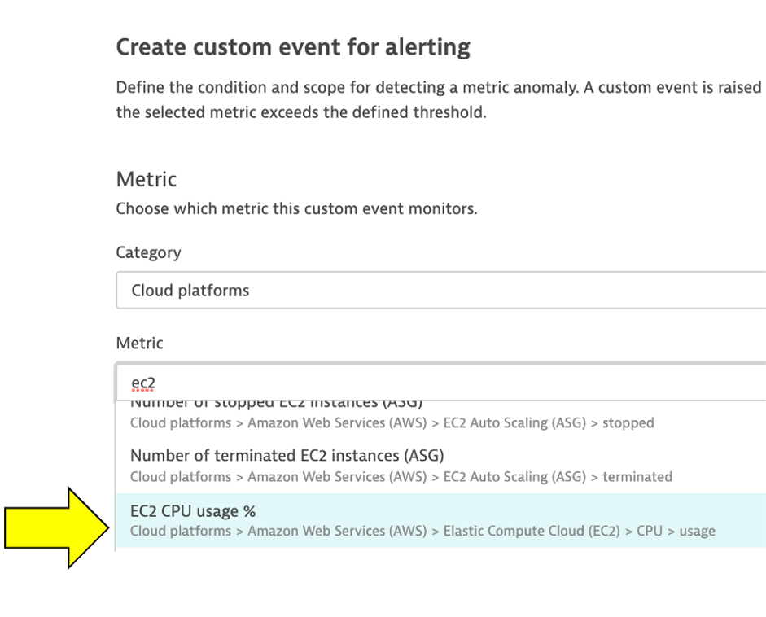

4 . Click `Add rule-base` button and update as shown below


5 . Choose `Static threshold` and update as shown below


6 . Add the `Event Description` to have the `title` and `severity = CUSTOM ALERT` as shown below.

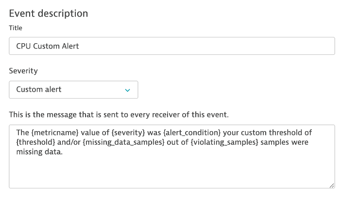

Notice the `Alert preview` chart that helps you in reviewing these settings


7 . Save your changes

8 . Add another rule, with everything the same, except for the `Event Description` to have the `title` and `severity = RESOURCE` as shown below.


9 . Save your changes and the list should look as shown below.

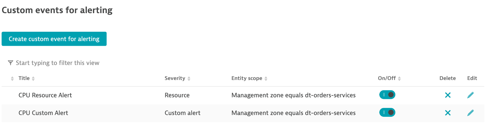

### 2. SSH to monolith host 

To connect to the host, simply use `EC2 Instance Connect`.  To this, navigate to the `EC2 instances` page in the AWS console.

From the list, pick the `dt-orders-monolith` and then the `connect` button.


Then on the next page, choose the `EC2 Instance Connect` option and then the `connect` button.

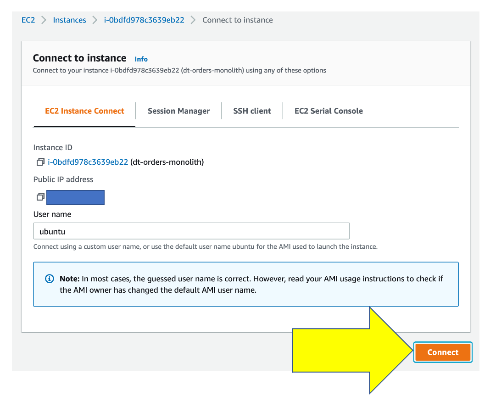

Once you connected, you will see the terminal prompt like the below.

```
Welcome to Ubuntu 20.04.2 LTS (GNU/Linux 5.4.0-1045-aws x86_64)
...
...
To run a command as administrator (user "root"), use "sudo <command>".
See "man sudo_root" for details.
ubuntu@ip-10-0-0-118:~$ 
```

### 3. Trigger a CPU problem

Using a unix utility <a href="https://linuxconfig.org/how-to-stress-test-your-cpu-on-linux" target="_blank">yes</a>, we can generate CPU stress just by running the `yes` command a few times.

In the terminal, copy all these lines and run them:

```
yes > /dev/null &
yes > /dev/null &
yes > /dev/null &
```

To verify, run this command:

```
ps -ef | grep yes
```

The output should look like this:

```
ubuntu    5802  5438 99 20:48 pts/0    00:00:05 yes
ubuntu    5805  5438 89 20:48 pts/0    00:00:04 yes
ubuntu    5806  5438 97 20:48 pts/0    00:00:03 yes
ubuntu    5818  5438  0 20:48 pts/0    00:00:00 grep --color=auto yes
```

3 . Back in Dynatrace within the `host` view, the CPU should now be high as shown below


4 . It may take a minute or so, but you will get two problem cards as shown below.  #1 is the alert from the `severity = RESOURCE` where Davis was invoked, and #2 is the alert from `severity = CUSTOM ALERT`.


### 4. Review Problem Notifications

1 . Navigate to `Settings --> Integrations --> Problem Notifications` 

2 . Read the overview and then click the `Add Notification` button

3 . Click various `Notification types` from the drop down to review the configurations inputs.

4 . For the `Custom integration` type, review the option to customize the payload.

5 . Notice how you can choose the `Alert profile`, but you only have default

### 5. Review Alerting Profiles

1 . Navigate to `Settings --> Alerting --> Alerting profiles`

2 . Read the overview and then expand the `default` rule.

3 . Now add one, by clicking on the `Add alerting profile` button

4 . Review the options to choose severity rules and filters

### 6. Stop the CPU problem

To stop the problem, you need to `kill` the processes.  To do this:

1 . Back in the CloudShell, run this command to get the process IDs `ps -ef | grep yes`

2 . For each process, copy the process ID and run `kill <PID>`

For example:

```
# If output is this...

ubuntu@ip-10-0-0-118:~$ ps -ef | grep yes
ubuntu    5802  5438 99 20:48 pts/0    00:00:05 yes
ubuntu    5805  5438 89 20:48 pts/0    00:00:04 yes
ubuntu    5806  5438 97 20:48 pts/0    00:00:03 yes

# Then run...

kill 5802
kill 5805
kill 5806
```

3 . Verify they are gone by running this again `ps -ef | grep yes`

4 . Verify that CPU in Dynatrace goes to normal and the problems will eventually automatically close

### 6. Exit the SSH

Simply type `exit` to exit the VM and return the CloudShell.

### 💥 **TECHNICAL NOTE** 

* See the <a href="https://www.dynatrace.com/support/help/how-to-use-dynatrace/problem-detection-and-analysis/problem-detection/metric-events-for-alerting/" target="_blank">Dynatrace Docs</a> for more details on the setup.

* Alert configuration is available through the <a href="https://www.dynatrace.com/support/help/dynatrace-api/configuration-api/anomaly-detection-api/anomaly-detection-api-metric-events/" target="_blank">Anomaly detection—metric events API</a>. Using the API, you can list, update, create, and delete configurations.

## Summary

In this section, you should have completed the following:

✅ Review how Dynatrace integrates with <a href="https://aws.amazon.com/cloudwatch/" target="_blank">AWS CloudWatch</a>

✅ Review how <a href="https://aws.amazon.com/cloudwatch/" target="_blank">AWS CloudWatch</a> metrics can be configured as <a href="https://www.dynatrace.com/support/help/how-to-use-dynatrace/problem-detection-and-analysis/problem-detection/metric-events-for-alerting/" target="_blank">Metric events for alerts</a>

### AWS Control Tower

The Dynatrace integrated solution for AWS Control Tower provides a way to establish Dynatrace monitoring for multi-account AWS environments. This solution automates the configuration process when AWS managed accounts are created. By ingesting metrics published to Amazon CloudWatch (Watch) for databases, networks, and compute services, Dynatrace provides a picture of your environment.  

You can read more about this on this [AWS Marketplace blog](https://aws.amazon.com/blogs/awsmarketplace/increasing-observability-in-your-aws-control-tower-landing-zone-with-dynatrace/)s
