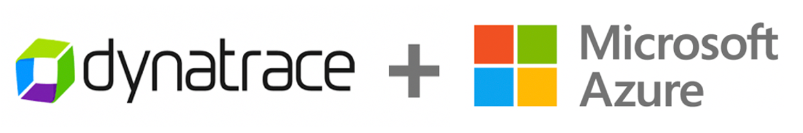
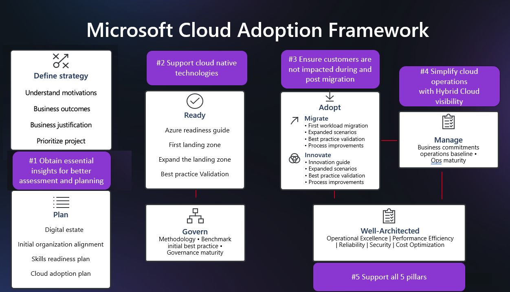

summary: Dynatrace Workshop on Azure  Introduction
id: azure-intro
categories: azure
tags: cloud
status: Published
authors: Jay Gurbani
Feedback Link: https://github.com/dt-alliances-workshops/workshops-content
# Azure Workshop Introduction
Duration: 5

[Dynatrace](https://www.dynatrace.com) is an Azure Gold Cloud Platform Competency Partner. Dynatrace provides software intelligence to simplify enterprise cloud complexity and accelerate digital transformation. With AI and complete automation, the company’s all-in-one platform provides answers, not just data, about the performance of applications, the underlying infrastructure and the experience of all users.

Dynatrace has pioneered and expanded the collection of observability data in highly dynamic cloud environments with the Dynatrace OneAgent. When an organization installs the OneAgent, it automatically detects all applications, containers, services, processes, and infrastructure in real-time with zero manual configuration or code changes. System components are automatically instrumented collect not only metrics, logs and traces, but a broader view of your environment including full topological model with entity relationships, code-level detail, and user experience – all in context.

## Workshop Learning Objectives
Duration: 5

This virtual hands-on workshop will start with a review of common challenges associated with modernization followed by a review of how Dynatrace’s AI-engine, Davis, performs automatic and intelligent root-cause analysis in hybrid cloud Azure environments. This will be followed by series of hands-on labs where you will:

1.  Setup a Dynatrace environment and sample applications within Azure
2.  Jump in and fully analyze an application within Dynatrace
3.  Start to see and understand application usage patterns, infrastructure consumption, service dependencies, benchmarking performance and how service levels can be tightly ensured.

You are now in the drivers seat for enabling modern operations for cloud native architectures!

### Workshop structure
The workshop breaks down into three sections. Plan on 2-4 hours for completion of the lab section.

* Prerequisites - Ensure your Dynatrace and Azure accounts are set-up
* Workshop Labs - Divided into modules, some labs include a step to run scripts that will provision Azure resources, deploy sample application, and configure Dynatrace.
* Cleanup Resources - Tear down workshop resources and keep on using the Free Trial! ​

By analyzing an application within Dynatrace, you’ll learn how to understand application usage patterns, infrastructure consumption, service dependencies, benchmarking performance and ensuring service levels, and enabling modern operations for cloud native architectures.

Attendees can expect to learn the following from this workshop:​

* Common challenges associated with modernization​
* How to solve challenges of hybrid cloud with Dynatrace observability​
* Improve acceleration of cloud workload adoption of Azure​

### Workshop Audience: 

* Application teams
* Architects
* Developers
* Technical leads

### It would be helpful for you:

* Use a Dynatrace Managed environment provisioned for you.
* Use a non-corporate Azure subscription so that you don't have permission issues
* Use a personal email address when signing up for Azure Pass subscription in pre-requisites section
* Be able to run basic [Unix commands](http://mally.stanford.edu/~sr/computing/basic-unix.html)
* Be familiar with basic [Azure cloud concepts](https://azure.microsoft.com/en-us/overview/what-is-azure)
* Be familiar with [containerization concepts](https://azure.microsoft.com/en-us/overview/what-is-a-container/)
* Please **ASK QUESTIONS** and **INTERACT**

## Forward
Duration: 5

### Modern cloud environments need a different approach to observability

Conventional application performance monitoring (APM) emerged when applications were mostly monolithic and update cycles were measured in years, not days. Manual instrumentation and performance base lining, though cumbersome, were once adequate particularly since fault patterns were generally known and well understood.

As monoliths get replaced by cloud-native applications, that are rapidly growing in size, traditional monitoring approaches are no longer enough. Rather than instrumenting for a predefined set of problems, enterprises need complete visibility into every single component of these dynamically scaling micro service environments. This includes multi-cloud infrastructures, container orchestration systems like Kubernetes, service meshes, functions-as-a-service and polyglot container payloads.

Such applications are more complex and unpredictable than ever. System health problems are rarely well understood from the outset and IT teams spend a significant amount of time manually solving problems and putting out fires after the fact. The challenge with modern cloud environments is to address the unknown unknowns the kind of unique glitches that have never occurred in the past. 

Lets next review a few common challenges the are driving the need for better observability and automation as applications are modernizing.

## Challenges
Duration: 5

Below are a few common challenges the are driving the need for better observability and automation as applications are modernizing.

### Challenge #1: Understanding the Legacy Application

First, we need to have a good overview of all hosts, processes, services and technologies so that we can answer the following key questions:

1. Which technologies are in use and where do they run?
1. Which technologies are legacy and can’t be moved because they are not supported?
1. What is the big picture and end-to-end aggregate view of the legacy app services?
1. Who is responsible and needs to be included in the discussion?

In our current state, we anticipate this as a few weeks of effort by our developer and operations teams to inventory the hosts, technology and dependencies. Because our IT teams are distributed and siloed by function, it may take several meetings to review the new diagrams and spreadsheets, and we will have to assign a project manager to help coordinate and keep everyone on task. All of this takes valuable time from our already busy team.

### Challenge #2: Understanding application usage patterns

In addition to needing to understand the blueprint for the existing application and infrastructure landscape, we need to know how the end-user traffic patterns map to resource consumption patterns of the underlying services as to properly answer:

1. What will it cost to run in the cloud?
1. What network traffic will there be between the services we migrate and those that have to stay in the current data center?
1. How can I make sense of all the spaghetti codes in the legacy app without reverse engineering miles of code and determining what service talks to what?

Because we use multiple monitoring and logging tools, gathering and compiling all this data can be complex and will take time. What will likely happen is that some teams will lack the resources to take on this task resulting in low confidence in the resulting analysis.

### Challenge #3: Making decision for the application migration strategy 

We want to balance the lower risk of just "lifting and shifting" versus benefits of the moving to new technology and the cost savings with on-demand and scalable Azure services.

What is needed to answer is:

1. What are the dependencies, complexity and which pieces are most important for each component and service?
1. What are the underlying infrastructure components and dependencies?
1. Where are the data repositories and what is the activity?
1. Which KPI’s are the most relevant?
1. What is the application usage patterns (mentioned above)?

Much like the effort to gather application usage patterns, we anticipate this effort being laborious and requiring multiple teams to get involved. Again, adding more time and taking resources away from other work.

Much like the effort to gather application usage patterns, we anticipate this effort being laborious and requiring multiple teams to get involved.  Again adding more time and taking resources away from other work.

### Challenge #4: Benchmarking performance and ensuring service levels

As mentioned above, we have a patchwork of tools with many of them focused on a single view:

* Just host monitoring
* Just logs
* Just website traffic

There is no unified view across our current on-prem platforms let alone the cloud. As a result, we don’t know how the application and underlying services are behaving, and many of our current tools aren’t even suited to support cloud native, or new technologies like Kubernetes.

At high level, we know we must first establish system benchmarks.  And then, during and post migration the following:

1. Validate business outcomes
1. Manage service levels real-time for full stack visibility of user experience, application and components
1. Maintain single view of our hybrid cloud environment

With our current set of tooling and manual approach to aggregate all the data, we simply will not be able to keep up with the demand.  This will result in blind spots and delays in gathering data and an increased risk to hurting services levels.  Just this past March, we had a major outage caused by a memory leak in the legacy code and we never saw it coming.

### Challenge #5: Increased Complexity for Operations

The team has quickly learned that building out cloud infrastructure, where everything is virtualized and dynamic, causes interdependencies to go way up, adding more layers of complexity.

The team understands that modernizing our legacy application to a Cloud native architecture will force a change to new way of operating in cloud. By decomposing the legacy application into small agile, autonomous applications adds complexity for operations. 

We need to both scale up our team’s ability to support all this new complexity AND minimize disruption during cloud migration and prevent delays but do so without adding a whole new set of resources.

We are asking ourselves:

* Will one tool or multiple tools simplify operations ?
* How can we filter noisy incidents from the actual incident which require attention?
* How can we scale the team to support additional complexity without adding more staff?

### Before we dig in ...

Before we take a look at how Dynatrace can help us with these challenges.

## Dynatrace and Azure
Duration: 5

The <a href="https://docs.microsoft.com/en-us/azure/cloud-adoption-framework/" target="_blank">Azure Cloud Adoption Framework</a> provides the best practices, documentation, and tools that cloud architects, IT professionals, and business decision makers need to successfully achieve short-term and long-term objectives. 

The Azure cloud adoption framework frames this guidance into the <a href="https://docs.microsoft.com/en-us/azure/cloud-adoption-framework/" target="_blank">phases</a> shown below.

* **Strategy phase** - Before we move, define and document our motivations to move to the cloud and define specific business outcomes we hope to achieve. We need to learn how to use the cloud to make your IT cost structure more flexible and build a business case to adopt the cloud. Lastly, we need to discover the technical flexibility, efficiencies, and capabilities that help you build a business case to adopt the cloud.

* **Plan phase** - We need to perform a detailed application and infrastructure discovery and put a plan in place. We need to identify and put in place the right tools to help iron out the challenges of portfolio analysis, right sizing, application prioritization and application grouping.

* **Ready phases** - It is critical that we accelerate our move to the cloud and application transformations to achieve the benefits, but we must also validate our architecture decisions and our performance and scalability benchmarks.

* **Adopt phase** - Once migrated, it will start to get interesting with usage of all modern services, modern architectures using Azure Containers, AKS, Azure Functions, Azure CosmosDB and much more.  We know we need to adopt modern ways of operations by automating monitoring tasks, remediation tasks and ITSM tasks.  We must also continue to expand and optimize our costs and performance.

Here is an overview for how <a href="https://www.dynatrace.com" target="_blank">Dynatrace</a> helps in each phase of our modernization journey.

## Next Steps
Duration: 2

There are a few prerequisite tasks you must perform before getting started on this workshop. These are:

* Setup your few Azure account subscription w/ proper permissions
* Access your email for Dynatrace Managed environment access setup for this workshop 
* Provision Azure resources and sample applications required for the labs via automated scripts in pre-requisites section

In the next section, there will be instructions on how to set everything up, step by step.
