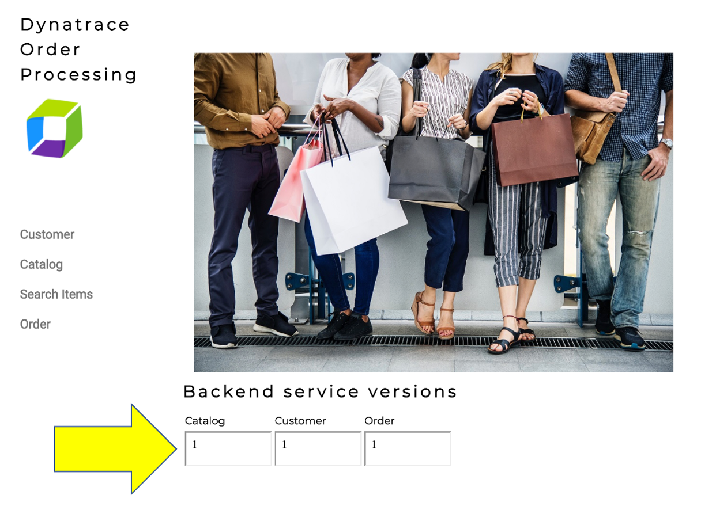
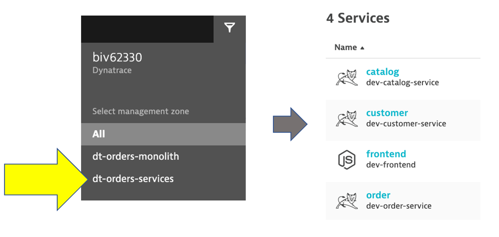
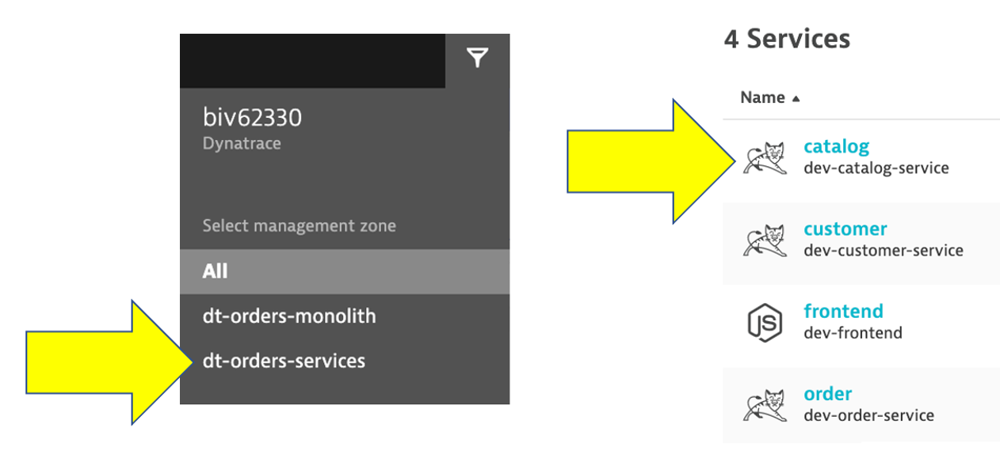

id: aws-lab2
categories: 
tags: 
status: Hidden

# AWS Lab 2 - Modernization with containers

## Overview

For this lab you are going to use an updated version of the application on a second EC2 instance.  This makes it easy for you to see the transformation of the Sample Application in Lab 1.

If you would rather provision Kubernetes on AWS to interact with the sames transformed application, then please follow ` Modernization with ssKubernetes` lab guide. 

### Objectives of this Lab

🔷 Review how the sample app went to multiple services

🔷 Examine the transformed application using service flows and back traces 

## Lab 2 Overview

As we saw earlier, the sample application is a `three-tiered application --> frontend, backend, database`

Re-hosting (also referred to as lift and shift) is a common migration use case. Re-architecture and Re-platform are steps that break the traditional architectures and replace individual components with cloud services and microservices. 

We just learned how we can get great information on services, processes and user requests using Dynatrace and OneAgent. This helps us now decide what individual features or complete applications based on business benefits we need to migrate and modernize. The idea here is to focus on feature-based business benefit with functional migration.

## Lab 2 Design

For this lab, another version of the application exists that breaks out each of these backend services into separate services. By putting these services into Docker images, we gain the ability to deploy the service into modern platforms like Kubernetes and Cloud managed services such as the ones shown below.

**#1 . Sample Application**

Sample app representing a "services" architecture of a frontend and multiple backend services implemented as Docker containers that we will review in this lab.

**#2 . Load generator process**

A [JMeter](https://github.com/dt-orders/load-traffic) process sends simulated user traffic to the sample app running within a Docker container. You will not need to interact with this container, it just runs in the background.

**#3 . Dynatrace monitoring**

The Dynatrace OneAgent has been installed by the workshop provisioning scripts and is communicating to your Dynatrace Managed tenant.

### 💥 **TECHNICAL NOTE** 

<i>Learn more about the various ways the OneAgent can be installed, in the <a href="https://www.dynatrace.com/support/help/setup-and-configuration/dynatrace-oneagent" target="_blank">Dynatrace documentation</a></i>

**#4 . AWS monitoring**

In addition to monitoring your AWS workloads using OneAgent, Dynatrace provides [integration](https://www.dynatrace.com/support/help/technology-support/cloud-platforms/amazon-web-services/aws-monitoring-with-dynatrace-saas/) with AWS CloudWatch which adds infrastructure monitoring to gain insight even into serverless application scenarios.

We will not have them configured for the lab, with Dynatrace you can also monitor other AWS services that influence the performance of your AWS-hosted applications. See the [Dynatrace Docs](https://www.dynatrace.com/support/help/technology-support/cloud-platforms/amazon-web-services/supporting-services/) for complete list of AWS Supported services.

**#5 . AWS Dashboard**

This out-of-the-box dashboard gives insights on AWS CloudWatch metrics from each configured AWS account.

## Sample App

To get the Public IP to the frontend of the Sample Application, open the `EC2 instances` page in the AWS console. On the newly created host `dt-orders-services` find the `Public IP` as shown below.

### View the Sample app in a Browser

To view the application, copy the public IP into a browser that will look like this.

### 💥 **TECHNICAL NOTE**

<i>One difference you will see is the a dynamic list for the backend services versions.  We will refer to this again later in the labs.</i>

### Transactions and services

Let’s now take a look at all the services being monitored by clicking on the `Transactions and services` left side Dynatrace menu.

In the management zone drop down, choose `dt-orders-services`. The filtered list should now look like this:

Choose the `frontend` service.

## Analyze Service Flow

Now that we are back on the frontend service, lets look at the service flow to see whats different now.  Just click on the `View service flow` button to open this.

### Response time perspective

You should now be on the `Service flow` page.

Right away, we can see how this application is structured:  

* Frontend calls order, customer, and catalog service
* Order service calls order and customer service

Something you would never know from the application web UI !

Refer to the picture above:

1. We are viewing the data from a `Response time perspective`. Shortly, we will review the `Throughput perspective`.
1. Click on the boxes to expand the response time metrics. We can see that most of the response time, most of the time is spent in the `order` service and the least in the `customer` services.  And as in the monolith version of the application, a very small amount of the response time is spent in the databases. 

### Throughput perspective

Refer to the picture above:

1. Change to the `Throughput perspective` by clicking on the box
1. Click on the boxes to expand the metrics to see the number of requests and average response times going to each service

### 👍 How this helps

Review architecture before and after changes is now as easy as a few clicks! 

## Analyze Service Backtrace

Let’s now take a look at the transactions and Services by clicking on the `Transactions and services` left side Dynatrace menu.

In the management zone drop down, choose `dt-orders-services` and pick the `catalog` service.

### Open Backtrace Page

To see the backtrace page, just click on the `Analyze Backtrace` button.

You should be on the service backtrace page where you will see information for this specific service.

This will get more interesting in the next lab, but for the modernized backend, we can see that the backtrace is as follows:

1. The starting point is the `catalog` service
1. `catalog` is called by the `order` service
1. `catalog` is called by the `frontend` service
1. You may also see browser traffic to the `frontend` from the `My web application`.  If you don't that is OK.

### 👍 How this helps

The `service flow` and `service backtrace` give you a complete picture of interdependency to the rest of the environment architecture at host, processes, services, application perspectives. 

## Summary

While migrating to the cloud, you want to evaluate if your migration goes according to the plan, whether the services are still performing well or even better than before, and whether your new architecture is as efficient as the blueprint suggested. Dynatrace helps you validate all these steps automatically, which helps speed up the migration and validation process.

Having the ability to understand service flows enables us to make smarter re-architecture and re-platforming decisions. With support for new technologies like Kubernetes, you can now have confidence modernizing with a platform that span the old and the new.

Over time, you can imagine that this sample application will be further changed to add in other technologies like [AWS Lambda](https://aws.amazon.com/lambda/) and other PaaS services like [AWS Relational Database Service (RDS)](https://aws.amazon.com/rds/) or [Amazon Aurora - MySQL and PostgreSQL-compatible relational database](https://aws.amazon.com/rds/aurora) databases and virtual networking [Amazon API Gateway](https://aws.amazon.com/api-gateway/) as shown in the picture below. 

### 💥 **TECHNICAL NOTE**

<i>We will not cover this, but organizations are establishing DevOps approaches and establishing Continuous Integration (CI) pipelines to build and test each service independently. Then adding Continuous Deployment (CD) to the process too that vastly increase our ability to delivery features faster to our customers.  Dynatrace has a number of solutions to support DevOps that you can read about [here](https://www.dynatrace.com/solutions/devops/)</i>

### 💥 **TECHNICAL NOTE**

<i>Dynatrace sees a lot of demand for Lambda serverless compute service and a slew of new capabilities that you can read about in these [Dynatrace blogs](https://www.dynatrace.com/news/tag/aws-lambda/)</i>

### Checklist

In this section, you should have completed the following:

✅ Review how the sample app went to multiple services

✅ Examine the transformed application using service flows and back traces 

