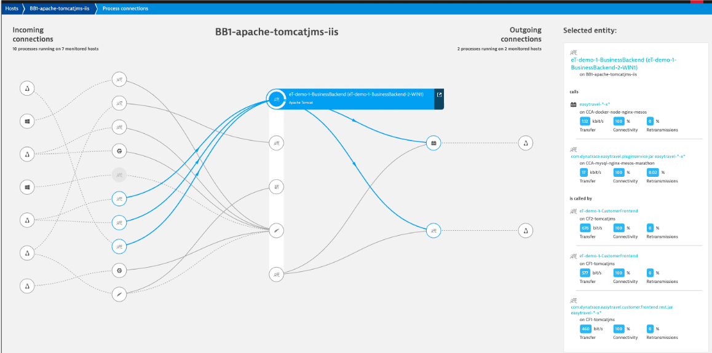
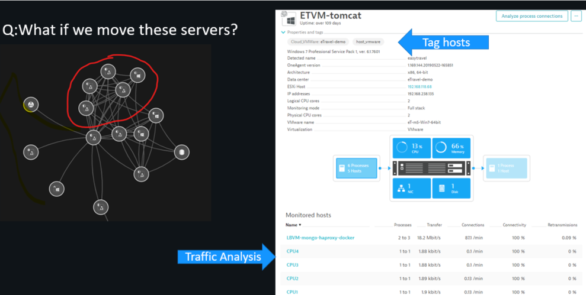
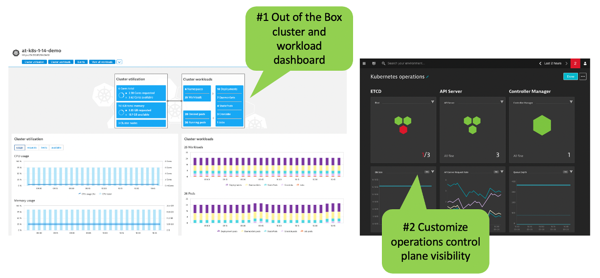
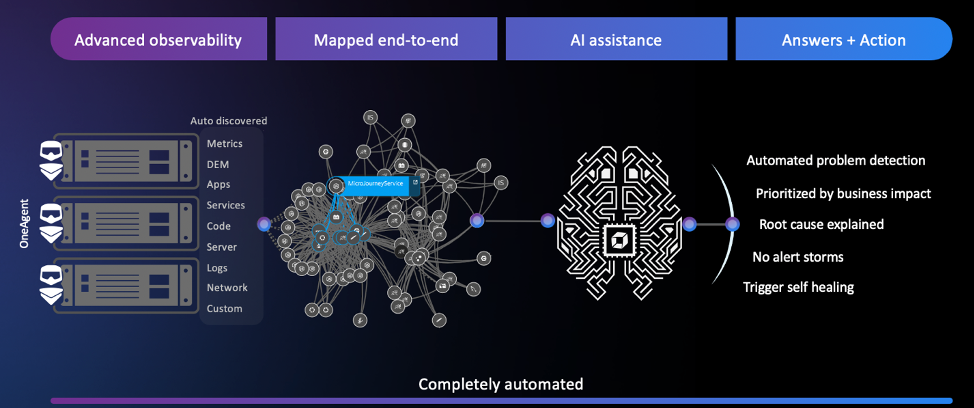
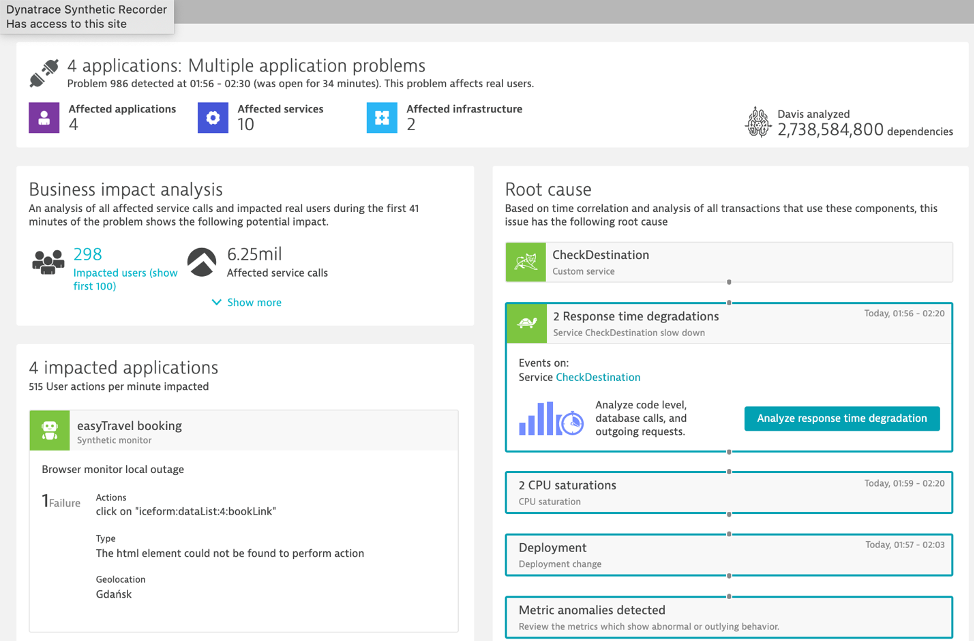

id: aws-dynatrace-better-together
categories: modernization,kubernetes,serverless
tags: aws-selfpaced,aws-immersion-day,aws-immersion-day-saas
status: Published

# AWS & Dynatrace - Better Together

## Who is Dynatrace

<a href="https://www.dynatrace.com/technologies/aws-monitoring" target="_blank">Dynatrace</a> is an <a href="https://aws.amazon.com/partners/find/partnerdetails/?n=Dynatrace&id=001E000000texmiIAA" target="_blank">AWS Advanced Technology Partner</a> and AWS DevOps, Migration, and Containers Competency Partner. Dynatrace provides software intelligence to simplify enterprise cloud complexity and accelerate digital transformation. With AI and complete automation, the company’s all-in-one platform provides answers, not just data, about the performance of applications, the underlying infrastructure and the experience of all users. 

Dynatrace has pioneered and expanded the collection of observability data in highly dynamic cloud environments with the Dynatrace OneAgent.  When an organization installs the OneAgent, it automatically detects all applications, containers, services, processes, and infrastructure in real-time with zero manual configuration or code changes. System components are automatically instrumented collect not only metrics, logs and traces, but a broader view of your environment including full topological model with entity relationships, code-level detail, and user experience – all in context.

## Modern cloud environments need a different approach to observability

Conventional application performance monitoring (APM) emerged when software was mostly monolithic and update cycles were measured in years, not days. Manual instrumentation and performance base lining, though cumbersome, were once adequate—particularly since fault patterns were generally known and well understood.

As monoliths get replaced by cloud-native applications, that are rapidly growing in size, traditional monitoring approaches are no longer enough. Rather than instrumenting for a predefined set of problems, enterprises need complete visibility into every single component of these dynamically scaling micro service environments. This includes multi-cloud infrastructures, container orchestration systems like Kubernetes, service meshes, functions-as-a-service and polyglot container payloads.

Such applications are more complex and unpredictable than ever. System health problems are rarely well understood from the outset and IT teams spend a significant amount of time manually solving problems and putting out fires after the fact. The challenge with modern cloud environments is to address the unknown unknowns—the kind of unique glitches that have never occurred in the past. 

Lets next review a few common challenges the are driving the need for better observability and automation as applications are modernizing.

## Challenges

Below are a few common challenges the are driving the need for better observability and automation as applications are modernizing.

### Challenge #1: Understanding the Legacy Application

First, we need to have a good overview of all hosts, processes, services and technologies so that we can answer the following key questions:

1. Which technologies are in use and where do they run?
1. Which technologies are legacy and can’t be moved because they are not supported?
1. What is the big picture and end-to-end aggregate view of the legacy app services?
1. Who is responsible and needs to be included in the discussion?

In our current state, we anticipate this as a few weeks of effort by our developer and operations teams to inventory the hosts, technology and dependencies. Because our IT teams are distributed and siloed by function, it may take several meetings to review the new diagrams and spreadsheets, and we will have to assign a project manager to help coordinate and keep everyone on task. All of this takes valuable time from our already busy team.

### Challenge #2: Understanding application usage patterns

In addition to needing to understand the blueprint for the existing application and infrastructure landscape, we need to know how the end-user traffic patterns map to resource consumption patterns of the underlying services as to properly answer:

1. What will it cost to run in the cloud?
1. What network traffic will there be between the services we migrate and those that have to stay in the current data center?
1. How can I make sense of all the spaghetti codes in the legacy app without reverse engineering miles of code and determining what service talks to what?

Because we use multiple monitoring and logging tools, gathering and compiling all this data can be complex and will take time. What will likely happen is that some teams will lack the resources to take on this task resulting in low confidence in the resulting analysis.

### Challenge #3: Making decision for the application migration strategy 

You may familiar with <a href="https://docs.aws.amazon.com/whitepapers/latest/aws-migration-whitepaper/the-6-rs-6-application-migration-strategies.html" target="_blank">the 6-Rs migration strategies</a> shown in the diagram below, but we are challenged with best determining which one makes sense for us.…

We want to balance the lower risk of just "lifting and shifting" versus benefits of the moving to new technology and the cost savings with on-demand and scalable AWS services.

What is needed to answer is:

1. What are the dependencies, complexity and which pieces are most important for each component and service?
1. What are the underlying infrastructure components and dependencies?
1. Where are the data repositories and what is the activity?
1. Which KPI’s are the most relevant?
1. What is the application usage patterns (mentioned above)?

Much like the effort to gather application usage patterns, we anticipate this effort being laborious and requiring multiple teams to get involved.  Again adding more time and taking resources away from other work.

### Challenge #4: Benchmarking performance and ensuring service levels

As mentioned above, we have a patchwork of tools with many of them focused on a single view:

* Just host monitoring
* Just logs
* Just website traffic

There is no unified view across our current on-prem platforms let alone the cloud. As a result, we don’t know how the application and underlying services are behaving, and many of our current tools aren’t even suited to support cloud native, or new technologies like Kubernetes.

At high level, we know we must first establish system benchmarks.  And then, during and post migration the following:

1. Validate business outcomes
1. Manage service levels real-time for full stack visibility of user experience, application and components
1. Maintain single view of our hybrid cloud environment

With our current set of tooling and manual approach to aggregate all the data, we simply will not be able to keep up with the demand.  This will result in blind spots and delays in gathering data and an increased risk to hurting services levels.  Just this past March, we had a major outage caused by a memory leak in the legacy code and we never saw it coming.

### Challenge #5: Increased Complexity for Operations

The team has quickly learned that building out cloud infrastructure, where everything is virtualized and dynamic, causes interdependencies to go way up, adding more layers of complexity.

The team understands that modernizing our legacy application to a Cloud native architecture will force a change to new way of operating in cloud. By decomposing the legacy application into small agile, autonomous applications adds complexity for operations. 

We need to both scale up our team’s ability to support all this new complexity AND minimize disruption during cloud migration and prevent delays but do so without adding a whole new set of resources.

We are asking ourselves:

* Will one tool or multiple tools simplify operations ?
* How can we filter noisy incidents from the actual incident which require attention?
* How can we scale the team to support additional complexity without adding more staff?

Lets take a look at how Dynatrace can help us with these challenges.

## Why Dynatrace

Cloud modernization is a challenging problem and it can be extremely costly for your business if you don’t prepare properly for it. As you modernize and move apps to the AWS cloud, there are three generally acknowledged areas to focus on around the decision and execution process:

**Plan better**

* Evaluate that the app is well suited for cloud with essential early insights
* Assess that the new design and cloud architecture will work well and be effective

**Execute faster**

* Avoid problems that impact service delivery and cause delays by identifying issues quickly, in full context
* Resolve problems faster, reducing overall project risk

**Optimize operations**

* Feel confident that expectation is met for service delivery through clarity on performance before and after migration to the cloud
* Identify areas for automation

## AWS and Dynatrace

Lets dig deeper into the ways <a href="https://www.dynatrace.com" target="_blank">Dynatrace</a> helps in each phase of our modernization journey.

The <a href="https://aws.amazon.com/cloud-migration" target="_blank">AWS Cloud Migration portal</a> provides the best practices, documentation, and tools that cloud architects, IT professionals, and business decision makers need to successfully achieve short-term and long-term objectives. 

The AWS migration framework presented on the AWS Cloud Migration portal frames this guidance into the <a href="https://aws.amazon.com/cloud-migration/how-to-migrate/" target="_blank">phases</a> shown below.

* **Assess phase** - Before we move, we need to ensure our return on investment by understanding current cost and savings. In addition, we need to validate our organization’s readiness to move to cloud from 6 different perspectives of Cloud Adoption framework- Governance, people, business, platform, security and operations.

* **Mobilize phase** - We need to perform a detailed application and infrastructure discovery and put a plan in place. We need to identify and put in place the right tools to help iron out the challenges of portfolio analysis, right sizing, application prioritization and application grouping.

* **Migrate & modernize phases** - It is critical that we accelerate our move to the cloud and application transformations to achieve the benefits, but we must also validate our architecture decisions and our performance and scalability benchmarks.

* **Operate & optimize phase** - Once migrated, it will start to get interesting with usage of all modern services, modern architectures using Fargate, ECS, EKS, Lambda, Amazon Aurora Serverless and much more.  We know we need to adopt modern ways of operations by automating monitoring tasks, remediation tasks and ITSM tasks.  We must also continue to expand and optimize our costs and performance.

Here is an overview for how <a href="https://www.dynatrace.com" target="_blank">Dynatrace</a> helps in each phase of our modernization journey.

### #1: Understanding the Legacy Application

With Dynatrace OneAgent and Smartscape technologies, it is now fast and easy to answer these questions about the our existing applications:

🔷 Which technologies are in use and where do they run?

🔷 How can I aggregate multiple services to have a big picture of the legacy app?

🔷 Who is responsible and needs to be included in the discussion?

🔷 How can I make sense of all the Spaghetti codes in the legacy app?

The Dynatrace Smartscape topology map enables you to understand the actual connection between all captured metrics, traces, logs, and user experience data. Other than mere time-based correlation, topology mapping reveals the actual causal dependencies between captured data. This is the basis for Dynatrace’s radically different AI engine, Davis.

!

### Understanding application usage patterns

Dynatrace automatically generate a blueprint of existing infrastructure, services and the application landscape thanks to Dynatrace Smartscape Technology. Dynatrace baselines existing on-premise applications, automatically detects all dependencies (internal as well as external) and calculates current resource consumption.  

Dynatrace has out-the-box dashboards for each tier in the stack. 

Incoming and outgoing connection to processes running monitored hosts is another view created automatically.

Instead of gathering this data from multiple tools, all teams can look to one source to help answer questions such as:

🔷 What will it cost to run in the cloud? 

🔷 What network traffic will there be between the services we migrate and those that have to stay in the current data center?

🔷 How can I make sense of all the Spaghetti codes in the legacy app?

### Making decision for the application migration strategy 

Dynatrace provides immediate feedback on decisions & transformation. By monitoring the progress of shifting workloads to the cloud, it helps make better decisions on what to move when based on how tightly coupled services are and on the automatic baseline comparison between pre-migration and in-migration.  One feature for this is the service flow, where dependencies and usage can be analyzed. 

This automatically built view along with other views such as the Smartscape view allows for "virtual" monolith to micro service migration planning without code changes. This enable smarter re-architecture and re-platforming decisions based on the existing on-premise workload and to validate other non-functional requirements such as scale, failover, costs.

### Benchmarking performance and ensuring service levels

At high level, we know we must first establish system benchmarks and then, during and post migration.  With the AI-supported base lining on the migrated services, Dynatrace allows for validating the success of the migration project from a performance, resource and cost perspective. 

With the build-in "hot-spot" analysis and performance analysis capabilities, Dynatrace can help pinpoint when issues show up. Here is one example where a problem has identified to be within the code execution area.  From there, one can drill into method level hot spots to see what might have changed and is impacting service levels.

Migration often means moving to new technologies such as Kubernetes.  Dynatrace monitors native Kubernetes and managed Kubernetes service like AWS EKS. Dynatrace auto-discovers any environment and provides full observability without any configuration or code changes. No matter your cloud platform, container runtime or service mesh layer, Dynatrace makes monitoring applications and clusters simple. 

By providing a single view into hybrid cloud environments and support for new technologies like Kubernetes, validating business outcomes is simplified.

### Increased complexity for operations

Adopting modern architectures and cloud services means automating monitoring tasks, remediation tasks and ITSM tasks. 

Traditional observability solutions offer little information beyond dashboard visualizations. At the end, it remains to human experts to analyze the data in time-consuming war rooms. Despite all efforts, too many user complaints stay unresolved. Dynatrace is the only software intelligence platform that reliably takes that burden off human operators. Davis, the Dynatrace causation-based AI engine, automates anomaly root-cause analysis and is custom built for highly dynamic micro service environments.

Dynatrace’s purpose-built AI engine, Davis, sits at the core of Dynatrace and delivers AI-powered insights, detects problems, which are opened when Dynatrace detects anomalies with your applications (impacting end users), services (impacting service levels) or infrastructure (unhealthy system components) for hybrid cloud environments.

🔷 Built at the core of the Dynatrace platform Davis processes all observability data across the full technology stack, independent of origin.

🔷 Precise technical root-cause analysis. Davis pinpoints malfunctioning components by probing billions of dependencies in milliseconds.

🔷 Identification of bad deployments. Davis knows exactly what deployment or config change has introduced the anomaly in the first place.

🔷 Discovery of unknown unknowns. Davis does not rely on predefined anomaly thresholds but automatically detects any unusual "change points" in the data.

🔷 Automatic hypothesis testing by systematically working through the complete fault tree.

🔷 No repetitive model learning or guessing. Unlike machine learning approaches, Davis’ causation-based AI relies on a topology map, which is updated in real-time.

You gain advanced observability across cloud and hybrid environments, from microservices to mainframe. Automatic full-stack instrumentation, dependency mapping and AI-assisted answers detailing the precise root-cause of anomalies, eliminating redundant manual work, and letting you focus on what matters, delivering instant answers across the full stack.

As a result, you gain advanced observability across cloud and hybrid environments, from microservices to mainframe. Automatic full-stack instrumentation, dependency mapping and AI-assisted answers detailing the precise root-cause of anomalies, eliminating redundant manual work, and letting you focus on what matters, delivering instant answers across the full stack.

## Enabling modern operations

In order to do more with less and scale, Operations team must transcend IT silos, foster collaboration and improve productivity. Automation is key component of this, but it takes platforms that can integrate into the enterprise eco-system and delivery pipelines. Using the Dynatrace data, AI enabled problems, events, Smartscape and APIs use cases such these are achievable today:

* Eliminate the QA analysis bottleneck and deliver better software faster
* Solve problems faster with AI-driven closed loop ITSM integration
* Automate Problem Remediation

The Dynatrace Software Intelligence Platform established a smart cloud ecosystem that enables modern operations that can:

* Ingest more data to fill blind spots
* Pull in data from Cloud Platforms
* Trigger orchestration
* Integrate with your Delivery Tools
* Exchange data with your business systems

In summary, Dynatrace delivers extremely high-fidelity answers to each of these key areas through its automatic and intelligent observability for discovery and instrumentation, topology dependency mapping, full stack context, and actionable answers to problems.  You can modernize and ensure every app is available, functional, fast, and fully optimized across all channels.