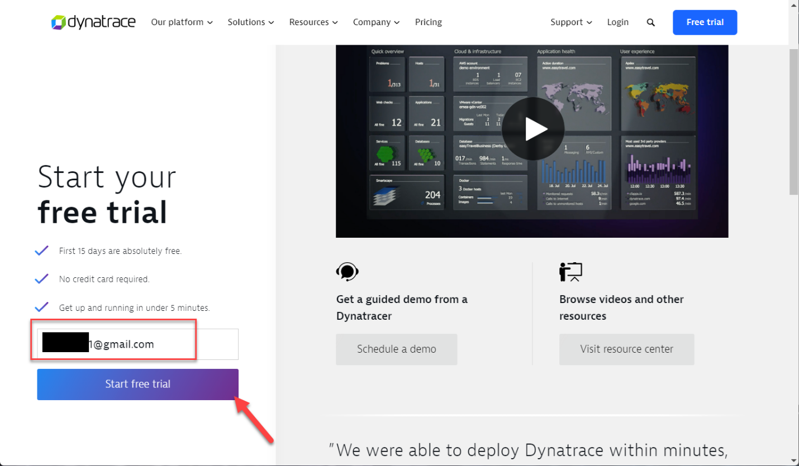
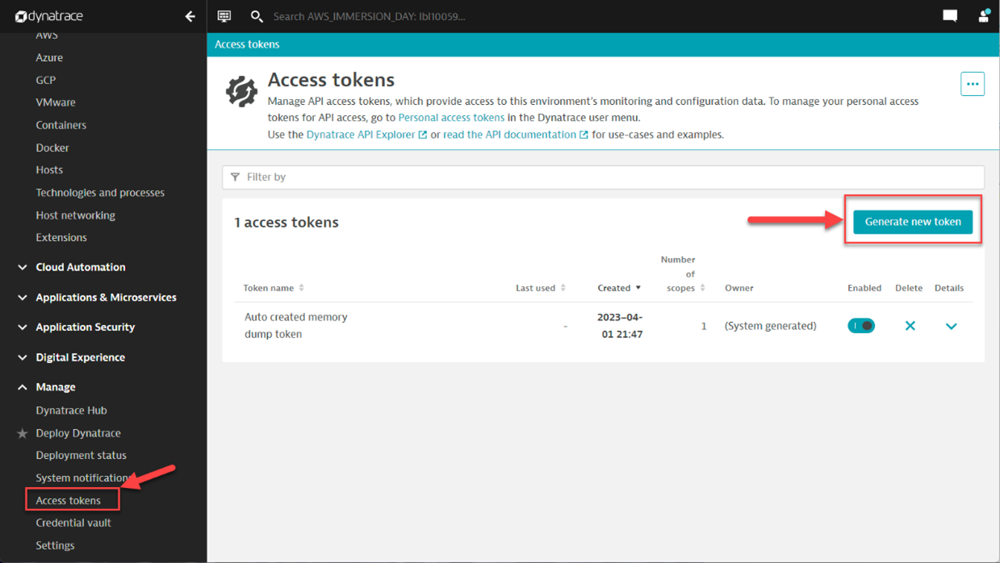
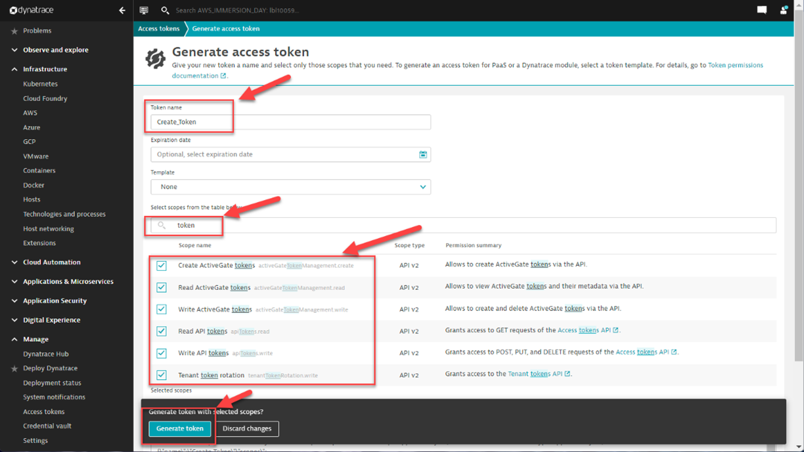
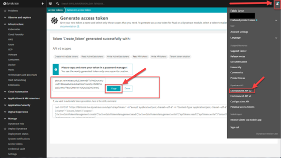
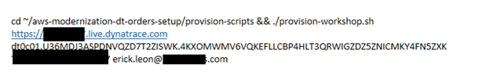

id: aws-dt-lab0-Prereq
categories: AWS-Lab-Prerequisite
tags: Dynatrace-SAAS-Prereq
status: Published

# Dynatrace Prerequisite Lab 0 - SAAS Deployment

## Set Up Dynatrace Tenant

`Please ensure you complete this lab the week of your AWS Immersion Day.  The Dynatrace Trial is only 2 weeks and if deployed too early your instance may expire.  We recommend you deploy your Dynatrace SAAS tenant 2 days before your event. Important to follow this lab step by step.`


* **Prerequisites** - A NEWLY created Google email address to use with this workshop is a must to ensure success during the next few steps.

### Dynatrace Tenant Provision Steps

1.	Navigate to <a href="www.dynatrace.com/trial" target="_blank">Dynatrace Trial</a> 
2.	enter email address in the text box
3.	click “Start Free Trial”
4.  suggested to use `"Dynatrac3!"` as your Dynatrace Tenant password



If you are unable to login or did not get your tenant invitation email, first ensure you used the newly created gmail address as required and check spam and junk folders.  


## Creating a Dynatrace All In One Token

Navigate to your new Dynatrace tenant as explained in the previous section.  The next steps will configure the right scopes used to create the “All in One Token” needed to allow AWS to use the Dynatrace API's.  

1.	From the left menu under the last section expand `Manage` and select `access tokens`
2.	Click on `Generate new Token`



3.	In the “Generate access token” form add the following info:
    1.	Token name:  AWS_ID_Token
    2.	Paginate and select all the token scopes listed below, when they are all selected it should be around `60` scopes.  
     `this would not typically be best practice but for this workshop we will break a few rules.`
    3.	Click on `Generate token`



4.	The result will generate a token and display it on the screen.  

5. Here you will want to click on the copy button to paste and save it into a notepad for your use in the next step.  

### 💥 **TECHNICAL NOTE**
*Please note this is the only time you will be able to see this access token so make sure to save it*



## Provision Script Command

Your instructors have simplyfied a few pieces of the workshop in order to streamline the AWS deployments.  In this step you will be composing your provisioning command that we will cut and paste into the AWS CLI during the workshop.

```
cd ~/aws-modernization-dt-orders-setup/provision-scripts && ./provision-workshop.sh {tenant URL} {Dynatrace token} {Tenant Email}
```
1.  Copy the above command to a notepad
2.	Replace {Tenant URL} with your tenant URL:  https://xxxxxxx.live.dynatrace.com
3.	From the all in one token you created and replace {Dynatrace token}:  dt0c01.xxxxxxxxxxxxxx
4.	Finally replace {Tenant Email}: with the email you used to create the tenant. 
5.	Once the command has been edited and saved it should look like: 



## Summary

In this section, you should have completed the following:

✅ Deployed your Dynatrace SAAS tenant

✅ Created the All In One Token 

✅ Created the Provisioning Script that will deploy the AWS assets during the workshop

You are now ready to attend the workshop.
