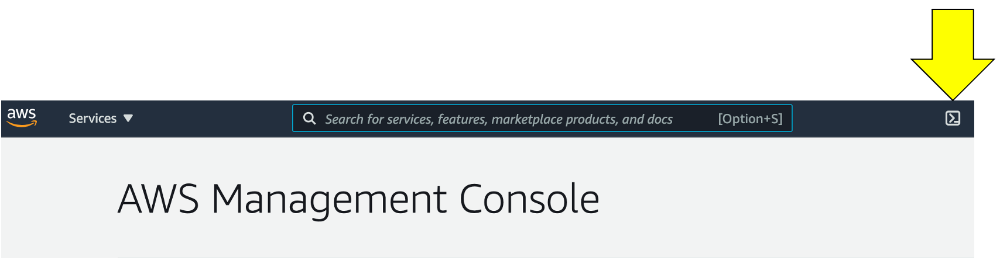
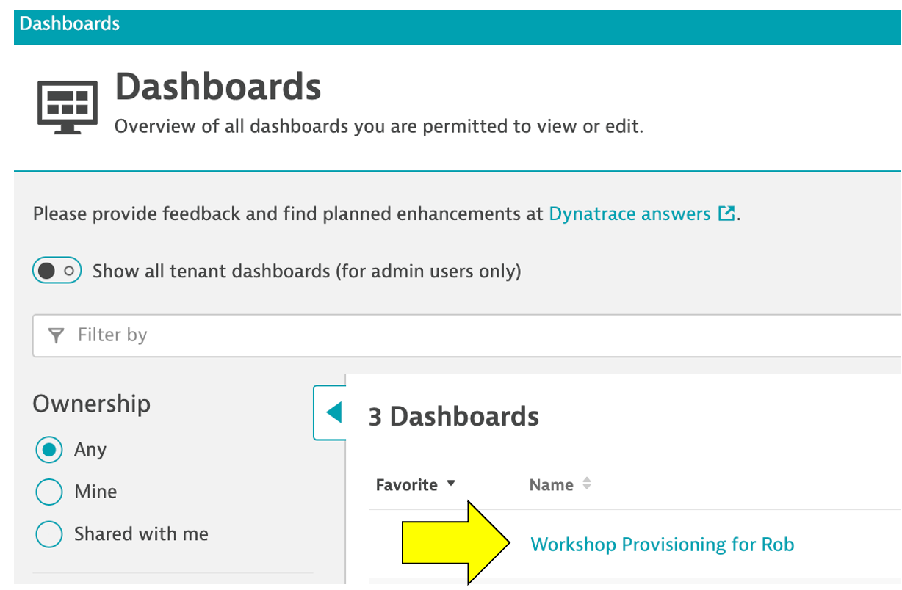

id: aws-lab0 immersion-day-jp
categories: modernization
status: Published
tags: aws-immersion-day-jp

# AWS Lab 0 - 初期設定

## AWS Immersion Day の目的

このハンズオンワークショップでは、まずモダナイゼーションに関して一般的な課題を確認し、次にDynatraceがAWS環境において自動的かつインテリジェントに根本原因分析を行う方法について紹介します。一連のハンズオンラボで以下のことを行います。

1. Dynatraceによるモノリスアプリケーションのオブザーバビリティの確認
1. モノリスからマイクロサービスへ更新された際のオブザーバビリティの確認
1. Dynatraceによるサービスレベル目標の概要
1. Dynatraceによる障害の検知と根本原因分析の実現方法

本セッションを通じて、クラウドネイティブアーキテクチャにおけるオブザーバビリティの実現方法について理解することができます！

### ワークショップの構成

本ワークショップはLab0-5までの6つのセッションで行われます。

* **Lab 0：環境構築** - DynatraceとAWS環境の構築と確認
* **Lab 1-5：ワークショップ** - 一部のラボでは、AWSリソースのプロビジョニング、サンプルアプリケーションのデプロイ、Dynatraceの設定を行うスクリプトを実行するステップを含みます。

### ワークショップの対象者

* アプリケーション開発者
* クラウド運用者
* アーキテクト
* テクニカルリード

## Dynatrace環境

ワークショップで使用するDynatraceにログインするためのURLが記載されたメールを送付しております。メールにログインURL、ID・パスワードが記載されておりますので、そちらの情報を元にログインをしてください。


ログインができないなどがございましたら、講師までお知らせください。

## AWSアカウント

AWSアカウントについてはAWS Event Engineサービスを通じて提供されます。ログインに必要なハッシュコードについても先ほどのメールに記載がございます。

1. 普段ご利用のAWSアカウントでログインしている場合は、ログアウトいただくか、ブラウザのプライベートウィンドウを利用してください。

2. <a href="https://dashboard.eventengine.run" target="_blank">https://dashboard.eventengine.run</a>にアクセスしていただくと以下の画面が表示されます。**Enter your event hash**に提供されたハッシュコードを入力し**Accept Terms & Login**をクリックしてください。


3. **Sign in with**と表示されたら、`Email One-Time Password (OTP)`を選びます。


4. メールアドレスを入力し、`Send passcode`ボタンをクリックします。


5. しばらくすると登録したメールアドレスにpasscodeが届くので、それを入力します。


6. **Team dashboard**のページが表示されたら、`AWS console`ボタンをクリックしてください。


7. **AWS Console Login**画面が表示されたら、`Open Console`ボタンをクリックします。


5. 新しいブラウザのタブが開き、AWSのコンソールが表示されます。


6. ここまで完了したら、環境の準備は完了です。

### 💥 **TECHNICAL NOTE**

*無料クレジットの有効期限が切れると、作成されたすべてのリソースは自動的に削除され、アカウントにアクセスすることができなくなります。*

## 監視対象サーバーの構築

<!--
### 1. Make sure you are in the correct region

Click the region button in the top right corner of your AWS console and make sure you are in `Oregon us-west-2` for consistency in this lab.


-->

### 1. Cloudshellの開始

このラボでは、AWS Cloudshellを使用します。Cloudshellはブラウザベースのシェルで、AWSリソースを安全に管理、利用することが可能です。

Cloudshellを開くには、AWSコンソールの上部にあるCloudshellアイコンをクリックします。 これには1分ほど時間がかかります。

また、リージョンは**シドニー**が選択されていることを確認してください。



下の画像のページが開く場合があります。その場合は**Close**ボタンをクリックしてウィンドウを閉じます。


ポップアップを閉じた後、Cloudshellが初期化されるのを1分ほど待ちます。これが終わると、以下のようなコマンドプロンプトが表示されます。


### 2. ワークショップスクリプトのクローン

Cloudshellを開いたら、ワークショップのセットアップを自動化するスクリプトをいくつか入手する必要があります。 以下のコマンドを実行してください：

```
git clone https://github.com/dt-alliances-workshops/aws-modernization-dt-orders-setup.git
```

下の画像のように出力されます。

```
[cloudshell-user@ip-10-0-52-50 ~]$ git clone https://github.com/dt-alliances-workshops/aws-modernization-dt-orders-setup.git

Cloning into 'aws-modernization-dt-orders-setup'...

remote: Enumerating objects: 161, done.
remote: Counting objects: 100% (161/161), done.
remote: Compressing objects: 100% (96/96), done.
remote: Total 161 (delta 72), reused 143 (delta 60), pack-reused 0
Receiving objects: 100% (161/161), 19.82 MiB | 22.21 MiB/s, done.
Resolving deltas: 100% (72/72), done.
```

## EC2インスタンスのプロビジョニング

2つのCloudFormationを実行すると以下が完了します

* `dt-orders-monolith`と`dt-orders-services`の2つのEC2インスタンスの作成
* EC2インスタンスには`Docker`と`Docker-Compose`がインストールされます
* EC2インスタンスには自動でDynatraceのテナントから`OneAgent`が設定されます
* `docker-compose up`を実行し、サンプルアプリケーションを起動します。

### 1. プロビジョニングスクリプトの取得

Dynatraceの左側のメニューから`ダッシュボード`を開きます。

ダッシュボードページで**ワークショップダッシュボード**をクリックします。



下の画像を参考にタイル右上の▽をクリックし、**タイルの編集**を選びます。コマンドが記載されている**Markdown**をクリックします。コマンドを全て選択し、右クリックから`コピー`をします。


**完了**ボタンをクリックし、編集モードから抜けます。

### 2. プロビジョニングスクリプトの実行

AWS Cloudshellに戻り、先ほどのマークダウンのコマンドを貼り付けます。以下のような画面が表示されるので`y`を押してセットアップを実行します。

```
===================================================================
About to Provision Workshop for:
https://syh360.dynatrace-managed.com/e/aaaaa-bbbb-ccccc-ddddd
SETUP_TYPE   = all
KEYPAIR_NAME = ee-default-keypair
===================================================================
Proceed? (y/n) :
```

スクリプトの実行が完了すると、以下のような画面が表示されます。

```
-----------------------------------------------------------------------------------
Done Setting up Workshop config
End: Thu Nov  4 01:45:06 UTC 2021
-----------------------------------------------------------------------------------
Create AWS resource: monolith-vm
{
    "StackId": "arn:aws:cloudformation:us-west-2:838488672964:stack/monolith-vm-1635990306/d82cd2b0-3d10-11ec-a495-023df82ab493"
}
Create AWS resource: services-vm
{
    "StackId": "arn:aws:cloudformation:us-west-2:838488672964:stack/services-vm-1635990309/d8a6e4b0-3d10-11ec-a495-023df82ab493"
}
```

### 3. AWS CloudFormationの結果確認

CloudFormationの実行には数分かかります。その間、CloudFormationの画面から途中経過が確認できます。
AWSの管理コンソールから`CloudFormation`のページを開きます。

* <a href="https://console.aws.amazon.com/cloudformation/home" target="_blank">https://console.aws.amazon.com/cloudformation/home</a>

CloudFormation Stackが完了するとStatusが`CREATE_COMPLETE`に変更されます。


### 💥 **TECHNICAL NOTE**

CloudFormationの実行にはおよそ5分程度時間が掛かります。

## Dynatrace の設定

上記のスクリプト内で以下のDynatraceの設定が自動で実行されています。

* <a href="https://www.dynatrace.com/support/help/how-to-use-dynatrace/problem-detection-and-analysis/problem-detection/detection-of-frequent-issues/" target="_blank">Frequent Issue Detection</a>の設定の無効化
* <a href="https://www.dynatrace.com/support/help/shortlink/problem-detection-sensitivity-services" target="_blank">Service Anomaly Detection</a>の調整
* <a href="https://www.dynatrace.com/support/help/how-to-use-dynatrace/management-zones/" target="_blank">Management Zones</a>の追加
* SLOとManagement Zonesの設定に必要な<a href="https://www.dynatrace.com/support/help/how-to-use-dynatrace/tags-and-metadata/" target="_blank">Auto Tagging Rules</a>の追加
* カスタムダッシュボード作成に必要な<a href="https://www.dynatrace.com/support/help/how-to-use-dynatrace/service-level-objectives/" target="_blank">SLOs</a>の追加

Dynatraceの設定変更には [Dynatrace Monitoring as Code](https://github.com/Dynatrace/dynatrace-configuration-as-code) (monaco)と [Dynatrace Configuration API](https://www.dynatrace.com/support/help/dynatrace-api/configuration-api/)を使用しています。

<!-- You can review the Monitoring as Code workshop files [in the GitHub repo](https://github.com/dt-alliances-workshops/aws-modernization-dt-orders-setup/tree/main/workshop-config) -->

## 本セクションのまとめ

このセクションでは、以下を実施しました。

✅ Dynatraceの環境にアクセスできることの確認

✅ AWSの環境にアクセスできることの確認

✅ ワークショップに必要なリソースの準備

それでは、次のセクションに進みましょう！
