id: aws-lab11-serverless-setup
categories: kubernetes,SAAS,serverless,all
tags: aws-immersion-day,aws-selfpaced,aws-immersion-day-SAAS
status: Published

# AWS Lab 11 - Modernization with AWS Serverless Lambda

## AWS Modernization with Serverless Lambda Objectives

This virtual hands-on workshop will start with a review of what is Serverless and Serverless Lambda.  We will address the benefits of serverless and lambda and also some challenges associated with the technology.  We will modernize the DT Orders application and deploy a new version of the catalog service.  This will be followed by series of hands-on labs where you will:

1. Continue to modernize the DT Orders applicaiton and deploy a serverless version of the Catalog applicaiton
1. Jump in and fully analyze the new serverless application within Dynatrace
1. Start to see and understand application usage patterns, infrastructure consumption, service dependencies, benchmarking performance and how service levels can be tightly ensured.

Raise your hand if you are `CLOUD NATIVE`... Oh thats you!! 

## Introduction Serverless Lambda

We have come a long way through this migration and modernization journey we started back in Lab-0.  We simulated a migration from on prem to EC2 Compute, we then modernized our application from monolith to a microservices architecture while shifting to a containerized approach and rehosting the application on an EKS cluster.  However the journey is not yet complete,  AWS continues to deliver technology that gives us addtional solutions for our digital products.  That said, there is more we can do to improve our code base as well as our infrastructure.  In the follwing lab we will be diving into the world of AWS Serverless specifically Lambda and what makes it a technology growing in popularity.  

### What is Serverless, is it really no servers

AWS Serverless is a cloud computing model provided by Amazon Web Services (AWS) where AWS manages the infrastructure, allowing adopters of the technology to build and run applications `withoutn having to manage servers`. 

Here are some key features and components of AWS Serverless:
1.  No server management is necessary
2.  Adopters are only charged for the server space they use, reducing cost
3.  Serverless architectures are inherently scalable
4.  Increased Agility
5.  Faster time to market
6.  Increased performance
7.  Optimizaes resources

Some disadvantages that must be mentioend
1. Lack of skills and resources
2. Security concerns
3. 3rd party dependancy
4. Difficult to test
5. Difficult to monitor -- `Not the case for Dynatrace`


## What is AWS Lambda?

AWS Lambda functions are a good example of how a serverless framework works:
* Developers write a function in a supported language or platform.
* The developer uploads the function and configuration for how to run the function to the cloud.
* The platform handling the function containerizes it.
* The platform builds the trigger to initiate the app.
* Every time the trigger executes, the function runs on an available resource.
* When an application is triggered, it can cause latency as the application sometimes will cold start.


AWS Lambda is a serverless compute service that runs your code in response to events and automatically manages the underlying compute resources for you. These events may include changes in state or an update, such as a user placing an item in a shopping cart on an ecommerce website. You can use AWS Lambda to extend other AWS services with custom logic, or create your own backend services that operate at AWS scale, performance, and security. AWS Lambda automatically runs code in response to multiple events, such as HTTP requests via Amazon API Gateway, modifications to objects in Amazon Simple Storage Service (Amazon S3) buckets, table updates in Amazon DynamoDB, and state transitions in AWS Step Functions.

It also runs your code on high availability compute infrastructure and performs all the administration of your compute resources. This includes server and operating system maintenance, capacity provisioning and automatic scaling, code and security patch deployment, and code monitoring and logging. All you need to do is supply the code.

### The Lambda Architecture?

Lambda architecture is a data deployment model for processing that consists of a traditional batch data pipeline and a fast streaming data pipeline for handling real-time data. In addition to the batch layer and speed layers, Lambda architecture also includes a data serving layer for responding to user queries.

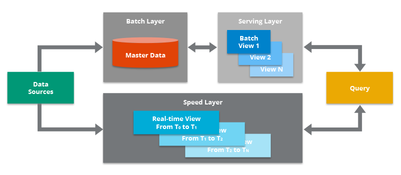

### The Lambda A-Typical Usecases

1.  Suppose you are creating a website and you want to host the backend logic on Lambda. You can invoke your Lambda function over HTTP using Amazon API Gateway as the HTTP endpoint. Now, your web client can invoke the API, and then API Gateway can route the request to Lambda.  
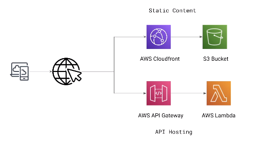

2.  Lambda is great for running repetitive tasks such as cronjobs
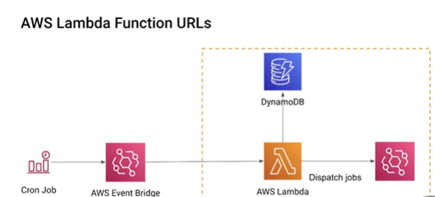

3.  Another popular use case is events processing When working with stream-based event sources, you create event source mappings in AWS Lambda. Lambda reads items from the stream and invokes the function synchronously.  
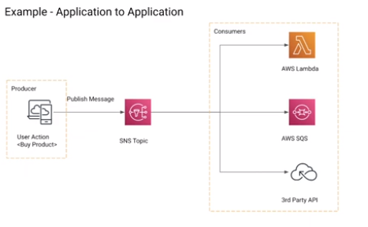

4.   Suppose you have a photo sharing application. People use your application to upload photos, and the application stores these user photos in an Amazon S3 bucket. Then, your application creates a thumbnail version of each user's photos and displays them on the user's profile page. In this scenario, you may choose to create a Lambda function that creates a thumbnail automatically. Amazon S3 is one of the supported AWS event sources that can publish object-created events and invoke your Lambda function. Your Lambda function code can read the photo object from the S3 bucket, create a thumbnail version, and then save it in another S3  
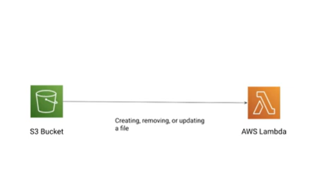

5.  Last but certainly not final is managing webhooks as our applications rely on 3rd party services.  Lambda in this case is used to manage the conneciton of the webhook to the serivces and freeing from managing this vm or other hardware to run this. 
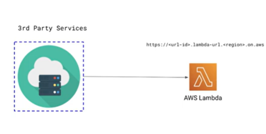

## Where we are headed throught this section

Below is conceptually were we are headed with our architechture.  Modernizing the catalog service from its current state to a Lambda based architecture that includes an external RDS database running a MySql instance.


Lets do this!!

## Checking the Assets in AWS

### Checking to make sure we have what we need to deploy our functions

If you remember in the begining we asked you to clone the git repo to your AWS console, well inside of that repo we also uploaded all of the assets we will need to successfully deploy the your RDS database and Lambda Functions:

first lets take a look at what we have:

```
cd ~/aws-modernization-dt-orders-setup/provision-scripts/
```
and type
```
ls -ltr
```
This will display the contents of this directory you just switched to:

ensure that you have all of the files highlighted by red outlines as they do the following:
* LambdaProvisionScript.sh - shell script used to automante the creation of the necessary parts.
* catalog-service-serverless.yml - used to deploy the changes to the catalog service in K8s
* create.sql - used to create the mysql db with in the RDS instance
* findByName.zip - contains all the Python code and logic necessary to build the findByName lambda
* serverlessDBActions.zip - same as above and necessary to build serverlessDBActions lambda

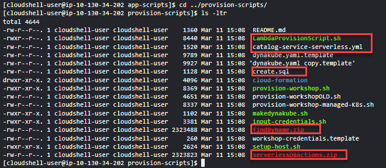

`If you do not please advise your instructor or double check to make sure you are in the right directory.`
### 💥 **TECHNICAL NOTE**

*look closely at your list of permissions specifically on the LambdaProvisionScript.sh it is not set up to be executatable.  lets give it the permissions necessary to use that file.  In your console cli type "chmod u+x LambdaProvisionScript.sh" now so that we can reference and execute the script.  If you do another ls -ltr you will see it has now turned green.*

## Deploying the LambdaProvisionScript.sh

```
./LambdaProvisionScript.sh
```
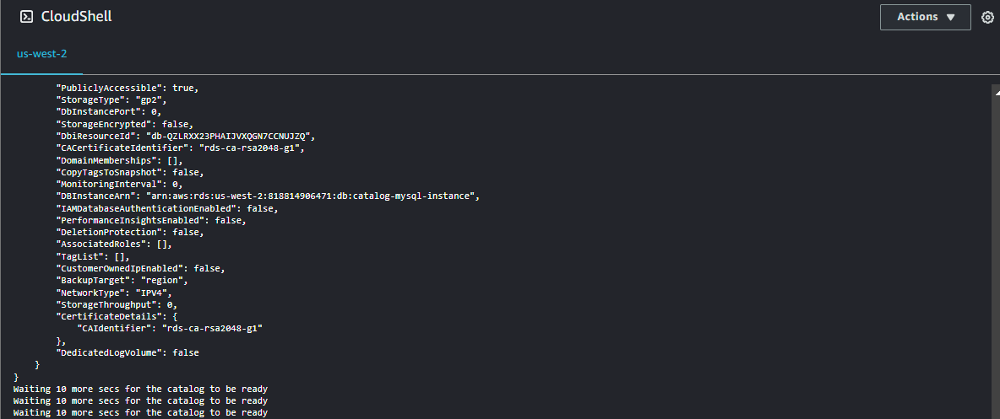

## What is our script doing? 
A shell script is one way to automate and execute commands in the AWS cli that will create the functions but of course there is other ways such as `Cloud Formation Templates`, `Terraform` or a myriad of other automation sdks.  

This shell script for us doing the following: 
*  Deploying the RDS database (will take about 3 to 4 mins to complete)
*  Creating the MySql instance within that RDS db. 
*  Creating the necessary permissions to allow the RDS to communicate with MySql
*  Creating all the environment variables that the script needs to reference
*  Creating 2 functions with public facing function URLs and the Dynatrace Layer.  
      *  `What is a dynatrace layer? It a way to load all the libraries and dependancys necessary for lambda to talk to your DT-Tenant and provide you with the observability you need in context.`
*  Updating the catalog-service-serverless-yml with the values of the functionURL's of the lambda functions 

Once the script completes its time to double check a few things and finally deploy the changes to the catalog service in the workshop K8s cluster.

## More about the Dynatrace Layer
Here's how the Dynatrace Lambda Layer works and its benefits:

Easy Integration: By adding the Dynatrace Lambda Layer to your AWS Lambda functions, you can automatically monitor their performance without modifying the function's code. This layer includes the Dynatrace OneAgent, which is responsible for collecting metrics, traces, and logs.

Real-Time Visibility: Dynatrace provides real-time insights into the performance of your Lambda functions, including execution times, memory usage, and invocation counts. It helps identify performance bottlenecks, errors, and anomalies within your serverless applications.

Distributed Tracing: The Dynatrace Lambda Layer supports distributed tracing, allowing you to trace requests as they move through your serverless components and other parts of your architecture. This is crucial for understanding dependencies and interactions in microservices and serverless architectures.

Automated Anomaly Detection: Leveraging artificial intelligence and machine learning, Dynatrace can automatically detect anomalies and potential issues in your serverless applications. This proactive monitoring can help you address problems before they impact your users.

Optimization Opportunities: By analyzing the detailed performance data collected, Dynatrace can offer insights into optimization opportunities, helping you improve efficiency and reduce costs associated with running Lambda functions.

Seamless Integration with AWS Services: The Dynatrace Lambda Layer integrates well with various AWS services and resources involved in your serverless applications, providing a comprehensive monitoring solution.

## Checking that we see the new Lambda functions in our Dynatrace Console.
In your Dynatrace tenant fron the right side menu as we did before select `AWS` and open the `CloudWatch dashboard`

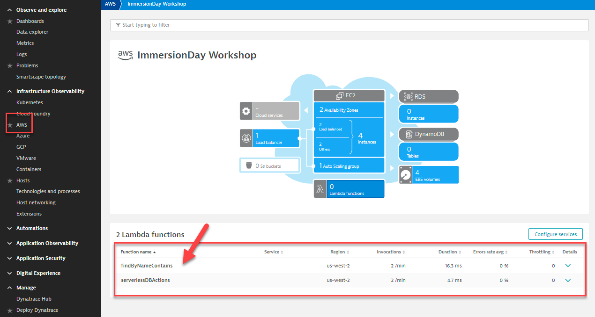

Click on the `Lambda functions` box and you will notice that Dynatrace already knows about your recent deployment and is collecting on CloudWatch available metrics.  At this point the Lambdas have not yet been deployed to the catalog service so not much going on.  

## Updating the Catalog Service to use the newly created Lambda functions 

Ensure you are still in the same directory 
```
~/aws-modernization-dt-orders-setup/app-scripts/
```
Lets double check that the `catalog-service-serverless.yml` has all the necessary updates from the LambdaProvisionScript.sh

```
cat catalog-service-serverless.yml
```
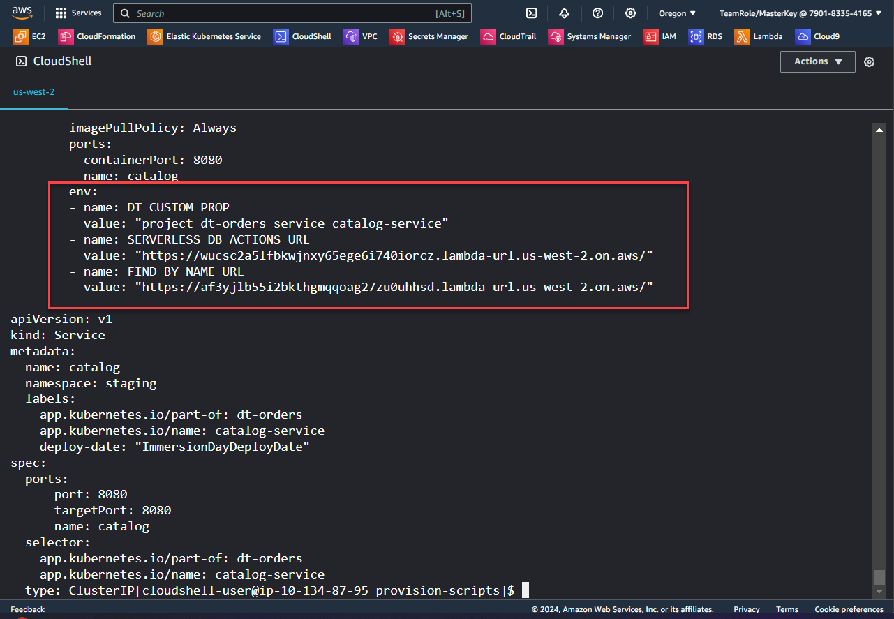 
Your file should also have 2 sets of URLs as in the section pictured.  `If you do not let your instructor know.`  From this cat output you can see that the deployment will be targeting the catalog service in the `staging` namespace, which is were our DT Orders app is currently running within our K8 cluster. 

### Lets finally deploy the update and get those Lambdas working!

in your AWS CLI console type the following command: (make sure you are in the /provision-scripts directory)

```
kubectl apply -f catalog-service-serverless.yml
```
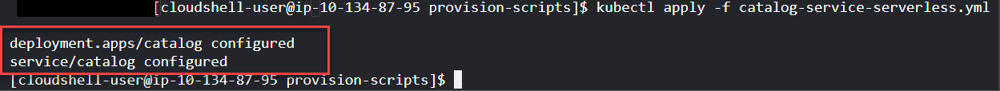 

Validate that you have an output as pictured above.  If you do **SUCCESS** however it will take a few minutes to get the changes to take place and traffic from the load gen to start flowing into the functions. 

**👍If we have time lets take a 5 min break and if we dont we will carry on**

## Summary

While modernizing to or in the cloud, you want to evaluate if your modernization goes according to the plan, whether the services are still performing well or even better than before, and whether your new architecture is as efficient as the blueprint suggested. Dynatrace helps you validate all these steps automatically, which helps speed up the modernization and validation process.

Having the ability to understand service flows enables us to make smarter re-architecture and re-platforming decisions.  With support for new technologies like Kubernetes, Lambda and many other AWS technologies you have confidence to modernize with a platform that can cover the old and the new. 

### 💥 **TECHNICAL NOTE**

<i>Dynatrace sees a lot of demand for Lambda serverless compute service and a slew of new capabilities and here is where to look for step by step reference [Dynatrace documentation](https://docs.dynatrace.com/docs/setup-and-configuration/setup-on-cloud-platforms/amazon-web-services/amazon-web-services-integrations/aws-lambda-integration)</i>

### What we did

In this section, you should have completed the following:

✅ Createded 2 Lambda functions and an RDS database

✅ Deployeded a change to the catalog service in the staging namespace with in K8 cluster

✅ Now we are ready to examine the modernized application using service flows through Lambda and backtraces 
