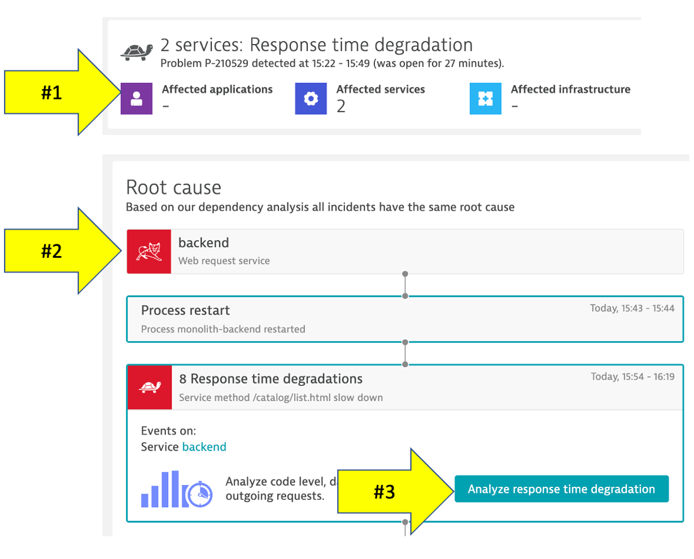
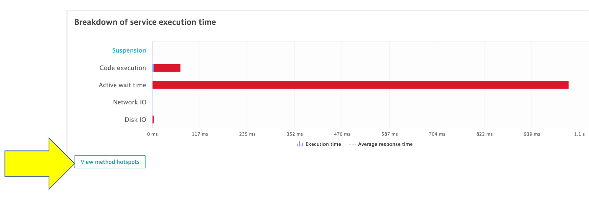
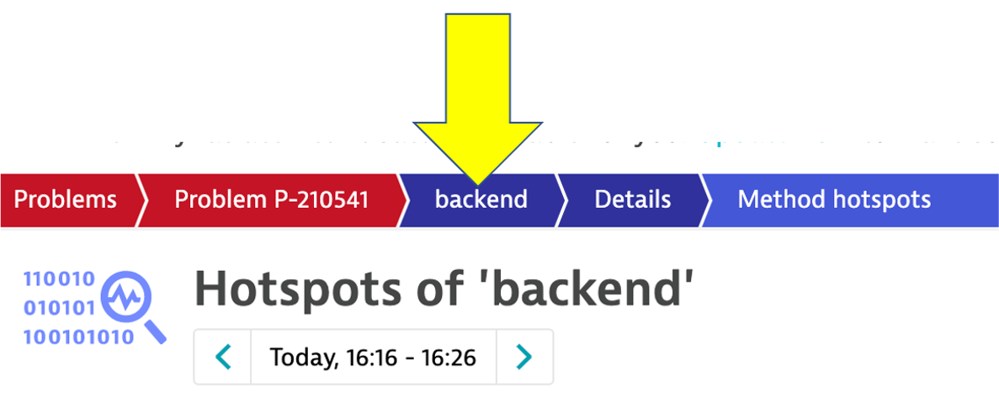
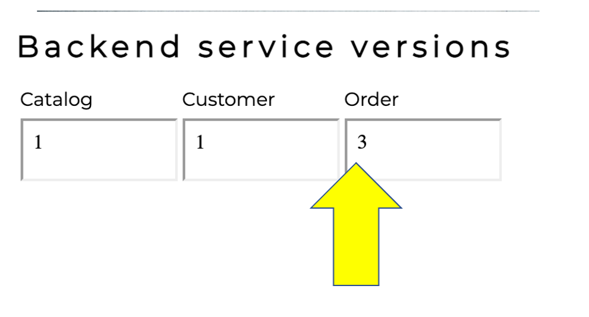
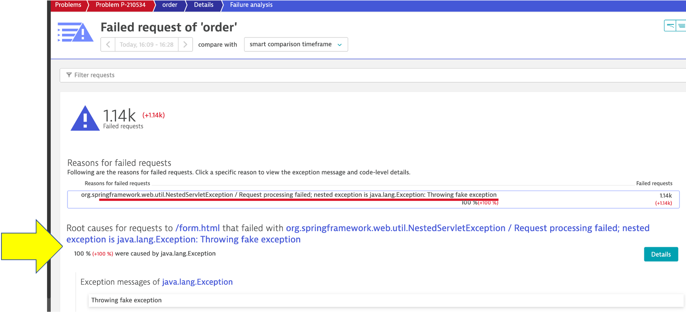
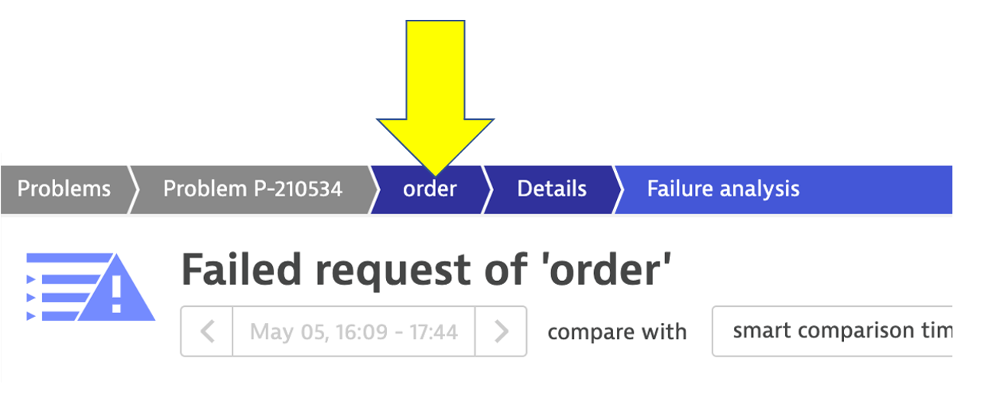
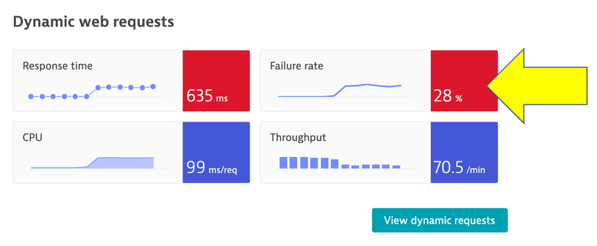
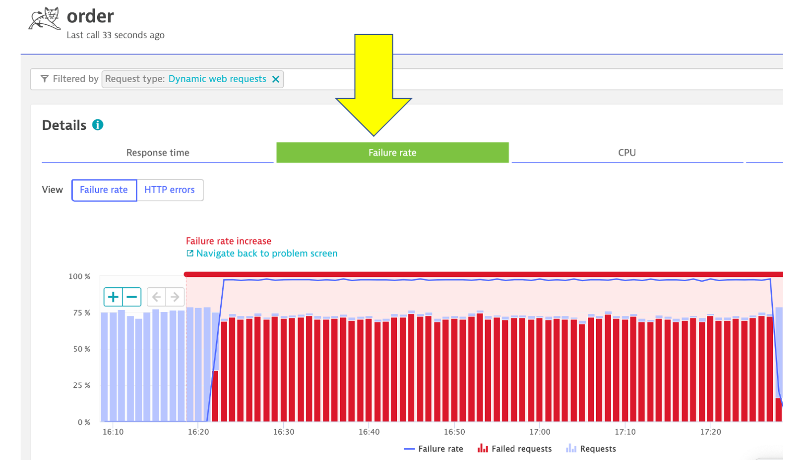

id: aws-lab5-jp
categories: modernization
status: Published
tags: aws-immersion-day-jp

# AWS Lab 5 - Davis AI

## 概要

マイクロサービスの複雑なエコシステムやKubernetesのようなテクノロジーでは、既存のモニタリングツールでは十分でないことがよくあります。

問題の根本原因を見つけることは以前よりも難しくなっており、アプリケーションがクラウドプロバイダーやデータセンターにまたがり、相互接続されたサービスが爆発的に増えている場合、必要な労力は人手による調査の限界を超えています。関連するコンポーネントが増加すれば増加するほど障害が発生する可能性はより高くなり、問題が生じた際の原因特定は困難になっていきます。

このラボでは、いくつかの問題をトリガーにして、自動的に問題を検出しAIが根本的な原因を突き止め、トラブルシューティングにかかる時間がどのように大幅に短縮されるかを確認します。

### 本セクションの目的

🔷 アプリケーションに問題を発生させ、DynatraceのAIエンジンである[Davis](https://www.dynatrace.com/platform/artificial-intelligence/)がどのように根本原因を特定しているのか、その確認方法について学びます。

## アプリケーションの障害の発生

Dynatrace Ordersのサンプルアプリケーションには、異なるバージョンの問題があらかじめ組み込まれています。

バージョン1は **通常** の動作で、バージョンを2や3のように値を設定することで問題が有効になります。

次のセクションでは、これらの問題を設定するシェルスクリプトを実行します。

### モノリス環境 - backend service - 全てのリクエストに対する遅延の発生


### マイクロサービス環境 - order service - order サービスに関連するリクエストに対する例外の発生


### 💥 **TECHNICAL NOTE**

障害パターンの詳細については[Githubリポジトリ](https://github.com/dt-orders/overview)をご確認ください。

## Dynatraceイベント

障害を発生させる前にDynatraceのイベントについて確認していきましょう。詳細については[Event API v2](https://www.dynatrace.com/support/help/shortlink/api-events-v2)を確認ください。

Dynatraceイベントは、CI/CDツールがDynatraceに情報を追加提供することを可能にします。以下は、デプロイメントとパフォーマンステストの2つの情報イベントがDynatraceに送信される例です。


Dynatraceのイベントタイプはいくつかあります。例えば以下のようなものです：
* `CUSTOM_ANNOTATION`
* `CUSTOM_CONFIGURATION`
* `CUSTOM_DEPLOYMENT`
* `CUSTOM_INFO`
* `MARKED_FOR_TERMINATION`

以下の画像はDynatraceのAIエンジンであるDavis®が判断した問題の根本原因であるサービスを以下に示します：
* (#1) `CUSTOM_INFO`
* (#2) `CUSTOM_DEPLOYMENT`


各イベントはタイムスタンプ、イベントソースと標準的ないくつかのフィールド（イベント種別に依存）、追加のカスタムフィールドを持っています。詳細については[ドキュメント](https://www.dynatrace.com/support/help/shortlink/api-events-v2-get-event-property-list)を確認してください。

### 👍 どのように役立つのか

Dynatraceではプロブレム通知画面でその問題に関連したイベント情報を確認することができます。問題についてのアラートを受けるとその時間帯に何が行われていたのか（新規のデプロイメントなど）を調べることなく知ることができます。イベントを1回クリックするだけで、システムやジョブ、担当者を確認することが可能になるのです！

### Dynatraceタグ

情報イベントを作成するときは、関連するコンポーネントだけに関連付けられるように、イベントを受け取るエンティティをターゲットにする必要があります。そこでDynatraceタグの出番です。

簡単に言うと、Dynatraceのタグは、大規模な監視環境でエンティティを整理するために使用されるラベルです。以下は、カタログサービスのためのいくつかのタグを示しています：

* `stage:staging`
* `service:catalog-service`


### API call例

以下はイベントAPI呼び出しの例です。次のステップでスクリプトの一部として、実行しますので、**ここでは実行する必要はありません。**

```
curl -X POST \
  https://mySampleEnv.live.dynatrace.com/api/v1/events \
  -H 'Authorization: Api-token abcdefjhij1234567890' \
  -H 'Content-Type: application/json' \
  -d '{
  "eventType" : "CUSTOM_DEPLOYMENT",
  "source" : "Pipeline Script" ,
  "deploymentName" : "Set order-service to version 1",
  "deploymentVersion" : "1"  ,
  "deploymentProject" : "dt-orders project" ,
  "ciBackLink" : "http://link-back-to-my-pipeline",
  "customProperties": {
      "Example Custom Property 1" : "Example: Commit SHA",
      "Example Custom Property 2" : "Example: Name of person who run pipeline",
      "Example Custom Property 3" : "Example: Application owner name",
      "Example Custom Property 4" : "Example: Ticket Number approving change"
  },
  "attachRules": {
      "tagRule" : [
          {
              "meTypes":["PROCESS_GROUP_INSTANCE"],
              "tags": [
                  {
                      "context": "CONTEXTLESS",
                      "key": "service",
                      "value": "order-service"
                  },
                  {
                      "context": "CONTEXTLESS",
                      "key": "project",
                      "value": "dt-orders"
                  },
                  {
                      "context": "CONTEXTLESS",
                      "key": "stage",
                      "value": "production"
                  }
              ]
          }
      ]}
  }'
```

## Backend サービスの障害

障害を発生させるためには、`backend`サービスのバージョンを変更します。バージョン変更を自動化するためのシェルスクリプトを準備していますので、本ハンズオンではそのシェルスクリプトを実行します。

シェルスクリプトの主な内容：
* `backend/setversion`を呼び出し、`backend`サービスのバージョンを変更
* Dynatraceへ変更を通知するために`CUSTOM_DEPLOYMENT`をイベントAPIを送信

1分ほどすると、すべてのリクエストに対して高いレスポンスタイムとなるはずです。


### 1. 障害パターンの有効化

AWS CLoudShellから以下のコマンドを実行し、バックエンドサービスをバージョン2に設定します。

```
cd ~/aws-modernization-dt-orders-setup/learner-scripts/
./set-version.sh backend 2
```

出力を見て、変更が正常に行われたことを確認します。

```
Retrieving dt-orders-monolith Public IP
=================================================================
Setting Service Version
SERVICE         = backend
NEW_VERSION     = 2
SET_VERSION_URL = http://1.1.1.1/backend/setversion/2
=================================================================
Set backend to 2 was successful
=================================================================
Sending Dynatrace Deployment event
DT_API_URL                 = https://xxx.live.dynatrace.com/api/v1/events
DEPLOYMENT_NAME            = Set backend to version 2
DEPLOYMENT_VERSION         = 2
DEPLOYMENT_PROJECT         = dt-orders
CI_BACK_LINK               = http://1.1.1.1
=================================================================
Push Event POST_DATA
{ "eventType" : "CUSTOM_DEPLOYMENT", "source" : "Custom Unix Shell Script" , "deploymentName" : "Set backend to version 2", "deploymentVersion" : "2" , "deploymentProject" :"dt-orders" , "ciBackLink" : "http://1.1.1.1", "customProperties": { "Example Custom Property 1" : "Example Custom Value 1", "Example Custom Property 2" : "Example Custom Value 2", "Example Custom Property 3" : "Example Custom Value 3" }, "attachRules" : { "tagRule" : [ { "meTypes":["PROCESS_GROUP_INSTANCE"], "tags": [ { "context": "CONTEXTLESS", "key": "service", "value": "backend" }, { "context": "CONTEXTLESS", "key": "project", "value": "dt-orders" }, { "context": "CONTEXTLESS", "key": "stage", "value": "production" } ]} ]} } }

Response Data
{"storedEventIds":[8663164135574257870,-5988376401319068441],"storedIds":["8663164135574257870_1628095127627","-5988376401319068441_1628095127627"],"storedCorrelationIds":[]}
```
<!--
## 2. View change in Dynatrace

From the left side menu, navigate to the `Releases` page.  Here you will see the how Dynatrace detected the versions.  It may take a minute, but you will see the version change in the `Real-time inventory` section and a new event in the `Release events` section.

**NOTE** Be sure to adjust the management zone to `dt-orders-monolith`


-->

### 2. ブラウザでアプリケーションのバージョン確認

サンプルアプリケーションにアクセスし、バージョンを確認します。正常にバージョンアップされていれば**バージョン2**と表示されるはずです。


### 3. Dynatraceでプロブレムの確認

数分するとDynatraceが問題を検出します。。

左のメニューから`プロブレム`に移動し、問題を確認してみましょう。

**注）Management Zoneの設定がAllになっていることを確認してください。**


下の画像のように表示がされるはずです。

1. 影響範囲 - 2つのサービスに影響
1. 根本原因



### 4. 問題の分析 - 応答時間の劣化の分析

`応答時間の劣化を分析`ボタンをクリックすると、リクエスト処理に対する応答時間の分析結果が表示されます。

ここでは、Dynatraceが自動的に問題を分析し、問題がコード、待機、または他のサービスやキューに関連しているかどうかを知ることができます。

実行時間の内訳の詳細を開くには、一番上の所見で`アクティブ待ち時間`行をクリックします。


### 5. 問題の分析 - 実行時間の詳細

Dynatrace は自動的に実行時間の内訳を表示します。 もっと見るには、`メソッドホットスポットの表示` ボタンをクリックします。



### 6. 問題の分析 - ホットスポットの確認

ここでは、コード呼び出しの内訳が示されており、このツリーを展開することで、スローダウンが発生しているメソッドを見つけることができます。 **注：スローダウンを起こしているメソッドを見つけるには、いくつかのスタックフレームを展開する必要があります。**


### 7. プロブレムインパクトの分析

上部のメニューから`backend`をクリックしてサービスページに戻ります。



次に、応答時間ボックスをクリックして、サービスの詳細ページを開きます。 問題がいつ発生したかを正確に確認することができます。


### 8. 問題の復旧

以下のコマンドを実行して、`backend`をバージョン1に戻します。

```
cd ~/aws-modernization-dt-orders-setup/learner-scripts/
./set-version.sh backend 1
```

### 💥 **TECHNICAL NOTE**

Dynatraceが問題分析を行う際、複数の問題が最終的に1つに統合されることがあります。

**問題のカードに "Custom Threshold "と書かれているのはなぜですか？**

DynatraceのAIエンジンは、毎日と毎週のトラフィックパターンのメトリックと依存関係を評価しています。本ハンズオンではサンプルアプリケーションをセットアップしたばかりで、レビューする履歴があまりないので、グローバルサービス設定として固定しきい値をセットアップしました。

この設定を確認するには、左側のメニューから`管理 > 設定`をクリックし、`Anomaly Detection`をクリックし、`Services`の設定をクリックする。


[Automated multi-dimensional baselining](https://www.dynatrace.com/support/help/shortlink/automated-baselining)に問題がどのように検出され、分析されるかについて詳細が記載されています。

## orderサービスの問題

次に、`order`サービスで障害を発生させます。

`backend`サービスと同様にシェルスクリプトを実行することで、自動的にバージョンが更新されます。

数分で`order`サービスを呼び出すすべてのリクエストについて例外が発生します。


### 1. Enable the problem pattern

AWS CLoudShellから以下のコマンドを実行し、バックエンドサービスをバージョン2に設定します。

```
cd ~/aws-modernization-dt-orders-setup/learner-scripts/
./set-version.sh order 3
```

以下のような結果が表示されるはずです。`storedEventIds`に数値が入っていることを確認してください。

```
Response Data
{"storedEventIds":[8663164135574257870,-5988376401319068441],"storedIds":["8663164135574257870_1628095127627","-5988376401319068441_1628095127627"],"storedCorrelationIds":[]}
```

### 2. ブラウザでアプリの確認

マイクロサービス環境のサンプルアプリへブラウザからアクセスしてください。注文アプリのバージョンに`3`が表示されているはずです。



<!--
## 2. View change in Dynatrace

From the left side menu, navigate to the `Releases` page.  Here you will see the how Dynatrace detected the versions of monitored processes.  It may take a minute, but you will see the version change in the `Real-time inventory` section and a new event in the `Release events` section.


**NOTE: Be sure that your management zone is NOT filtered!**


If you expand the event, you should see something like this


-->

### 3. Dynatraceによる問題の確認

問題が表示されるまでに時間がかかることがありますが、表示されると以下の画像のようになります。また、Dynatraceが問題の分析を行っているため、2つの問題が最終的に1つに統合される場合があります。

1. 問題カードと影響の概要
1. 根本原因
1. 追加のコンテキスト情報としてのDeploymentイベント


### 4. 問題の分析

上の画像の#4を参照し、`失敗率の劣化の分析`ボタンをクリックします。

すぐに例外が発生していることがわかります。`詳細`ボタンをクリックしてコードのスタックトレースを確認することができます。



### 5. プロブレムの影響分析

上部のメニューから`order`をクリックしてサービスページに戻ります。



このページでは、`失敗率`に注目してください。



次に、失敗率ボックスをクリックして、サービスの詳細ページを開きます。 問題がいつ発生したかを正確に知ることができます。



### 6. 問題の復旧

以下のコマンドを実行して、`order`サービスをバージョン1に戻します。

```
cd ~/aws-modernization-dt-orders-setup/learner-scripts/
./set-version.sh order 1
```

Dynatraceは、正常に戻ったことを検出すると、自動的に問題を終了します。

## 本セッションのまとめ

応答時間の遅延、失敗率の増加の2つの障害パターンでDynatraceがどのように問題を検知し、Davis AIが根本原因を特定するのかを確認しました。さらにドリルダウンをしていくことで障害の内容を深堀して分析する方法について学びました。

### チェックリスト

このセクションでは以下を確認しました：

✅ アプリケーションの問題を有効にし、Davisが発見したことを確認
