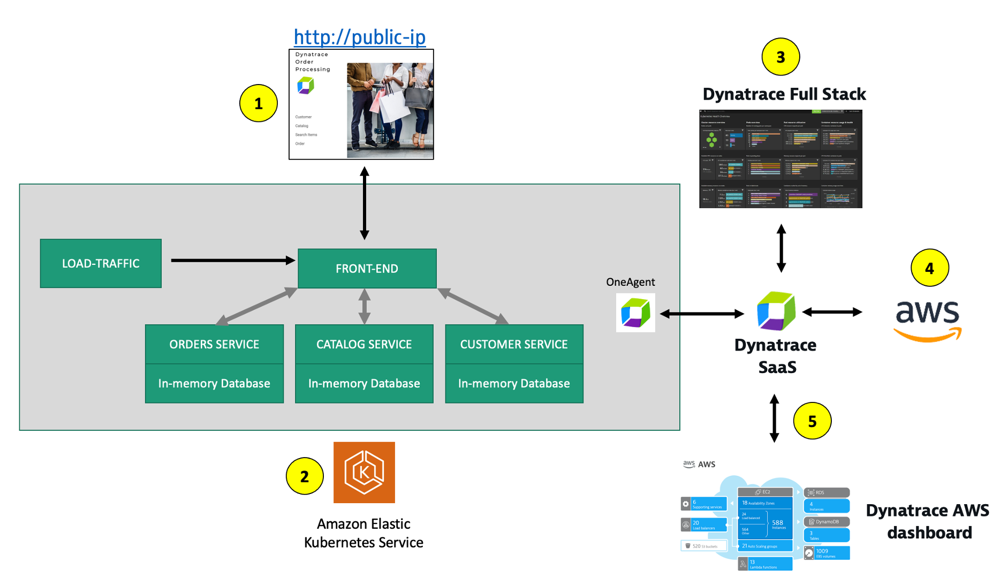
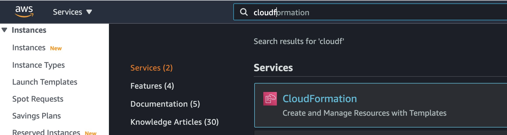
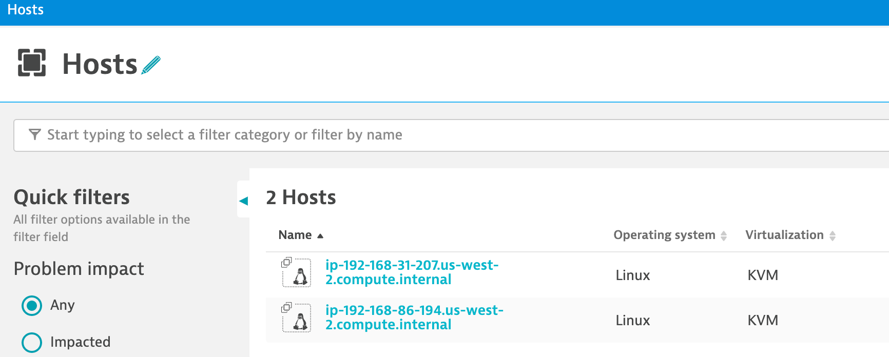

id: aws-lab6
categories: kubernetes
status: Published
tags: aws-immersion-day,aws-selfpaced


# AWS Lab 6 - Dynatrace Operator for Kubernetes

## Overview

Re-hosting (also referred to as lift and shift) is a common migration use case. Re-architecture and Re-platform are steps that break the traditional architectures and replace individual components with cloud services and microservices. 

For this lab you are going to use an updated version of the application on a Kubernetes.  This makes it easy for you to see the transformation of the Sample Application in Lab 1 and the value of running Kubernetes on AWS without needing to stand up or maintain your own Kubernetes control plane. 

### 💥💥💥 Notice 💥💥💥

If you would rather NOT provision Kubernetes on AWS, then please follow the `AWS Lab 2 - Modernization with Containers` workshop guide. This guide has a shorter setup process but, still allows you to interact with the sames transformed application. 

### 💥💥💥 Notice 💥💥💥

This lab assumed you already provisioned an Amazon Elastic Kubernetes Service (EKS) cluster. If you did not have a cluster, then return the Kubernetes Lab.

### Objectives of this Lab 

🔷 Install the Dynatrace Operator and sample application

🔷 Review how the sample application went from a simple architecture to multiple services 

🔷 Examine the transformed application using service flows and back traces 

## Lab Setup

For this lab, another version of the application exists that breaks out each of these backend services into separate services. By putting these services into Docker images, we gain the ability to deploy the service into modern platforms like Kubernetes and AWS services.

### Kubernetes Overview

Kubernetes is open source software that allows you to deploy and manage containerized applications at scale. 

Kubernetes manages clusters of compute instances and runs containers on those instances with processes for deployment, maintenance, and scaling. Using Kubernetes, you can run any type of containerized applications using the same toolset on-premises and in the cloud.  

You can read more about Kubernetes <a href="https://aws.amazon.com/kubernetes" target="_blank">here</a>

### Amazon Elastic Kubernetes Service

AWS makes it easy to run Kubernetes. You can choose to manage Kubernetes infrastructure yourself with Amazon EC2 or get an automatically provisioned, managed Kubernetes control plane with <a href="https://aws.amazon.com/eks/" target="_blank">Amazon EKS</a>. Either way, you get powerful, community-backed integrations to AWS services like VPC, IAM, and service discovery as well as the security, scalability, and high-availability of AWS.

Amazon EKS runs Kubernetes control plane instances across multiple Availability Zones to ensure high availability. Amazon EKS automatically detects and replaces unhealthy control plane instances, and it provides automated version upgrades and patching for them.

Amazon EKS is also integrated with many AWS services to provide scalability and security for your applications, including the following:

* Elastic Load Balancing for load distribution
* IAM for authentication
* Amazon VPC for isolation
* Amazon ECR for container images

## Lab components

Refer to the picture below, here are the components for lab 2.



**#1 . Sample Application**
Sample app representing a "services" architecture of a frontend and multiple backend services implemented as Docker containers that we will review in this lab.

**#2 . Kubernetes**
Amazon Elastic Kubernetes Service (EKS) is hosting the application. The Kubernetes cluster had the Dynatrace OneAgent Operator installed. (see below for more details).  Two EKS nodes make up the Kubernetes cluster. The Dynatrace OneAgent was preinstalled by the OneAgent operator and is sending data to your Dynatrace SaaS environment. (see below for more details)

**#3 . Dynatrace Operator**
Dynatrace OneAgent is container-aware and comes with built-in support for out-of-the-box monitoring of Kubernetes. Dynatrace supports full-stack monitoring for Kubernetes, from the application down to the infrastructure layer.

**#4 . Dynatrace**
Dynatrace tenant where monitoring data is collected and analyzed.

**#5 . Full-Stack Dashboard**
Made possible by the Dynatrace OneAgent that will automatically instrument each running node & pod in EKS.

**#6 . Kubernetes Dashboard**
The Kubernetes page provides an overview of all Kubernetes clusters showing monitoring data like the clusters’ sizing and utilization.

## Dynatrace Operator Overview

One key Dynatrace advantage is ease of activation. OneAgent technology simplifies deployment across large enterprises and relieves engineers of the burden of instrumenting their applications by hand. As Kubernetes adoption continues to grow, it becomes more important than ever to simplify the activation of observability across workloads without sacrificing the deployment automation that Kubernetes provides. Observability should be as cloud-native as Kubernetes itself.

In our workshop, we will install the Dynatrace Operator that streamlines lifecycle management.  You can read more about it here in this <a href="https://www.dynatrace.com/news/blog/new-dynatrace-operator-elevates-cloud-native-observability-for-kubernetes/" target="_blank">Dynatrace blog</a>.

Organizations will often customize the Dynatrace Operator installation and you can read more about the options in the <a href="https://www.dynatrace.com/support/help/setup-and-configuration/setup-on-container-platforms/kubernetes/get-started-with-kubernetes-monitoring/dto-config-options-k8s" target="_blank">Dynatrace docs</a> but, we are going to use a single command that we can get from the Dynatrace interface to show how easy it is to get started.

## Review CloudFormation

To verify completion status of the CloudFormation script within the AWS console.

You can navigate to the CloudFormation page as shown below.


Or use this link as shortcut to the CloudFormation page

* <a href="https://console.aws.amazon.com/cloudformation/home" target="_blank">https://console.aws.amazon.com/cloudformation/home</a>

On the CloudFormation page, click on the stack shown in this example below.


Then click on `Events` to see the provisioning steps. As it processes, the statuses will start to show `CREATE_COMPLETE`


You can monitor this as it runs for about 30 minutes. When it's complete, all statuses will show `CREATE_COMPLETE` 

## Verify Cluster

Only proceed with this next step once the CloudFormation stack shows `CREATE_COMPLETE` status.


### 1. Verify Cluster within AWS Console

With the AWS Console, search for the `Elastic Kubernetes Service` or click on the link below.

* <a href="https://console.aws.amazon.com/eks/home#/clusters" target="_blank">https://console.aws.amazon.com/eks/home#/clusters</a>


The cluster page, click on the new workshop cluster. Next click on the resources tab --> in the left hand menu under the Clusters section click on Nodes.  You should see a few nodes listed as shown below.


Explore the configuration and view nodes details.

### 2. Verify Cluster using kubectl

Using the CloudShell, you can verify the new cluster with the <a href="https://kubernetes.io/docs/reference/kubectl/overview/" target="_blank">kubectl</a> command line tool used to control Kubernetes clusters. 
content/99_cleanup/index.md

1. Run this command to display the command line options

    ```
    kubectl
    ```

1. Run this command to configure `kubectl` to connect to the cluster

    ```
    aws eks update-kubeconfig --name $(aws eks list-clusters | jq -r .clusters[0])
    ```

1. Verify you are connected. You should see `dynatrace-workshop` as part of the output.

    ```
    kubectl config current-context
    ```

    The output should look something like this:

    ```
    [user-info]@dynatrace-workshop.us-west-2.eksctl.io
    ```

1. List the nodes in the cluster

    ```
    kubectl get nodes
    ```

    The output should look like this:

    ```
    NAME                                           STATUS   ROLES    AGE     VERSION
    ip-192-168-31-207.us-west-2.compute.internal   Ready    <none>   5d23h   v1.21.2-eks-c1718fb
    ip-192-168-86-194.us-west-2.compute.internal   Ready    <none>   5d23h   v1.21.2-eks-c1718fb
    ```

    You can see even more detail with this command.

    ```
    kubectl describe nodes
    ```
    
## Dynatrace Operator Installation Walk-Through

One key Dynatrace advantage is ease of activation. OneAgent technology simplifies deployment across large enterprises and relieves engineers of the burden of instrumenting their applications by hand. As Kubernetes adoption continues to grow, it becomes more important than ever to simplify the activation of observability across workloads without sacrificing the deployment automation that Kubernetes provides. Observability should be as cloud-native as Kubernetes itself.

In our workshop, we will install the Dynatrace Operator that streamlines lifecycle management.  You can read more about it here in this <a href="https://www.dynatrace.com/news/blog/new-dynatrace-operator-elevates-cloud-native-observability-for-kubernetes/" target="_blank"> Dynatrace Blog </a>

Organizations will often customize the Dynatrace Operator installation and you can read more about the options in the <a href="https://www.dynatrace.com/support/help/setup-and-configuration/setup-on-container-platforms/kubernetes/get-started-with-kubernetes-monitoring/dto-config-options-k8s" target="_blank"> Dynatrace Doc</a> but, we are going to use a single command that we can get from the Dynatrace interface to show how easy it is to get started.

1. To navigate to Deploy Dynatrace Page, follow these steps and refer to the picture below:

    1. Within Dynatrace, click on the `Deploy Dynatrace` menu
    1. Click on the `Start Installation` button
    1. Click on the `Kubernetes` button

    

1. To get the Dynatrace Operator installation command, refer to the steps and pictures below:

    1. On the Kubernetes configuration page, enter `dynatrace` for the name and `workshop` for the group. This is not the cluster name, it will show up as the Kubernetes page name in Dynatrace
    1. Click the `Create tokens` button
    1. Select the `Skip SSL Certificate Check` to be ON
    1. Click the `Copy` button and paste to a notepad for use after next step

    

## Install Dynatrace Operator For Workshop

<aside class="positive"> 

📓 The `dynakube.yaml` file was automatically generated in AWS cloudshell during the provision script you ran in Lab0. Therefore we'll use a modified version of the commands
</aside>
    
1. First, copy and paste command below into your AWS Cloud Shell to orient you in correct directory for `dynakube.yaml` file.
       
        ```
        cd ~/aws-modernization-dt-orders-setup/gen
        ```
1. Next, copy the commands from the `Monitor Kubernetes / Openshift`  configuration page of Dynatrace UI or from below to continue with the Kuberentes Operator Install steps.

         ```
         kubectl create namespace dynatrace
         kubectl apply -f https://github.com/Dynatrace/dynatrace-operator/releases/download/v0.4.2/kubernetes.yaml
         kubectl -n dynatrace wait pod --for=condition=ready -l internal.dynatrace.com/app=webhook --timeout=300s
         kubectl apply -f dynakube.yaml
         ```

    <aside class="negative">
        If you receive any errors running the commands above, please ensure you're in the `/aws-modernization-dt-orders-setup/gen` folder as highlighted in the step above.
    </aside>
     
1. When you run the command, it will do the following:
    1. Create a namespace called `dynatrace` in your cluster containing the Dynatrace Operator supporting pods
    1. Set the OneAgent on each of the cluster nodes as to provide full-stack Dynatrace monitoring
    1. Create a Kubernetes dashboard that will be populated with the Kubernetes data pulled from the API
    1. Setup a Dynatrace Active gate that runs as a container in the `dynatrace` namespace that is used in the polling of Kubernetes API
    1. Enable preset out-of-the-box Kubernetes dashboards

## Verify Dynatrace Operator

Once the script is complete, then monitor the installation until you all pods are in `Running` state with all pods as `1/1`.

```
kubectl -n dynatrace get pods
```

Rerun the command until the output looks like this:

```
NAME                                 READY   STATUS    RESTARTS   AGE
dynakube-classic-g5n9d               1/1     Running   0          2m45s
dynakube-classic-vr5qh               1/1     Running   0          2m45s
dynakube-kubemon-0                   1/1     Running   0          2m43s
dynakube-routing-0                   1/1     Running   0          2m45s
dynatrace-operator-f946fb4c6-q5k5g   1/1     Running   0          3m59s
```

## Verify Dynatrace Monitoring

We will review more detail shortly, but quickly verify within Dynatrace that the hosts are now monitored.

From the left-side menu in Dynatrace choose `Hosts`. Ensure the `management zone` filter is set to all `ALL`


You should see the two hosts like the ones shown below in addition to the host with the name `dt-orders-monolith`.




