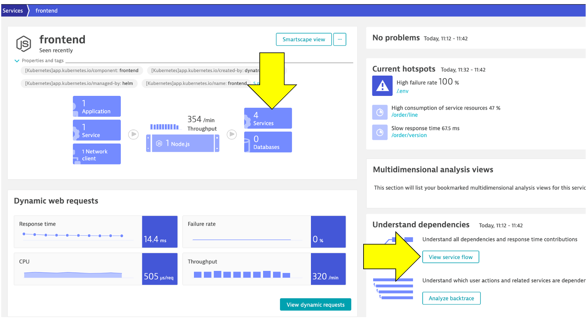

id: aws-lab7
categories: kubernetes
status: Published
tags: aws-immersion-day,aws-selfpaced


# AWS Lab 7 - Modernization with Kubernetes


## Deploy sample application

Dynatrace automatically derives tags from your Kubernetes/OpenShift labels. This enables you to automatically organize and filter all your monitored Kubernetes/OpenShift application components.

To review what is configured for the sample application, go ahead and open this folder and look at one such as the `frontend.yml`:

* <a href="https://github.com/dt-alliances-workshops/aws-modernization-dt-orders-setup/tree/main/app-scripts/manifests" target="_blank">https://github.com/dt-alliances-workshops/aws-modernization-dt-orders-setup/tree/main/app-scripts/manifests</a>

Notice the labels and annotations:

```
metadata:
      labels:
        app.kubernetes.io/name: frontend
        app.kubernetes.io/version: "1"
        app.kubernetes.io/component: frontend
        app.kubernetes.io/part-of: dt-orders
        app.kubernetes.io/managed-by: helm
        app.kubernetes.io/created-by: dynatrace-demos
      annotations:
        owner: Team Frontend
        chat-channel: dev-team-frontend 
```

Notice the defined container and version.  These containers are stored in <a href="https://hub.docker.com/u/dtdemos" target="_blank">Dockerhub</a>.

```
spec:
    containers:
    - name: frontend
    image: dtdemos/dt-orders-frontend:1
```

Notice the `DT_CUSTOM_PROPS` environment variable:

```
env:
    - name: DT_CUSTOM_PROP
        value: "project=dt-orders service=frontend"
```

### 💥 **TECHNICAL NOTES** 

* The `DT_CUSTOM_PROPS` is a special Dynatrace feature, that the OneAgent will automatically recognize and make Dynatrace tags for the process. You can read more details in the <a href="https://www.dynatrace.com/support/help/shortlink/process-group-properties#anchor_variables" target="_blank">Dynatrace documentation</a>


* Read more details on how Dynatrace identifies labels and tags Kubernetes in the <a href="https://www.dynatrace.com/support/help/shortlink/kubernetes-tagging" target="_blank">Dynatrace documentation</a>

## Deploy sample app

Back in the SSH shell, run these commands to deploy the application:

```
cd ~/aws-modernization-dt-orders-setup/app-scripts
./start-k8.sh
```

### 💥 **TECHNICAL NOTE**

The <a href="https://github.com/dt-alliances-workshops/aws-modernization-dt-orders-setup/tree/main/app-scripts" target="_blank">start-k8.sh</a> script automates a number of `kubectl` commands:

1. Create a namespace called `staging` where all these resources will reside
1. Grant the Kubernetes default service account a viewer role into the `staging` namespace
1. Create both the `deployment` and `service` Kubernetes objects for each of the sample

### Verify the pods are starting up

Rerun this command until all the pods are in `Running` status with all pods as `1/1`.

```
kubectl -n staging get pods
```

The output should look like this:

```
NAME                               READY   STATUS    RESTARTS   AGE
browser-traffic-5b9456875d-ks9vw   1/1     Running   0          30h
catalog-7dcf64cc99-hfrpg           1/1     Running   0          2d8h
customer-8464884799-vljdx          1/1     Running   0          2d8h
frontend-7c466b9d69-9ql2g          1/1     Running   0          2d8h
load-traffic-6886649ddf-76pqf      1/1     Running   0          2d8h
order-6d4cd477cb-9bvn4             1/1     Running   0          2d8h
```

### Kubernetes Role Binding - Overview

In Kubernetes, every pod is associated with a service account which is used to authenticate the pod's requests to the Kubernetes API. If not otherwise specified the pod uses the default service account of its namespace.

* Every namespace has its own set of service accounts and thus also its own namespace-scoped default service account. The labels of each pod for which the service account has view permissions will be imported into Dynatrace automatically.

* In order for Dynatrace to read the Kubernetes properties and annotations, you need to grant the Kubernetes default service account a viewer role into the `staging` namespace to enable this. We only have one namespace, but you will need to repeat these steps for all service accounts and namespaces you want to enable for Dynatrace within your environments.

For the workshop, we already updated the required file with the `staging` namespace. Next you will run the setup script that will apply it to your cluster. Go ahead and open this folder and look at the `dynatrace-oneagent-metadata-viewer.yaml` file. 
* <a href="https://github.com/dt-alliances-workshops/aws-modernization-dt-orders-setup/tree/main/app-scripts/manifests" target="_blank">https://github.com/dt-alliances-workshops/aws-modernization-dt-orders-setup/tree/main/app-scripts/manifests</a>


## Sample application Kubernetes details

Refer to this picture for a more detailed description of our setup. 


**1 - Dynatrace Namespace**

This <a href="https://kubernetes.io/docs/concepts/overview/working-with-objects/namespaces/" target="_blank">Kubernetes Namespace</a> contains the pods and services that make up the Dynatrace Operator.

**2 - Kubernetes nodes**

Kubernetes runs your workload by placing containers into Pods to run on <a href="https://kubernetes.io/docs/concepts/architecture/nodes/" target="_blank">Nodes</a>.

**3 - Dynatrace**

Dynatrace tenant where monitoring data is collected and analyzed.

**4 - Cloud shell**

The shell is configured with the <a href="https://kubernetes.io/docs/reference/kubectl/overview/" target="_blank">kubectl</a> command line tool that lets you control Kubernetes clusters.

**5 - Sample application namespace**

This <a href="https://kubernetes.io/docs/concepts/overview/working-with-objects/namespaces/" target="_blank">Kubernetes Namespace</a> contains the sample application pods and services.

**6 - Sample application**

The frontend service is exposed as a public IP and is accessible in a browser.

## Review sample app in a browser

To view the application, we need to get the IP to the Kubernetes service for the sample application. To do this, we need to run a kubernetes command.

From the SSH CLI SSH command prompt type this command

```
kubectl -n staging get svc
```

Example output

```
NAME       TYPE           CLUSTER-IP       EXTERNAL-IP
catalog    ClusterIP      10.100.181.171   <none>                                                                  
customer   ClusterIP      10.100.147.216   <none>
frontend   LoadBalancer   10.100.58.2      a6ebaa4a370e0468093167462c3aeab2-115097342.us-west-2.elb.amazonaws.com
order      ClusterIP      10.100.228.17    <none>
```

From the output, copy the entire value from EXTERNAL-IP and open it in a browser. This would be `http://1a6ebaa4a370e0468093167462c3aeab2-115097342.us-west-2.elb.amazonaws.com` for the example above. 

### Explore Sample app

Use the menu on on the home page to navigate around the application and notice the URL for key functionality. You will see these URLs later as we analyze the application.

 * Customer List = customer/list.html
 * Customer Detail = customer/5.html
 * Catalog List = catalog/list.html
 * Catalog Search Form = catalog/searchForm.html
 * Order List = order/list.html
 * Order Form = order/form.html

### 💥 **TECHNICAL NOTE** 

<i>The application looks like this monolith, but notice how the home page shows the versions of the three running backend services. You will see these version updated automatically as we deploy new versions of the backend services.</i>

## Review Kubernetes within Dynatrace

In this step we will walk through the different Dynatrace dashboards that are available out of the box for monitoring Kubernetes.

### Tasks to complete this step
1. Validate AWS ActivateGate visible in Dynatrace UI</summary>
   1.1. Go to the Dynatrace UI.
   1.2. From the Dynatrace Menu, click `Manage --> Deployment status` to review OneAgent Deployment status
   1.3. Within the `Deployment status` page, next click on the `ActiveGate` option to review the Active Gate. <br>
      <aside class="positive"> 

         📓   From Dynatrace menu on the left, go to Manage -> Deployment Status -> ActiveGates, you will notice there is a `dynatrace-workshop-cluster-activegate-0` connected to your Dynatrace environment now.  This actigate gate routes all the agent traffic from apps that are running on that AKS cluster.**

      </aside>
          
### Configure Dynatrace to View the Kubernetes Clusters
1 . From the AWS Cloudshell, run the below command to get the `Kubernetes API URL`.

 ```
 kubectl config view --minify -o jsonpath='{.clusters[0].cluster.server}' 
 ```
    
`example:  https://ABC123xxxxxxxxxxxxxxx.gr7.us-east-2.eks.amazonaws.com`

2 . Copy paste the output into your Dynatrace Tenant `pictured`

3 . Next we need to get the `bearer token`. Run below command in the Cloudshell.

 ```
kubectl get secret $(kubectl get sa dynatrace-kubernetes-monitoring -o jsonpath='{.secrets[0].name}' -n dynatrace) -o jsonpath='{.data.token}' -n dynatrace | base64 --decode
 ```
example-note the token is very very long and only copy up to `[cloudshell` as highlighted:  `eyJhbGcixxxxxxxxxxxxxxtpZCI6IlNDcWVLVWxiOUNwQlBKSlVJZjNyQkhCdFBrTU8yeXNhWEVjSXpubDlCTEEifQvhzl0HYFA5kEnWtjznuhb4OKBwywhP9G-zO9Uo-6_EaXP2TLsZUjJ8kFHGAWc_EFxg`[cloudshell-user@ip-10-0-xx-xx ~]$

4 . Copy paste the output into your Dynatrace Tenant `pictured`
      

5 . test the connection once the data is ready `pictured`, finally save the configuration.

1. Review Kubernetes Dashboards are accessible from the left-side menu in Dynatrace choose `Kubernetes` and navigate to the Kubernetes cluster page as shown below: <br>
      📓**Note:** Be sure that your management zone is NOT filtered!**

      

      **1 - Kubernetes cluster** - A summary the Kubernetes cluster is shown at the top of the Kubernetes dashboard.<br>

      **2 - Nodes** - The resources for the Cluster are summarized for the one-to-many hosts or Cluster nodes in this view.
      Explore specific node in the Node Analysis section, pick the analyze nodes button.
      

      **3 - Namespaces** - Namespaces are ways to partition your cluster resources to run multiple workloads (for example `application A` and `application B` workloads) on same cluster
      1.	This workload section shows workloads over time
      2.	In the Cluster workload section, pick the view all workloads button.
            
      - In the filter, pick namespace then staging
            

      **4 - Kubernetes workload**
      - Pick the frontend to drill into.
         
      - Review the workload overview page to look at various metrics related to the workload.
      - Click on Kubernetes POD to look at POD utilization metrics.
         

      **5 - POD** - Review the POD overview page to look at various metrics related to the POD
      - Click on Container next to look at container metrics      
         
       

      **6 - Containers** - Referring to the diagram above, expand the properties and tags section to view:
      - Container information
      - Kubernetes information
      - In the info graphic, pick the service to open the services list
      - In the service list, click on k8-frontend service
      

      - Next click on 2 Services Icon to review the services running inside the container
      - Select the active front-end service.
      
      **7 - Service** - This view should now look familiar. In Lab 1, we looked at the service for the frontend and backend.  Notice how the Kubernetes information is also available in the service properties.  
            
      

## Analyze Service Backtrace on Kubernetes
Duration: 5

Now that we've modernized the application and installed it on Kubernetes, we still need to trace the application transactions from front to back.  

Dynatrace understands your applications transactions from end to end. This transactional insight is visualized several ways like the backtrace.

The backtrace tree view represents the sequence of services that led to this service call, beginning with the page load or user action in the browser.

Dynatrace also gives you insight into what Kubernetes cluster, node, workload, and namespace that service is running on.

<aside class="positive">

**👍 How this helps**

The service flow and service backtrace give you a complete picture of interdependency to the rest of the environment architecture at host, processes, services, and application perspectives.

</aside>

### Tasks to complete this step
1. Review Services View for `order` service
   * Left Menu -> Applications & Microservices -> Services <br>
         
   * Top Menu -> filter by ``` dt-orders-k8 management ``` zone.
         
   * Pick the ``` order ``` service.
         
   * On this service, we can quickly review the inbound and outbound dependencies.
   * Referring to the picture, within the services infographic, click on the "services" square to get a list of the services that the order service calls.
         

2. Review Backtrace View
   * To see the backtrace page, just click on the Analyze Backtrace button.
   * You should be on the service backtrace page where you will see information for this specific service.
   * This will get more interesting in the next lab, but for the monolith backend, we can see that the backtrace is as follows:
      1. The starting point is the backend
      1. Backend service is called by the front-end
      1. Front-end is a where end user requests start and the user sessions get captured 
      1. My web application is the default application that Dynatrace creates
         

## Analyze Service flow on Kubernetes
Duration: 5

In this step we will walk through the Service Flow view within Dynatrace  and see what's different now that its deployed on Kubernetes.

### Tasks to complete this step
1. Review Services View for `Frontend` service
   * Left Menu -> Applications & Microservices -> Services <br>
            
   * Top Menu -> filter by ``` dt-orders-k8 management ``` zone.
         
   * Pick the ``` frontend ``` service.
         
   * Just click on the view service flow button to open this.
          

2. Analyze Services view from Response time perspective
   - You should now be on the Service flow page.
   - Right away, we can see how this application is structured:
      * Frontend calls order, customer, and catalog service
      * Order service calls order and customer service
   - Something you would never know from the application web UI!
         

   - Refer to the picture above:
      1.	We are viewing the data from a Response time perspective. Shortly, we will review the Throughput perspective.
      2.	Click on the boxes to expand the response time metrics. Most of the response time is spent in the order service and the least in the customer services. And as in the simple version of the application, a very small amount of the response time is spent in the databases.

3. Analyze Services view from Throughput perspective
            

   - Refer to the picture above:
      1.	Change to the Throughput perspective by clicking on the box
      2.	Click on the boxes to expand the metrics to see the number of requests and average response times going to each service

<aside class="positive">

**👍 How this helps**

Reviewing the architecture before and after changes is now as easy as a few clicks!

</aside>

## Summary

While migrating to the cloud, you want to evaluate if your migration goes according to the plan, whether the services are still performing well or even better than before, and whether your new architecture is as efficient as the blueprint suggested. Dynatrace helps you validate all these steps automatically, which helps speed up the migration and validation process.

Having the ability to understand service flows enables us to make smarter re-architecture and re-platforming decisions.  With support for new technologies like Kubernetes, you have confidence to modernize with a platform that spans the old and the new. 

Over time, you can imagine that this sample application will be further changed to add in other technologies like [AWS Lambda](https://aws.amazon.com/lambda/) and other PaaS services like [AWS Relational Database Service (RDS)](https://aws.amazon.com/rds/) or [Amazon Aurora - MySQL and PostgreSQL-compatible relational database](https://aws.amazon.com/rds/aurora) databases and virtual networking [Amazon API Gateway](https://aws.amazon.com/api-gateway/) as shown in the picture below. 


### 💥 **TECHNICAL NOTE**

<i>We will not cover this, but organizations are establishing DevOps approaches and establishing Continuous Integration (CI) pipelines to build and test each service independently. Then adding Continuous Deployment (CD) to the process too that vastly increase our ability to delivery features faster to our customers.  Dynatrace has a number of solutions to support DevOps that you can read about [here](https://www.dynatrace.com/solutions/devops/)</i>

### 💥 **TECHNICAL NOTE**

<i>Dynatrace sees a lot of demand for Lambda serverless compute service and a slew of new capabilities that you can read about in these [Dynatrace blogs](https://www.dynatrace.com/news/tag/aws-lambda/)</i>

### Checklist

In this section, you should have completed the following:

✅ Install the Dynatrace Operator and sample application

✅ Review how the sample application went from a simple architecture to multiple services 

✅ Examine the transformed application using service flows and backtraces 
