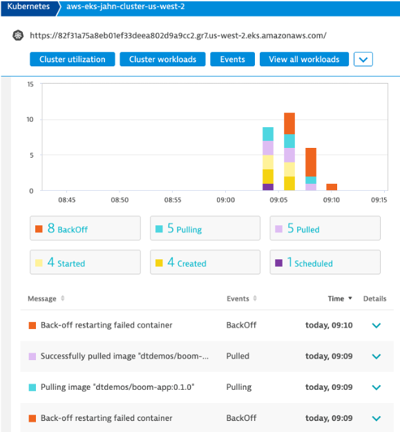
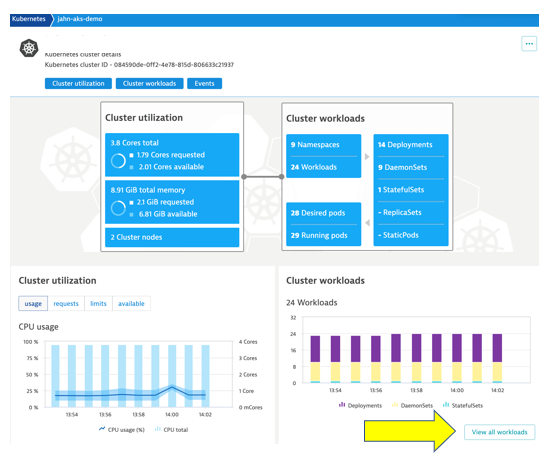
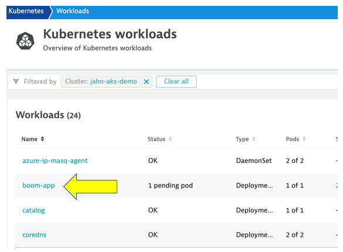
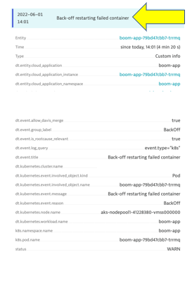

id: aws-lab8-K8 events
categories: kubernetes,SAAS
tags: aws-immersion-day,aws-selfpaced,aws-immersion-day-SAAS
status: Published

# AWS Lab 8 - Kubernetes Events

## Overview

### View events
After enabling the Kubernetes event monitoring, you can view and analyze events from the Kubernetes cluster. On your Kubernetes cluster details page, go to Events.

In the Dynatrace Kubernetes dashboard, these events will look like this: 



## Configure Event Monitoring

### Kubernetes events monitoring for analysis and alerting
For full observability into your Kubernetes events, automatic Davis analysis, and custom alerting, you need to enable Kubernetes event monitoring.

You can enable this feature for specific Kubernetes clusters. See below for instructions.

### Enable event monitoring for individual clusters
1. In the Dynatrace menu, go to Kubernetes.
2. Find your Kubernetes cluster, and then select More (…) > Settings in the Actions column.


3. Make sure that the flags are same as image.  Also click on the "add events field selector" button and add the below text to the "Field selector name" and "field selector expresion"
    ```
    Pod events

    ```

    ```
    involvedObject.kind=Pod
    ```
    


4. Select Save Changes


## Event Monitoring 

As you saw before in Lab 7 you are able to see all the same metricsw and work loads namespaces as before with the added visibility to Events specific to your environment.

**1 - Cluster Info**



**2 - Workload detail**



**3 - Overview of the Boom-App workload**


**4 - Events specific to failed containers**


**5 - Event Metadata**


