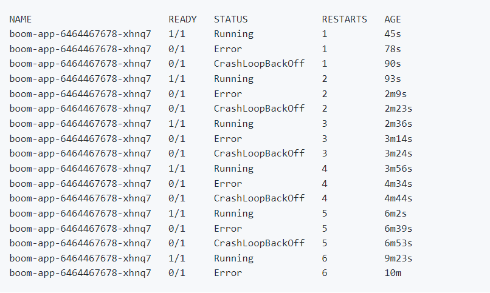
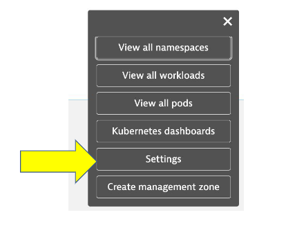
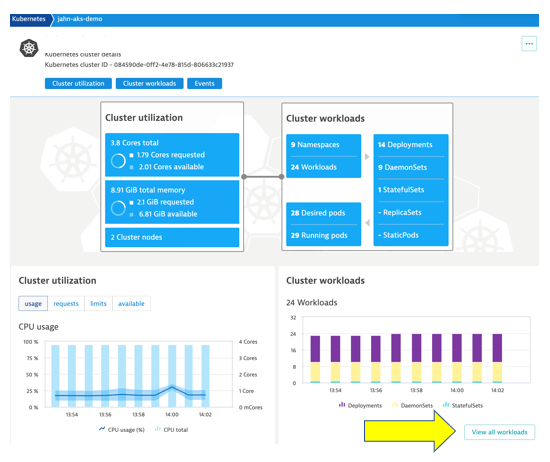
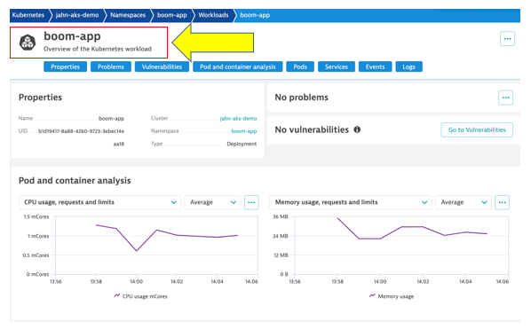
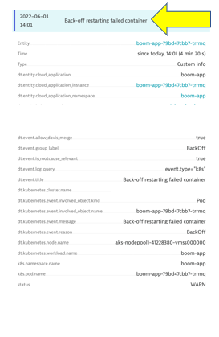

id: aws-lab8
categories: 
tags:
status:Hidden

# AWS Lab 8 - Kubernetes Events

## Overview

### View events
After enabling the Kubernetes event monitoring, you can view and analyze events from the Kubernetes cluster. On your Kubernetes cluster details page, go to Events.

We will install a dockerized application called the `boom.app` to generate Kubernetes pod crashes and generate events in the Dynatrace console .

In the Dynatrace Kubernetes dashboard, these events will look like this: 


## Boom-App Deploy

<!--
### 1. Make sure you are in the correct region 

Click the region button in the top right corner of your AWS console and make sure you are in `Oregon us-west-2` for consistency in this lab.


-->

### 1. Open up Cloudshell

In this lab, we will be using AWS Cloudshell.  Make sure you are in the right directory and region of your AWS console.

To open the Cloudshell, click on the Cloudshell icon at the top of the AWS console.  This make take a minute to complete.


This may open up a slash page. 


After closing the pop-up, wait a minute for the Cloudshell to initialize.  When this is done, you will see the command prompt as shown below.


### 2. Deploy the Boom App

1  Once you have the Cloudshell open, you need switch to the right directory.  Run this command:

```
cd ~/aws-modernization-dt-orders-setup/app-scripts
```

2  Next run the below kubectl comand to create the boom-app namespace:
```
kubectl create ns boom-app
```

3  Next run the below kubectl comand to execute the boom-app.yaml file:
```
kubectl apply -f boom-app.yaml -n boom-app

```

4  Next run the below kubectl comand to validate that your pods have deployed and are running.
```
kubectl -n boom-app get pods -l app=boom-app -w

```
Kubectl output shows the pod crashing and restarting



## Configure Event Monitoring

### Kubernetes events monitoring for analysis and alerting
For full observability into your Kubernetes events, automatic Davis analysis, and custom alerting, you need to enable Kubernetes event monitoring.

You can enable this feature for specific Kubernetes clusters. See below for instructions.

### Enable event monitoring for individual clusters
1. In the Dynatrace menu, go to Kubernetes.
2. Find your Kubernetes cluster, and then select More (…) > Settings in the Actions column.



3. Make sure that the flags are same as image.  Also click on the "add events field selector" button and add the below text to the "Field selector name" and "field selector expresion"
    ```
    Pod events

    ```

    ```
    involvedObject.kind=Pod
    ```
    


4. Select Save Changes


## Event Monitoring 

As you saw before in Lab 7 you are able to see all the same metricsw and work loads namespaces as before with the added visibility to Events specific to your environment.

**1 - Cluster Info**



**2 - Workload detail**


**3 - Overview of the Boom-App workload**



**4 - Events specific to failed containers**


**5 - Event Metadata**




## Clean up the Boom-App
Lets make sure to clean up the Boom-App installation:

1.  To remove the namespace, run this command

```
kubectl delete ns boom-app
```

2.  Verify the namespace is removed, run this command

```
kubectl get ns
```
