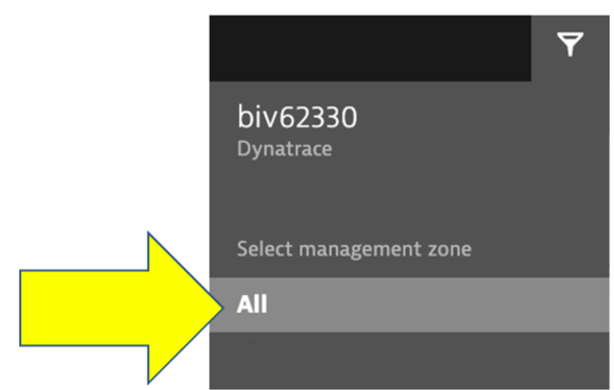

id: aws-lab9
categories: SAAS,kubernetes
tags: aws-immersion-day,aws-selfpaced,aws-immersion-day-saas
status: Published

# AWS Lab  9 - Davis AI for Kubernetes

## Overview

Often the monitoring tools organizations use simply don’t work in the complex ecosystem of microservices and for technologies like Kubernetes.

Finding the root cause of problems is harder than ever before and the effort required goes beyond what is humanly possible when the application spans to the cloud providers and data centers and the explosion of interconnected services. There are more possibilities for failures and more hiding spots for problems to sneak into the environment when software driving more than just the application.

In this lab, we will trigger a few problem and see how troubleshooting time is significantly reduced by letting AI automatically detect problems and pinpoints the root cause, explaining business impact with no manual configurations.

### Objectives of this Lab

🔷 Enable a problem in the application and walk through what <a href="https://www.dynatrace.com/platform/artificial-intelligence/" target="_blank">Dynatrace Davis</a> found

## Enable application problems

The Dynatrace Orders sample application has pre-built problems with different versions.  

These problems can be enabled with a `setversion` URL that can be used to change the version and thus the behavior of the application. Version 1 is the **"normal"** behavior and problems are enabled by setting the version to a value such as 2 or 3.

In the next section, you will run a unix script that sets these problems.

<!-- ### Service deployment - order service - exceptions for all order related requests


### 💥 **TECHNICAL NOTE**

<i>Refer to <a href="https://github.com/dt-orders/overview" target="_blank">dt-orders overview README</a></i>

## Dynatrace Events

Before we get to the problems, let's review Refer to <a href="https://www.dynatrace.com/support/help/dynatrace-api/environment-api/events-v2" target="_blank">Dynatrace information events</a>.

Dynatrace information events enable continuous delivery tools to provide additional details for Dynatrace. Here is an example of two informational events for deployment and performance testing being be sent to Dynatrace.


There are several Dynatrace information event types:
* `CUSTOM_ANNOTATION`
* `CUSTOM_CONFIGURATION`
* `CUSTOM_DEPLOYMENT`
* `CUSTOM_INFO`
* `MARKED_FOR_TERMINATION`

Below we can see for a service that was the root cause to a problem the Dynatrace AI engine, Davis®, determined: 
* (#1) `CUSTOM_INFO` events and 
* (#2)`CUSTOM_DEPLOYMENT` events  


Each event has a timestamp, event source, a few standardized fields (depending on the event type), and the option to add additional custom fields.  See <a href="https://www.dynatrace.com/support/help/dynatrace-api/environment-api/events-v2/get-event-properties" target="_blank">this table</a> for details.  

Here are two example events.  NOTE the URL back to the pipeline making the change.


### 👍 How this helps

Having information events speeds up triage by adding context to what’s happening with the application. Just imagine getting alerted about an issue and immediately seeing a load test or deployment took place, and in one click of the event, URL review the system, job, and team responsible!

### Dynatrace tags

When creating information events, you must target the entities to receive the event so that it’s only associated with the relevant component. That is where Dynatrace tags come in.

In a nutshell, tags in Dynatrace are labels or markers used for organizing entities in large monitoring environments. Below shows a few tags for my catalog service: `stage:staging` and `service:catalog-service`


### API call Example

Here is an example of a typical events API call. You do not need to executed this as you will see this in action as part of the scripts in the next step

```
curl -X POST \
  https://mySampleEnv.live.dynatrace.com/api/v1/events \
  -H 'Authorization: Api-token abcdefjhij1234567890' \
  -H 'Content-Type: application/json' \  
  -d '{
  "eventType" : "CUSTOM_DEPLOYMENT",
  "source" : "Pipeline Script" ,
  "deploymentName" : "Set order-service to version 1",
  "deploymentVersion" : "1"  ,
  "deploymentProject" : "dt-orders project" ,
  "ciBackLink" : "http://link-back-to-my-pipeline",
  "customProperties": {
      "Example Custom Property 1" : "Example: Commit SHA",
      "Example Custom Property 2" : "Example: Name of person who run pipeline",
      "Example Custom Property 3" : "Example: Application owner name",
      "Example Custom Property 4" : "Example: Ticket Number approving change"
  },
  "attachRules": {
            "tagRule" : [
                {
                  "meTypes":["PROCESS_GROUP_INSTANCE"],
                  "tags": [
                      {
                            "context": "CONTEXTLESS",
                            "key": "service",
                              "value": "order-service"
                      },
                          {
                            "context": "CONTEXTLESS",
                            "key": "project",
                              "value": "dt-orders"
                      },
                          {
                            "context": "CONTEXTLESS",
                            "key": "stage",
                              "value": "production"
                      }
            ]}
          ]}
        }
}
``` -->


##  K8's Order service problem

Now we are going to set the k8's `order` service version that will cause failures on the all requests.

To automate the version change, a unix script is provided that will do the following:
* Call the `order/setversion` URL set the order-service version
* Send a Dynatrace `CUSTOM_DEPLOYMENT` event indicating the change

After a minute or so, you should expect to see exceptions for all order related requests.


### 1. Enable the problem pattern

You will use the AWS Cloudshell to set the order service to version 3.

The argument for this depends on whether you do this on the Docker or the Kubernetes setup.

#### 1 - For Kubernetes setup, run this command.

```
cd ~/aws-modernization-dt-orders-setup/learner-scripts/
./set-version.sh k8-order 3
```

Ensure there are numerical values at the end for Response Data: `storedEventIds` like:

```
Response Data
{"storedEventIds":[8663164135574257870,-5988376401319068441],"storedIds":["8663164135574257870_1628095127627","-5988376401319068441_1628095127627"],"storedCorrelationIds":[]}
```

### 2. View app in browser

The event has the URL back to the sample application, so just click that if you don't have the sample app up already.  You should see `version 3` for the order app now too.


<!--
## 2. View change in Dynatrace

From the left side menu, navigate to the `Releases` page.  Here you will see the how Dynatrace detected the versions of monitored processes.  It may take a minute, but you will see the version change in the `Real-time inventory` section and a new event in the `Release events` section.


**NOTE: Be sure that your management zone is NOT filtered!**



If you expand the event, you should see something like this


-->

### 3. Review problem in Dynatrace

The problem may take a minute to show up, but this is what the problem will look like once it does. Also, you may see two problems that eventually get merged into one as Dynatrace is performing the problem analysis.

1. Problem card windows and impact summary
1. Root cause
1. Deployment event as additional context


### 4. Analyze problem

Referring to #4 in the picture above, click on the `Analyze failure rate degradation` button.

Right away we can see that there were exceptions in the code and the `details` button can be clicked to see the code stack trace.


### 5. Analyze problem impact

From the problem card click on the Kubernetes Service -> `Order` link from the `Impacted Service` box, next click on the `order` service in the `related services` section to open the service page.  Notice the anomaly generated.


Next click on the `view all request` as pictured above to see a timeline of all the transactions on the `order` service.


and select the `failure rate` tab so you can see exactly when the problem started.


### 6. Disable the problem pattern

From the `Services` host shell, run these commands to set the version back to version 1

####  For Kubernetes run this command.

```
cd ~/aws-modernization-dt-orders-setup/learner-scripts/
./set-version.sh k8-order 1
```

Dynatrace will automatically close the problem once it detects things are back to normal.

## Summary

In this section, you should have completed the following:

✅ Enable a problem in the application and walk through what Davis AI found
