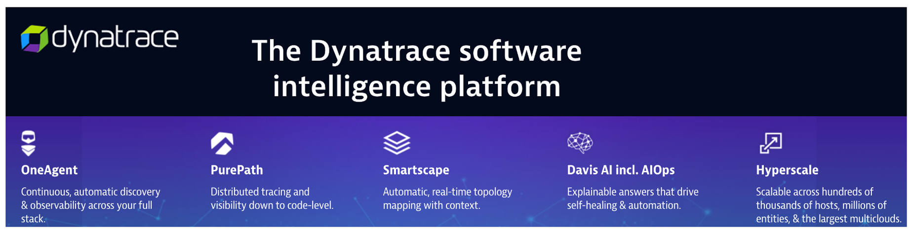
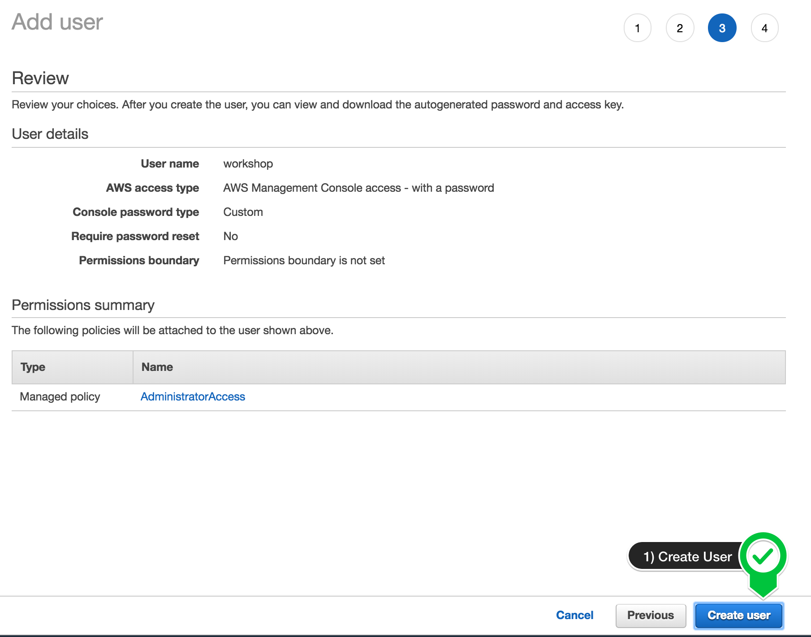

id: aws-selfpaced
categories: modernization,kubernetes
status: Published
tags: aws-selfpaced
description:

# AWS Lab 0 - Self Paced Overview

## Workshop Learning Objectives

This virtual hands-on workshop will start with a review of common challenges associated with modernization followed by a review of how Dynatrace’s AI-engine, Davis, performs automatic and intelligent root-cause analysis in hybrid cloud AWS environments. This will be followed by series of hands-on labs where you will:

1. Setup a Dynatrace environment and sample applications within AWS
1. Jump in and fully analyze an application within Dynatrace
1. Start to see and understand application usage patterns, infrastructure consumption, service dependencies, benchmarking performance and how service levels can be tightly ensured.

You are now in the drivers seat for enabling modern operations for cloud native architectures!

### Workshop structure

The workshop breaks down into three sections.  Plan on 2-4 hours for completion of the lab section.

* **Prerequisites** - Ensure your Dynatrace and AWS accounts are set-up
* **Workshop Labs** - Divided into modules, some labs include a step to run scripts that will provision AWS resources, deploy sample application, and configure Dynatrace.
* **Cleanup Resources**  - Tear down workshop resources and keep on using the Free Trial!

### Workshop Audience

* Application teams
* Architects
* Developers
* Technical leads

It will be helpful for you to be:

* Able to run basic <a href="http://mally.stanford.edu/~sr/computing/basic-unix.html" target="_blank">Unix commands</a>
* Familiar with basic <a href="http://aws.amazon.com/getting-started/fundamentals-core-concepts/" target="_blank">AWS cloud concepts</a>
* Familiar with <a href="https://aws.amazon.com/containers/" target="_blank">container concepts</a>

## Dynatrace Tenant



For this workshop you will use a 15-day free Dynatrace evaluation of the full feature set of our all-in-one performance monitoring platform to monitor AWS resources and complete the workshop exercises and to use once the workshop is complete.

To sign up for a 15-day trial, navigate to this URL:

* <a href="https://www.dynatrace.com/trial/?utm_medium=alliance&utm_source=aws&utm_campaign=website&utm_content=none&utm_term=none" target="_blank">https://www.dynatrace.com/trial</a>
* You can use your work email even if you are an existing Dynatrace customer
* If you have any issues email `alliances-help@dynatrace.com`

Once you sign up:

* You will be asked to setup a password and some details about yourself and accept the Dynatrace trial terms and conditions.
* Next you are asked to pick the nearest geographic region to you and then your Dynatrace SaaS tenant is provisioned.
* Once provisioned, in a minute or two, you will see a button that says `Deploy Dynatrace`. Clicking this will bring you into your Dynatrace environment.
* You are also sent an automated email with a link to your Dynatrace environment for reference.

## AWS Account

This workshop requires an AWS account where there is IAM user/identity that has proper permissions to set up the necessary AWS components to work through the workshop. 

### 💥 **TECHNICAL NOTES**

* You are responsible for the cost of the AWS services used while running this workshop in your AWS account.

* You will need permission to add/delete: VPCs/subnets/Routes/IGWs/Route tables, CloudFormation Stacks, and EC2s/security groups/keypairs.
    * If you are using an AWS trial account, you should have `AdministratorAccess` policy, so this is all you need. 
    * If you are using an account owned by your organization, please ensure you have the right permissions and authority. 

If you already have an account, you can skip the `setting up your AWS account` section below

## Setting up your AWS account

1 . If you don't already have an AWS account with Administrator access: <a href="https://aws.amazon.com/getting-started/" target="_blank">create
one now by clicking here</a>

2 . Once you have an AWS account, ensure you are following the remaining workshop steps
as an IAM user with administrator access to the AWS account:
<a href="https://console.aws.amazon.com/iam/home?#/users$new" target="_blank">Create a new IAM user to use for the workshop</a>

3 . Enter the user details:


4 . Attach the AdministratorAccess IAM Policy:


5 . Click to create the new user:


6 . Take note of the login URL and save:


7 . Once you are in the AWS portal, you can now move to the next section.

## AWS Cloudshell

### 1. Open up Cloudshell

In this lab, we will be using AWS Cloudshell. Cloudshell is a browser-based shell that makes it easy to securely manage, explore, and interact with your AWS resources.

To open the Cloudshell, click on the Cloudshell icon at the top of the AWS console.  This make take a minute to complete.


This may open up a slash page. 


After closing the pop-up, wait a minute for the Cloudshell to initialize.  When this is done, you will see the command prompt as shown below.


### 2. Clone the workshop scripts

Once you have the Cloudshell open, you need to get some scripts that will automate the workshop setup.  Run this command:

```
git clone https://github.com/dt-alliances-workshops/aws-modernization-dt-orders-setup.git
```

It should look like this:

```
[cloudshell-user@ip-10-0-52-50 ~]$ git clone https://github.com/dt-alliances-workshops/aws-modernization-dt-orders-setup.git

Cloning into 'aws-modernization-dt-orders-setup'...

remote: Enumerating objects: 161, done.
remote: Counting objects: 100% (161/161), done.
remote: Compressing objects: 100% (96/96), done.
remote: Total 161 (delta 72), reused 143 (delta 60), pack-reused 0
Receiving objects: 100% (161/161), 19.82 MiB | 22.21 MiB/s, done.
Resolving deltas: 100% (72/72), done.
```

## Create Dynatrace API token 

All we wanted to do here, is quickly get a Dynatrace token and save it for use in the Lab setup.  To capture the token, follow these steps:

1 . Login into Dynatrace

2 . Choose the `Access Tokens` option from bottom of the left side menu. 


3 . On the create token page, click the `Generate new token` button

4 . On the new token page, Enter a name like `aws-workshop`

5 . Add Read & Write SLO to the scope.

* Enter `slo` in the filter
* Select `Read SLO` and `Write SLO` rows
* Verify then got added to the scope list on the bottom


6 . Add Read & Write Configuration to the scope.

* Enter `config` in the filter
* Select `Read configuration` and `Write configuration` rows
* Verify then got added to the scope list on the bottom


7 . Add Access problem and event feed, metrics, and topology to the scope.

* Enter `problem` in the filter
* Select `Access problem and event feed, metrics, and topology` row
* Verify then got added to the scope list on the bottom


8 . Add Platform as a Service to the scope. This is used by OneAgent installer.

* Enter `paas` in the filter
* Select `PaaS integration - Installer download` and `PaaS integration - Support alert` rows
* Verify then got added to the scope list on the bottom


9 . Since this token is only shown once and you will need it in the next labs, copy this value to a local TEXT file before you leave this page. (For example Notepad, Notepad++, Notes.app)


10 . That is it for now.  You will use this token later as you setup the lab resources.

## Collect Setup Script Inputs: Overview

The next steps of this guide will have you gather various information from your Dynatrace environment needed to configure your environment and for the lab exercises.

From your Dynatrace environment, you will capture:

* Dynatrace Base URL
* Dynatrace API token

### 💥 **TECHNICAL NOTE**

_The next set of steps assume that your Dynatrace tenant is fully provisioned and you are logged into it._

### Capture Inputs Script

In the code repo you cloned, there is a simple UNIX shell script that prompts for values and writes them to a file called `gen/workshop-credentials.json`. Later in the labs, there are a few other simple UNIX shell scripts that will automate the step that reads this file so that you don’t need to type or copy-paste these values over and over again during the workshop.

The next section below instructs how to get the inputs values that you type or paste against the prompt one at a time. This is what the script will look like:

```
==================================================================
Please enter your Dynatrace credentials as requested below: 
Press <enter> to keep the current value
===================================================================
Dynatrace Base URL       (current: ) : 
Dynatrace API Token      (current: ) : 
===================================================================
```

If you mess up, just click [enter] through the rest of the values and save it at the ending prompt.  You can then just re-run the script and the script will prompt you again to re-enter each value showing you each current value that it saved.

### Lets begin

1 . Run the input credentials Unix script

```
cd ~/aws-modernization-dt-orders-setup/provision-scripts
./input-credentials.sh
```

2 . Login into Dynatrace to collect the inputs values

### 💥 **TECHNICAL NOTE**
_The URL will be in the Dynatrace tenant creation email such as: https://[ENVIRONMENT ID].live.dynatrace.com.  You can also get there by by using the the SaaS login link on the top right of the <a href="https://www.dyntrace.com" target="_blank">Dynatrace home page</a>._

### Step 1 of 2: Dynatrace Base URL

1 . Copy the Dynatrace base URL from your browser, for example: **https://[ENVIRONMENT ID].live.dynatrace.com**

2 . Back in the UNIX terminal, paste the value for the `Dynatrace Base URL` prompt.

### 💥 **IMPORTANT**
_Only include the base URL up to the **https://[ENVIRONMENT ID].live.dynatrace.com** Do not include any query strings_

### Step 2 of 2: Dynatrace API Token

Paste the Dynatrace token that you created earlier and saved to you notes.

### Optional Inputs

You will see additional inputs for the name of the AWS resources used in the labs.  Just accept the default values.

### Verify Inputs

Your completed data entry should look like this:

```
Please confirm all are correct:
--------------------------------------------------
Dynatrace Base URL       : https://ABC.live.dynatrace.com
Dynatrace API Token      : ggggggggggggggggggggggg
--------------------------------------------------
Monolith Host Name       : dt-orders-monolith
Services Host Name       : dt-orders-services
Cluster Name             : dynatrace-workshop-cluster
===================================================================
Saved credential to: ../gen/workshop-credentials.json
{
    "DT_BASEURL": "https://ABC.live.dynatrace.com",
    "DT_API_TOKEN": "ggggggggggggggggggggggg",
    "HOSTNAME_MONOLITH": "dt-orders-monolith",
    "HOSTNAME_SERVICES": "dt-orders-services",
    "CLUSTER_NAME": "dynatrace-workshop-cluster"
}
```

After you confirm, the script will show the saved values in the `~/aws-modernization-dt-orders-setup/gen/workshop-credentials.json` file. 

### Fixing Inputs

If you mess up, you can re-run the script again and will prompt you again for each value.

```
cd ~/aws-modernization-dt-orders-setup/provision-scripts
./input-credentials.sh
```
## Identify or Create AWS Key pair

To complete the workshop, you will also need an AWS Key Pair to complete the workshop exercises. A Key Pair is required when provisioning EC2 instances and EKS Clusters.

For the workshop you have the option of using an existing Key Pair that you may already have in you environment or making a new one.  But you must have one.

### To create a new Key Pair name:

1 . navigate to the `Key Pairs` page in the AWS console:

* <a href="https://console.aws.amazon.com/ec2/v2/home#KeyPairs" target="_blank">https://console.aws.amazon.com/ec2/v2/home#KeyPairs</a>. 

2 . Click `Create Key Pair` button 

3 . On the create Key Pair page, fill in values as shown below 

* Unique name like `dynatrace-workshop`
* Type = RSA
* Format = PEM


4 . You will not need the PEM file that is downloaded, but the Key Pair name is needed in the next labs.  To remember what you defined, copy this key pair name to a local TEXT file. (For example Notepad, Notepad++, Notes.app)


## Lab 1 Setup Part 1: Dynatrace Configuration

### 💥💥💥 Only follow these instructions if you are running Lab 1 - OneAgent Observability 💥💥💥

This step just requires you to run a few steps to provision several AWS resources and the Dynatrace configuration needed for the workshop.

From the AWS Cloudshell window, run these commands:

```
cd ~/aws-modernization-dt-orders-setup/workshop-config
./setup-workshop-config.sh monolith-vm
```

The script output will look like this:

```
-----------------------------------------------------------------------------------
Setting up Workshop config
Dynatrace  : https://XXXXX.live.dynatrace.com
Starting   : Fri Oct  1 19:46:19 UTC 2021
-----------------------------------------------------------------------------------
...
...
-----------------------------------------------------------------------------------
Done Setting up Workshop config
End: Fri Oct  1 19:46:31 UTC 2021
-----------------------------------------------------------------------------------
```

The script will run fast while it adds the following Dynatrace configuration: 

* Set global <a href="https://www.dynatrace.com/support/help/how-to-use-dynatrace/problem-detection-and-analysis/problem-detection/detection-of-frequent-issues/" target="_blank">Frequent Issue Detection</a> settings to Off
* Adjust the <a href="https://www.dynatrace.com/support/help/how-to-use-dynatrace/problem-detection-and-analysis/problem-detection/how-to-adjust-the-sensitivity-of-problem-detection/" target="_blank">Service Anomaly Detection</a>
* Add <a href="https://www.dynatrace.com/support/help/how-to-use-dynatrace/management-zones/" target="_blank">Management Zones</a> for the monolith version of the application
* Add <a href="https://www.dynatrace.com/support/help/how-to-use-dynatrace/tags-and-metadata/" target="_blank">Auto Tagging Rules</a> to drive management zone and SLO settings
* Add <a href="https://www.dynatrace.com/support/help/how-to-use-dynatrace/service-level-objectives/" target="_blank">SLOs</a> for a use in custom dashboards

### 💥 **TECHNICAL NOTE**

_The Dynatrace configuration scripts use a combination of <a href="https://github.com/dynatrace-oss/dynatrace-monitoring-as-code" target="_blank">Dynatrace Monitoring as Code</a> framework (a.k.a. monaco) and the <a href="https://www.dynatrace.com/support/help/dynatrace-api/configuration-api/" target="_blank">Dynatrace Configuration API</a> for those few Dynatrace configurations not yet supported by monaco._

## Lab 1 Setup Part 2: Provision AWS resources

### 💥💥💥 Only follow these instructions if you are running Lab 1 - OneAgent Observability 💥💥💥

You will now run a CloudFormation what will do the following:

* Add a VPC named `dt-orders-monolith`
* Add EC2 instance named: `dt-orders-monolith` with a new security group named `dt-orders-monolith` that opens up the required ports to access the sample application
* At EC2 startup, it installs `Docker` and `Docker-Compose`
* At EC2 startup, it installs the `OneAgent` for your Dynatrace tenant
* Starts up the sample application

### Step 1: Add Cloudformation Stack 

1 . In the AWS console, navigate to Cloudformation Stack 


2 . On the Cloudformation Stack page, click the `Create Stack` button and the `With new resources` option.

3 . On the `Create stack` page, copy `s3` URL below in this values to the `Amazon s3 URL` field as shown below.

* `https://aws-modernize-workshop-cloudformation.s3.us-west-2.amazonaws.com/workshopMonolith.yaml`


### Step 2: Enter input parameters

On the `Specify Stack Details` page, enter the following values:

1. `Stack Name` - Any unique name such as `lab1`
1. `DynatraceBaseUrl` - Use the Dynatrace base URL from your browser, for example: **https://[ENVIRONMENT ID].live.dynatrace.com**
1. `DynatracePaasToken` - The Dynatrace PaaS Token, you created earlier in the `Prerequisites` section
1. `KeyPairName` - If you are in a workshop using an Event Engine, then leave this value as `ee-default-keypair`.  If you are running this workshop on your own, then you need to use the name of your keypair that you use or created in the `Prerequisites` section and saved to your local notes.
1. `ResourcePrefix` - Leave this empty


Click the `Next` button
 
### Step 3: Review CloudFormation Output

The CloudFormation may take a few minutes, but you can check the CloudFormation output to ensure that all the AWS resources were provisioned successfully. 

Monitor CloudFormation stack status within the AWS console. Navigate to the `CloudFormation` page or just navidate to:
* <a href="https://console.aws.amazon.com/cloudformation/home" target="_blank">https://console.aws.amazon.com/cloudformation/home</a>

When it is complete, it will show a `CREATE_COMPLETE` status as shown below.s


 
### 💥 **TECHNICAL NOTE**

_The process to provision everything will take ~5 minutes, so please be patient._

_If you using a personal or corporate account, the CloudFormation may rollback due to VPC limits being reached. In that scenario, delete one of the VPCs and retry the script._

## Lab 2 Setup Part 1: Dynatrace Configuration

### 💥💥💥 Only follow these instructions if you are running Lab 2 - Modernization with containers 💥💥💥

This step just requires you to run a few steps to provision several AWS resources and the Dynatrace configuration needed for the workshop.

From the AWS Cloudshell window, run these commands:

```
cd ~/aws-modernization-dt-orders-setup/workshop-config
./setup-workshop-config.sh services-vm
```

The script output will look like this:

```
-----------------------------------------------------------------------------------
Setting up Workshop config
Dynatrace  : https://XXXXX.live.dynatrace.com
Starting   : Fri Oct  1 19:46:19 UTC 2021
-----------------------------------------------------------------------------------
...
...
-----------------------------------------------------------------------------------
Done Setting up Workshop config
End: Fri Oct  1 19:46:31 UTC 2021
-----------------------------------------------------------------------------------
```

The script will run fast while it adds the following Dynatrace configuration: 

* Add <a href="https://www.dynatrace.com/support/help/how-to-use-dynatrace/management-zones/" target="_blank">Management Zones</a> for the services versions of the application
* Add <a href="https://www.dynatrace.com/support/help/how-to-use-dynatrace/service-level-objectives/" target="_blank">SLOs</a> for a use in custom dashboards

### 💥 **TECHNICAL NOTE**

_The Dynatrace configuration scripts use a combination of <a href="https://github.com/dynatrace-oss/dynatrace-monitoring-as-code" target="_blank">Dynatrace Monitoring as Code</a> framework (a.k.a. monaco) and the <a href="https://www.dynatrace.com/support/help/dynatrace-api/configuration-api/" target="_blank">Dynatrace Configuration API</a> for those few Dynatrace configurations not yet supported by monaco._

## Lab 2 Setup Part 2: Provision AWS resources

### 💥💥💥 Only follow these instructions if you are running Lab 2 - Modernization with containers 💥💥💥

You will now run a CloudFormation what will do the following:

* Add a VPC named `dt-orders-services`
* Add EC2 instance named: `dt-orders-services` with a new security group named `dt-orders-services` that opens up the required ports to access the sample application
* At EC2 startup, it installs `Docker` and `Docker-Compose`
* At EC2 startup, it installs the `OneAgent` for your Dynatrace tenant
* Starts up the sample application

### Step 1: Add Cloudformation Stack 

1 . In the AWS console, navigate to Cloudformation Stack 


2 . On the Cloudformation Stack page, click the `Create Stack` button and the `With new resources` option.

3 . On the `Create stack` page, copy `s3` URL below in this values to the `Amazon s3 URL` field as shown below.

* `https://aws-modernize-workshop-cloudformation.s3.us-west-2.amazonaws.com/workshopServices.yaml`


4 . Click the `Next` button

### Step 2: Enter input parameters

On the `Specify Stack Details` page, enter the following values:

1. `Stack Name` - Any unique name such as `lab2`
1. `DynatraceBaseUrl` - Use the Dynatrace base URL from your browser, for example: **https://[ENVIRONMENT ID].live.dynatrace.com**
1. `DynatracePaasToken` - The Dynatrace PaaS Token, you created earlier in the `Prerequisites` section
1. `KeyPairName` - If you are in a workshop using an Event Engine, then leave this value as `ee-default-keypair`.  If you are running this workshop on your own, then you need to use the name of your keypair that you use or created in the `Prerequisites` section and saved to your local notes.
1. `ResourcePrefix` - Leave this empty


Click the `Next` button
 
### Step 3: Review CloudFormation Output

The CloudFormation may take a few minutes, but you can check the CloudFormation output to ensure that all the AWS resources were provisioned successfully. 

Monitor CloudFormation stack status within the AWS console. Navigate to the `CloudFormation` page or just navidate to:
* <a href="https://console.aws.amazon.com/cloudformation/home" target="_blank">https://console.aws.amazon.com/cloudformation/home</a>

When it is complete, it will show a `CREATE_COMPLETE` status as shown below.s


### 💥 **TECHNICAL NOTE**

_The process to provision everything will take ~5 minutes, so please be patient._

_If you using a personal or corporate account, the CloudFormation may rollback due to VPC limits being reached. In that scenario, delete one of the VPCs and retry the script._


## Lab 3: Dynatrace Configuration 

### 💥💥💥 Only follow these instructions if you are running Lab 3 - SLOs 💥💥💥

This step just requires you to run a few steps to import the Dynatrace configuration needed for the workshop.

For this you MUST use the email that you use to login into your Dynatrace environment as a parameter.  This is due the the security model for Dynatrace dashboards that require that a dashboard has an owner.

From the AWS Cloudshell window, run these commands and use your email for the last parameter.

```
cd ~/aws-modernization-dt-orders-setup/workshop-config
./setup-workshop-config.sh dashboard [YOUR EMAIL]
```

The script output will look like this:

```
=============================================
Setting up Workshop config
Dynatrace  : https://XXXXX.live.dynatrace.com
Starting   : Fri Nov  11 19:46:19 UTC 2021
=============================================
Setup type = dashboard
...
...
2021-11-04 19:55:23 INFO  Executing projects in this order: 
2021-11-04 19:55:23 INFO        1: monaco-files/projects/db (1 configs)
2021-11-04 19:55:23 INFO  Processing environment workshop...
2021-11-04 19:55:23 INFO        Processing project monaco-files/projects/db...
2021-11-04 19:55:23 DEBUG               Deploying configs in this order: 
2021-11-04 19:55:23 DEBUG                       1: monaco-files/projects/db/dashboard/dashboard.json
...
...
=============================================
Provisioning workshop resources COMPLETE
End: Thu Nov  11 19:46:51 EDT 2021
=============================================
```

## Lab 6 Setup: Dynatrace Configuration  

### 💥💥💥 Only follow these instructions if you are running Lab 6 - Modernization with Kubernetes 💥💥💥

This step just requires you to run a few steps to import the Dynatrace configuration needed for the workshop.

From the AWS Cloudshell window, run these commands:

```
cd ~/aws-modernization-dt-orders-setup/workshop-config
./setup-workshop-config.sh cluster
```

The script output will look like this:

```
-----------------------------------------------------------------------------------
Setting up Workshop config
Dynatrace  : https://XXXXX.live.dynatrace.com
Starting   : Fri Oct  1 19:46:19 UTC 2021
-----------------------------------------------------------------------------------
...
...
-----------------------------------------------------------------------------------
Done Setting up Workshop config
End: Fri Oct  1 19:46:31 UTC 2021
-----------------------------------------------------------------------------------
```

The script will run fast while it adds the following Dynatrace configuration: 

* Add <a href="https://www.dynatrace.com/support/help/how-to-use-dynatrace/management-zones/" target="_blank">Management Zones</a> for the kubernete versions of the application
* Add <a href="https://www.dynatrace.com/support/help/how-to-use-dynatrace/service-level-objectives/" target="_blank">SLOs</a> for a use in custom dashboards
* Add <a href="https://www.dynatrace.com/support/help/how-to-use-dynatrace/process-groups/configuration/customize-the-name-of-process-groups/" target="_blank">Process Naming Rule</a> to have the services show as namespace-service-name


## Summary

In this section, you should have completed the following:

✅ Ensure your Dynatrace account is ready

✅ Ensure your AWS Account is ready

✅ Create and gather Dynatrace URLs & Tokens needed to provision the workshop

✅ Provision the workshop resources

You are now ready to proceed with the labs.
