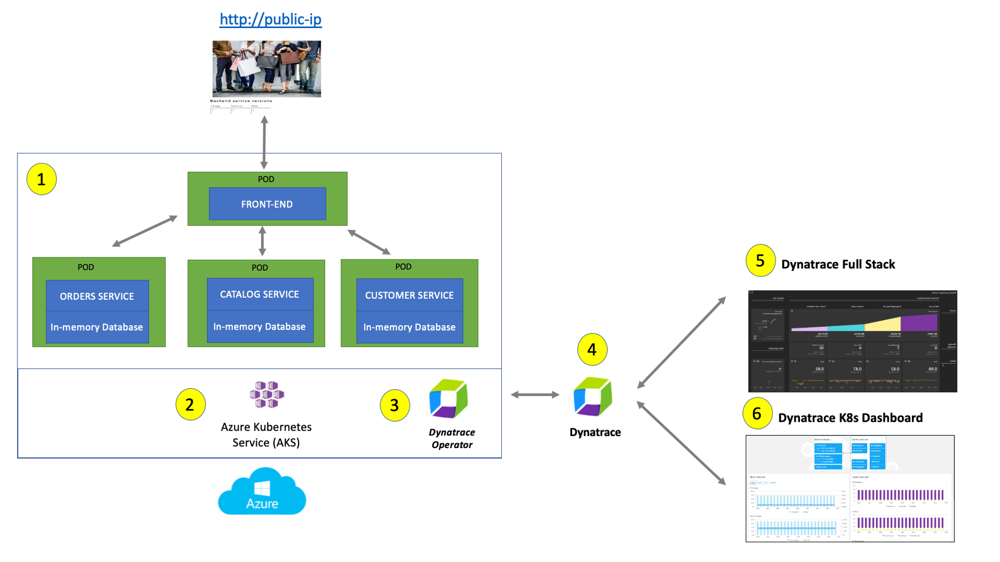

summary: Dynatrace Workshop on Azure AKS Levelup - Lab1
id: azure-aks-levelup-lab1
categories: aks, all
tags: aks
status: Published
authors: Jay Gurbani
Feedback Link: https://github.com/dt-alliances-workshops/workshops-content

# Azure AKS Levelup Workshop Lab 1 - Dynatrace Observability for AKS

## Objectives 
Duration: 3

🔷 Install the Dynatrace Operator and sample application

🔷 Review some use cases for Platform Ops MOnitoring

🔷 Review some use cases for Optimizing Kubernetes resources with Dynatrace

🔷 Examine the application using service flows and back traces 
 
## Review the Sample App 
Duration: 3

The sample application is a three-tiered application --> frontend, backend, database.

For our lab, another version of the application exists that breaks out each of these backend services into separate services. By putting these services into Docker images, we gain the ability to deploy the service into modern platforms like Azure Kubernetes and Cloud managed services such as the ones from Azure shown below.


The picture below shows how the components of the sample application interact with Dynatrace. 



**#1 . Sample Application** - Representing a "services" architecture of a frontend and multiple backend services implemented as Docker containers that we will review in this lab.

**#2 . Azure Kubernetes Service (AKS)** -  is hosting the application. The Kubernetes cluster had the Dynatrace OneAgent Operator installed. (see below for more details).  Two AKS nodes make up the Kubernetes cluster. The Dynatrace OneAgent was preinstalled by the OneAgent operator and is sending data to your Dynatrace SaaS environment. (see below for more details)

**#3 . Dynatrace Operator** - Dynatrace OneAgent is container-aware and comes with built-in support for out-of-the-box monitoring of Kubernetes. Dynatrace supports full-stack monitoring for Kubernetes, from the application down to the infrastructure layer.

**#4 . Dynatrace tenant** is where monitoring data is collected and analyzed.

**#5 . Full-Stack Dashboard** - Made possible by the Dynatrace OneAgent that will automatically instrument each running node & pod in AKS.

**#6 . Kubernetes Dashboard** - The Kubernetes page provides an overview of all Kubernetes clusters showing monitoring data like the clusters’ sizing and utilization.

<aside class="positive">   

### 📓 Beyond the Lab
Over time, you can imagine that this sample application will be further changed to add in other technologies like Azures serverless and other PaaS services like Azures SQL or Cosmo DB databases and virtual networking Application gateways as shown in the picture below.


</aside>
 
## Deploy the Dynatrace Kubernetes Operator via Azure Portal
Duration: 3

<aside class="positive">
This step is only visible for demonstration.  

The Dynatrace Operator is already deployed to an AKS cluster and that is visibile in your Dynatrace Sandbox environment that you have access to.

You do not need to perform any of the steps below, just follow along the demonstration to see how the Operator is installed.

</aside>

### Overview
One key Dynatrace advantage is ease of activation via Azure Portal. OneAgent technology simplifies deployment across large enterprises and relieves engineers of the burden of instrumenting their applications by hand. As Kubernetes adoption continues to grow, it becomes more important than ever to simplify the activation of observability across workloads without sacrificing the deployment automation that Kubernetes provides. Observability should be as cloud-native as Kubernetes itself.

Dynatrace offers a fully automated approach to infrastructure and application observability including Kubernetes control plane, deployments, pods, nodes, and a wide array of cloud-native technologies. Dynatrace furthers this automated approach by providing unprecedented flexibility for organizations that need to onboard teams as quickly as possible. The foundation of this flexibility is the <a href="https://www.dynatrace.com/news/blog/flexible-scalable-self-service-kubernetes-native-observability/" target="_blank"> Dynatrace Operator </a>  and its new Cloud Native Full Stack injection deployment strategy.

Organizations will often want to customize the Dynatrace Operator installation and you can read more about the options in the <a href="https://docs.dynatrace.com/docs/setup-and-configuration/setup-on-k8s/installation" target="_blank"> Dynatrace Doc</a> but, we are going to use a single command that we can get from the Dynatrace interface to show how easy it is to get started.


### Tasks to complete this step

1. Open up the Azure Portal and search for the AKS Cluster from the top search bar and select it once it displays under resources
      

1. Once you're on the AKS cluster, from the left navigation, go to `Settings -> Extensions + Applications`

1. Click on `Install an extension`.
   

1. Search Dynatrace in search bar.  Click on Dynatrace Operator tile once its displayed.  
   

1. Click create at the next screen

1. On the `Basics` tab, the subscription and resource group shold already be pre-selected. Just select the AKS Cluster from the drop down.
   

1. On the `Dynatrace Operator Configuration` here are the values to fill in
   <aside class="positive">
      Bring up the notepad where you save off the values for Dynatrace Operator & Data Ingest token during the provisioning step of the input-credentials script.

      📓 Both the Dynatrace Operator and Data Ingest token values are the same.
   </aside>

   - `AKS extension resource name`: dynatraceazuregrail
   - `Dynatrace operator token`: token value from notepad saved from earlier step
   - `Data ingest token`: token value from notepad saved from earlier step
   - `API URL`: URL value from notepad saved from earlier step
   - `OneAgent Deployment Type`: cloud native full stack

   
   
1. Click on `Review + Create` and click `Create` on the next screen.
1. After the deployment is complete, go into Dynatrace -> From the left menu select `Apps` and bring up `Kubernetes Classic` app.
   - Within a couple of minutes, you will see the cluster and some of the metrics start to show up.
      


## K8 Use Case - Assess Cluster Health & Performance
Duration: 14

### Overview
In this step we will walk through the new Kubernetes experience which is optimized for DevOps Platform Engineers and Site Reliability Engineers (SREs), focusing on the health and performance optimization of multicloud Kubernetes environments.
The underlying metrics, events, and logs are all powered by <a href="https://docs.dynatrace.com/docs/platform/grail/dynatrace-grail" target="_blank">Grail</a>, which supports flexible analytics through the <a href="https://docs.dynatrace.com/docs/platform/grail/dynatrace-query-language" target="_blank">Dynatrace Query Language</a> in Notebooks, Dashboards, and Workflows.

We will use The Kubernetes app to gain clear insights into cluster health, helping you identify and address issues, and ensuring your clusters are functioning efficiently.
 
### Tasks to complete this step

1. Bring up the Kubernetes app in Dynatrace by going to left Navigation Menu and select `Apps -> Kubernetes`.  Alternatively you should see Kubernetes app also visibile under the `Pinned` section
   
1. Click on Explorer from the top to view all of the AKS clusters this Sandbox environment is currently monitoring
   
1. Select the red number under nodes to quickly assess which of your nodes are unhealthy   
1. Click on Explorer view from the top menu
   
1. Select the `dtaksworkshop` cluster and let's quickly walk through some of the screens.
   - Overview screen shows up high level cluster utilization, # of nodes, number of worksloads and if any of them have any outstanding problems.
   - Logs screen shows you types of logs (ERROR, WARN, etc) over the last hour.  You can click on `Run Query` to quickly shop the last 100 errors and warnings log details
   - Events screen will show any K8 events details
1. Now let's focus on one of the problem nodes in our cluster. Select the red number under nodes to quickly filter down your view to assess which of your nodes are unhealthy.   
   
   
1. You will notice in this view that we also show you any kubernetes events that contribute to unhealthiness, such as Backoff events from pods.   
1.  If you click on problem for 2nd node, you'll quick the details of why this node is healthy (CPU saturation)
   
1. If we quickly switch over to the events tab you can quickly see all of the Kubernetes events that were triggered on this node (such as Backoff event for pod)
   
1. We can quickly view other metadata about this node as well, such as what OS, K8 version, Labels, Annotations, etc
   


## K8 Use Case - Workload Resource Optimization
Duration: 14

### Overview
Maximize your cluster resources and reduce costs by identifying and optimizing underutilized workloads. Leverage the Kubernetes app alongside advanced queries in Notebooks, powered by data from Grail, for precise resource allocation suggestions.

### Tasks to complete this step

1. In Kubernetes app, go to the explorer view and then select the `dtaksworkshop` cluster click on `View workloads list`.  
   
1. Let's apply a couple of filter, one to look at only health workloads, second to look workload from `hipstershop` namespace
   
1. Switch over the Utilization tab and sort by CPU Usage, assending
   
1. You will quickly see that the `checkoutservice` sorts to the top and if you click into to look at resource utilization details, you'll notice that the service only uses 1 millicore of CPU and 12mb of memory, but actually the cpu and memory limits are much higher.
   
1. To verify the consistency of usage patters, you can swith to the Utilization tab.  
1. If you need to identify which workloads lack requests or limits, there's simple Dynatrace Query Language (DQL) you can run to identify those 😉
   - Open up Notebooks app from the left navigation, create a new notebook, add DQL element, and copy/paste the DQL below. into it.

      ```
      fetch dt.entity.cloud_application, from: -30m | fields id, workload.name = entity.name, workload.type = arrayFirst(cloudApplicationDeploymentTypes), cluster.id = clustered_by[dt.entity.kubernetes_cluster], namespace.name = namespaceName
      | lookup [
      fetch dt.entity.kubernetes_cluster, from: -30m | fields id, cluster.name = entity.name, cluster.distribution = kubernetesDistribution, cluster.cluster_id = kubernetesClusterId | limit 20000
      ], sourceField:cluster.id, lookupField:id, fields:{cluster.name}
      | fieldsRemove cluster.id         
      | filterOut  namespace.name == "kube-system"
      | lookup [
      timeseries values = sum(dt.kubernetes.container.requests_CPU), by:{dt.entity.cloud_application}, from: -2m, filter: dt.kubernetes.container.type == "app"
      | fieldsAdd requests_CPU = arrayFirst(values)
      | limit 20000
      ], sourceField:id, lookupField:dt.entity.cloud_application, fields:{requests_CPU}
      | lookup [
      timeseries values = sum(dt.kubernetes.container.requests_memory), by:{dt.entity.cloud_application}, from: -2m, filter: dt.kubernetes.container.type == "app"
      | fieldsAdd requests_memory = arrayFirst(values)
      | limit 20000
      ], sourceField:id, lookupField:dt.entity.cloud_application, fields:{requests_memory}
      | filter isNull(requests_CPU) or isNull(requests_memory)
      ```
      


## Summary
Duration: 3

While migrating to the cloud, you want to evaluate if your migration goes according to the plan, whether the services are still performing well or even better than before, and whether your new architecture is as efficient as the blueprint suggested. Dynatrace helps you validate all these steps automatically, which helps speed up the migration and validation process.

Having the ability to understand cluster health, application service flows enables us to make smarter re-architecture and re-platforming decisions.  With support for new technologies like Kubernetes, you have confidence to modernize with a platform that spans the old and the new. 

### Checklist

In this section, you should have completed the following:

   ✅ Installed Dynatrace Operator on Azure Kubernetes cluster via Azure Portal

   ✅ Review real-time data now available for the sample application on Kubernetes

   ✅ Review Kubernetes App within Dynatrace   


