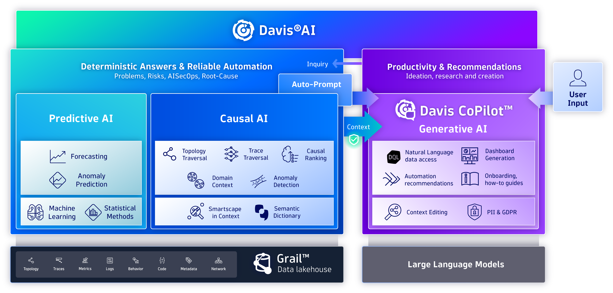
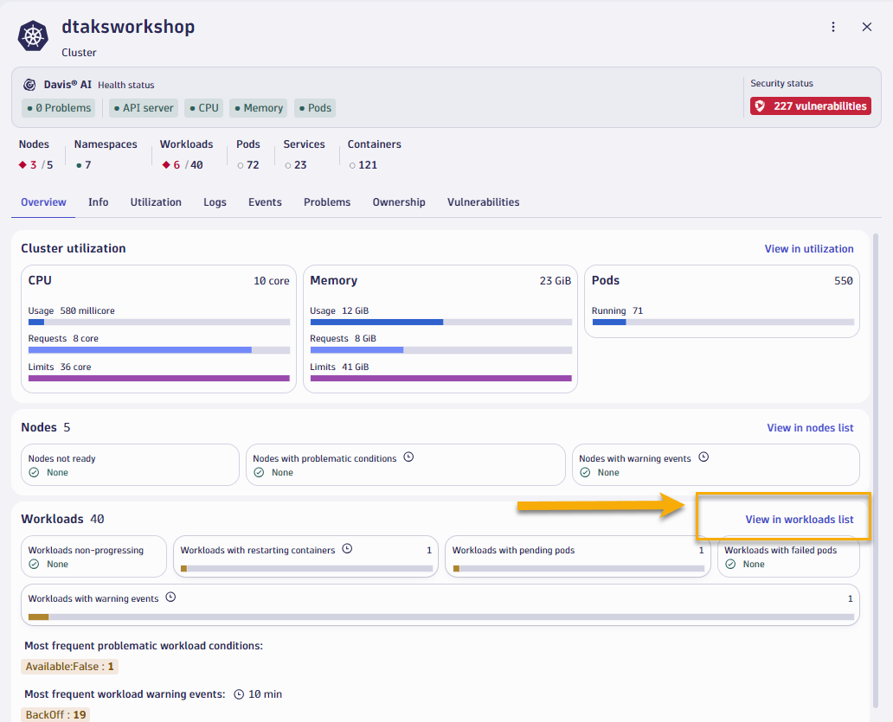
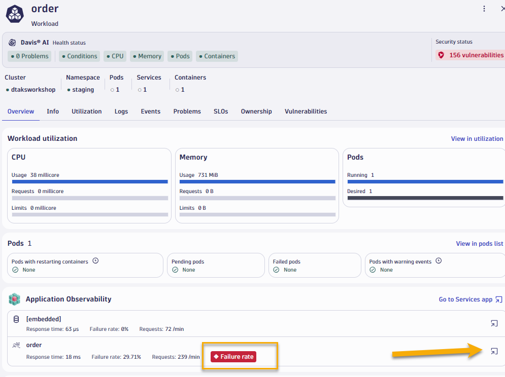
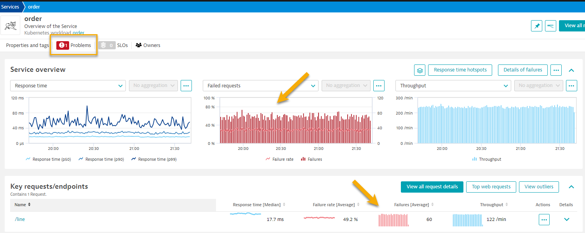
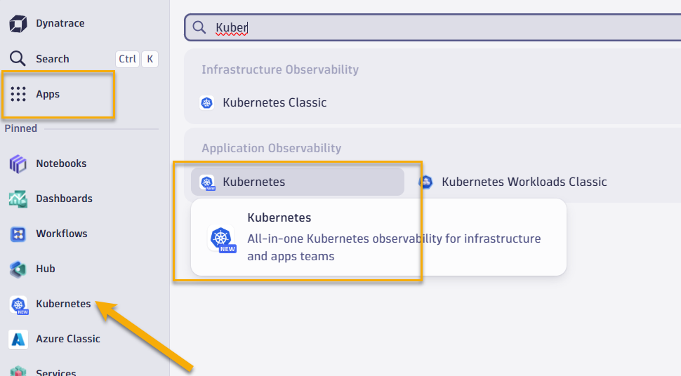
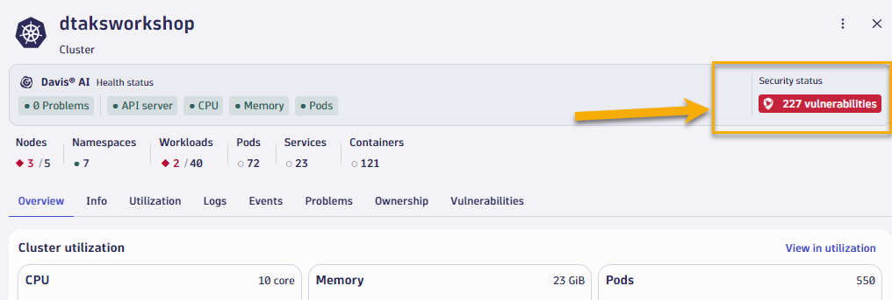
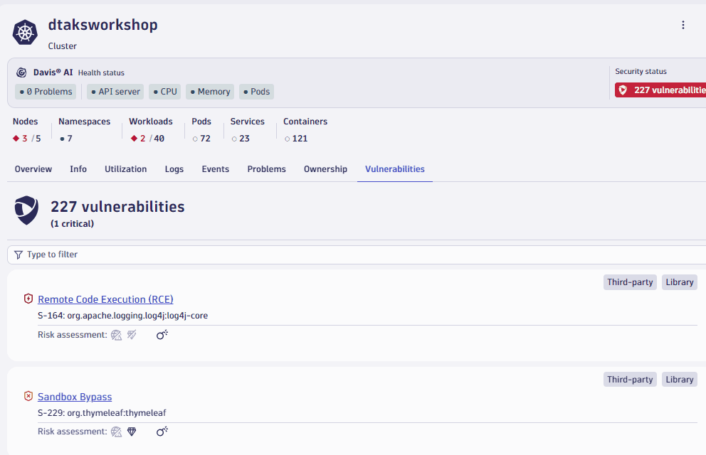
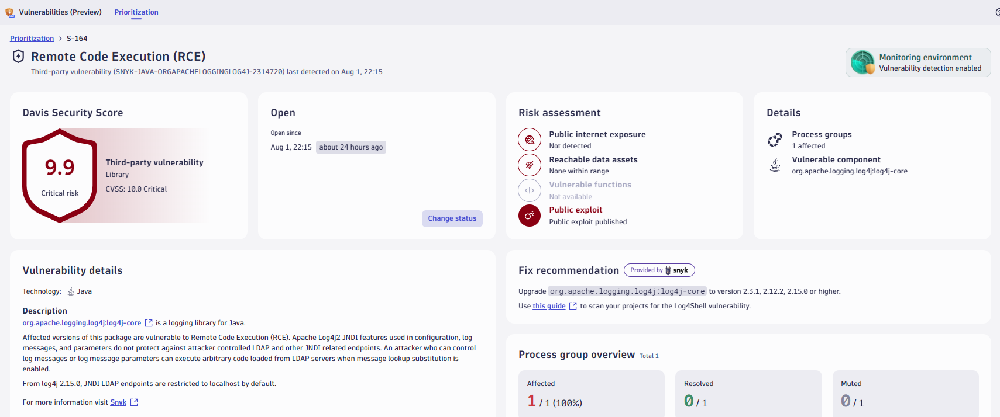

summary: Dynatrace Workshop on Azure AKS Levelup - Lab2
id: azure-aks-levelup-lab2
categories: aks, all
tags: aks
status: Published
authors: Jay Gurbani
Feedback Link: https://github.com/dt-alliances-workshops/learn-site-content

# Azure AKS Levelup Workshop Lab 2 - Application Obervability & Security for AKS

## Objectives 
Duration: 2

🔷 Review application performance

🔷 Examine the application using service flows and back traces 

🔷 Enable a problem in the application and walk through what [Dynatrace Davis](https://www.dynatrace.com/platform/artificial-intelligence/) found

## K8 Use Case - Troubleshoot worloads with Application Observability
Duration: 11

### Overview
Even with a reliable infrastructure, issues can arise, leading to service degradation or, in worst-case scenarios, user-facing errors. Kubernetes experience offers a suite of tools to visualize and troubleshoot issues, helping to catch problems before they escalate.

Often the monitoring tools in an organization simply don’t work in the complex ecosystem of microservices and for technologies like Kubernetes.

Finding the root cause of problems is harder than ever before and the effort required goes beyond what is humanly possible when the application spans to the cloud providers and data centers and the explosion of interconnected services. There are more possibilities for failures and more hiding spots for problems to sneak into the environment when software driving more than just the application.

Dynatrace's Hypermodal AI, which combines predictive AI, causal AI, and generative AI, boosts productivity across operations, security, development, and business teams.

In this lab, we will trigger a few problem in our sample app and see how troubleshooting time is significantly reduced by letting AI automatically detect problems and pinpoints the root cause, explaining business impact with no manual configurations.

### Tasks to complete this step

1. In Kubernetes app, go to the explorer view and then select the `dtaksworkshop` cluster click on `View workloads list`.  
   
1. Let's apply a filter to look at workloads from `staging` namespace.  And let's click on the `order` workload.
1. Once we open up the order, we quickly see that under `Application Observability` there's a Failure rate problem that's identified for that workload.  Click on `Go to Services app` link in that view
   
1. Once we open up the frontend service, we can quickly see that there are many errors reported for this service over the last hour
   
1. Let's quickly walk through Application Observability data in Order Service screen
    - Show Service Flow 
    - Show Smartscape view  
    - Show 1 trace and code level hiearchy, errors, method hotspots
1. Let's review problem card that shows root cause of the issue

## K8 Use Case - Detect Application Security vulnerabilities in workloads
Duration: 11

### Overview

Due to the widespread increase in the usage of open-source libraries, modern applications usually contain a large number of vulnerabilities. Evaluating hundreds or thousands of open vulnerabilities quickly becomes a daunting task.

* Dynatrace Runtime Vulnerability Analytics is designed to pinpoint vulnerabilities that need immediate investigation. It automatically analyzes data access paths and production execution to provide an automatic risk and impact assessment.

*  Dynatrace Runtime Application Protection leverages code-level insights and transaction analysis to detect and block attacks on your applications automatically and in real time.

### Tasks to complete this step

1. Bring up the Kubernetes app in Dynatrace by going to left Navigation Menu and select `Apps -> Kubernetes`.  Alternatively you should see Kubernetes app also visibile under the `Pinned` section
   
1. In Kubernetes app, go to the explorer view and then select the `dtaksworkshop` cluster
1. Once you bring up the cluster overview screen you can quickly view number of vulnerabilities that are associated with this cluster.
     
1. Let's filter the vulnerabilities to see if we can quickly pinpont one with risk level critical.
    
1. Let's now click on critical vulnerability to find out additional details about it.
    
1. Let's quickly review the Vulnerability details

## Summary
Duration: 1

In this section, you should have completed the following:

  ✅ Enabled a problem in the application and walk through what <a href="https://www.dynatrace.com/platform/artificial-intelligence/" target="_blank"> Dynatrace Davis </a> found

  ✅ Reviewed the details of the Dynatrace Prolem card.
    
  

