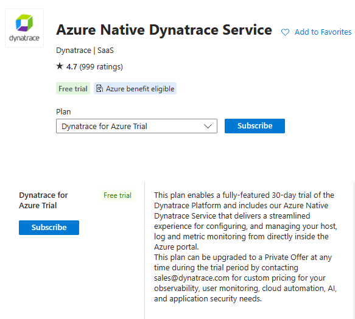

summary: Dynatrace Workshop on Azure AKS Levelup - Lab3
id: azure-aks-levelup-lab3
categories: aks, all
tags: aks
status: Published
authors: Jay Gurbani
Feedback Link: mailto:jay.gurbani@dynatrace.com

# Azure Workshop Lab 3 - Reminder 

## Workshop Environment Reminder
Duration: 4

If you plan to keep the workshop resources running in Azure for a few more days to come back and review the labs, please keep in mind the following things:

* Your access to this Sandbox Dynatrace Environment will disabled after 7 calendar days of your workshop.
* If you want to standup your own trial Dynatrace environment via Azure Marketplace.  Here are quick instructions on how to do that
    - Sign-up for free trail of [Azure Native Dynatrace Service via Marketplace](https://azuremarketplace.microsoft.com/en-US/marketplace/apps/dynatrace.dynatrace_portal_integration?tab=Overview) with full feature set of our all-in-one performance monitoring platform to monitor Azure.
   - Create the Free Trial using the `Dynatrace for Azure Trial` plan
        
   -  Refer to the guide on [to create new Dynatrace Azure resource](https://learn.microsoft.com/en-us/azure/partner-solutions/dynatrace/dynatrace-create#create-a-dynatrace-resource-in-azure) once you choose the free trial public plan.
* 🎉`COMING SOON`🎉 We will also soon have a Dynatrace WhatTheHack available in [Microsoft Repo](https://microsoft.github.io/WhatTheHack/) so you can run your own hacks with your customers.

 
## Other Resources
Duration: 1

Addition Azure & Dynatrace related resources to get your started with:

* [Partner Cafe Quick Azure Overview](https://www.youtube.com/watch?v=VCdEHAoEePw)
* [Dynatrace YouTube Videos](https://www.youtube.com/channel/UCcYJ-5q_AfmjQ4XTjTS0o3g)
* [Dynatrace Platform docs](https://docs.dynatrace.com/docs/platform)
* [Dynatrace Azure Integrations Docs](https://docs.dynatrace.com/docs/setup-and-configuration/setup-on-cloud-platforms/microsoft-azure-services/azure-integrations)
* [Azure Native Dynatrace Service Docs](https://docs.dynatrace.com/docs/setup-and-configuration/setup-on-cloud-platforms/microsoft-azure-services/azure-platform/azure-native-integration)
* [Azure Monitor Metrics](https://docs.dynatrace.com/docs/setup-and-configuration/setup-on-cloud-platforms/microsoft-azure-services/azure-integrations/azure-cloud-services-metrics)
* Customer Stories:​
    - [OneStream](https://www.dynatrace.com/customers/onestream/)
    - [Kroger](https://www.dynatrace.com/news/customer-stories/kroger/)
    - [TD Bank](https://www.dynatrace.com/customers/td-bank/)
    - [Park 'N Fly](https://www.dynatrace.com/customers/park-n-fly/)
