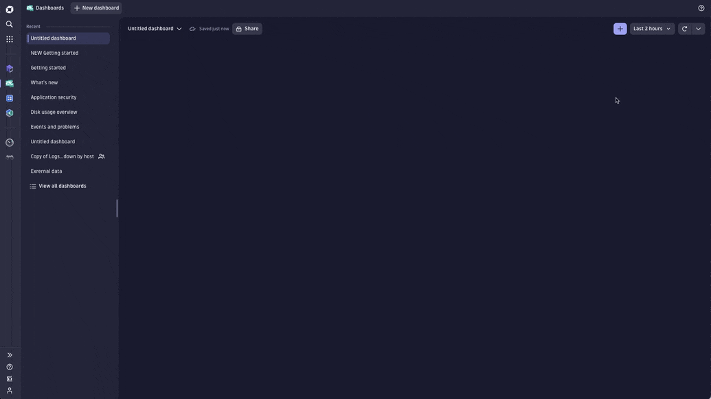
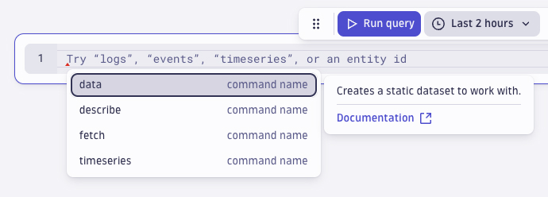
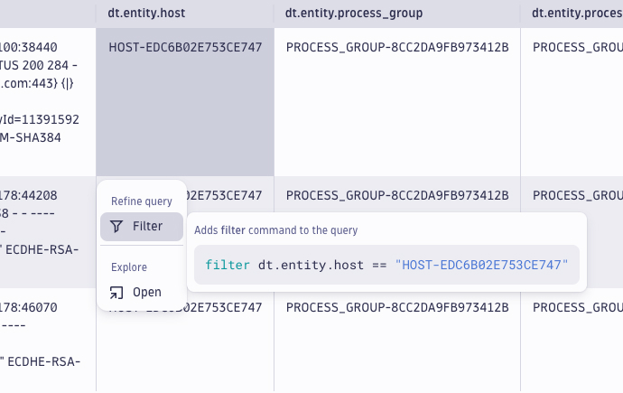
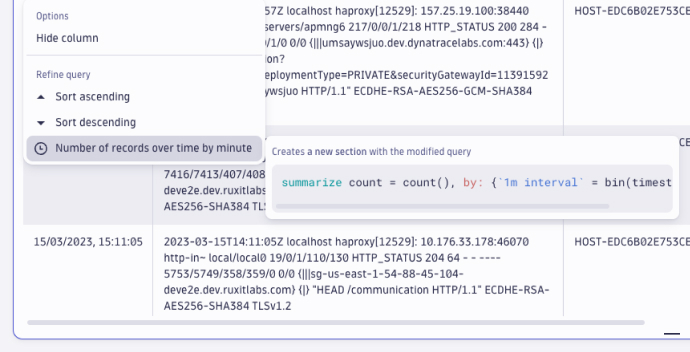
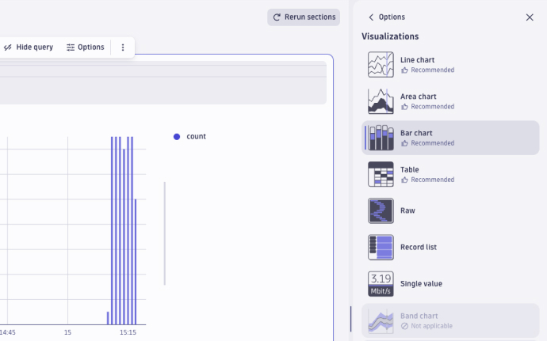
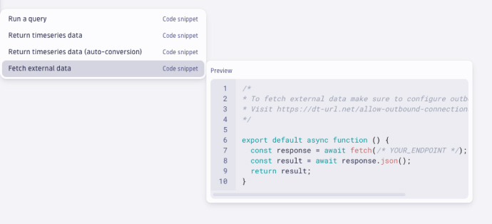

summary: Dynatrace Workshop on Azure Grail Lab1
id: azure-grail-lab1
categories: grail
tags: azure
status: Published
authors: Jay Gurbani
Feedback Link: https://github.com/dt-alliances-workshops/workshops-content

# Azure Workshop Lab 1 - Dashboards & Notebooks

## Getting started with Dashboards

Get your first fully functional dashboard up and running in minutes with this quick guided tour. We’ll show you how to add queries, external data, markdown, and variables—without long explanations or tutorials.

If you're already familiar with Dashboards, you can get going with an empty dashboard.

If you ever want to revisit this page, you’ll find it under Getting started in the (?) menu.

With Dashboards, you can:

- Query, visualize, and observe all your data stored in Grail.
- Write custom JavaScript with ad-hoc functions to fetch external data.
- Annotate all your visualizations with markdown to enrich them with context.
- Add variables to filter your results and make your dashboard dynamic.
### Tasks to complete this step
1. Select +.
1. Select Query Grail.
1. In the tile editor, choose a command from the DQL commands dropdown. For example, type logs.
1. Select Run Query. For logs, your results will be generated in a table by default.
1. Select Select visualization to display the results differently.
1. If you want to display the same results in different visualizations, select Duplicate
    

## Getting started with Notebooks
Want to explore data and create powerful, data-driven documents for sharing and collaboration? You're in the right place. If you're already familiar with Notebooks, you can get going with an empty notebook. If you ever want to revisit this page, you’ll find it under Getting started in the (?) menu.

With Notebooks, you can:
- Query, analyze, and visualize all your observability data, including logs, metrics, and events powered by <a href="https://www.dynatrace.com/support/help/shortlink/dynatrace-grail" target="_blank">Grail</a>.
- Create and collaborate on interactive, data-driven, and persistent documents.
- Fetch and incorporate external data with ad-hoc <a href="https://dt-url.net/functions-help" target="_blank">functions</a>.
- Add markdown to provide context and bring colleagues along.

In each notebook, you can add sections of Query, Code, and Markdown. On this page, we show you how to work with each one.

### Tasks to complete this step
1. Add a query
    - Select + to open the sections menu.
    - Select Query Grail.
    - Type logs for this example.
    - Adjust the timeframe, if you want. The default is the last 2 hours.
    - Then, select Run query.
    
2. Use filters to refine your query
    - You can refine query results in lots of ways. Let’s try refining your query result with a simple host filter.
    - In the table, select the cell with the relevant host.
    - Select Filter.
        
    - You just filtered your query results by the host. Nicely done. The filter only applies to the current section of your notebook. Now, let’s say you want to see the number of records per minute for that host.
        - Hold Alt or Option for the next step.
        - In the timestamp column, select Records per minute.
            
    <aside class="positive"> 📓If you want to go further and learn more about using DQL to refine queries in Notebooks, visit <a href="https://www.dynatrace.com/support/help/observe-and-explore/query-data/dynatrace-query-language" target="_blank">Dynatrace Query Language</a>. 
    </aside>
3. Visualize your data in different ways
    - When you’re working with complex data, you’ll find it useful to see a record list, which is a simple list of records that contains all the fields.

    - Simply select the record list tab and you’re done.
At other times, a chart or graph may be more effective for communicating a trend, event, or insight. Dynatrace gives you a variety of options. Let’s try creating a bar chart.
        - Select Visualizations.
        - Select Change visualization.
        - Choose the Bar chart.
        
4. Add Code
    - Code sections are useful when you want to add external data to your notebook. Code sections run as a serverless function. To learn more, visit <a href="https://developer.dynatrace.com/preview/develop/functions/" target="_blank">Dynatrace functions</a>. Let’s add code using a snippet to fetch external data: Select + to open the sections menu.

        - Under Code, select Fetch external data.
        - Give the different templates a try. They’ll save you time and effort.
        

## Getting Started with DQL