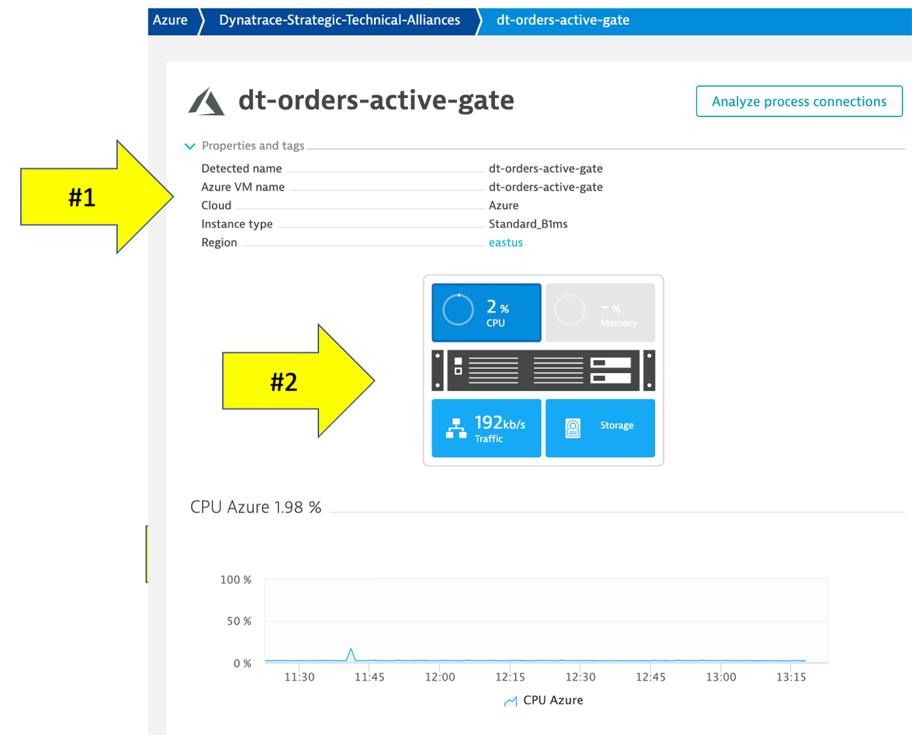
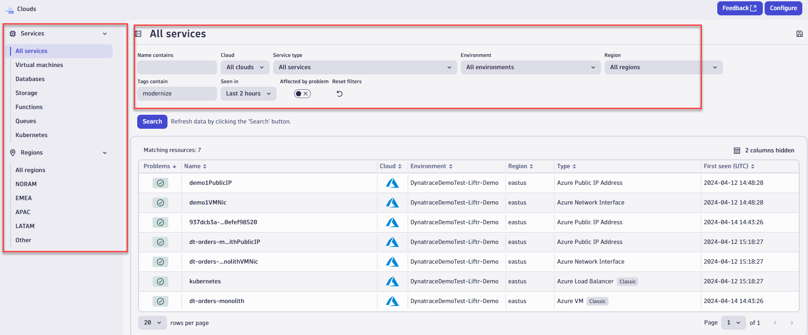
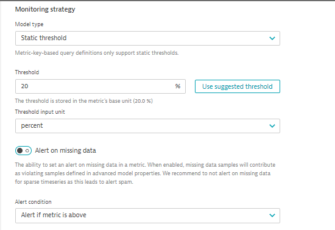

summary: Dynatrace Workshop on Azure Grail Lab3
id: azure-grail-lab3
categories: grail,all
tags: azure, grail
status: Published
authors: Jay Gurbani
Feedback Link: https://github.com/dt-alliances-workshops/learn-site-content


# Azure Grail Workshop Lab 3 - Azure Monitor

## Objectives of this Lab 
Duration: 3

In order to do more with less and scale, organizations must transcend IT silos, foster collaboration and improve productivity. Automation and a common data model are key components of this, but it takes platforms that support operational teams and workflows.

With [Azure Native Dynatrace Services](https://www.dynatrace.com/news/blog/using-dynatrace-on-microsoft-azure/), our SaaS solution is available as a native azure resource in the Azure Portal.  With the native azure resource, we can easily get Azure monitor metrics and azure resource logs without the need of provisioning ActiveGate in your Azure subscription to query the Azure Monitor metrics or setting up Eventhub or Azure functions to forward Azure logs.  

🔷 Review how Azure Native Dynatrace integrates and gathers [Azure monitor](https://azure.microsoft.com/en-us/services/monitor/) metrics

🔷 Review how Azure monitor metrics can be configured as [Metric events for alerts](https://www.dynatrace.com/support/help/how-to-use-dynatrace/problem-detection-and-analysis/problem-detection/metric-events-for-alerting/)

<!--
<aside class="positive"> 

💻📓
🏫**Class Note** - Please update the Tracking Spreadsheet if you've completed the task on this step.

</aside>
-->

## Review - Azure Monitor Setup
Duration: 3

Referring to the picture below, here are the components for this lab.

<!--  -->


**#1 . Azure**:  Azure cloud platform where Azure services produce metrics that are sent to Azure monitor.

**#2 . Azure Native Dynatrace Service**: An <a href="https://docs.dynatrace.com/docs/setup-and-configuration/setup-on-cloud-platforms/microsoft-azure-services/azure-platform/azure-native-integration" target="_blank"> native Azure resource </a> inside the Azure Portal. 

**#3 . Dynatrace Azure Dashboard**: Out of the box dashboard for each configured Azure subscription.

### Azure Dashboard

In addition to monitoring your Azure workloads using OneAgent, Dynatrace provides integration with <a href="https://docs.microsoft.com/en-us/azure/azure-monitor/overview" target="_blank"> Azure Monitor </a> which adds infrastructure monitoring to gain insight even into serverless application scenarios.

The integration uses Azure Monitor metrics for service insights, as well as Azure Resource Manager (ARM) to gather metadata.


### Review your environment

1. From the left side menu in Dynatrace, click the `Azure` menu item.
1. Scroll down, and in the `Environment dynamics` action click on the `eastus` region to open the virtual machine regional page  

### Virtual machine regional page 

Notice the following details:
1. A summary of type and status is shown
1. A running average for virtual machines
1. A table of host with Azure monitor metrics summarized.  Notice that both VMs with and without an OneAgent are both shown


### Virtual machine details 

Click on the `dt-orders-active-gate` host to open the host page.

Notice the following details:
1. Expand the properties to see more details
1. All the Azure monitor metrics are viewable as time-series data



<aside class="positive"> 

💻📓 See the [Dynatrace Docs](https://www.dynatrace.com/support/help/setup-and-configuration/setup-on-cloud-platforms/microsoft-azure-services/azure-integrations/azure-cloud-services-metrics/monitor-azure-integration-service-environment) for more details on the setup.

</aside>

<aside class="positive">

**👍 How this helps**

Dynatrace brings value by enriching the data from Azure Monitor/App Insights and extending observability into the platform with additional metrics for cloud infrastructure, load balancers, API Management Services, and more.​

These metrics are managed by Dynatrace's AI engine automatically and this extended observability improves operations, reduces MTTR and increases innovation. 

</aside>

## Cloud App Review
Duration: 5

The Dynatrace Clouds app, a novel way for observing multiple resources across multiple clouds. It provides a single, centralized dashboard that displays all resources across multiple clouds, and significantly enhances multicloud resource tracking and governance.

The [Clouds App]([https://www.dynatrace.com/hub/detail/clouds/?query=clouds&filter=all) provides:
    - Centralized oversight and insights:  A univied view that elimiates the to switch between different cloud services dashboards.
    - Logs and metrics in context: With a single click, the dashboard shows an analysis of logs and metrics for a selected resource in its appropriate context, making it easier to understand the complexities inherent in cloud infrastructure.
    - Enhanced troubleshooting: Troubleshooting is more effective when teams can see patterns and anomalies across all cloud environments, rather than analyzing them in isolation.

Check out this [blog](https://www.dynatrace.com/news/blog/maximizing-the-potential-of-multicloud-strategy-with-the-dynatrace-cloud-app/) for additional use cases.  Also here's a link to the [docs](https://docs.dynatrace.com/docs/platform-modules/infrastructure-monitoring/cloud-platform-monitoring/clouds-app)

### Tasks to complete this step

1. In Dynatrace from menu on the left, select `Apps -> Clouds`.
1. Click on All Services and select the Azure VM called `dt-orders-monolith` to view the metrics for that VM
    
    - Click on Metrics, and Logs tab  to quickly access the details for that service.
    - Also, if there'an open problem against this host, you can quickly view the problem details on `Problems` tab.
1. Select another service such as the `Kubernetes` Azure Load Balancer service
    - Notice all the properties we bring in for this service including the Azure tags
        
1. Notice all of the other ways you can filter the cloud services by service type, regions, or service names, clouds, etc to look for details on specific metric.
    

## Custom Metric Event Setup
Duration: 3

Dynatrace Davis automatically analyzes abnormal situations within your IT infrastructure and attempts to identify any relevant impact and root cause. Davis relies on a wide spectrum of information sources, such as a transactional view of your services and applications, as well as on events raised on individual nodes within your Smartscape topology.

There are two main sources for single events in Dynatrace:

* Metric-based events (events that are triggered by a series of measurements) and
events that are independent of any metric (for example, process crashes, deployment changes, and VM motion events)
* Custom metric events are configured in the global settings of your environment and are visible to all Dynatrace users in your environment.

### Tasks to complete this step
1. Setup Custom Metric Events for Alerting
    * To add custom alerts, navigate to `Settings --> Anomaly Detection --> Metric Events` menu. 
    * Click the `Add metric Event` button.
            
    * Fill in the below information on the `Add metric event` template
        1.  Summary:  `CPU % percentage`
        2.  Type:  `Metric key` from dropdown
        3.  Metric key `Azure CPU usage` from dropdown
            
            <aside class="positive"> 💡There are similar CPU percentage metrics, please make sure you select the right one </aside>
        4.  Agregation `Average` from dropdown
        5.  Management zone `dt-orders-monolith`
        6.  under `Entities` click on `>` to see `Advanced dimension definition` and select `Azure VM` from dropdown
            
        7.  Dimension filter click on `Add dimension filter` and select as shown below.
                
        8.  under Monitoring strategy section select as shown.
            
        9.  select the `>` next to `Advanced model properties` and input as shown.
            
        10. In the `Event template` section add:
            1. Title:  `CPU CUSTOM ALERT`
            2. Event type from dropdown:  `Custom alert`
            3. Dimension key of entity for events select `Azure VM` from dropdown
                
        11. click on `Save Changes`        

    *  Add another rule, with everything the same, except for the Event Description to have the title as `CPU Resource Alert` and Event type = `RESOURCE` as shown below.
            

    * Save your changes and the list should look as shown below.
        

## Trigger CPU Problem on VM
Duration: 4

### Tasks to complete this step
1. Trigger a CPU Problem
    * To enable a problem, you will go into the Azure Portal UI and use the `Run Command` feature to start a shell script.
    * From the Azure Portal, search for `dt-orders-monlith` VM from the search menu and select it.
              

    * Once inside the VM resource page, click on `Run Command` under Operations from the left menu
              
        
    * Next, click on `RunShellScript` and type in the command listed below in the `Run Command Script` window and click run

        ```
        /home/workshop/azure-modernization-dt-orders-setup/learner-scripts/run-cpu-prb.sh
        ```
        

    * In the output window you should receive the following:

        
    

1. Review Dynatrace UI for Problem card
    <!--
        * Back in Dynatrace within the `Infrastructure & Ops` app, the CPU should now be high as shown below 
    -->

    <!-- 
              
    -->
    

    <!--
    * It may take a minute or so, but you will get two problem cards as shown below.  #1 is the alert from the `severity = RESOURCE` where Davis was invoked, and #2 is the alert from `severity = CUSTOM ALERT`.

        

        <aside class="positive">💻📓 Look at the <a href="https://www.dynatrace.com/support/help/how-to-use-dynatrace/problem-detection-and-analysis/problem-detection/metric-events-for-alerting/" target="_blank"> Dynatrace Docs </a> for more details on the setup.

        Alert configuration is available through the <a href="https://www.dynatrace.com/support/help/dynatrace-api/configuration-api/anomaly-detection-api/anomaly-detection-api-metric-events/" target="_blank"> Anomaly detection—metric events API </a> Using the API, you can list, update, create, and delete configurations.

        </aside>
    -->

    * Back in Dynatrace within the `Hosts Classic` app, the CPU should now be high as shown below

        

    * It may take a minute or so, but you will get two problem cards as shown below.  #1 is the alert from the `severity = RESOURCE` where Davis was invoked, and #2 is the alert from `severity = CUSTOM ALERT`.

        

        <aside class="positive">💻📓 Look at the <a href="https://www.dynatrace.com/support/help/how-to-use-dynatrace/problem-detection-and-analysis/problem-detection/metric-events-for-alerting/" target="_blank"> Dynatrace Docs </a> for more details on the setup.

        Alert configuration is available through the <a href="https://www.dynatrace.com/support/help/dynatrace-api/configuration-api/anomaly-detection-api/anomaly-detection-api-metric-events/" target="_blank"> Anomaly detection—metric events API </a> Using the API, you can list, update, create, and delete configurations.

        </aside>

    * Review Problem Notifications Settings
        -  Navigate to `Settings --> Integrations --> Problem Notifications` 
        -  Read the overview and then click the `Add Notification` button
        -  Click various `Notification types` from the drop down to review the configurations inputs.
        -  For the `Custom integration` type, review the option to customize the payload.
        -  Notice how you can choose the `Alert profile`, but you only have default as an option currently

    * Review Alerting Profiles
        -  Navigate to `Settings --> Alerting --> Alerting profiles`
        -  Read the overview and then expand the `default` rule.
        -  Now add one, by clicking on the `Add alerting profile` button
        -  Review the options to choose severity rules and filters

1. Stop the CPU problem
    * To stop the problem, we will use the same `Run Command` feature in Azure Portal to execute stop shell script.
    * From the Azure Portal, search for `dt-orders-monlith` VM from the search menu and select it.
              

    * Once inside the VM resource page, click on `Run Command` under Operations from the left menu         
    
    * Next, click on `RunShellScript` and type in the following command listed below in the `Run Command Script` window and click run

        ```
        /home/workshop/azure-modernization-dt-orders-setup/learner-scripts/stop-cpu-prb.sh
        ```        
                

    * In the output window you should receive the following:

        

    * Verify that CPU in Dynatrace goes to normal and the problem card will automatically close

<!--
🏫**Class Note** - Please update the Tracking Spreadsheet if you've completed the task on this step.
-->


## Summary
Duration: 2

In this section, you should have completed the following:

✅  Reviewed how Dynatrace integrates with [Azure monitor](https://azure.microsoft.com/en-us/services/monitor/)

✅  Reviewed how Azure monitor metrics can be configured as <a href="https://www.dynatrace.com/support/help/how-to-use-dynatrace/problem-detection-and-analysis/problem-detection/metric-events-for-alerting/" target="_blank"> Metric events for alerts</a>


<!--
<aside class="positive"> 🏫 - Please update the Tracking Spreadsheet upon completing this task. </aside>
-->