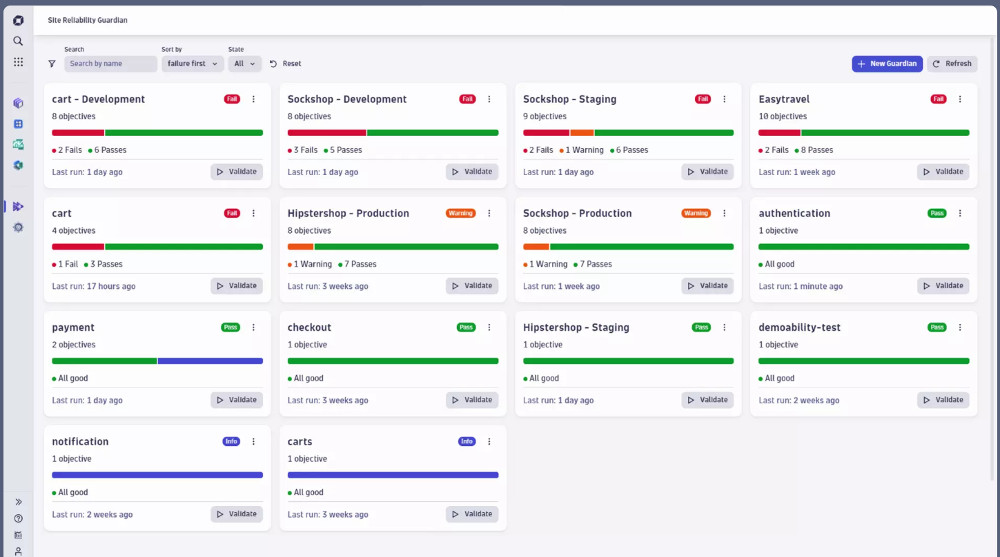
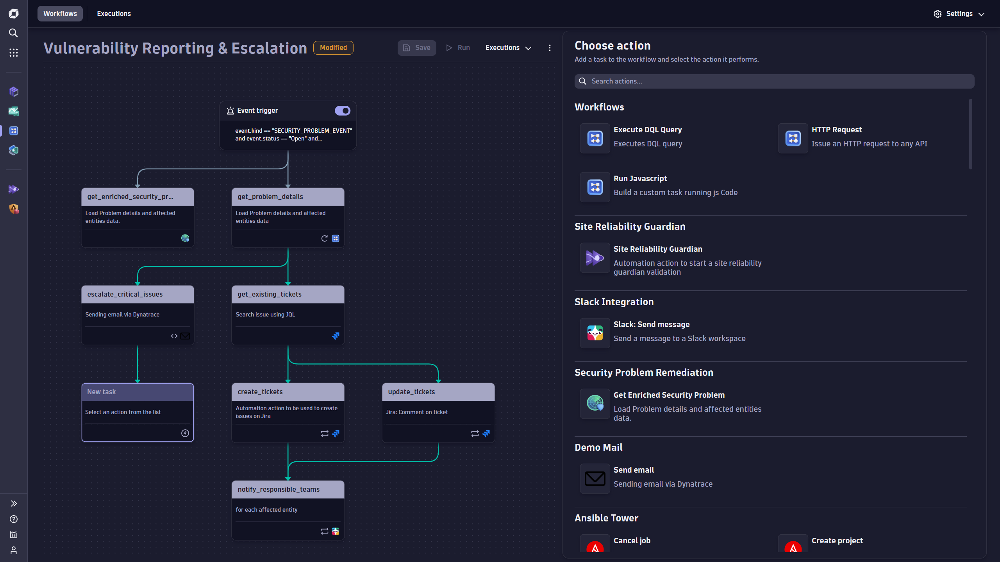
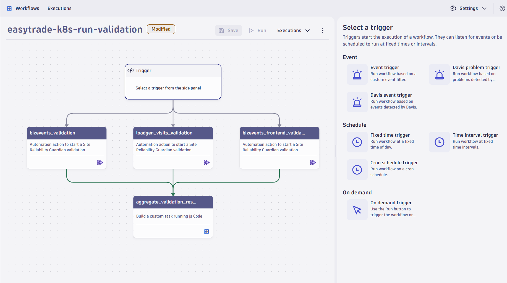
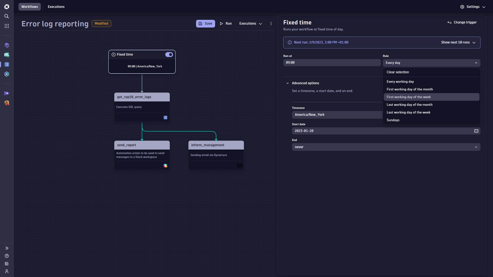
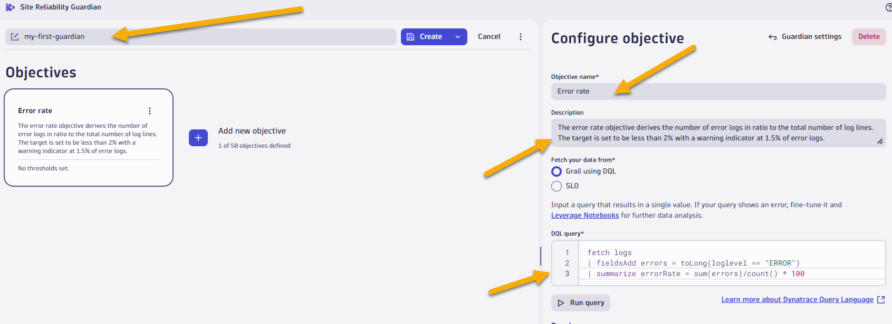
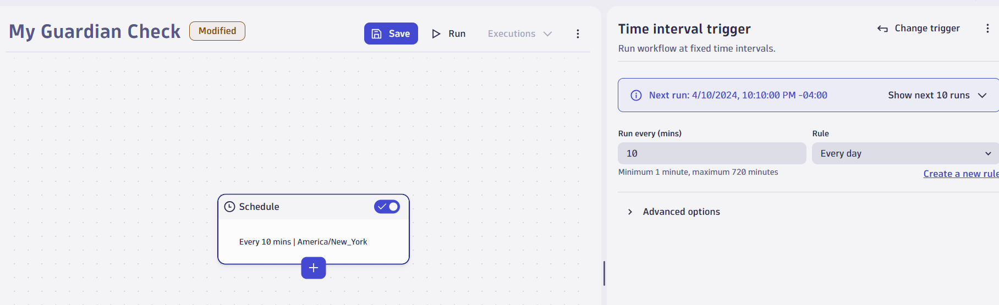
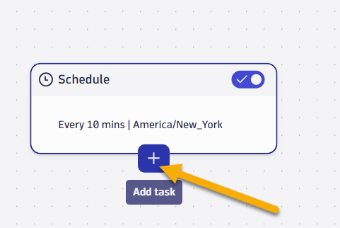
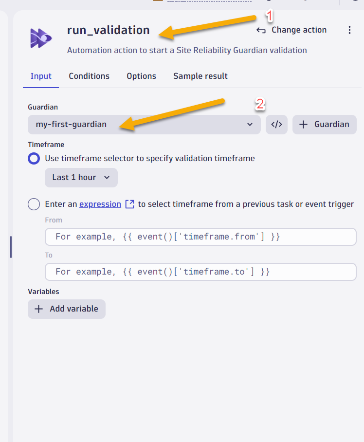
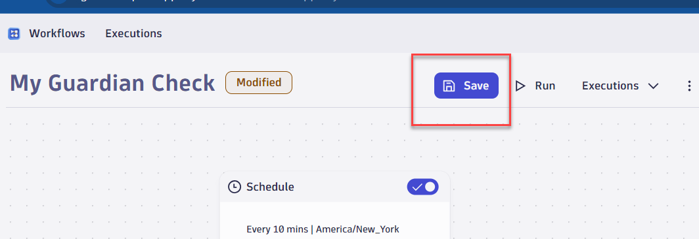

summary: Dynatrace Workshop on Azure Grail Lab5
id: azure-grail-lab5
categories: grail,all
tags: azure,grail
status: Published
authors: Jay Gurbani
Feedback Link: https://github.com/dt-alliances-workshops/workshops-content

# Azure Grail Workshop Lab 5 - SRE Guardian and Workflow

## Site Reliability Guardian Overview
Duration: 2

The Site Reliability Guardian provides an automated change impact analysis to validate service availability, performance, and capacity objectives across various systems. This enables DevOps platform engineers to make the right release decisions for new versions and empowers SREs to apply Service-Level Objectives (SLOs) for their critical services.

While the Dynatrace Site Reliability Guardian simplifies the adoption of DevOps and SRE best practices to ensure reliable, secure, and high-quality releases in general, the provisioned workflow is key for automating those best practices in particular. Learn in this sample how the workflow will act on changes in your environment and how it will perform a validation to make the right decision in a releasing or progressive delivery process.

In this lab exercise, you will learn more about the workflow leveraged by the <a href="https://docs.dynatrace.com/platform/capabilities/site-reliability-guardian" target="_blank">Site Reliability Guardian </a>.



## Workflow Overview
Duration: 2
Workflows is one of the built-in apps shipped with Dynatrace. A workflow in Dynatrace refers to a sequence of automated steps or tasks that can be triggered based on specific conditions or events within your monitored environment. These workflows are crucial in automating the response to particular situations and ensuring the smooth running of applications and systems.

Workflows allows you to:

 - Dynatrace workflows provide a no/low-code graphical editor makes it easy to create answer-driven workflow automations. Just assemble the tasks and define a trigger – it’s that simple.
    

- Workflows are often triggered by certain events or conditions. Easily set up and trigger automations based on schedule, events, problems, AI (Davis Analyzers), or external API calls.
    

- What can you do with Workflows? - Use cases include but are not limited to:
    - Targeted notification and collaboration: connect the right teams and equip them with answers in real-time
    - Closed-loop remediation: automatically remediate problems and vulnerabilities
    - Quality and security gating: block vulnerabilities and regressions before they reach production
    - Continuous vulnerability assessment: detect zero-day vulnerabilities
    - Predictive automation: take maintenance measures before risking a potential failure
    - Progressive delivery orchestration: orchestrate releases based on user and system feedback
    - Intelligent infrastructure and application orchestration: auto-scale and resize smarter load distributions
    - Preventive security configurations: block malicious IPs based on known attack patterns


- How can workflows help?  Workfows can help boost team productivity and reduce errors from manual process through automations that are easy to set up and manage.
    

## Getting started Guardian
Duration: 7

### Tasks to complete this step
1. Create a guardian
    - In Dynatrace from menu on the left, select `Apps -> Site Reliability Guardian`.
    - On the All Guardians overview page, select `+ Guardian`. 
    - Click on `create without template`.  A new guardian is displayed in the editor.
    - Provide a name for the guardian: my-first-guardian
    - Add the following objective example by defining the name, a DQL, and specifying a target as well as a warning threshold.
        - **Objective name:** Error rate
        - **Description:** The error rate objective derives the number of error logs in ratio to the total number of log lines. The target is set to be less than 2% with a warning indicator at 1.5% of error logs.
        - DQL to calculate error rate:
            ```
                fetch logs
                | fieldsAdd errors = toLong(loglevel == "ERROR")
                | summarize errorRate = sum(errors)/count() * 100
                
            ```
            
        - Click on `run query`, select the last 1 hour to previw results of your current error rate.
    - **Set thresholds for this objective**: 
        - Select `Lower than the these numbers is good` 
        - **Failure**: `1`
        - **Warning**: `0.4`
        > For other examples, please see: [Site Reliability Guardian objective examples](https://docs.dynatrace.com/platform/capabilities/site-reliability-guardian/reference).
    - Click on **Create** to create the guardian.
    - Click on **Validate** to perform a manual validation of the objective.

## Getting started with Workflow
Duration: 8

In todays lab for Workflow's we'll leverage the Guardian we created in previous step and run that on scheduled basis to ensure we always meet our SLO

### Tasks to complete this step

1. Sign in to Dynatrace.
1. In the Dynatrace Launcher, select Workflows.
1. Select Add New workflow to create your first workflow. The Workflow editor opens.
1. Select the workflow title ("Untitled Workflow") and customize the name e.g. "Guardian Check".
1. In the Choose trigger section, select the `Time interval trigger`.  
    - Set the Run every (min) parameter to `10 minutes` and Rule parameter to `everyday`
        
1. To add the first task, select + on the trigger node of the workflow graph.
    
1. In the Choose action section, which lists all available actions for tasks, select "Site Reliability Guardian". The workflow now has its first task and shows the input configuration for that task on the right.
    - For the Guardian, select "my-first-guardian"
    - For the timeframe, select "Last 1 Hour"
     
1. From the left menu click on save to save the workflow
    
1. Select Run to execute the workflow.


## Sample Workflow Use Case for Reporting
Duration: 2

[Example link for Reporting Workflow](https://egu21862.apps.dynatrace.com/ui/apps/dynatrace.notebooks/notebook/d2c17fd0-8bd6-4f57-9985-77431fb8af6f#964bfb79-2c8d-4d65-920d-88ef6f6b4263)
Let's say you manage an e-commerce platform. Your team has recently deployed several updates to enhance user experience. To ensure these changes are working as expected and have not introduced any new performance issues, you need a robust observability strategy - so you decided to use Dynatrace.

Since your demand on your services is very elastic, various services spin up and down every day. However, at the end of the day your boss wants to know how many Azure Virtual Machines were running that day, what the name of those is and how long they were running - so you created a DQL query for that that you now have to run at 6:00 pm every day - which means that after picking up your daughter from school, you again have to log in to execute this DQL query.  Here's the DQL query for it:

```
    fetch dt.entity.host, from:now() - 24h
    | filter cloudType == "AZURE"
    | fields Host = entity.name, started = arrayMax(array(now() - 24h, lifetime[start])), ended = arrayMin(array(now(), lifetime[end]))
    | fields Host, Runtime = toString(ended - started)
    | sort Runtime desc
```

### Tasks to complete this step

1.  Since you are very lazy and don't want to log in again at 6, you want this data to be sent to your boss automatically. Your objective is to create a workflow that reads this data and sends it to your boss once a day. For submitting the results use the email action.
<!--
2.  Unfortunately your boss is not happy with the result, because he got it in a JSON format. Instead, he want's it human readable, line by line. Luckily - Dynatrace supports Jinja expressions for formatting the [data](https://www.dynatrace.com/support/help/shortlink/automations-reference#for-loop)

    - Your objective is to enhance that workflow to loop over the results and provide some output in this format:

        ```
            gke-apac-hackathon-default-pool-5179eccf-kuvo.c.acm-workshops.internal: 23:58:41.515879000
            gke-dynatrace-demo-default-pool-81ea5ea3-thsc.c.acm-workshops.internal: 23:58:24.841474000      
        ```
-->
## Summary
Duration: 2

In this section, you should have completed the following:

✅  Understand what a Site Reliability Guardian is and how it can strengten SRE practices

✅  Understand use cases for Workflows

✅  Created a Site Reliability Guardain.

✅  Created a simple workflow using the SRG

