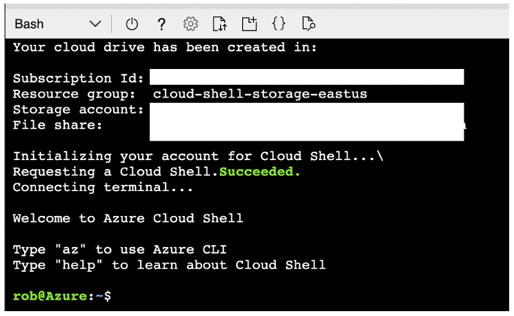

summary: Dynatrace Workshop on Azure - Prerequisites
id: azure-prereq
categories: modernization,kubernetes
tags: azure
status: Published
authors: Jay Gurbani
Feedback Link: https://github.com/dt-alliances-workshops/workshops-content
# Azure Workshop Lab 0 - Prerequisites and Setup

## Prerequisites & Setup

We will now setup Dynatrace, Azure, and the workshop environment. You need all of these in place before you are presented with the lab excercises.

## What you'll learn in this section
Duration: 1
🔷 Ensure your have an email for accessing your Dynatrace managed environment

🔷 Setup your temporary Azure subscription from the Azure Pass promo code you received from workshop staff.

🔷 Automatically provision workshop environment and sample application

## Login to Dynatrace Managed Environment
Duration: 5

For this workshop we have setup a free Dynatrace environment with evaluation license of the full feature set of our all-in-one performance monitoring platform to monitor Azure resources and complete the workshop exercises.  

### What you will need

In your email mailbox you used to register for this workshop, you should have received an email similar to one below 24-48 hours before the workshop.


### Tasks to complete this step

1) Task - Login to your DT Environment
    - Click on the link within the email you've received to setup your password for the Dynatrace environment.
    - Once your password is setup, login to your Dynatrace environment.


🏫**Class Note** - Please update the Tracking Spreadsheet if you've completed the task on this step.

## Azure Pass Subscription Setup
Duration: 5

To complete this workshop, you will be provided an Azure Pass Promo code.  A workshop staff will provide that code to prior or during the day of the workshop.

That Azure Pass Promo code enables you to have a separate Azure subscription setup under a separate account to provision all the resources needed to complete the workshop.     

This free Azure subscription will be available to you for the next 5 days or until when the $100 credit is utilized by the Azure resources (whichever comes first).

### Tasks to complete this step

1. To setup your workshop using free Azure Pass subscription, navigate to <a href="https://www.microsoftazurepass.com/" target="_blank">Microsoft's Azure Pass website</a>
2.  Click on Start.
     
3. Use a ***personal email address*** to signin or create a new Microsoft account email.
     
     **💥NOTE: If you are already signed in on a Azure account via your corporate email, please signout and login with personal account or create a new account.**
4.  Confirm the email address you want to use for your Azure pass subscription and "promo" code provided to allow for the Azure subscription to be setup.
     
    **💥NOTE:Using Azure Pass promotion code requires an email and the provisioning takes about 5 minutes to process.**

    **💥NOTE: You can create a new personal account during this step.**
    

🏫**Class Note** - Please update the Tracking Spreadsheet if you've completed the task on this step.

## Azure Prep
Duration: 5

1. Navigate to <a href="https://portal.azure.com/" target="_blank">https://portal.azure.com/ </a>

2. Click on the Cloud Shell button
    

    💥**NOTE:** If you get this prompt, choose bash


    💥**NOTE:** If you get the prompt below, choose `Azure Pass - Sponsorship` and then click the `Create Storage` button.


    💥**NOTE:** Creating the storage will take about a couple of minutes.

3. Once the storage is created, you should see the Unix bash shell.


4. Make a dedicated Azure shell Browser tab by clicking this new tab icon.


5. To verify which subscription is configured for the Azure CLI, run this command.
    ```
      az account show
    ```

- Look for the name in the output. This is example when a promo code was used.

    ```
      {
        "environmentName": "AzureCloud",
        "homeTenantId": "xxx-xxx-xxx-xx-xxx",
        "id": "yyy-yyyy-yyy-yyy-yyy",
        "isDefault": true,
        "managedByTenants": [], 
        "name": "Azure Pass - Sponsorship",   <----- This is the active subscription
        "state": "Enabled",
        "tenantId": "zzz-zzz-zzz-zzz-zzz",
        "user": {
          "name": "name@company.com",
          "type": "user"
        }
      }
    ```

- 💥**TECHNICAL NOTE**: If the subscription is not `Azure Pass - Sponsorship`, run this command to see all the subscriptions for your user id. If this is the first time using Azure portal or a trial, then you should only have one subscription.

    ```
      az account list --output table
    ```

- Here is an sample output:

    ```
      Name                                     CloudName    SubscriptionId                        State    IsDefault
      ---------------------------------------  -----------  ------------------------------------  -------  -----------
      Subscription 1                           AzureCloud   aaaaaaaa-aaaa-aaaa-aaaa-aaaaaaaaaaaa  Enabled  False
      Subscription 2                           AzureCloud   bbbbbbbb-aaaa-aaaa-aaaa-aaaaaaaaaaaa  Enabled  False
      Subscription 3                           AzureCloud   cccccccc-aaaa-aaaa-aaaa-aaaaaaaaaaaa  Enabled  False
      Subscription 4                           AzureCloud   dddddddd-aaaa-aaaa-aaaa-aaaaaaaaaaaa  Enabled  False
      Azure Pass - Sponsorship                 AzureCloud   eeeeeeee-aaaa-aaaa-aaaa-aaaaaaaaaaaa  Enabled  True
    ```

- If the `Azure Pass - Sponsorship` is not the `IsDefault = True`, then run these command to set and verify.

    ```
      # set the subscription
      az account set --subscription <YOUR PROMO SUBSCRIPTION ID>

      # verify change
      az account list --output table

      # double check with
      az account show
    ```

6. Within your Azure Cloud Shell window, run this command to download the workshop scripts:
    ```
      git clone https://github.com/dt-alliances-workshops/azure-modernization-dt-orders-setup.git
    ```
7. To validate all the workshops scripts have download, please run these commands within the Azure Cloud Shell window to display the directories
    ```
      cd azure-modernization-dt-orders-setup/
      ls -al
    ```
- You should see an output similar to the one below 
 


🏫**Class Note** - Please update the Tracking Spreadsheet if you've completed the task on this step.

## Provision the workshop
Duration: 20
This step will automatically provision several Azure resources and Dynatrace configuration needed for the workshop via a shell script.  

The process to provision everything will take ~15-20 minutes.

### What exactly is this script doing?

1 . Add Azure resources

- Add a Resource Group for all the VMs named: `dynatrace-azure-modernize-workshop`
- Add Service Principal: `dynatrace-azure-modernize-workshop-sp` needed for the Azure monitor integration.
- Add VM named: `dt-orders-monolith`. At startup, it installs Docker and the Dynatrace Orders application in the Monolith configuration. OneAgent is installed using Azure extension
- Add VM named: `dt-orders-active-gate`. At startup, it installs the Dynatrace ActiveGate process needed for the Azure monitor integration.
- Add Azure Kubernetes Cluster named `dynatrace-workshop-cluster`.

2 . Set Dynatrace configuration

- Set global [Frequent Issue Detection](https://www.dynatrace.com/support/help/how-to-use-dynatrace/problem-detection-and-analysis/problem-detection/detection-of-frequent-issues/) settings to Off
- Adjust the [Service Anomaly Detection](https://www.dynatrace.com/support/help/how-to-use-dynatrace/problem-detection-and-analysis/problem-detection/how-to-adjust-the-sensitivity-of-problem-detection/) global settings to a fixed error threshold
- Add [Management Zones](https://www.dynatrace.com/support/help/how-to-use-dynatrace/management-zones/) for the monolith and micro services versions of the application
- Add [Auto Tagging Rules](https://www.dynatrace.com/support/help/how-to-use-dynatrace/tags-and-metadata/) to drive management zone and SLO settings
- Add [SLOs](https://www.dynatrace.com/support/help/how-to-use-dynatrace/service-level-objectives/) for a use in custom dashboards
- Add [Azure Monitor Integration](https://www.dynatrace.com/support/help/technology-support/cloud-platforms/microsoft-azure-services/set-up-integration-with-azure-monitor/)

### 💥 **TECHNICAL NOTE**

_The Dynatrace configuration scripts use a combination of [Dynatrace Monitoring as Code](https://github.com/dynatrace-oss/dynatrace-monitoring-as-code) framework (a.k.a. monaco) and the [Dynatrace Configuration API](https://www.dynatrace.com/support/help/dynatrace-api/configuration-api/) for those few Dynatrace configurations not yet supported by monaco._

### Tasks to complete this step
1. Login to the Dynatrace UI
2. From left side in Dynatrace, pick the dashboard menu
3. On the Dashboard page, open the Workshop Provisioning dashboard.

4. While inside the Workshop Provisioning dashboard page, click on edit

5. Select the tile that has provisioning command

6. Copy ALL the text from the Markdown text on the right. You will paste this in the Azure cloud shell as the next step.

7. Return back to the window where you have the Azure Cloud shell open
8. Paste the full command and hit enter.  You should see a prompt similar to as one below.

    ```
      ===================================================================
      About to Provision Workshop for
      Dynatrace Managed Server: https://name.dynatrace-managed.com/e/aaaaa-bbbb-ccccc-ddddd
      SETUP_TYPE   = all
      ===================================================================
      Proceed? (y/n) : 
    ```
9. Enter **y** at the prompt to begin the provisioning of the workshop.  Once the script is complete you should see output as shown below
    ```
      =============================================
      Provisioning workshop resources COMPLETE
      End: Thu 25 Nov 2021 12:45:29 PM UTC
      =============================================
    ```

## Validate workshop provisioning automation completed
Duration: 5
1. Go back to the window where you have the Azure Portal screen open
2. Search for `Resource Groups` from the search bar at the top

3. Click on `Resource Groups`.  From the list of resource group select `dynatrace-azure-modernize-workshop`.
4. Once you within the resource group, you will see all of the different types of resources we've automatically provisionined for this workshop


### Verify AKS Cluster is provisioned
- In this step we will verify if the Azure Kubernetes Service (AKS) Cluster was provisioned correctly. Also we will download the credentials to manage our AKS cluster via `kubectl` commands.

- The <a href="https://kubernetes.io/docs/reference/kubectl/overview/" target="_blank">kubectl</a> command line tool that lets you control Kubernetes clusters.  For details about each command, including all the supported flags and subcommands, see the <a href="https://kubernetes.io/docs/reference/kubectl/overview/" target="_blank">kubectl</a> reference documentation.

**NOTE:**Only proceed if the provisioning script completes, and looks like this:

```
...
...
=============================================
Provisioning workshop resources COMPLETE
=============================================
```

Once the provisioning script is complete, you can verify the new cluster with this kubectl command.

1. Run this command in Azure Cloud shell to get familiar with the command line options for kubectl.

    ```
    kubectl --help
    ```

1. Configure kubectl to connect to the new cluster by downloading the cluster credentials. 

    ```
    az aks get-credentials --resource-group dynatrace-azure-modernize-workshop --name dynatrace-workshop-cluster
    ```

1. Verify you are connected.  You should see `dynatrace-workshop-cluster` as the output.

    ```
    kubectl config current-context
    ```

1. List the nodes in the cluster

    ```
    kubectl get nodes
    ```

    The output should look like this:

    ```
    NAME                                STATUS   ROLES   AGE   VERSION
    aks-nodepool1-74092643-vmss000000   Ready    agent   21h   v1.19.11
    aks-nodepool1-74092643-vmss000001   Ready    agent   21h   v1.19.11
    ```

    You can see even more detail with this command.

    ```
    kubectl describe nodes
    ```

### Optional Verification of AKS Cluster via Azure Portal

- Within the Azure web portal, search for the kubernetes services and then click on the new workshop cluster.


- Explore the configuration to view the number of nodes and the kubernetes version.


</details>


🏫**Class Note** - Please update the Tracking Spreadsheet if you've completed the task on this step.

## Summary

In this section, you should have completed the following:

✅ Provisioned a Dynatrace tenant and Azure subscription

✅ Setup the Azure Cloud Shell to run various UNIX commands

✅ Captured environment and token info needed for workshop provisioning automation scripts

✅ Provisioned workshop resources

🏫**Class Note** - Please update the Tracking Spreadsheet if you've completed the task on this step.