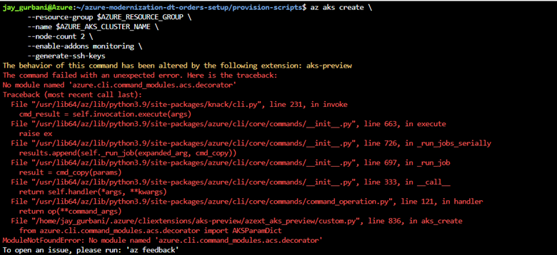

summary: Lab 11 Dynatrace Workshop on Azure
id: azure-lab11
categories: 
tags: 
status: Hidden
authors: Jay Gurbani
Feedback Link: mailto:jay.gurbani@dynatrace.com

# Azure Workshop - SE Delivery Notes

##  Workshop Links

|**Name**                               | **Link**                                                                          |
|-------------------                |------------------------------------------------------------------             |
|Lab Content                        |[https://learn.alliances.dynatracelabs.com/azure?cat=kubernetes](https://learn.alliances.dynatracelabs.com/azure?cat=kubernetes)                 |
|Azure Portal                       |[https://portal.azure.com](https://portal.azure.com)                                                       |
|Github - Lab Provisioning Scripts  |[https://github.com/dt-alliances-workshops/azure-modernization-dt-orders-setup](https://github.com/dt-alliances-workshops/azure-modernization-dt-orders-setup)  |
|Github - Sample App    | [https://github.com/dt-orders/overview](https://github.com/dt-orders/overview)
|DT Managed Cluster for Workshop    | [https://syh360.dynatrace-managed.com/](https://syh360.dynatrace-managed.com/)
|Azure Pass Subscription Redemption    |  [https://www.microsoftazurepass.com/](https://www.microsoftazurepass.com/)
|Azure Pass Subscription Check Balance | [https://www.microsoftazuresponsorships.com/Balance](https://www.microsoftazuresponsorships.com/Balance)
|Workshop PPT Content Folder| [DT SharePoint](https://dynatrace.sharepoint.com/:f:/s/StrategicBusinessDevelopment/Em7OPic-iepJiqG91mbq7AUBYJJmCQiQTr2eOzgdjWgvsg?e=V3o4za)


## Sample Agenda TimeLine

*	10:00am -  [#1 - Kickoff Deck (Jay)](https://dynatrace.sharepoint.com/:p:/s/StrategicBusinessDevelopment/EdqD9epOVepBp8ZfzJunGzEBW8jzOczyZMK05vg_QUYUhw?e=c4YLbM) 
    * Kickoff/Intro (Jay Gurbani)
    * The Azure/Dynatrace partnership (Jay Gurbani)
    * Workshop helpful tips (Jay Gurbani) 
* 10:20 -  [#2 - Hands On Deck (SE)](https://dynatrace.sharepoint.com/:p:/s/StrategicBusinessDevelopment/EdqD9epOVepBp8ZfzJunGzEBW8jzOczyZMK05vg_QUYUhw?e=c4YLbM)
    * Walk through the high-level workshop overview in slides 1-6.  
    * After slide 6, jump into the lab content site 
        * [https://learn.alliances.dynatracelabs.com/azure?cat=modernization](https://learn.alliances.dynatracelabs.com/azure?cat=modernization)
        * **Reminder**: we will do Lab 0-5.  Lab 7 is cleanup lab.
            * Lab5 is a variation of lab2 that we will not do today.
            * Lab6 is AppSec focused.  Only do if there's interest and time.
    * **Note**: Slides 7-20 are supplemental material if someone has questions around specific topics such as Azure functions, etc.
    * Lab Content Site - https://learn.alliances.dynatracelabs.com/azure?cat=modernization
        * Start with Lab 0 
        * In lab 0, go until step 5 (Provision the workshop)
* ~10:30am - While provisioning script is running (kill time to do a quick demo on Dynatrace unique capabilities for Azure) 
    * Perhaps just briefly walk through the Azure Monitor screen from the [demo live environment](https://guu84124.live.dynatrace.com/#azure;id=AZURE_SUBSCRIPTION-2BED0374A04ADF85/azureRegions;gtf=today;gf=all)
* 10:45am - Start on Lab 1.  (Aim to complete it by 11:30am.)
* 11:30-11:40 - Take a 10 min break.   
* 11:40-12:20 – Complete Lab2 
* 12:20-12:30 – Let everyone grab lunch
* 12:30-12:50 – Demo (Azure Portal Integration Demo (Jay))
* 12:50-1:20 - lab 3
* 1:20 – 5-minute break
* 1:25-1:40 - lab 4
* 1:40-1:55 - lab 5
* 1:55 - #4 - [Wrap-up Deck (Jay Gurbani)](https://dynatrace.sharepoint.com/:p:/s/StrategicBusinessDevelopment/EYY8_-EBWIVCiJgVhdhYneIB0OKTvVz5xfsMJ8JzUe1WFw?e=hS1HtJ)

## Guidance and Recommendations

* During day of the workshop we will use Azure Pass subscription codes so that each customer has their own Azure Tenant with all the privileges
    * 💡 **We will have some extra subscription pass codes to give to the SE's to try out the workshop.**
* Each Azure Paas subscription will expire after 5 days or until the $100 credit is utilized by Azure Resources **(whichever comes first)**
* Prior to the workshop delivery date.  Walk through each exercise in the labs 0-4.  If you find any caveats, have questions or parts do not work please provide feedback.
* During the day of the workshop
    * Demonstrate each of the exercises in the labs.  
    * Have multiple tabs open in your browser
        * [Lab Content](https://learn.alliances.dynatracelabs.com/azure?cat=kubernetes)
        * PPT Content - Customized for the event
        * [Azure Portal](https://portal.azure.com)
        * [Azure Portal Cloud Shell](https://portal.azure.com/#cloudshell)
* Workshop Attendees will receive a welcome email at least 24 hours prior to the Workshop start with instructions to complete Step 2 and Step 3 in the Lab0. 

### Pre-Requisites

* Use an Azure Pass Subscription Code if one available. If unavailable, use the SE Subscription while the Alliances Team procures the Azure Pass Subscription codes. 
    * 💡 All the labs still function in regular Dynatrace SE Subscription except for the Azure Monitor integration functionality which requires the access privileges to create Azure Service Principals. 
* Access to the [Alliances DT Managed Cluster](https://syh360.dynatrace-managed.com/)
* Each environment on the Managed Cluster has a unique dashboard created in the environment. for the attendees.  This dashboard kicks off the provisioning script with certain parameters.

### Labs and Details

#### Lab 0 - Provisioning

*	Before starting make sure you stress that they are not connected via VPN back to their work environment for anything.   
    * They should use their personal email account to login to Azure Portal.
    * They should use their work email account to login to DT Managed Tenant.
*	Attendees should have completed until Step 3 in Lab 0 as part of instructions in the welcome email.    If many of them have not, start with Step 1 again ☹
*	On Step 3, when you Azure Pass redemption steps, **make sure you stress again that attendees use their personal email account to redeem the code** to avoid any access issues with their corporate account
*	As the provisioning script is running they might see some errors fly by quickly.  Most of the time there’s error checking built into the provisioning scripts to address those errors.   True check will be Step 6 in Lab 0 where they’ve validated all resources are visible in “dynatrace-azure-modernize-workshop” resource group.  There are total of 12 resources created within that resource group.
    * If customers get an error during the creation of AKS cluster that looks like this
        
    * Have the customer update their aks-preview extension for azure cli by executing the following:
        ```  
        az extension update --name aks-preview 
        ```
    * 💡  This is a known issue with aks-preview extension in azure cli version <= 0.5.82.  Latest version as of Aug 2022 is 0.5.94.  To check which version is installed, type az –version.

#### Lab 1 - 

*   Lab 1 is meant to familiarize attendees with various in Dynatrace.  Feel free to go as slow or fast based on attendee familiarity of various DT screens.

#### Lab 2 - AKS

* Step 3, Deploy Kubernetes Dynatrace Operator, there is a automatically generated “dynakube.yaml” already within the gen folder.  Make sure you’re sitting in that folder before you run the kubectl commands.
    * 💡  The dynakube.yaml is generated when the provisioning script is run in Lab 0.
* Sometimes the Dynatrace Operator won’t instrument the sample application deployed on AKS and its not visible in the Services view which is used in Step 7.  If this occurs, have attendee restart the pods in the staging namespace with following command:
    ```
        kubectl get deployments -n staging -o custom-columns=NAME:.metadata.name|grep -iv NAME|while read LINE; do kubectl rollout restart deployment $LINE -n staging ; done;
    ```

#### Lab 3 - Davis AI

* Step 2, please review the concept behind Information Events and Tags how Dynatrace uses it to add additional context.  
* In next two steps of the lab, we will use the Information Events from a “deployment” to illustrate how things go wrong during a deployment and how Davis uses that information for problem cards.
* It can take about 5-7 minutes for the problem card to be generated sometimes and another 3-5 minutes for them to be correlated together to show root cause.

#### Lab 4 – Azure Monitor

* Step 3 around setting up Custom Alerting is long.  Some attendees tend to get lost on this.  Please go through this slowly.

#### Lab 5 – SLO Dashboards
* There is a JSON file link embedded for Dashboard so users don't have create the dashboard.  They just need to copy/paste the JSON data into Dashbaord creation ui. 

#### Lab 7 - Cleanup

* Not necessary to go through this lab entirely but just re-iterate the points on Step 1

