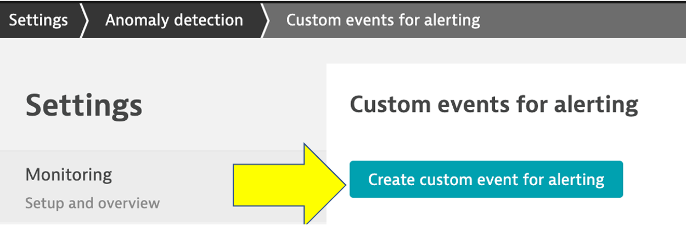
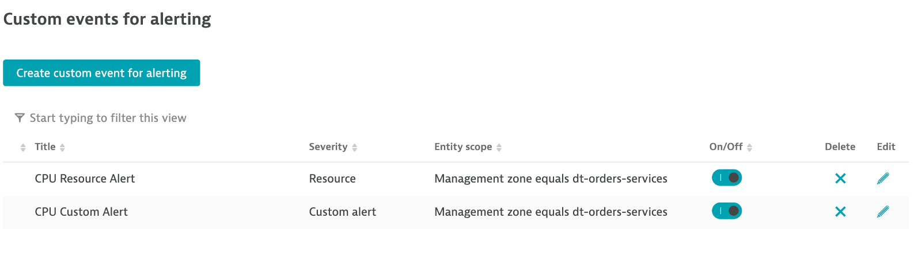
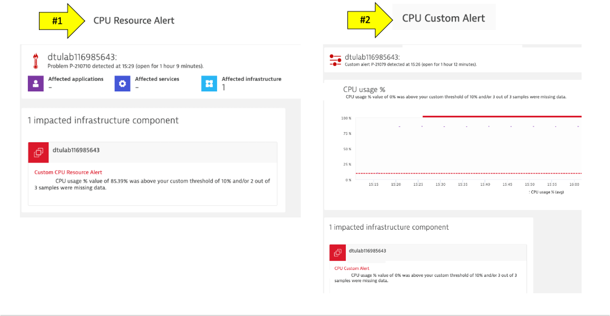

summary: Dynatrace Workshop on Azure - lab4
id: azure-lab4
categories: modernization,kubernetes
tags: azure
status: Published
authors: Jay Gurbani
Feedback Link: https://github.com/dt-alliances-workshops/workshops-content

# Azure Workshop Lab 4 - Operate

In order to do more with less and scale, organizations must transcend IT silos, foster collaboration and improve productivity. Automation and a common data model are key components of this, but it takes platforms that support operational teams and workflows.

## Objectives of this Lab 

🔷 Review how Dynatrace integrates with [Azure monitor](https://azure.microsoft.com/en-us/services/monitor/)

🔷 Review how Azure monitor metrics can be configured as [Metric events for alerts](https://www.dynatrace.com/support/help/how-to-use-dynatrace/problem-detection-and-analysis/problem-detection/metric-events-for-alerting/)

🔷 Examine Dynatrace Service Level Objectives (SLOs)

🔷 Create a custom dashboard with SLOs 

🏫**Class Note** - Please update the Tracking Spreadsheet if you've completed the task on this step.

### Overview - Azure Monitor Setup

Referring to the picture below, here are the components for this lab.


**#1 . Azure**

Azure cloud platform where Azure services produce metrics that are sent to Azure monitor.

**#2 . Azure VM running ActiveGate**

A <a href="https://www.dynatrace.com/support/help/setup-and-configuration/dynatrace-activegate/basic-concepts/when-do-i-need-to-install-an-activegate/#anchor-route" target="_blank"> Dynatrace ActiveGate </a> process required to monitor Azure monitor data. 

**#3 . Dynatrace**

Dynatrace tenant where monitoring data is collected and analyzed.

**#4 . Dynatrace Azure Dashboard**

Out of the box dashboard for each configured Azure subscription.

### Azure Dashboard

In addition to monitoring your Azure workloads using OneAgent, Dynatrace provides integration with <a href="https://docs.microsoft.com/en-us/azure/azure-monitor/overview" target="_blank"> Azure Monitor </a> which adds infrastructure monitoring to gain insight even into serverless application scenarios.

The integration uses Azure Monitor metrics for service insights, as well as Azure Resource Manager (ARM) to gather metadata.


### Review your environment

1. From the left side menu in Dynatrace, click the `Azure` menu item.
1. Scroll down, and in the `Environment dynamics` action click on the `eastus` region to open the virtual machine regional page  

### Virtual machine regional page 

Notice the following details:
1. A summary of type and status is shown
1. A running average for virtual machines
1. A table of host with Azure monitor metrics summarized.  Notice that both VMs with and without an OneAgent are both shown


### Virtual machine details 

Click on the `dt-orders-active-gate` host to open the host page.

Notice the following details:
1. Expand the properties to see more details
1. All the Azure monitor metrics are viewable as time-series data


### 💥 **TECHNICAL NOTE** 

See the [Dynatrace Docs](https://www.dynatrace.com/support/help/technology-support/cloud-platforms/microsoft-azure-services/set-up-integration-with-azure-monitor/) for more details on the setup.

### 👍 How this helps

Dynatrace brings value by enriching the data from Azure Monitor/App Insights and extending observability into the platform with additional metrics for cloud infrastructure, load balancers, API Management Services, and more.​

These metrics are managed by Dynatrace's AI engine automatically and this extended observability improves operations, reduces MTTR and increases innovation. 

## Step 1 - Custom Alerting

Dynatrace Davis automatically analyzes abnormal situations within your IT infrastructure and attempts to identify any relevant impact and root cause. Davis relies on a wide spectrum of information sources, such as a transactional view of your services and applications, as well as on events raised on individual nodes within your Smartscape topology.

There are two main sources for single events in Dynatrace:

* Metric-based events (events that are triggered by a series of measurements) and
events that are independent of any metric (for example, process crashes, deployment changes, and VM motion events)
* Custom metric events are configured in the global settings of your environment and are visible to all Dynatrace users in your environment.

### Tasks to complete this step
<details><summary>Task 1 - Setup Custom Events for Alerting</summary>

1 . To add custom alerts, navigate to `Settings --> Anomaly Detection --> Custom Events for Alerting` menu. 

2 . Click the `Create custom event for alerting` button.



3 . In the `Category` dropdown list, select `Cloud Platform` and in the `Metric` dropdown list, type `Percentage CPU` and pick the `Cloud platforms > Azure > Virtual Machine > cpuUsage` option and Pick `Average`


4 . Click `Add rule-base` button and update as shown below


5 . Choose `Static threshold` and update as shown below


6 . Add the `Event Description` to have the `title` and `severity = CUSTOM ALERT` as shown below.


Notice the `Alert preview` chart that helps you in reviewing these settings


7 . Save your changes

8 . Add another rule, with everything the same, except for the `Event Description` to have the `title` and `severity = RESOURCE` as shown below.


9 . Save your changes and the list should look as shown below.



</details>
<details><summary>Task 2 - Trigger a CPU Problem</summary>
To enable a problem, you will SSH into a VM and run the [yes](https://en.wikipedia.org/wiki/Yes_(Unix)) utility in the background that will cause high CPU.  

1. From the Azure shell, SSH to the monolith virtual machine with this command:

```
cd ~/azure-modernization-dt-orders-setup/learner-scripts
./show-app-urls.sh
```

Using the IP address for the MONOLITH host, run this command:

```
ssh workshop@<PUBLIC-IP>
```

**NOTE: Ask instructor for password**

2. Once SSH session is established, copy all these lines and run them:

```
yes > /dev/null &
yes > /dev/null &
yes > /dev/null &
```

To verify, run this command:

```
ps -ef | grep yes
```

The output should look like this:

```
azureuser:~$ yes > /dev/null &
[1] 138465
azureuser:~$ yes > /dev/null &
[2] 138488
azureuser:~$ yes > /dev/null &
[3] 138495

azureuser:~$ ps -ef | grep yes
azureuser  138465  137535 81 20:54 pts/2    00:00:03 yes
azureuser  138488  137535 80 20:54 pts/2    00:00:02 yes
azureuser  138495  137535 95 20:55 pts/2    00:00:01 yes
azureuser  138573  137535  0 20:55 pts/2    00:00:00 grep --color=auto yes
```
</details>
<details><summary>Task 3 - Review Dynatrace UI for Problem card</summary>

1. Back in Dynatrace within the `host` view, the CPU should now be high as shown below


1. It may take a minute or so, but you will get two problem cards as shown below.  #1 is the alert from the `severity = RESOURCE` where Davis was invoked, and #2 is the alert from `severity = CUSTOM ALERT`.



### 💥 **TECHNICAL NOTE** 

* See the <a href="https://www.dynatrace.com/support/help/how-to-use-dynatrace/problem-detection-and-analysis/problem-detection/metric-events-for-alerting/" target="_blank"> Dynatrace Docs </a> for more details on the setup.

* Alert configuration is available through the <a href="https://www.dynatrace.com/support/help/dynatrace-api/configuration-api/anomaly-detection-api/anomaly-detection-api-metric-events/" target="_blank"> Anomaly detection—metric events API </a> Using the API, you can list, update, create, and delete configurations.

### Review Problem Notifications

1 . Navigate to `Settings --> Integrations --> Problem Notifications` 

2 . Read the overview and then click the `Add Notification` button

3 . Click various `Notification types` from the drop down to review the configurations inputs.

4 . For the `Custom integration` type, review the option to customize the payload.

5 . Notice how you can choose the `Alert profile`, but you only have default as an option currently

### Review Alerting Profiles

1 . Navigate to `Settings --> Alerting --> Alerting profiles`

2 . Read the overview and then expand the `default` rule.

3 . Now add one, by clicking on the `Add alerting profile` button

4 . Review the options to choose severity rules and filters

</details>
<details><summary>Task 4 - Stop the CPU problem</summary>
To stop the problem, you need to `kill` the processes.  To do this:

1. Run this command to get the process IDs:

```
ps -ef | grep yes
```

2. For each process, copy the process ID and run 

```
kill <PID>
```

For example:

```
# If output is this...

azureuser:~$ ps -ef | grep yes
azureuser  138465  137535 81 20:54 pts/2    00:00:03 yes
azureuser  138488  137535 80 20:54 pts/2    00:00:02 yes
azureuser  138495  137535 95 20:55 pts/2    00:00:01 yes

# Then run...

kill 138465
kill 138488
kill 138495
```

3. Verify they are gone by running this again:

```
ps -ef | grep yes
```

4. Verify that CPU in Dynatrace goes to normal and the problems will eventually automatically close

5. To exit the SSH session, run...

```
exit
```
</details>

🏫**Class Note** - Please update the Tracking Spreadsheet if you've completed the task on this step.

## Step 2 - SLOs Setup

Dynatrace provides all the necessary real-time information that your Site-Reliability Engineering (SRE) teams need to monitor their defined objectives.

An SRE team is responsible for finding good service-level indicators (SLIs) for a given service in order to closely monitor the reliable delivery of that service. SLIs can differ from one service to another, as not all services are equally critical in terms of time and error constraints.

Dynatrace offers more than 2000 different metrics that are ready for use as dedicated SLIs.

Each Service Level Objective (SLO) definition can be evaluated by following two result metrics:

* **SLO status:** The current evaluation result of the SLO, expressed as a percentage. The semantics of this percentage (for example, 99.3% of all service requests are successful, or 99.99% of all website users are “satisfied” in terms of Apdex rating) and the target defined for this percentage are up to the SRE team.

* **SLO error budget:** The remaining buffer until the defined SLO target is considered as failed. For example, if an SLO defines a 95% target and its current SLO status is evaluated as 98%, the remaining error budget is the difference between the SLO status and the SLO target.
Two SLOs were created for you, so review those.

Here is an example custom dashboard with SLO dashboard tiles.


### Tasks to complete this step
<details><summary>Task - Review SLO's are deployed</summary>

From the left menu in Dynatrace, click the `Service Level Objective` option to review the two SLOs that are already setup.  Edit one of them to review the configuration.


### 👍 How this helps

You can review the current health status, error budgets, targets and warnings, along with the timeframe of all your SLOs on the SLOs overview page.

Davis provides quick notifications on anomalies detected, along with actionable root causes. If your SLO has turned red, this is most likely because Davis has already raised a problem for the underlying metrics, showing you the root cause.

### 💥 **TECHNICAL NOTE** 

See the <a href="https://www.dynatrace.com/support/help/how-to-use-dynatrace/service-level-objectives/" target="_blank"> Dynatrace Docs </a> for more details on SLOs
</details>

## Create SLO Dashboard
In this step we'll create a very basic SLO dashboard to compare the before and after migration SLO's we've defined for our Monolith and Kubernetes service.

### Tasks to complete this step
<details><summary>Task 1 - Create Dashboard</summary>
From the left side menu in Dynatrace, pick the `dashboard` menu.

On the dashboard page, click the `new dashboard` button.


Provide a dashboard name like `Cloud Migration Success`

On the blank dashboard page, click the settings.  Then click the `advanced settings` link to open then settings page


Referring to this picture, follow these steps:

1. On the settings page, click the `dashboard JSON` menu.
1. Copy and paste the following Json content from this file into your dashboard JSON, replacing the existing JSON in the process:
    * <a href="https://raw.githubusercontent.com/dt-alliances-workshops/azure-modernization-dt-orders-setup/master/learner-scripts/cloud-modernization-dashboard.json" target="_blank"> Dashboard JSON file Link</a>
1. You **MUST** replace the `owner` field to be the email that you logged into Dynatrace with or you will not be able to view it.


After you edit the email, then click the `Revert Dashboard ID` button.  After you click the `Revert Dashboard ID` button, click the `Save changes` button.


### View Dashboard

Click the `Cloud Migration Success` breadcrumb menu to go back to the dashboard page


You should now see the dashboard


### Edit Dashboard

Now you need to edit the dashboard and adjust the tiles with the SLOs and databases in your environment.

On the top right of the page, click the `edit` button and then follow these steps:

#### Edit Dynamic requests tile

1. Click on the title of the Dynamic requests tile to open the Service properties window on the right side 
1. On the Service properties window, pick the monolith `frontend (monolith-frontend)` service
1. Click the `Done` button


#### Edit remaining tiles

1. Repeat the same steps above for the Cloud services tile, but pick the `staging- frontend` in the Service properties window
1. Repeat for the two SLO tiles, but pick the associated SLO from the drop down list in the SLO properties window
1. Repeat for the two database tiles. For Cloud services application there are 3 databases, so just pick one of the database of a demo.
1. Click the `Done` button to save the dashboard
</details>


🏫**Class Note** - Please update the Tracking Spreadsheet if you've completed the task on this step.

## Summary

In this section, you should have completed the following:

🔷 Review how Dynatrace integrates with [Azure monitor](https://azure.microsoft.com/en-us/services/monitor/)

🔷 Review how Azure monitor metrics can be configured as <a href="https://www.dynatrace.com/support/help/how-to-use-dynatrace/problem-detection-and-analysis/problem-detection/metric-events-for-alerting/" target="_blank"> Metric events for alerts</a>

🔷 Examine Dynatrace Service Level Objectives (SLOs)

🔷 Create a custom dashboard with SLOs 

🏫**Class Note** - Please update the Tracking Spreadsheet if you've completed the task on this step.