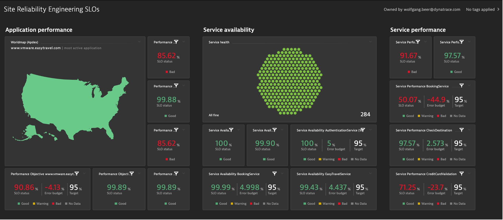

summary: Lab 5 Dynatrace Workshop on Azure
id: azure-lab5
categories: modernization,kubernetes,all
tags: azure
status: Hidden
authors: Jay Gurbani
Feedback Link: https://github.com/dt-alliances-workshops/learn-site-content

# Azure Workshop Lab 5 - SLO's

## Objectives of this Lab 
Duration: 3

🔷 Examine Dynatrace Service Level Objectives (SLOs)

🔷 Create a custom dashboard with SLOs 

## SLOs Setup Review
Duration: 5

Dynatrace provides all the necessary real-time information that your Site-Reliability Engineering (SRE) teams need to monitor their defined objectives.

An SRE team is responsible for finding good service-level indicators (SLIs) for a given service in order to closely monitor the reliable delivery of that service. SLIs can differ from one service to another, as not all services are equally critical in terms of time and error constraints.

Dynatrace offers more than 2000 different metrics that are ready for use as dedicated SLIs.

Each Service Level Objective (SLO) definition can be evaluated by following two result metrics:

* **SLO status:** The current evaluation result of the SLO, expressed as a percentage. The semantics of this percentage (for example, 99.3% of all service requests are successful, or 99.99% of all website users are “satisfied” in terms of Apdex rating) and the target defined for this percentage are up to the SRE team.

* **SLO error budget:** The remaining buffer until the defined SLO target is considered as failed. For example, if an SLO defines a 95% target and its current SLO status is evaluated as 98%, the remaining error budget is the difference between the SLO status and the SLO target.
Two SLOs were created for you, so review those.

Here is an example custom dashboard with SLO dashboard tiles.

### Tasks to complete this step
1. Review SLO's are deployed

    * From the left menu in Dynatrace, click the `Service Level Objective` option to review the two SLOs that are already setup.  Edit one of them to review the configuration.

        

        <aside class="positive">

        **👍 How this helps**

        You can review the current health status, error budgets, targets and warnings, along with the timeframe of all your SLOs on the SLOs overview page.

        Davis provides quick notifications on anomalies detected, along with actionable root causes. If your SLO has turned red, this is most likely because Davis has already raised a problem for the underlying metrics, showing you the root cause.
        </aside>

        <aside class="positive">💻📓 See the <a href="https://www.dynatrace.com/support/help/how-to-use-dynatrace/service-level-objectives/" target="_blank"> Dynatrace Docs </a> for more details on SLOs
        </aside>

## Create SLO Dashboard
Duration: 7

In this step we'll create a very basic SLO dashboard to compare the before and after migration SLO's we've defined for our Monolith and Kubernetes service.

### Tasks to complete this step
1.  Create Dashboard
    * From the left side menu in Dynatrace, pick the `dashboard` menu.
    * On the dashboard page, click the `new dashboard` button.

        

    - Provide a dashboard name like `Cloud Migration Success`
    - On the blank dashboard page, click the settings.  Then click the `Configure more` link to open then settings page

        

    - Referring to this picture, follow these steps:
        * On the settings page, click the `dashboard JSON` menu.
        * Copy and paste the following Json content from this file into your dashboard JSON, replacing the existing JSON in the process:
            * <a href="https://raw.githubusercontent.com/dt-alliances-workshops/azure-modernization-dt-orders-setup/master/learner-scripts/cloud-modernization-dashboard.json" target="_blank"> Dashboard JSON file Link</a>
        * You **MUST** replace the `owner` field to be the email that you logged into Dynatrace with or you will not be able to view it.

            

        * After you edit the email, then click the `Revert Dashboard ID` button.  After you click the `Revert Dashboard ID` button, click the `Save changes` button.

            
2. View Dashboard
    - Click the `Cloud Migration Success` breadcrumb menu to go back to the dashboard page

        

    - You should now see the dashboard

        

3. Edit Dashboard
    - Now you need to edit the dashboard and adjust the tiles with the SLOs and databases in your environment.
    - On the top right of the page, click the `edit` button and then follow these steps:
        *  Click on the title of the Dynamic requests tile to open the Service properties window on the right side 
        *  On the Service properties window, pick the monolith `frontend (monolith-frontend)` service
        *  Click the `Done` button

            

    - Edit remaining tiles by following these steps
        * Repeat the same steps above for the Cloud services tile, but pick the `staging- frontend` in the Service properties window
        * Repeat for the two SLO tiles, but pick the associated SLO from the drop down list in the SLO properties window
        * Repeat for the two database tiles. For Cloud services application there are 3 databases, so just pick one of the database of a demo.
        * Click the `Done` button to save the dashboard

<aside class="positive"> 🏫 - Please update the Tracking Spreadsheet upon completing this task. </aside>

## Summary
Duration: 2

In this section, you should have completed the following:

✅ Examined Dynatrace Service Level Objectives (SLOs)

✅ Created a custom dashboard with SLOs 

<aside class="positive"> 🏫 - Please update the Tracking Spreadsheet upon completing this task. </aside>