summary: Lab 6 Dynatrace Workshop on Azure
id: azure-lab6
categories: appsec,all
tags: azure
status: Hidden
authors: Jay Gurbani
Feedback Link: mailto:jay.gurbani@dynatrace.com

# Azure Workshop Lab 6 - AppSec

## Objectives
Duration: 2

We now have a moden microservices application hosted on Azure, but is it secure? The number of reported vulnerabilities is growing every year and examples like log4shell have shown us how severe they can be and how hard it is to quickly identify and resolve them.

As we have seen in the previous labs, Dynatrace helps you detect problems proactively and this also applies to security. Dynatrace Application Security detects third-party vulnerabilities at runtime, providing you with a continuous assessment of your deployed applications.

### Objectives of this Lab

- Enable Dynatrace Application Security to find potential vulnerabilities in our application
- Become familiar with the user interface by reviewing some of the identified vulnerabilities
- See how Davis Security Score helps us prioritize vulnerabilities

## Enable Dynatrace Application Security
Duration: 5

Application Security is an integral part of the Dynatrace platform, which makes it very easy to set it up, the only action required is toggling a switch in the user interface. 

To demonstrate this, we will enable Application Security in our environment by following the below. Once this is completed, we will explore the product and analyze some vulnerabilities. 

### Tasks to complete this step

1. Enable runtime Vulnerability detection
    1. Navigate to the relevant settings page
         1. Click on `Third Party Vulnerabilities` in the Application Security section of the menu
        2. Click on `Activate Settings`
    2. Toggle `Enable runtime vulnerability detection` 

         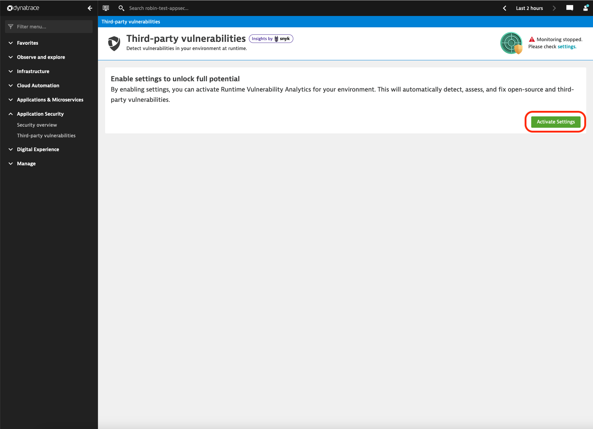 

        <aside class="positive"> 

        📓 Alternatively we can go to Settings > Application Security > Runtime vulnerability detection. 

        On the page that opens, toggle *Enable runtime vulnerability detection*, then click on ***Save changes*** when prompted, to complete the activation. 

         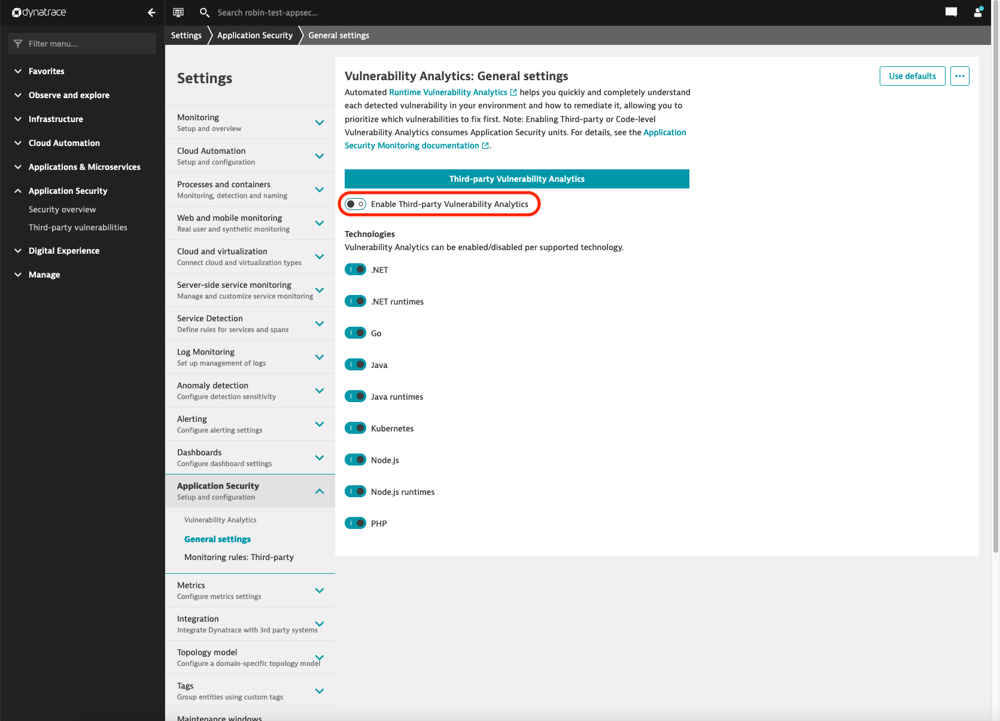 

        </aside>

## Getting familiar with Application Security
Duration: 15

Now that Application Security is enabled, lets explore the product and analyze some vulnerabilities.

### Vulnerabilities
On this screen you can see a list of all vulnerabilities that were discovered in the environment. 

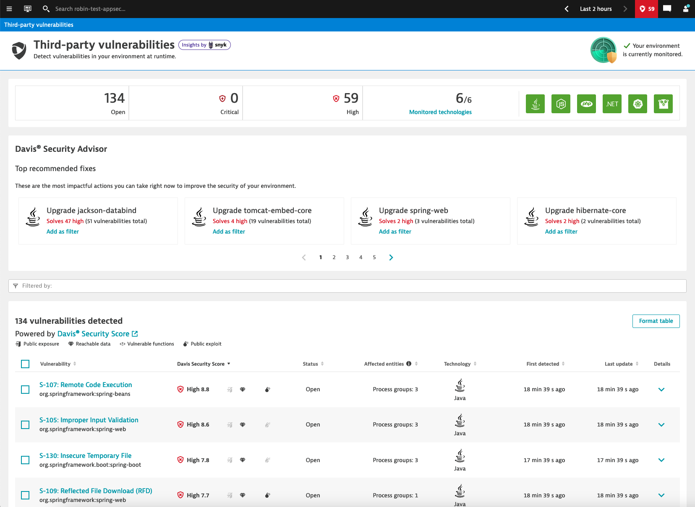

The list is sorted by the Davis Security Score, which is based on the CVSS, but also factors in context information detected at runtime. This contextual information, shown as icons next to the Davis Security Score, indicates whether there is public exposure, reachable data assets, presence of vulnerable functions, and availability of a public exploit. 

  <aside class="positive"> 

   📓 `Contexual Information`
      - **Public exposure**: The vulnerability affects a process that is exposed to the internet, based on the Dynatrace entity model (Smartscape).
      - **Reachable Data**: The vulnerability affects a process that has a direct access to a database
      - **Vulnerable Functions**: The vulnerable code of the affected librariy is actively used.  We have not enabled this yet, therefore this information won't be displayed. 
      - **Public Exploit**: There is a known exploit for this vulnerability.

  </aside>

 

### Tasks to complete this step

<aside class="positive"> 

📓  In March 2022 a [critical vulnerability was discovered in the Spring Framework](https://www.dynatrace.com/news/blog/what-is-spring4shell-vulnerabilities-in-the-java-spring-framework/). The affected versions of the Spring Beans library are vulnerable to Remote Code Execution (RCE), allowing attackers to install a web shell on a victim's application by manipulating the classloader with a specific HTTP Post request. 

Let's see if we are affected by this vulnerability.

</aside>

1. Click on the *Filter by* field, select *Snyk/CVE ID* and enter CVE-2022-22965. 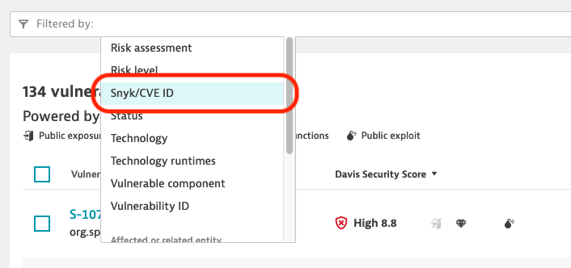
 As you can see, the vulnerability was detected in your environment and is has a Davis Security Score of 8.8 out of 10. It also shows you that there are 3 process groups that are affected. 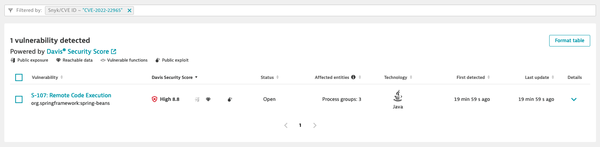
2. Now, click on the title of the vulnerability (*S-XXX: Remote Code Execution*) to show further details about this vulnerability.
3. Here you can see all the details about this specific vulnerability: 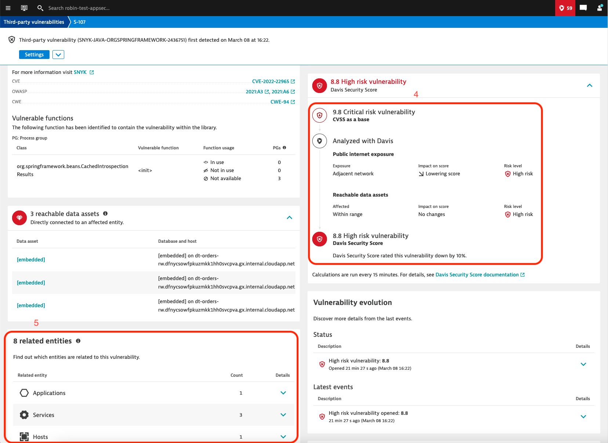
    1. At the top you can see the context information, it shows that no public internet exposure was detected, meaning that all requests to the affected processes are from the local network. However, the **Sensitive data assets** indicates that the there is a access to a database from at least one of the processes, meaning that some data could be at risk. Meanwhile on the right side, it is indicated that there is a ***public exploit*** available for this vulnerability, making it easier for potential attackers to exploit the vulnerability. 
    2. Under **Vulnerability details** you can see the number of processes and process groups that are affected by the vulnerabily. A description of the vulnerability is also provides, for example it mentions that the current known exploits affect applications deployed on Tomcat, Payara or Glassfish using Java 9 or higher. Links to other resources, such as the National Vulnerability Database, OWASP and Snyk are provided for further research.  
    3. The **Process group overview** shows the affected process groups and processes.  By scrolling further down, you can see additional context informaion, like related entities, details about the security score, evolution of the vulnerability, etc. 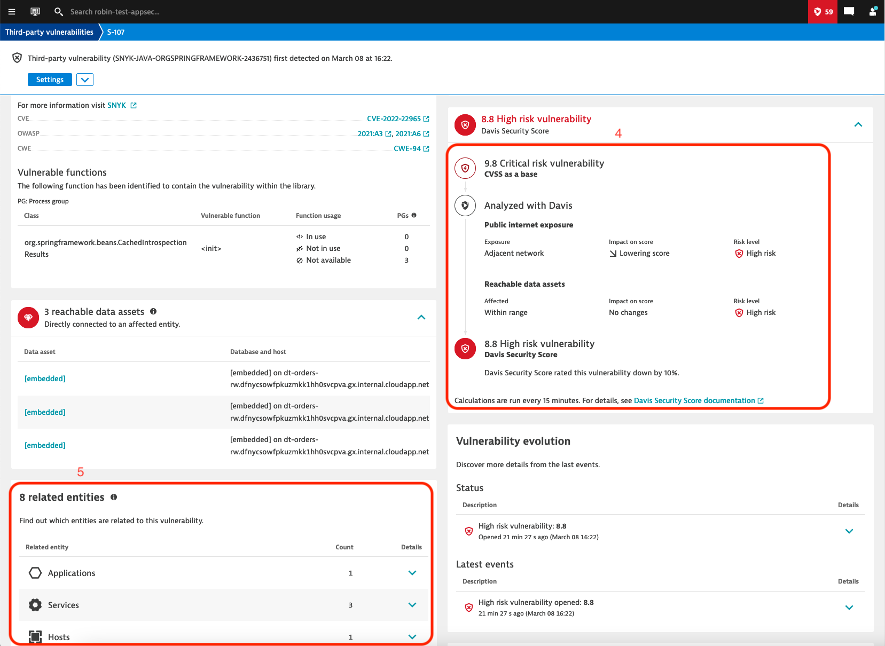
    4. The details about the Davis Security Score shows you how the context information are applied to the base CVSS to adjust the scare based on the current environment. In this example you can see that the score was lowered because there is no *Public Exposure*, all requests come from *Adjacent networks*. This helps you prioritize the different vulnerabilities. 
   5. You can also see all related entities (hosts, services, applications, kubernetes clusters, etc.) to quickly identify the potential impact if someone can exploit the vulnerability.  
   In order to further investigate this vulnerability, we want to check if the conditions for this vulnerability to be exploitable, as described under Vulnerability details, apply to our Process Groups. For this you can click on **View all process groups** under *Process group overview*: 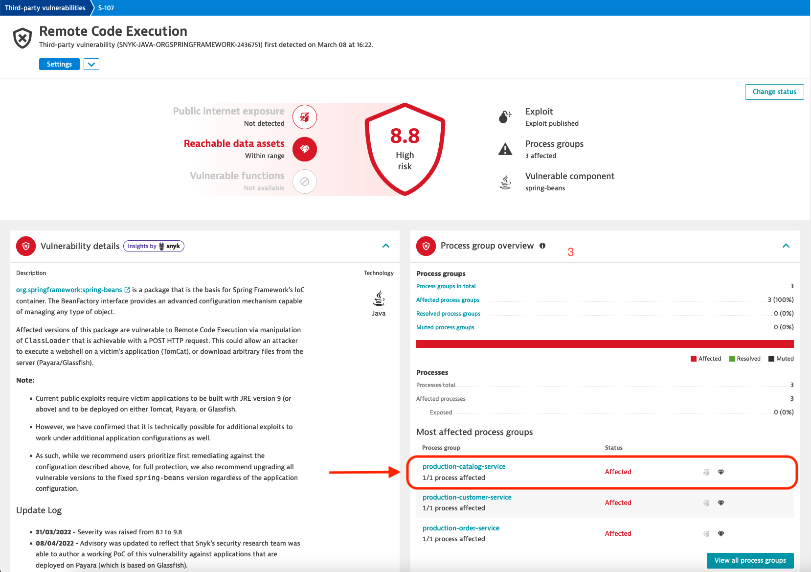
 - Click on the first entry in the list of affected Process Groups.
   - This brings us to the detail view of that specific Process Group. 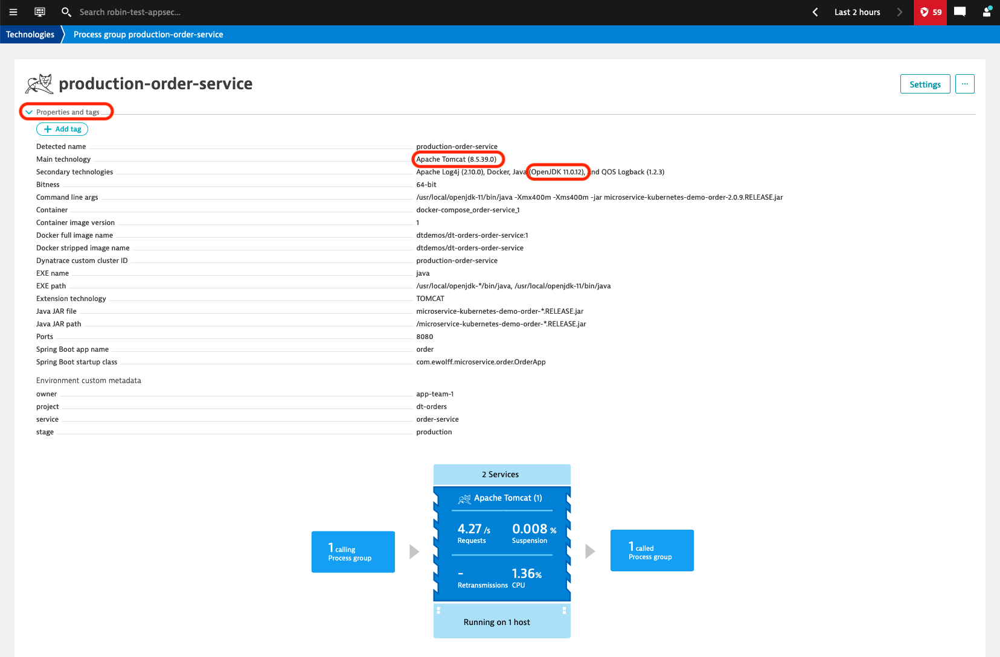

As we saw in the detail information about the vulnerability, currently the exploits are only known to work with Java 9 or newer and applications deployed as a WAR in Tomcat, Payara or Glassfish. Since Dynatrace collects all these information at runtime, it is quite easy to see if the Process Groups match these criteria. 
 - Click on **Properties and tags** to show the properties of this Process Group
   - As you can see in the properties, the application is deployed on Apache Tomcat and is running on Java 11, meaning that it is affected by the spring4shell vulnerability. 

    - Click on *View all process groups*. 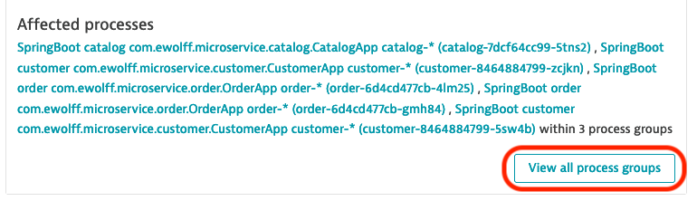
    - This shows the list of all affected Process Groups. 
    
    - As you can see in the properties, the application is deployed on Tomcat and is running on Java 11, meaning that it is affected by the vulnerability. 

## Security Notifications
Duration: 10

In order to get alerted in case new vulnerability is discovered in our environment, we can setup security notifications. There are three notification types:
- Email: sends a email to a predefined address
- Jira: opens a new Jira Issue
- Custom integration (Webhook): sends a webrequest with a payload to an end-point. 

Two steps are required to setup notifications. First we need to create a *Security Profile*, which defines in which cases a notifications is sent out. Then we can setup a *Security Notification* that sends out a notification for the previously created *Security Profile*. 

### Tasks to complete this step

- The first step is to create a Vulnerability Alerting Profile 
  - Go to *Settings > Alerting > Vulnerability alerting profiles*
  - Click on **Add alerting profile**
  - Specify a name, e.g. *Critical and high vulnerabilities*
  - Toggle the *Critical* and *High* Risk Levels
  - Click on **Save changes**
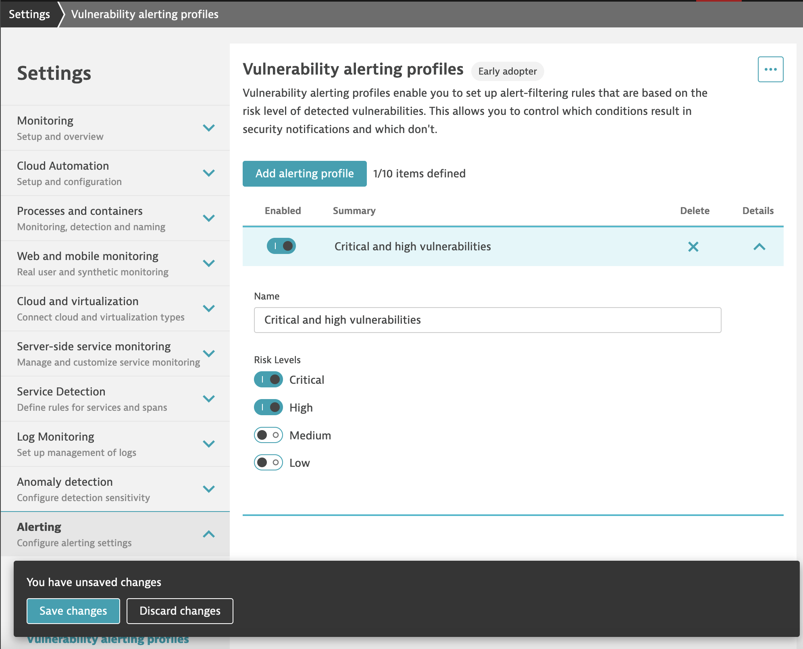
- After that we can setup the notification for the profile we just created
  - Go to *Settings > Integration > Security notifications*
  - Click on **Add integration##
  - Under *Security alert type* select *Vulnerability alert* 
  - For the Notification type we are going to use *Email*
  - Display name: Email for critical and high vulnerabilities.
  - Under *To* click on *Add recipient* and enter your email address
  - The *Subject* and *Body* fields allow us to define the information in the email.
    - You can for example add the severity in to the subject: [{Severity}] Security problem {SecurityProblemId}: {Title}
  - The last step is to select the alerting profiles, where you can select the previously created profile (should be preselected)
  - You can choose to send a test notification to see how the notification would look like
  - Then click on **Save changes**
  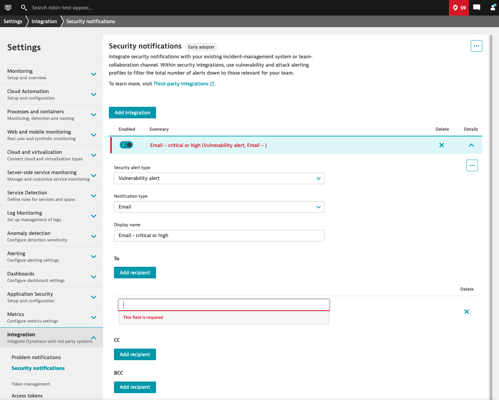

From now on, you will receive notifications whenever a new vulnerability with a risk score of *critical* or *high* is discovered. 

## Summary
Duration: 3

Without any additional deployment or configuration required, Dynatrace can provide you a real-time view of the vulnerabilities present in your running applications. This helps you:
- Immediately get notified about vulnerabilities impacting your production environment
- Understand the potential impact
- Prioritize the vulnerabilities thanks to context information 
- Reduce false-positives, since it focuses on libraries that are effectively used

### Checklist

In this section, you should have completed the following:

✅  Enabled Runtime vulnerability analytics in just one click

✅  Review the vulnerabilities that were detected automatically by Dynatrace

✅  Use context information to prioritize the vulnerabilities

✅  Setup notifications to receive an email upon discovery of new vulnerabilities

<aside class="positive"> 🏫 - Please update the Tracking Spreadsheet upon completing this task.   </aside>