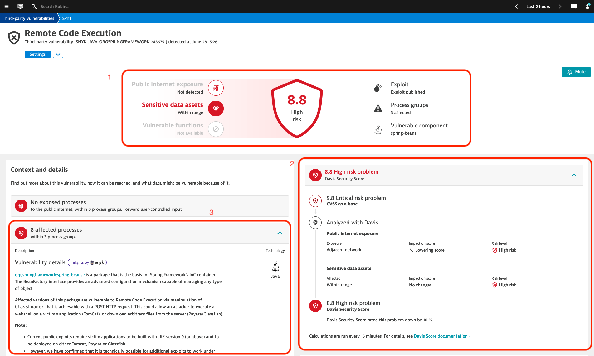
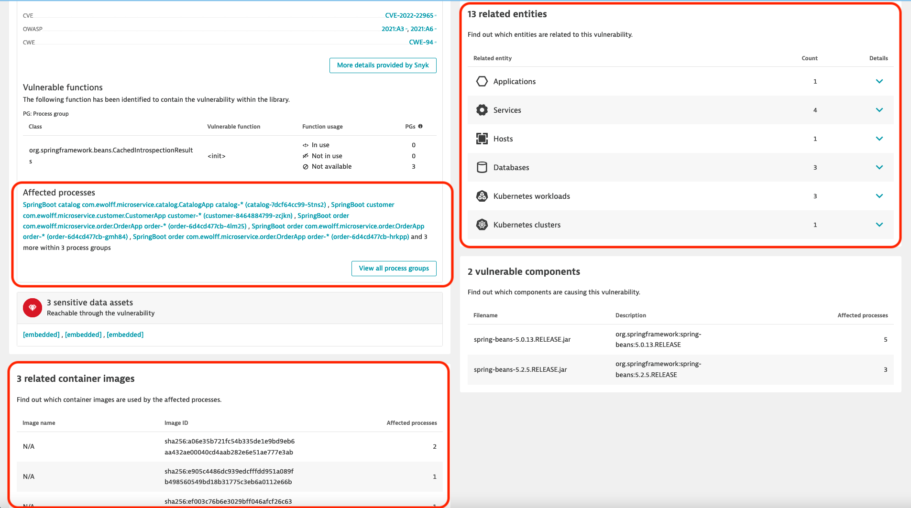
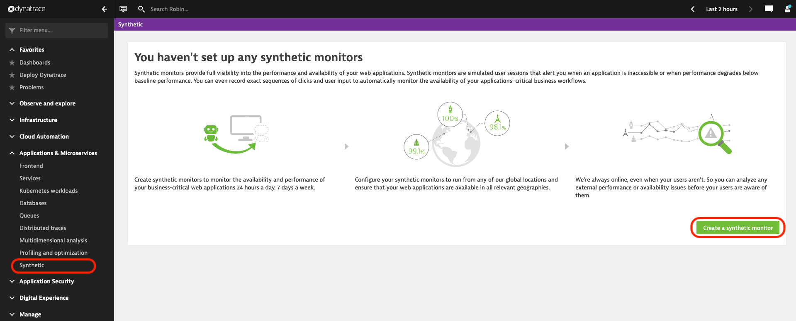
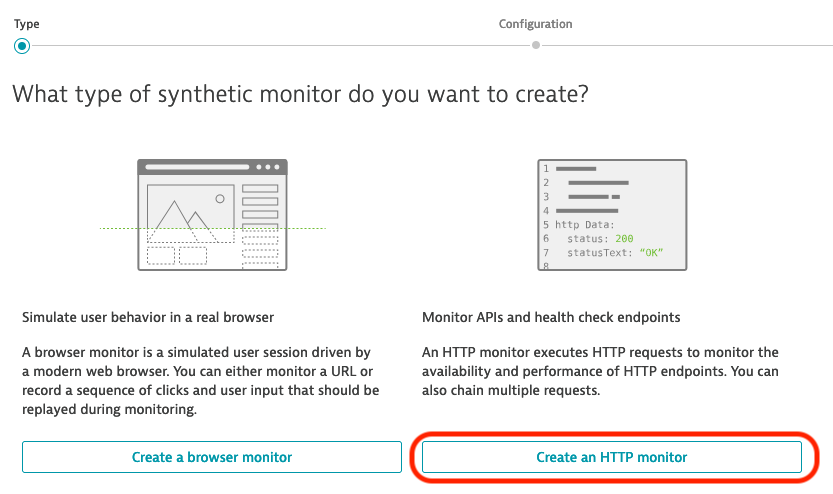
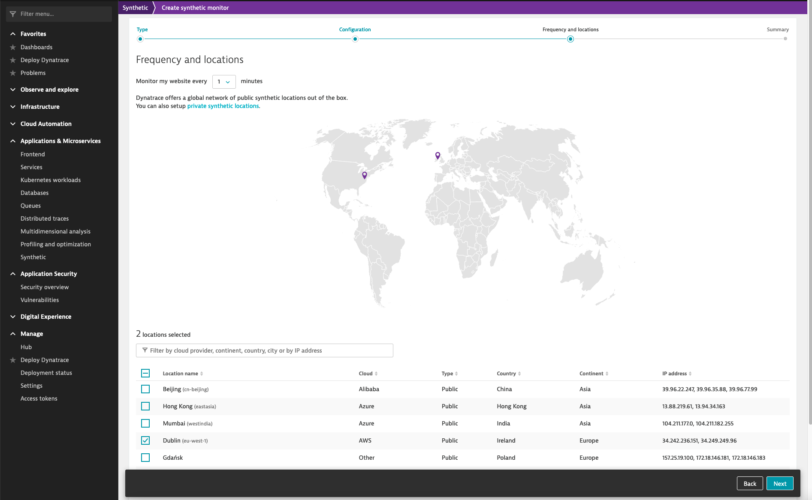

summary: Lab 6 Dynatrace Workshop on Azure
id: azure-lab6
categories: appsec,all
tags: azure
status: Hidden
authors: Jay Gurbani
Feedback Link: mailto:jay.gurbani@dynatrace.com

# Azure Workshop Lab 6 - AppSec

## Objectives

We now have a moden microservices application hosted on Azure, but is it secure? The number of reported vulnerabilities is growing every year and examples like log4shell have shown us how severe they can be and how hard it is to quickly identify and resolve them.

As we have seen in the previous labs, Dynatrace helps you detect problems proactively and this also applies to security. Dynatrace Application Security detects third-party vulnerabilities at runtime, providing you with a continuous assessment of your deployed applications.

### Objectives of this Lab

🔷 Enable Dynatrace Application Security to find potential vulnerabilities our application
🔷 Become familiar with the user interface by reviewing some of the identified vulnerabilities
🔷 See how Davis Security Score helps us prioritize vulnerabilities

## Enable Dynatrace Application Security

Application Security is an integral part of the Dynatrace platform, and it uses the same core technologies as all other Dynatrace products. This includes OneAgent, Smartscape, PurePath, and DAVIS. This not only makes configuration quick and easy, but also means that observability is used to enrich vulnerability data as well as provide accurate insight into your runtime applications. The only action required is toggling a switch in the user interface. 

To demonstrate this, we will enable Application Security in our environment by following the below. Once this is completed, we will explore the product and analyze some vulnerabilities. 

### Tasks to complete this step

1. Enable runtime Vulnerability detection
    1. Navigate to the relevant settings page
         1. Click on `Third Party Vulnerabilities` in the Application Security section of the menu
        2. Click on `Activate Settings`
    2. Toggle `Enable runtime vulnerability detection` 

          

        <aside class="positive"> 

        📓 Alternatively we can go to Settings > Application Security > Runtime vulnerability detection. 

        On the page that opens, toggle *Enable runtime vulnerability detection*, then click on ***Save changes*** when prompted, to complete the activation. 

          

        </aside>

        

        <aside class="positive"> 

        📓 The following technologies are currently supported by Dynatrace Applcation Security:
        -  Java
        -  .NET
        - Kubernetes
        - Node.js
        - PHP

        </aside>

## Getting familiar with Application Security

Now that Application Security is enabled, lets explore the product and analyze some vulnerabilities.

### Vulnerabilities
On this screen you can see a list of all vulnerabilities that were discovered in the environment. 

The list is sorted by the Davis Security Score, which is based on the CVSS, but also factors in context information detected at runtime. This contextual information, shown as icons next to the Davis Security Score, indicates whether there is public exposure, sensitive data in range, presence of vulnerable functions, and availability of a public exploit. 

  <aside class="positive"> 

   📓 `Contexual Information`
      - **Public exposure**: The vulnerability affects a process that is exposed to the internet, based on the Dynatrace entity model (Smartscape).
      - **Sensitive Data**: The vulnerability affects a process that has database access, based on the Dynatrace entity model.
      - **Vulnerable Functions**: The vulnerable code of the affected librariy is actively used.  We have not enabled this yet, therefore this information won't be displayed. 
      - **Public Exploit**: There is a known exploit for this vulnerability.

  </aside>

 

### Tasks to complete this step

<aside class="positive"> 

📓  In March 2022 a [critical vulnerability was discovered in the Spring Framework](https://www.dynatrace.com/news/blog/what-is-spring4shell-vulnerabilities-in-the-java-spring-framework/). The affected versions of the Spring Beans library are vulnerable to Remote Code Execution (RCE), allowing attackers to install a web shell on a victim's application by manipulating the classloader with a specific HTTP Post request. 

Let's see if we are affected by this vulnerability.

</aside>

1. Click on the *Filter by* field, select *Snyk/CVE ID* and enter CVE-2022-22965. 
 As you can the vulnerability was detected in your environment, with a Davis Security Score of 8.8 out of 10. It also shows you that there are 3 process groups that are affected. 
2. Now, click on *Remote Code Execution* to show further details about this vulnerability.
3. Here you can see all the details about this specific vulnerability: 
    1. At the top you can see the context information, it shows that no public internet exposure was detected, meaning that all requests to the affected processes are from the local network. However, the **Sensitive data assets** indicates that the there is a access to a database from at least one of the processes, meaning that some data could be at risk. Meanwhile on the right side, it is indicated that there is a ***public exploit*** available for this vulnerability, making it easier for potential attackers to exploit the vulnerability. 
    2. Here you can see how the Davis Security Score was calculated. Its original CVSS is a 9.8, but now that Davis has factored in the contextual information, it has been lowered to 8.8. This is because, although reachability to Sensitive Data has been identified, there is no Public Internet Exposure as all requests come from Adjacent networks. This helps you prioritize the different vulnerabilities. 
    3. Under context and details you can see that there are 8 processes in 3 process groups that are affected by the vulnerabily. A description of the vulnerability is also provides, for example it mentions that the current known exploits affect applications deployed on Tomcat, Payara or Glassfish using Java 9 or higher. Links to other resources, such as the National Vulnerability Database, OWASP and Snyk are also provided for further research. 
4. By scrolling further down, you can see additional context informaion, like all affected processes, the affected container images and other related entities. 
    - Click on *View all process groups*. 
    - This shows the list of all affected Process Groups. As we saw in the detail information about the vulnerability, currently the exploits are only known to work with Java 9 or newer and applications deployed in Tomcat, Payara or Glassfish. Since Dynatrace collects all these information at runtime, it is quite easy to see if the Process Groups match these criteria. 
    - First, click on the first Process Group to see the Process Group Details and expand the *Properties and Tags* section. 
    - As you can see in the properties, the application is deployed on Tomcat and is running on Java 11, meaning that it is affected by the spring4shell vulnerability. 

## Davis Security Score

Davis Security Score (DSS) is an enhanced risk-calculation score based on the industry-standard Common Vulnerability Scoring System. Because Davis AI also considers parameters like public internet exposure and checks to see if and where sensitive data is affected, DSS is the most precise risk-assessment score available.

In order to see the Davis in action, we are going to generate some traffic from public locations using the Synthetic monitors in Dynatrace.

In order to simulate Public Internet Exposure we take advantage of the Synthetic Monitors in Dynatrace to simulate requests from several locations.

### Tasks to complete this step

- In Dynatrace Open Application & Microservice > Synthetic and create a new Synthetic Monitor 
  - Click on **Create a synthetic monitor**
  - Choose: Create an HTTP Monitor 
  - Give it a name (e.g. load application) and click *Add HTTP request*
    - type: HTTP request
    - URL: public IP address of the sample application
      - Use `kubectl -n staging get svc` to get the public IP, as described in Lab 2, Section 5
    - Name: load
    - HTTP Method: GET
  - Click **Add GTTP request** and then click on **Next** at the bottom of the page. 
  - On the requency and location screen:
    - Leave the Frequency to 1min
    - Location: Choose at least 3 different locations, for example:
      - Johannesburg (southafricanorth)
      - Seoul (koreacentral)
      - Berlin (germanynorth) 
  - Click: *Next* and *Create HTTP Monitor*

  