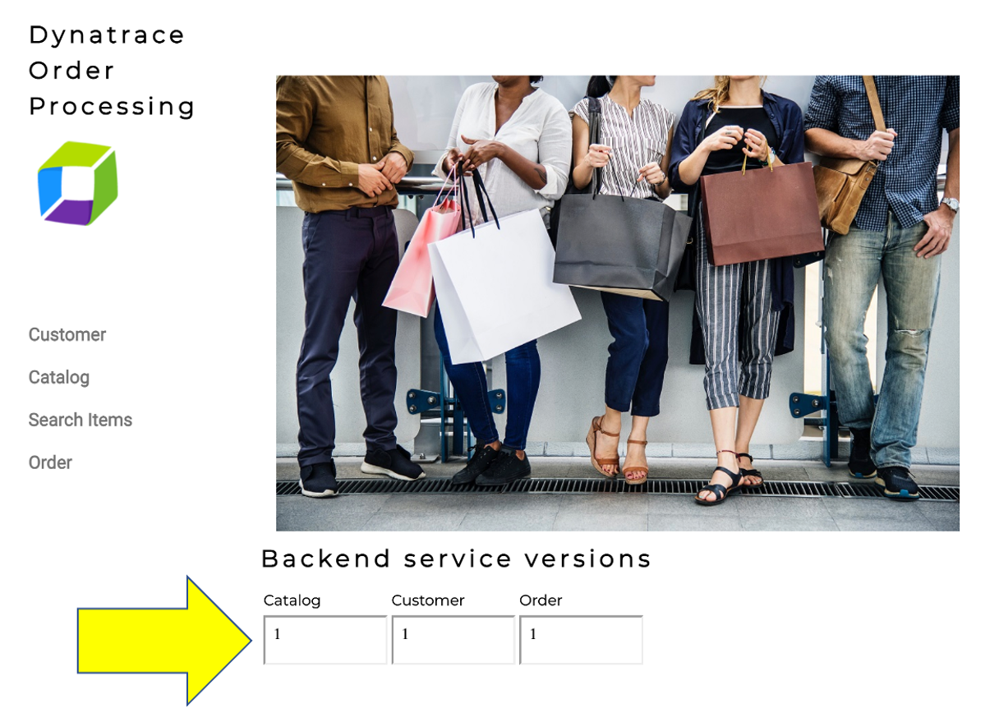
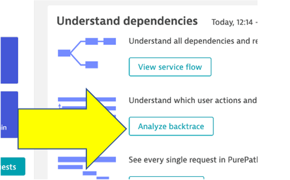

summary: Lab 7 Dynatrace Workshop on Azure
id: azure-lab7
categories: modernization,all
tags: azure
status: Published
authors: Jay Gurbani
Feedback Link: https://github.com/dt-alliances-workshops/learn-site-content

# Azure Workshop Lab 7 - Modernization with Containers

## Objectives of this Lab
Duration: 2

🔷 Review how the sample app went from monolith to microservices

🔷 Examine the transformed application using serviceflows and backtraces 

<aside class="positive"> 

💥💥💥 **Notice** 💥💥💥

  This is an alternative version to Azure Lab 2 - Modernization with AKS.  This lab uses containers instead of Azure Kubernetes Service. 

 If you would rather NOT provision Kubernetes on Azure, then please follow this lab. This guide has a shorter setup process but, still allows you to interact with the sames transformed application.
</aside>

## Review Modernization on a VM
Duration: 5

Re-hosting (also referred to as lift and shift) is a common migration use case. Re-architecture and Re-platform are steps that break the traditional monolithic architectures and replace individual components with cloud services. These steps can also replace newly-developed microservices, including containerized or serverless.

We just learned how we can get great information on services, processes and user requests using Dynatrace and OneAgent. This helps us now decide what individual features or complete applications based on business benefits we need to migrate and modernize. The idea here is to focus on feature-based business benefit with functional migration.

### Modernize the Sample App 

As we saw earlier, the sample application is a three-tiered application --> frontend, backend, database.

For our lab, another version of the application exists that breaks out each of these backend services into separate services. By putting these services into Docker images, we gain the ability to deploy the service into modern platforms like Kubernetes and Cloud managed services such as the ones shown below.

### Beyond the Lab

Over time, you can imagine that this sample application will be further changed to add in other technologies like [Azures serverless](https://azure.microsoft.com/en-us/solutions/serverless/) and other PaaS services like [Azure SQL](https://docs.microsoft.com/en-us/azure/azure-sql/database/) or [Cosmo DB](https://docs.microsoft.com/en-us/azure/cosmos-db/) databases and virtual networking [Application gateway](https://docs.microsoft.com/en-us/azure/application-gateway/) as shown in the picture below. 

### 💥 **TECHNICAL NOTE**

_We will not cover this, but organizations are establishing DevOps approaches and establishing Continuous Integration (CI) pipelines to build and test each service independently. Then adding Continuous Deployment (CD) to the process too that vastly increase our ability to delivery features faster to our customers.  Dynatrace has a number of solutions to support DevOps that you can read about [here](https://www.dynatrace.com/solutions/devops/)_

## Review Lab Environment Setup
Duration: 3

Refer to the picture below, here are the components for lab 5.

**#1 . Sample Application**

Sample app representing a "services" architecture of a frontend and multiple backend services implemented as Docker containers that we will review in this lab.

**#2 . Load generator process**

A docker processes that sends simulated user traffic to the sample app using [Jmeter](https://github.com/dt-orders/load-traffic) run within a Docker container.  You will not need to interact with this container, it just runs in the background.

**#3 . Dynatrace monitoring**

The Dynatrace OneAgent has been installed by the workshop provisioning scripts and is communicating to your SaaS Dynatrace tenant.

**#4 . Azure monitoring**

In addition to monitoring your Azure workloads using OneAgent, Dynatrace provides [integration](https://www.dynatrace.com/support/help/technology-support/cloud-platforms/microsoft-azure-services/set-up-integration-with-azure-monitor/) with Azure Monitor which adds infrastructure monitoring to gain insight even into serverless application scenarios.

The integration uses Azure Monitor metrics for service insights, as well as Azure Resource Manager (ARM) to gather metadata.

We will not have them configured for the lab, see the [Dynatrace Docs](https://www.dynatrace.com/support/help/technology-support/cloud-platforms/microsoft-azure-services/supporting-services/) for complete list of Azure Supported services.

**#5 . Azure monitor Dashboard**

This out of the box dashboard gives insights or Azure monitor metrics to each configured Azure subscription.

## Access the sample application
Duration: 5

- As you did in lab 1, open up Azure console and open up the Virtual Machine page.  You can use the search feature as shown below.

    

- Once on the Virtual Machine page, click on the VM named `dt-orders-services`.  Explore details about this VM, but you want to copy the public IP as shown below.

    

- To view the application, copy the public IP into a browser that will look like this.

### 💥 **TECHNICAL NOTE**
_One difference you will see is the a dynamic list for the backend services versions.  We will refer to this again later in the labs._

## Review Sample App Service Flow 
Duration: 5

- Let’s now take a look at all the services being monitored by clicking on the `Transactions and services` left side Dynatrace menu.
- In the management zone drop down, choose `dt-orders-services`. The filtered list should now look like this:

    

- Choose the `frontend` service.

### Analyze serviceflow

- Now that we are back on the frontend service, lets look at the service flow to see whats different now.  Just click on the `view service flow` button to open this.

    

### Response time perspective

- You should now be on the `Service flow` page.

- Right away, we can see how this application is structured:  
    * Frontend calls order, customer, and catalog service
    * Order service calls order and customer service

- Something you would never know from the application web UI !

    

- Refer to the picture above:
    1. We are viewing the data from a `Response time perspective`. Shortly, we will review the `Throughput perspective`.
    1. Click on the boxes to expand the response time metrics. We can see that most of the response time, most of the time is spent in the `order` service and the least in the `customer` services.  And as in the simple version of the application, a very small amount of the response time is spent in the databases. 

### Throughput perspective

- Refer to the picture above:
    1. Change to the `Throughput perspective` by clicking on the box
    1. Click on the boxes to expand the metrics to see the number of requests and average response times going to each service

    ### 👍 How this helps
    - Review architecture before and after changes is now as easy as a few clicks !

## Analyze Service Backtrace
Duration: 5

Let’s now take a look at the transactions and Services by clicking on the `Transactions and services` left side Dynatrace menu.

- In the management zone drop down, choose `dt-orders-services` and pick the `catalog` service.

    

- To see the backtrace page, just click on the `Analyze Backtrace` button.

    

- You should be on the service backtrace page where you will see information for this specific service.
- This will get more interesting in the next lab, but for the modernized backend, we can see that the backtrace is as follows:
    1. The starting point is the `catalog` service
    1. `catalog` is called by the `order` service
    1. `catalog` is called by the `frontend` service
    1. You may also see browser traffic to the `frontend` from the `My web application`.  If you don't that is OK.

    

    ### 👍 How this helps
    The `service flow` and `service backtrace` give you a complete picture of interdependency to the rest of the environment architecture at host, processes, services, application perspectives. 

## Summary
Duration: 5

While migrating to the cloud, you want to evaluate if your migration goes according to the plan, whether the services are still performing well or even better than before, and whether your new architecture is as efficient as the blueprint suggested. Dynatrace helps you validate all these steps automatically, which helps speed up the migration and validation process.

Having the ability to understand service flows enables us to make smarter re-architecture and re-platforming decisions.  With support for new technologies like Kubernetes, you have confidence to modernize with a platform that span the old and the new. 

### Checklist

In this section, you should have completed the following:

🔷 Review how the sample app went from monolith to microservices
🔷 Examine the transformed application using serviceflows and backtraces 