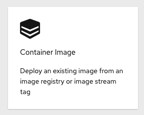

summary: Lab 0 Openshift 4 101 w/Dynatrace Introduction
id: redhat-lab0
categories: 
tags: openshift
status: Published
authors: Michael Villiger
Feedback Link: https://github.com/dt-alliances-workshops/claat-mockup

# Lab 0 Openshift 4 101 w/Dynatrace Introduction

## Welcome and Prerequisites


### Description 

This workshop will have you deploying and creating native docker images for a Node.js based website and learning to leverage the power of OpenShift 4 to build, deploy, scale, and automate. Additionaly, you will learn how to monitor the applications through the deployment of the Dynatrace Operator.

### Who should attend

- Anyone who has had any exposure to Containers
- Architects
- Developers
- Technical leads
- Operations Engineers


### What you will learn

- Enabling Dynatrace Operator and integration with Kubernetes events
- S2I
- Rollback Replication and Recovery
- Using Labels
- Blue/Green Deployment


### Introduction
Welcome to the workshop! This particular workshop will have you deploying with native docker images as well as using OpenShift to create docker images for a Node.js based website. You will also be leveraging the power of OpenShift to build, deploy, scale, and automate. In addition a Dynatrace OneAgent Operator will be installed and configured to show off the power of using Application Performance Mangement.

If you are on-site with us, the instructor will walk you through and kick off each lab.  Otherwise, if you're running this on your own, just go through the list of labs below in order (as some build off of each other).


### We require every attendee to:
* This workshop is done entirely through the browser, but you do need a free personal GitHub account.
* Please use a browser that allows javascript to communicate with Dynatrace. Brave browser does not work, but Chrome and Firefox do.
* Be able to run basic [Unix commands](http://mally.stanford.edu/~sr/computing/basic-unix.html)

### Create a Github account
If you don't have a personal GitHub account please follow the below steps to create an account and optionally fetch the git cli:

* [Create GitHub Account](https://github.com/join?source=header-home)
* [Download Git Client (optional)](https://git-scm.com/downloads)

* Please **ASK QUESTIONS** and **INTERACT**

## Welcome to OpenShift and Dynatrace!
This lab provides a quick tour of the console to help you get familiar with the user interface along with some key terminology we will use in subsequent lab content.  If you are already familiar with the basics of OpenShift simply ensure you can login and create the project.

### What is OpenShift?

OpenShift provides a consistent application development and deployment platform, regardless of the underlying infrastructure, and provides operations teams with a scalable, secure, and enterprise-grade application platform and unified container and cloud management capabilities.

### What is Dynatrace?


Dynatrace is a holistic software intelligence platform that identifies, monitors and optimizes application performance, IT infrastructure and User experience for large organizations.​

​Dynatrace brings together a single source of truth across Operations, Development, Security and Business Intelligence. ​

Undergirded by key inputs that include what you expect; (Traces, Metrics and Logs) AND key intelligence derived in real time from ongoing learning about the topology, user behaviour, code, metadata and the network AND Levering inputs from CloudWatch and API integrations from opensource tools such as OpenTelemetry and Keptn.​

The platform integrates to and interconnects with over 560 supported technologies.​
### Key Terms
We will be using the following terms throughout the workshop labs so here are some basic definitions you should be familiar with.  You'll learn more terms along the way, but these are the basics to get you started.

* Container - Your software wrapped in a complete filesystem containing everything it needs to run
* Image - We are talking about docker images; read-only and used to create containers
* Image Stream - An image stream comprises one or more Docker images identified by tags. 
* Pod - One or more docker containers that run together
* Service - Provides a common DNS name to access a pod (or replicated set of pods)
* Project - A project is a group of services that are related logically
* Deployment - an update to your application triggered by a image change or config change
* Build - The process of turning your source code into a runnable image
* BuildConfig - configuration data that determines how to manage your build
* Route - a labeled and DNS mapped network path to a service from outside OpenShift
* Master - The foreman of the OpenShift architecture, the master schedules operations, watches for problems, and orchestrates everything
* Node - Where the compute happens, your software is run on nodes
* Operator - A method of packaging, deploying, and managing a Kubernetes-native application.

###############################

## Accessing OpenShift through the Web Console
OpenShift provides a web console that allows you to perform various tasks via a web browser.

### Let's Login to the Web Console

1. Use your browser to navigate to the URI provided by your instructor and login with the user/password provided.

    ```bash
    "https://console-openshift-console.apps.example.alliances.dynatracelabs.com"
    ```

    
    *Login Webpage*

1. Once you are logged in you should see the overview page for your cluster:

    
    *Administrator Default View*

### This is what an empty project looks like
First, let's create a new project to run a terminal application that we'll use for the rest of the workshop.

1. Click on "Projects" then the "Create Project" button and give it a name of terminal

1. Populate "Name" with "terminal" and populate the "Display Name" and "Description" boxes with whatever you like.  Click on "Create" to create the project.

    

1. This is going to take you to the next logical step of adding something to the project but we don't want to do that just yet.

### Let's deploy Butterfly (Browser-based SSH)

First, we need to change views from the "Administrator" view to the "Developer" view. There is a pop-up menu in the top left corner of the screen just below the menu (three horizontal lines) button.


1. Click "Administrator" and change it to "Developer"

    

1. Click "+Add" to add a new item to the project

    

1. Click "Container Image" to add an existing image from the container registry

    

1. In the dialog box under the default radio button "Image name from external registry", enter "quay.io/openshifthomeroom/workshop-terminal".  The image should be "Validated" when found.

    

1. Observe the default values that are populated in the search results.

    

1. Click "Create"


1. You will now see a screen that shows a thumbnail view of your deployed application. Click on "D workshop-termin..." to expand the screen and see the details of the running pod:

    
    
    "Topology"

### Test out the Butterfly webapp

1. Notice that in the web console overview, you now have a URL in the service box.  You can see the webapp running by clicking the exposed route.

    

1. After clicking on the URLa new browser window should open placing you into a terminal session.

    

1. Now, type the command `oc`.

## Accessing OpenShift through the CLI
In addition to the web console we previously used, you can utilize a command line tool to perform tasks.

### Using the command line (CLI)

1. Use your existing Butterfly terminal login following command:

    ```bash
    $ oc login
    ```

1. Using the same username/password combination as before, finish authenticating to the CLI

    ```bash
    Authentication required for https://console-openshift-console.apps.example.alliances.dynatracelabs.com (openshift)
    Username: kubeadmin
    Password:
    Login successful.
    ```

1. Check to see what projects you have access to:

    ```bash
    $ oc get projects
    ```
    _You will see ~64 projects including the "terminal-0" project_

### Use the CLI to create a new project

1. Use the CLI to create and use a new project by typing the following command to create and use the project "demo-0"

    ```bash
    $ oc new-project demo-0
    ```
1. Type the following command to show services, deployment configs, build configurations, and active deployments (this will come in handy later):

    ```bash
    $ oc status
    ```

### Summary

# You should now be ready to get hands-on with our workshop labs.    


