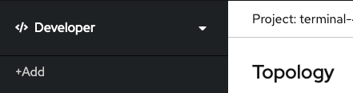

summary: Lab 1 Openshift 4 101 w/Dynatrace BYO Container Overview
id: redhat-lab1
categories: modernization
tags: openshift
status: Published
authors: Michael Villiger
Feedback Link: https://github.com/dt-alliances-workshops/claat-mockup

# Lab 1 Openshift 4 101 w/Dynatrace BYO Container Overview

## Bring your own docker
It's easy to get started with OpenShift whether you're using our app templates or bringing your existing assets.  In this quick lab we will deploy an application using an exisiting container image.  OpenShift will create an image stream for the image as well as deploy and manage containers based on that image.  And we will dig into the details to show how all that works.

In this and other labs you'll have the option of choosing to use the CLI or the Web Console. Please choose one, but not both as the steps are repeated.

## CLI Steps (Optional)

### Let's point OpenShift to an existing built container image

Verify you're still in the project we created at the end of the last lab by going to the terminal and typing the following:  

```bash
$ oc projects
```

You should see something *similar* in the last line of the output:

```bash
$ Using project "demo-0" on server "https://172.30.0.1:443".
```

If you don't, use the following command to use the correct project:

```bash
$ oc project demo-0
```

In the terminal and type the following:

```bash
$ oc new-app sonatype/nexus:oss
```

The output should show something *similar* to below:

```bash
--> Found container image ae52f07 (4 months old) from Docker Hub for "sonatype/nexus:oss"

    Red Hat Universal Base Image 7
    ------------------------------
    The Universal Base Image is designed and engineered to be the base layer for all of your 
containerized applications, middleware and utilities. This base image is freely redistributable, 
but Red Hat only supports Red Hat technologies through subscriptions for Red Hat products. 
This image is maintained by Red Hat and updated regularly.

    Tags: base rhel7

    * An image stream tag will be created as "nexus:oss" that will track this image

--> Creating resources ...
    imagestream.image.openshift.io "nexus" created
    deployment.apps "nexus" created
    service "nexus" created
--> Success
    Application is not exposed. You can expose services to the outside world by executing one or 
more of the commands below:
     'oc expose svc/nexus'
    Run 'oc status' to view your app.  
```

Now, let's create a route, so that you can get to the app:

```bash
$ oc expose svc/nexus
```

## Web Console Steps (Optional)

### Let's point OpenShift to an existing built container image

1. Switch to "Developer" mode, by clicking on the menu, in the top left corner, where it says "Administrator", and pick "Developer"

    
1. Switch to "Project: demo-0", by clicking on the menu, in the top left, where it says "Project" and pick "demo-0"

    
1. Click "+Add"

    
1. Click "Container Image", to add an existing image from the container registry

    
1. Select the option for "Image name from external registry" and enter "sonatype/nexus:oss", then ensure that the image is validated.

    
1. Select the option "Create Application" for the Application dropdown and supply the Application name "nexus"

Enter the values as shown in the table below:
<table>
<tr><td><b>Application Name</b></td><td>nexus-app</td></tr>
<tr><td><b>Name</b></td><td>nexus</td></tr>
<tr><td><b>Resources</b></td><td>Deployment Config</td></tr>
<tr><td><b>Create a route to the application</b></td><td>Checked</td></tr>
</table>

Click "Create"

## Summary
In this lab you've deployed an example container image, pulled from Quay.io, into a pod running in OpenShift.  You exposed a route for clients to access that service via thier web browsers.  And you learned how to get and describe resources using the command line and the web console.  Hopefully, this basic lab also helped to get you familiar with using the CLI and navigating within the web console.

