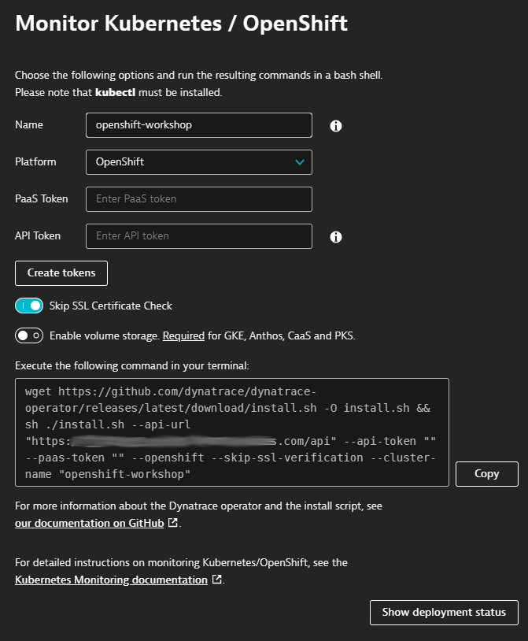
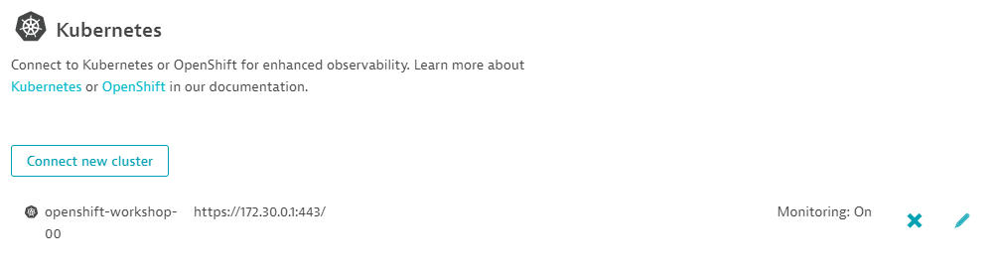

summary: Lab 2 Openshift 4 101 w/Dynatrace OpenShift Observability
id: redhat-lab2
categories: modernization
tags: openshift
status: Published
authors: Michael Villiger
Feedback Link: https://github.com/dt-alliances-workshops/claat-mockup

# Lab 2 Openshift 4 101 w/Dynatrace OpenShift Observability

## Deploying Dynatrace OpenShift Observability

One key Dynatrace advantage is ease of activation. OneAgent technology simplifies deployment across large enterprises and relieves engineers of the burden of instrumenting their applications by hand. As OpenShift adoption continues to grow it becomes more important than ever to simplify the activation of observability across workloads without sacrificing the deployment automation that OpenShift provides. Observability should be as cloud-native as OpenShift itself.

In our workshop, we will install the Dynatrace Operator that streamlines lifecycle management.  You can read more about it here in this [Dynatrace blog](https://www.dynatrace.com/news/blog/new-dynatrace-operator-elevates-cloud-native-observability-for-kubernetes/). Additionally we will configure ingestion of Kubernetes events and view this information in the Dynatrace UI.

## Deploying Dynatrace Operator

Organizations will often customize the Dynatrace Operator installation and you can read more about the options in the [Dynatrace docs](https://www.dynatrace.com/support/help/technology-support/container-platforms/kubernetes/monitor-kubernetes-environments/) but, we are going to use a single command that we can get from the Dynatrace interface to show how easy it is to get started.

When we run this command, it will do the following:
* Create a namespace called `dynatrace` in your cluster will the Dynatrace Operator pods
* Set the OneAgent on each of the cluster nodes as to provide full-stack Dynatrace monitoring
* Create a Kubernetes dashboard that will be populated with the Kubernetes data pulled from the API
* Setup a Dynatrace ActiveGate that runs as a container in the `dynatrace` namespace that is used in the polling of Kubernetes API
* Enable preset out-of-the-box Kubernetes dashboards

### Install Dynatrace Operator

1. To navigate to OpenShift/Kubernetes page, follow these steps and refer to the picture below:

    1. Within Dynatrace, click on the `Deploy Dynatrace` menu item.
    1. Click on the `Start Installation` button
    1. Click on the `OpenShift` button

    

1. To get the Dynatrace Operator installation command, refer to the steps and pictures below:

    1. On the Kubernetes configuration page, enter `openshift-workshop` for the name. This is not the cluster name, it will show up as the Kubernetes page name in Dynatrace
    1. Click the `Create tokens` button
    1. Select the `Skip SSL Certificate Check` to be ON
    1. Click the `Copy` button

    

1. Paste the command in Butterfly console and run it

1. Once the script is complete, then monitor the installation until you all pods are in `Running` state.

    ```
    oc -n dynatrace get pods
    ```

    Rerun the command (or use watch: `oc -n dynatrace get pods -w`) until the output looks like this:

    ```
    NAME                                  READY   STATUS    RESTARTS   AGE
    dynakube-classic-2rk9z                1/1     Running   0          2m14s
    dynakube-classic-4tlcj                1/1     Running   0          2m14s
    dynakube-classic-lz7r6                1/1     Running   0          2m14s
    dynakube-classic-m7z87                1/1     Running   0          2m14s
    dynakube-classic-tzcsl                1/1     Running   0          2m14s
    dynakube-classic-wm2h6                1/1     Running   0          2m14s
    dynakube-kubemon-0                    1/1     Running   0          2m22s
    dynakube-routing-0                    1/1     Running   0          2m14s
    dynatrace-operator-7cf8964786-7m9k2   1/1     Running   0          3m1s
    ```

## Dynatrace Kubernetes Events Ingest

Dynatrace Kubernetes Events Ingest is a Dynatrace feature for Kubernetes that allows you to receive events from your cluster within Dynatrace. This allows you to accurately track Kubernetes events within the context of other activities in the cluster and can supply DAVIS with additional context around problems in your cluster provoding for more accurate root cause analysis.

1. Within the Dynatrace Kubernetes Overview screen, select "Enable Kubernetes events visibility". (This can also be accessed via Settings->Cloud and virtualization->Kubernetes)

      
1. Click the pencil next to the X to edit the Dynatrace configuration for your workload cluster.

    
1. Enable "Monitor Events" and then enable "Opt in to the Kubernetes events feature" as well as "Include al levents relevant for Davis"

    
1. Click the "Save" button.

1. As our cluster is likely healthy, we might not immediately see any events within the Dynatrace kubernetes overview. 

1. Should we wish to see additional events, you can enable additional events ingest by adding an additional events field selector

1. From the Kubernetes configuration screen, click the "Add events field selector" button.

1. Supply a name for the events field selector. Here we will use "Warning events"

1. Supply a field selector expression. Here we will use "type=Warning"

1. Click the "Activate" button.

1. Click the "Save" button.

1. After some time, if there are events matching our field selectors we should see events within the Dynatrace Kubernetes overview screen.

    
