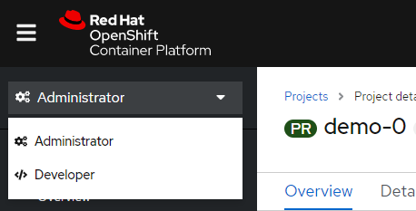

summary: Lab 3 Openshift 4 101 w/Dynatrace Deploying an App with S2I
id: redhat-lab3
categories: modernization
tags: openshift
status: Published
authors: Michael Villiger
Feedback Link: https://github.com/dt-alliances-workshops/claat-mockup

# Lab 3 Openshift 4 101 w/Dynatrace Deploying an App with Source-To-Image (S2I)

## Deploying an App with Source-To-Image (S2I)

### Source to Image (S2I)
One of the useful components of OpenShift is its source-to-image capability.  S2I is a framework that makes it easy to turn your source code into runnable images.  The main advantage of using S2I for building reproducible docker images is the ease of use for developers.  You'll see just how simple it can be in this lab.

### Let's build a node.js web app, using S2I
We can do this either via the command line or the web console.  You decide which you'd rather do and follow the steps below.

## CLI Steps (Optional)


1. Goto the terminal and type the following:

    ```bash
    $ oc new-project metro-map
    $ oc new-app --name=dc-metro-map https://github.com/RedHatGov/openshift-workshops.git --context-dir=dc-metro-map
    $ oc expose service dc-metro-map
    ```

    #### 💥 **TECHNICAL NOTE**

    _When using the CLI, OpenShift automatically detects the source code type and select the nodejs builder image._

### Check out the build details
We can see the details of what the S2I builder did.  This can be helpful to diagnose issues if builds are failing.

#### 💥 **TECHNICAL NOTE**
_TIP: For a node.js app, running "npm shrinkwrap" is a good practice to perform on your branch before releasing changes that you plan to build/deploy as an image with S2I_

### Viewing build details

1. Goto the terminal and type the following:

    ```bash
    $ oc get builds
    ```

1. Note the name of your build from the above command output and use it to see the logs with:

    ```bash
    $ oc logs builds/[BUILD_NAME]
    ```

The console will print out the full log for your build.  Note, you could pipe this to more or less for easier viewing in the CLI.

### See the app in action
Let's see this app in action!

1. Goto the terminal and type the following:

    ```bash
    $ oc get routes
    ```

1. Copy the HOST/PORT and paste into your favorite web browser:

1. The app should look like this in your web browser:

    

## Web Console Steps (Optional)
1. Switch to administrator mode, if you're not already there

    
1. Click on "Projects" then the "Create Project" button and give it a name of metro-map

    
1. Switch to developer mode and select the project metro-map if it did not take you there automatically

    
1. Click "+Add"

    
1. Click "From Git"

    
1. Fill out the "Git Repo URL" field as follows:

    <table>
    <tr><td><b>Git Repo URL</b></td><td><a href>https://github.com/RedHatGov/openshift-workshops.git</a></td></tr>
    </table>

    
1. Ensure that the repository is validated (as shown above)

1. Click on the "Show Advanced Git Options" expender

    


1. Fill out the "Context Dir" field as follows:

    <table>
    <tr><td><b>Context Dir</b></td><td>dc-metro-map</td></tr>
    </table>
    #### 💥 **TECHNICAL NOTE**
    _Do NOT include a leading / or the build will fail!_

1. Under "Builder", click click on the "Node.js" icon

    
1. Select Node.js 12 UBI7 (12-ubi7) in the Builder Image version

    
1. Fill out the fields, under "General" as follows:

    <table>
    <tr><td><b>Application</b></td><td>Create Application</td></tr>
    <tr><td><b>Application Name</b></td><td>dc-metro-map</td></tr>
    <tr><td><b>Name</b></td><td>dc-metro-map</td></tr>
    </table>

1. Choose "Deployment Configuration" 

    
1. Scroll to the bottom and click "Create"


### Check out the build details
We can see the details of what the S2I builder did.  This can be helpful to diagnose issues if builds are failing.

#### 💥 **TECHNICAL NOTE**
_For a node.js app, running "npm shrinkwrap" is a good practice to perform on your branch before releasing changes that you plan to build/deploy as an image with S2I_

### Viewing build details

1. Click on "Topology", the "node"/"dc-metro-map" icon, then Resources, and then on "View logs"

    
1. You should see a log output similar to the one below:

    

### See the app in action
Let's see this app in action!

1. Click on "Topology"

    
1. Click the arrow, at the top right corner of the "dc-metro-map" icon, to launch a new tab/window, with the running app

    


