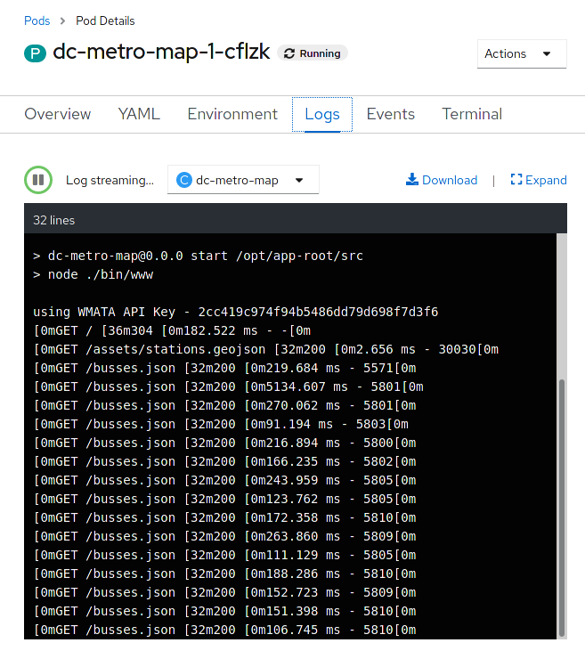
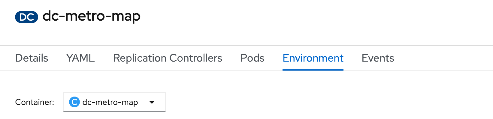
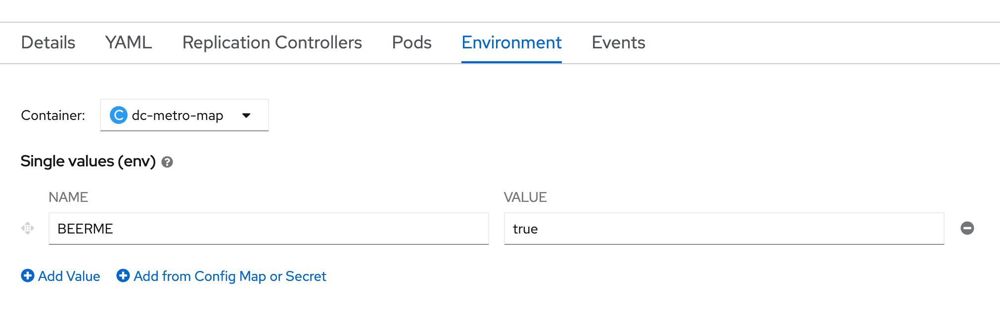

summary: Lab 4 Openshift 4 101 w/Dynatrace Developing and Managing Your Application
id: redhat-lab4
categories: modernization
tags: openshift
status: Published
authors: Michael Villiger
Feedback Link: https://github.com/dt-alliances-workshops/claat-mockup

# Lab 4 Openshift 4 101 w/Dynatrace Developing and Managing Your Application

## Developing and Managing Your Application

### Developing and managing an application in OpenShift
In this lab we will explore some of the common activities undertaken by developers working in OpenShift.  You will become familiar with how to use environment variables, secrets, build configurations, and more.  Let's look at some of the basic things a developer might care about for a deployed app.

### Setup
From the previous lab you should have the DC Metro Maps web app running in OpenShift.  

## CLI Steps (Optional)

### See the app in action and inspect some details
OpenShift provides traceability for your running deployment, back to the container image, and the registry that it came from. Additionally, images built by OpenShift are traceable back to the exact [branch](https://help.github.com/en/github/collaborating-with-issues-and-pull-requests/about-branches) and [commit](https://help.github.com/en/github/getting-started-with-github/github-glossary#commit). Let's take a look at that!


- Goto the terminal and type the following:

    ```bash
    $ oc status
    ```

    This is going to show the status of your current project.  In this case it will show the dc-metro-map service (svc) with a nested deployment config(also called a "DC") along with some more info that you can ignore for now.  
    
    _A deployment in OpenShift is a replication controller based on a user defined template called a deployment configuration_


The dc provides us details we care about to see where our application image comes from, so let's check it out in more detail.

- Type the following to find out more about our dc:

    ```bash
    $ oc describe deploymentconfig/dc-metro-map
    ```
    _Notice under the template section it lists the containers it wants to deploy along with the path to the container image._


There are a few other ways you could get to this information.  If you are feeling adventurous, you might also want to try to:

1. describe the replication controller
    - ```oc describe rc -l app=dc-metro-map```
1. describe the image stream
    - ```oc describe is -l app=dc-metro-map```
1. describe the running pods
    - ```oc describe pod```

Because we built this app using S2I, we get to see the details about the build - including the container image that was used for building the source code.  So let's find out where the image came from.  Here are the steps to get more information about the build configuration (bc) and the builds themselves:

- Type the following to find out more about our bc:

    ```bash
    $ oc describe bc/dc-metro-map
    ```
    _Notice the information about the configuration of how this app gets built.  In particular look at the github URL, the webhooks you can use to automatically trigger a new build, the docker image where the build runs inside of, and the builds that have been completed._

New let's look at one of those builds:

- Type the following:

    ```bash
    $ oc describe build/dc-metro-map-1
    ```

    This shows us even more about the deployed container's build and source code, including exact commit information, for this build.  We can also see the commit's author, and the commit message.  You can inspect the code by opening a web browser and pointing it to a specific commit, like this:

    https://github.com/RedHatGov/redhatgov.github.io/commit/2d5078cc5bbdf3cf63c5ab15e1628f30b3c89954

### Pod logs
In the S2I lab we looked at a build log to inspect the process of turning source code into an image.  Now let's inspect the log for a running pod - in particular let's see the web application's logs.

1. Goto the terminal and type the following:

    ```bash
    $ oc get pods
    ```
    This is going to show basic details for all pods in this project (including the builders).  Let's look at the log for the pod running our application.  Look for the POD NAME that that is "Running" you will use it below.

1. Goto the terminal and type the following (replacing the POD NAME with your pod's name):

    ```bash
    $ oc logs [POD NAME]
    ```
    You will see in the output details of your app starting up and any status messages it has reported since it started.

    _You can see more details about the pod itself with ```oc describe pod/<POD NAME>```_


### How about we set some environment variables?
Whether it's a database name or a configuration variable, most applications make use of environment variables.  It's best not to bake these into your containers because they do change and you don't want to rebuild an image just to change an environment variable.  Good news!  You don't have to.  OpenShift let's you specify environment variables in your deployment configuration and they get passed along through the pod to the container.  Let's try doing that.


Let's have a little fun.  The app has some easter eggs that get triggered when certain environment variables are set to 'true'.

1. Goto the terminal and type the following:

    ```bash
    $ oc set env deploymentconfig/dc-metro-map -e BEERME=true
    ```

1. and then

    ```bash
    $ oc get pods -w
    ```

Due to the deployment config strategy being set to "Rolling" and the "ConfigChange" trigger being set, OpenShift auto deployed a new pod as soon as you updated the environment variable.  If you were quick enough, you might have seen this happening, with the ```oc get pods -w```  command

- Type Ctrl+C to stop watching the pods

_You can set environment variables, across all deployment configurations, with 'dc --all', instead of specifying a specific DC._

## Web Console Steps (Optional)


### See the app in action and inspect some details
OpenShift provides traceability for your running deployment, back to the container image, and the registry that it came from. Additionally, images built by OpenShift are traceable back to the exact [branch](https://help.github.com/en/github/collaborating-with-issues-and-pull-requests/about-branches) and [commit](https://help.github.com/en/github/getting-started-with-github/github-glossary#commit). Let's take a look at that!


1. Change modes to "Administrator", and then click on "Workloads", and "Deployment Configs".

    
1. Click on "dc-metro-map", under "Name", and check out the details of the deployment

    
1. Within the deployment for the dc-metro-map is a container summary that shows the detailed registry, container reference, and hash information, for the container that was deployed.

    
1. Click on "Builds", and then "Image Streams", in the left-side menu.

    
1. Click on the "dc-metro-map" image stream, to see its details.

    
1. You should see something like what is shown, below.

    
1. Click "Builds" and then "Builds", in the left-side menu, to get back to the build summary

    
1. Click "dc-metro-map-1" to see the build details

    


Because we built this app using S2I, we get to see the details about the build - including the container image that was used for building the source code.  Note that you can kick-off a rebuild here if something went wrong with the initial build and you'd like to attempt it again.

_Notice that, in the "Git Commit" section, you can see the comment from the last commit when the build was started, and you can see the that commit's author._


### Pod logs
In the S2I lab we looked at a build log to inspect the process of turning source code into an image.  Now let's inspect the log for a running pod - in particular let's see the web application's logs.

- Click on "Workloads" and then click on "Pods"

    

    This is going to show basic details for all pods in this project (including the builders). If you had a build failure or something similar earlier, you might see a pod that is in a error or failed state with a pod in the running state as shown in the screenshot below.

    

Next let's look at the log for the pod running our application.

1. Click the pod that starts with "dc-metro-map-"

    Here you see the status details of your pod as well as its configuration.  Take a minute here and look at what details are available.

    
1. Click the "Logs" button

    
    Now you can see, in the output window, the details of your app starting up, and any status messages that it has reported since it started.

### How about we set some environment variables?
Whether it's a database name or a configuration variable, most applications make use of environment variables.  It's best not to bake these into your containers because they do change and you don't want to rebuild an image just to change an environment variable.  Good news!  You don't have to.  OpenShift let's you specify environment variables in your deployment configuration and they get passed along through the pod to the container.  Let's try doing that.


1. Click on "Workloads", and last, click on "Deployment Configs", in the left-side menu.
    This is going to show basic details for all build configurations in this project

1. Click the "dc-metro-map" build config.
1. Click the "Environment" tab next to the "Pods" tab .

    
    This opens up a tab with the environment variables for this deployment config.

1. Add an environment variable with the name BEERME and a value of 'true'

    
1. Click "Save"

If you are quick enough, you will see a new pod spin up, and the old pod spin down.  This is due to the deployment config strategy being set to "Rolling", and having a "ConfigChange" trigger. Thus, OpenShift auto deployed a new pod as soon as you updated with the environment variable.


With the new environment variables set the app should look like this in your web browser (with beers instead of busses):


### Getting into a pod
There are situations when you might want to jump into a running pod, and OpenShift lets you do that pretty easily.  We set some environment variables, in this lab, so let's jump onto our pod to inspect them.  

1. Click on "Workloads" and then click on "Pods"

1. Click the pod that starts with "dc-metro-map-" and has a status of Running

1. Click the "Terminal" button

    

### Let's look for the environment variables we set

Inside the web page's terminal type this:

```bash
$ env | grep BEER
```

That should return **BEERME=true**, matching the value that we set in the deployment config.

## Cleanup and Summary

### Summary
In this lab you've seen how to trace running software back to its roots, how to see details on the pods running your software, how to update deployment configurations, how to inspect logs files, how to set environment variables consistently across your environment, and how to interactively attach to running containers.  All these things should come in handy for any developer working in an OpenShift platform.
