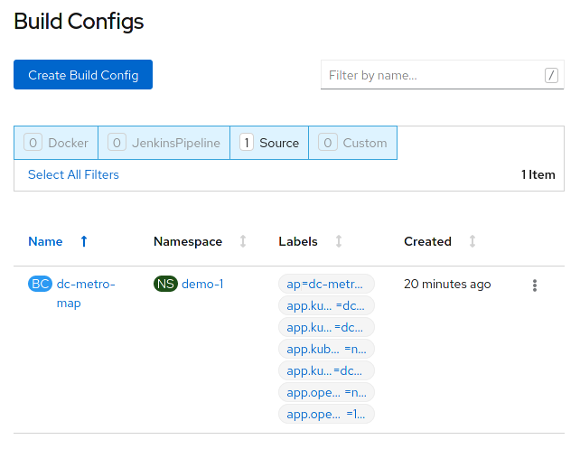

summary: Lab 5 Openshift 4 101 w/Dynatrace Webhooks and Rollbacks (Optional)
id: redhat-lab5
categories: modernization
tags: openshift
status: Published
authors: Michael Villiger
Feedback Link: https://github.com/dt-alliances-workshops/claat-mockup

# Lab 5 Openshift 4 101 w/Dynatrace Webhooks and Rollbacks (Optional)

## Webhooks and Rollbacks

### Build Triggers, Webhooks and Rollbacks - Oh My!
Once you have an app deployed in OpenShift you can take advantage of some continuous capabilities that help to enable DevOps and automate your management process.  We will cover some of those in this lab: Build triggers, webhooks, and rollbacks.


### A bit of configuration
We are going to do some integration and coding with an external git repository.  For this lab we are going to use github, if you don't already have an account, [you can create one here][1].

OK, let's fork the dc-metro-map app from **my** account into **your** github account.  Goto [https://github.com/RedHatGov/openshift-workshops][2] and look to the top right for the "Fork" button.


> Click the "Fork" button

Github should redirect you to the newly created fork of the source code.

### Build Trigger / Code Change Webhook
When using S2I there are a few different things that can be used to [trigger] a rebuild of your source code.  The first is a configuration change, the second is an image change, and the last (which we are covering here) is a webhook.  A webhook is basically your git source code repository telling OpenShift that the code we care about has changed.  Let's set that up for our project now to see it in action.

Jump back to your OpenShift web console and let's add the webapp to our project.  You should know how to do this from previous lab work, but this time point to *your* github URL for the source code.  If you need a refresher follow the steps below or just skip to the next section

<blockquote>
Click the "Add to Project" button
</blockquote>

<br/>
<br>
<blockquote>
Select the "From Git" icon
</blockquote>


Make sure that you replace <b>YOUR_ACCOUNT</b> with your GitHub user ID. Click on the "Show Advanced Git Options" expander to fill in the "Context Dir" field:


<table>
<tr><td><b>Git Repo URL</b></td><td>https://github.com/<b>YOUR_ACCOUNT</b>/openshift-workshops.git</td></tr>
<tr><td><b>Context Dir</b></td><td>dc-metro-map</td></tr>
</table>

<br>

<blockquote>
Select Node.js
</blockquote>


<table>
<tr><td><b>Application Name</b></td><td>dc-metro-map</td></tr>
<tr><td><b>Name</b></td><td>dc-metro-map</td></tr>
</table>


<blockquote>
Select "Deployment Configuration"
</blockquote>

<blockquote>
When you are done, scroll to the bottom and click 'Create'
</blockquote>

## CLI Steps (Optional)

The node.js builder template creates a number of resources for you, but what we care about right now is the build configuration because that contains the webhooks. So to get the URL:

1. Goto the terminal and type the following:
    ```bash
    $ oc get bc/dc-metro-map -o yaml | grep generic-webhook
    ```
1. which returns the name of the secret that we need to find:

    ```bash
    name: dc-metro-map-generic-webhook-secret
    ```

1. Now that you have the name of the secret, you can get its value:

    ```bash
    $ SECRET=`oc get secrets dc-metro-map-generic-webhook-secret -o json | jq -r '.data.WebHookSecretKey' | base64 -d ; echo`
    ```

1. Last, we can get the URL for the webhook, this way:

    ```bash
    $ oc describe bc/dc-metro-map | grep "Webhook Generic" -A 1 | sed "s/<secret>/${SECRET}/"
    ```

1. which results in the information that we need:

    ```bash
    Webhook Generic:
        URL:        https://api.ocptest-alliances.dynatracelabs.com:6443/apis/build.openshift.io/v1/namespaces/demo-0/buildconfigs/dc-metro-map/webhooks/813f423c1d78b005/generic    
    ```

1. Copy the "Webhook Generic" URL to the clipboard, so that we can use it in GitHub.

1. Now switch back over to github 

1. Let's put the webhook URL into the repository. At the main page for this repository (the fork), you should see a tab bar with code, pull requests, pulse, graphs, and settings.

    
1. Click the "Settings" tab

1. Now you will see a vertical list of settings groups.

1. Click the "Webhooks" link

    
1. Click the "Add webhook" button

1. Paste in the URL you copied

1. Disable SSL verification by clicking the button

    
1. Click the "Add webhook" button

Good work! Now any "push" to the forked repository will send a webhook that triggers OpenShift to: re-build the code and image using s2i, and then perform a new pod deployment.  In fact Github should have sent a test trigger and OpenShift should have kicked off a new build already.

### Rollbacks
Well, what if something isn't quite right with the latest version of our app?  Let's say some feature we thought was ready for the world really isn't - and we didn't figure that out until after we deployed it.  No problem, we can roll it back with the click of a button.  Let's check that out:


- Goto the terminal and type the following:

    ```bash
    $ oc rollout undo dc/dc-metro-map
    $ oc get pods -w
    ```
OpenShift has done a graceful removal of the old pod and created a new one.  

#### 💥 **TECHNICAL NOTE**
_Note that the old pod wasn't killed until the new pod was successfully started and ready to be used.  This is so that OpenShift could continue to route traffic to the old pod until the new one was ready._

## Web Console Steps (Optional)

The node.js builder template creates a number of resources for you, but what we care about right now is the build configuration because that contains the webhooks.  So to get the URL:

1. in "Administrator" mode, click on "Builds" and then click on "Build Configs"
    This is going to show basic details for all build configurations in this project

    
1. Click the "dc-metro-map" build config

    
    

    You will see the summary of builds using this build config
1. Scroll to the bottom of the window.

    

    Now you can see the links to get the various secrets.

1. Copy the Generic webhook to the clipboard, by clicking on "Copy URL with Secret"

1. Now switch back over to github 

1. Let's put the webhook URL into the repository. At the main page for this repository (the fork), you should see a tab bar with code, pull requests, pulse, graphs, and settings.

    
1. Click the "Settings" tab

    Now you will see a vertical list of settings groups.

1. Click the "Webhooks" link


    
1. Click the "Add webhook" button

1. Paste in the URL you copied

1. Disable SSL verification by clicking the button

    
1. Click the "Add webhook" button

Good work! Now any "push" to the forked repository will send a webhook that triggers OpenShift to: re-build the code and image using s2i, and then perform a new pod deployment.  In fact Github should have sent a test trigger and OpenShift should have kicked off a new build already.

### Rollbacks
Well, what if something isn't quite right with the latest version of our app?  Let's say some feature we thought was ready for the world really isn't - and we didn't figure that out until after we deployed it.  No problem, we can roll it back with the click of a button.  Let's check that out:

1. Click on "Builds" and then click on "Builds"
This is going to show basic details for all builds, for the dc-metro-map application.

    
1. Click the "dc-metro-map" build that you want to roll back to. For the purposes of this lab, click dc-metro-map-1.

1. Click on 'Actions', and then 'Rebuild', from the menu, in the upper right corner of the window.

    
1. You can go back to the 'Workloads', 'DeploymentConfigs', 'dc-metro-map' page, and click on the 'Events' tab, to see your previous deployment spinning down and your new one spinning up.
    

    OpenShift has done a graceful removal of the old pod and created a new one.  

#### 💥 **TECHNICAL NOTE**
_Note that the old pod wasn't killed until the new pod was successfully started and ready to be used.  This is so that OpenShift could continue to route traffic to the old pod until the new one was ready._

## Summary

In this lab we saw how you can configure a source code repository to trigger builds with webhooks.  This webhook could come from Github, Jenkins, Travis-CI, or any tool capable of sending a URL POST.  Keep in mind that there are other types of build triggers you can setup.  For example: if a new version of the upstream RHEL image changes.  We also inspected our deployment history and did a rollback of our running deployment to one based on an older image with the click of a button.

[1]: https://github.com/join?source=header-home
[2]: https://github.com/RedHatGov/openshift-workshops.git


