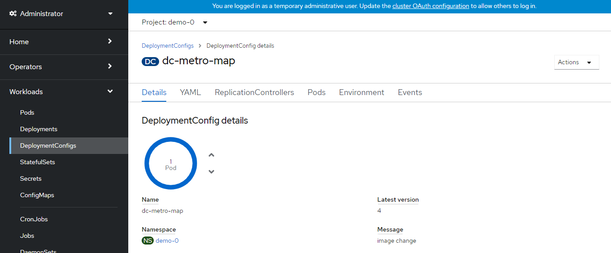
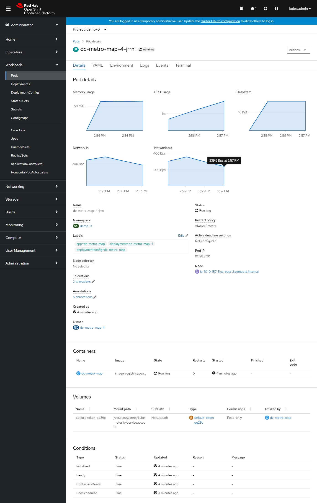
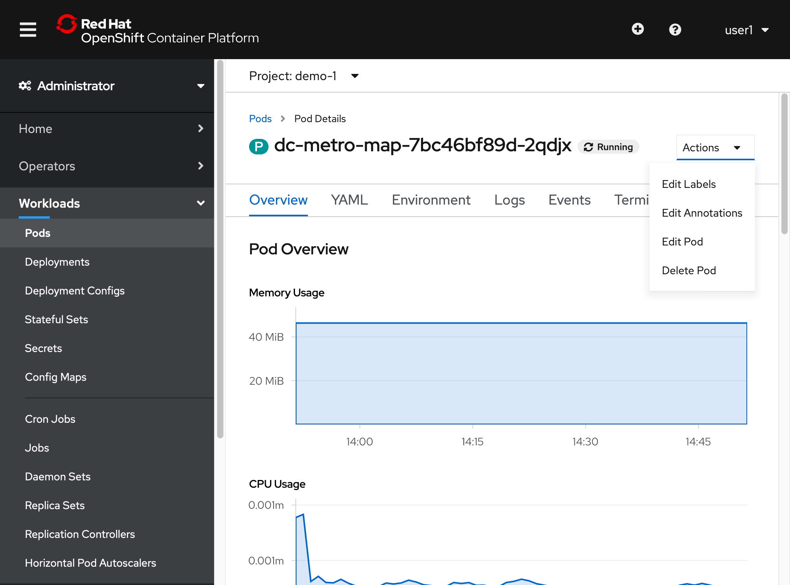
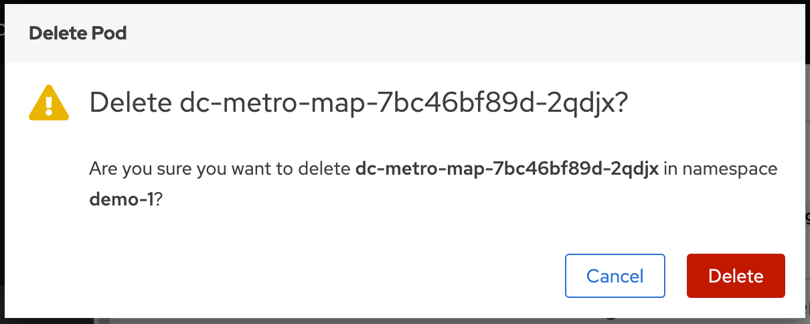
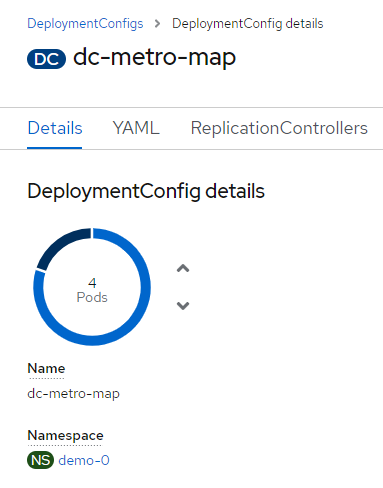

summary: Lab 6 Openshift 4 101 w/Dynatrace Replication and Recovery (Optional)
id: redhat-lab6
categories: modernization
tags: openshift
status: Published
authors: Michael Villiger
Feedback Link: https://github.com/dt-alliances-workshops/claat-mockup

# Lab 6 Openshift 4 101 w/Dynatrace Replication and Recovery (Optional)

## Replication and Recovery

### Things will go wrong, and that's why we have replication and recovery
Things will go wrong with your software, or your hardware, or from something out of your control.  But we can plan for that failure, and planning for it let's us minimize the impact.  OpenShift supports this via what we call replication and recovery.

## CLI Steps (Optional)

### Replication
Let's walk through a simple example of how the replication controller can keep your deployment at a desired state.  Assuming you still have the dc-metro-map project running we can manually scale up our replicas to handle increased user load.


1. Goto the terminal and try the following:

    ```bash
    $ oc scale --replicas=4 dc/dc-metro-map
    ```

1. Check out the new pods:

    ```bash
    $ oc get pods
    ```

    _Notice that you now have 4 unique pods available to inspect.  If you want go ahead and inspect them, using ```oc describe pod/<POD_NAME>```. You can see that each has its own IP address and logs._

So you've told OpenShift that you'd like to maintain 4 running, load-balanced, instances of our web app.

### Recovery
Okay, now that we have a slightly more interesting replication state, we can test a service outages scenario. In this scenario, the dc-metro-map replication controller will ensure that other pods are created to replace those that become unhealthy.  Let's forcibly inflict an issue and see how OpenShift responds.


- Choose a random pod and delete it:

    ```bash
    $ oc get pods
    $ oc delete pod/PODNAME
    $ oc get pods -w
    ```

If you're fast enough you'll see the pod you deleted go "Terminating" and you'll also see a new pod immediately get created and transition from "Pending" to "Running".  If you weren't fast enough you can see that your old pod is gone and a new pod is in the list with an age of only a few seconds.

- You can see the more details about your deployment configuration with:

    ```bash
    $ oc describe dc/dc-metro-map
    ```

### Application Health
In addition to the health of your application's pods, OpenShift will watch the containers inside those pods.  Let's forcibly inflict some issues and see how OpenShift responds.  


- Choose a running pod and shell into it:

    ```bash
    $ oc get pods
    $ oc exec PODNAME -it -- /bin/bash
    ```

You are now executing a bash shell running in the container of the pod.  Let's kill our webapp and see what happens.

#### 💥 **TECHNICAL NOTE**
_If we had multiple containers in the pod we could use "-c CONTAINER_NAME" to select the right one_

- Choose a running pod and shell into its container:

    ```bash
    $ pkill -9 node
    ```

This will kick you out off the container with an error like ```Error executing command in container```

Do it again - shell in and execute the same command to kill node

- Watch for the container restart

    ```bash
    $ oc get pods -w
    ```

If a container dies multiple times quickly, OpenShift is going to put the pod in a CrashBackOff state.  This ensures the system doesn't waste resources trying to restart containers that are continuously crashing.

## Web Console Steps (Optional)

### Replication
Let's walk through a simple example of how the replication controller can keep your deployment at a desired state.  Assuming you still have the dc-metro-map project running we can manually scale up our replicas to handle increased user load.


1. Click "Workloads", then "Deployment Configuration", and then "dc-metro-map"

1. In the Deployment Config Details, click the up arrow 3 times.

    The deployment should indicate that it is scaling to 4 pods, and eventually you will have 4 running pods.  Keep in mind that each pod has it's own container which is an identical deployment of the webapp.  OpenShift is now (by default) round robin load-balancing traffic to each pod.
    
1. Click the Pods tab, and select one of the pods (ex: dc-metro-map-X-XXXX)

    Notice that you now have 4 unique webapp pods available to inspect.  If you want go ahead and inspect them you can see that each has its own IP address and logs.
    

So you've told OpenShift that you'd like to maintain 4 running, load-balanced, instances of our web app.

### Recovery
Okay, now that we have a slightly more interesting replication state, we can test a service outages scenario. In this scenario, the dc-metro-map replication controller will ensure that other pods are created to replace those that become unhealthy.  Let's forcibly inflict an issue and see how OpenShift responds.

From the browse pods list:

1. Click one of the running pods (not a build pod)

1. Click the "Actions" button in the top right and then select "Delete Pod"

    
1. Now click the "Delete" button in the popup to confirm the pod deletion

    
1. Quickly switch back to the deployment configuration overview
    
    
    
    _If you're fast enough you'll see the pod you deleted unfill a portion of the deployment circle, and then a new pod fill it back up._
1. You can browse the pods list again to see the old pod was deleted and a new pod with a recent age.

    

### Application Health
In addition to the health of your application's pods, OpenShift will watch the containers inside those pods.  Let's forcibly inflict some issues and see how OpenShift responds.  


1. Navigate to browse the pods list, and click on a running pod

1. In the tab bar for this pod, click on "Terminal"

1. Click inside the terminal view and type ```$ pkill -9 node```

    
1. This is going to kill the node.js web server, and kick you off of the container's terminal.

    

## Clean Up and Summary

### Clean up
Let's scale back down to 1 replica.  If you are using the web console just click the down arrow from the Deployments Configs Overview page.  If you are using the command line use the ```oc scale``` command.


<br/>

### Summary
In this lab we learned about replication controllers and how they can be used to scale your applications and services.  We also tried to break a few things and saw how OpenShift responded to heal the system and keep it running.  
