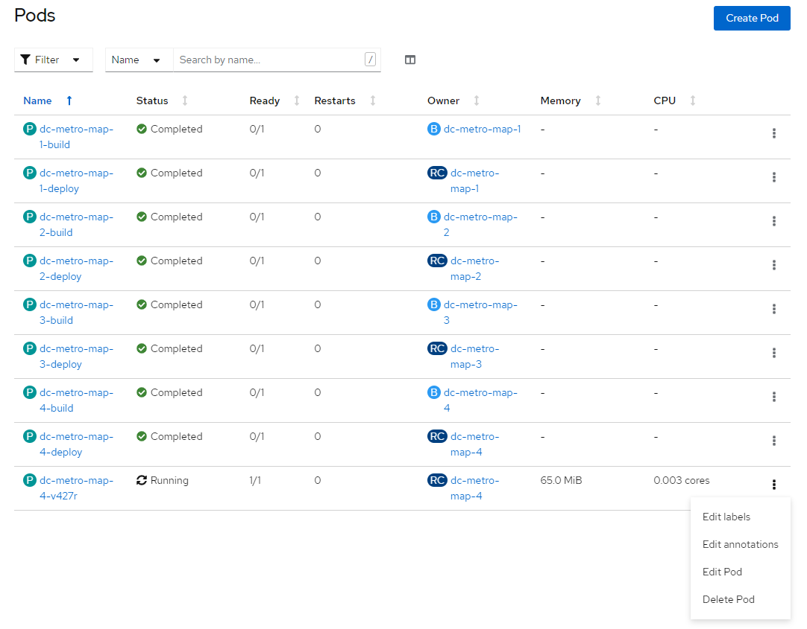
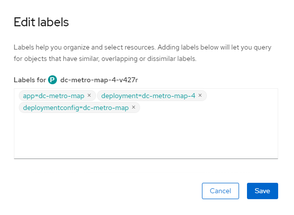
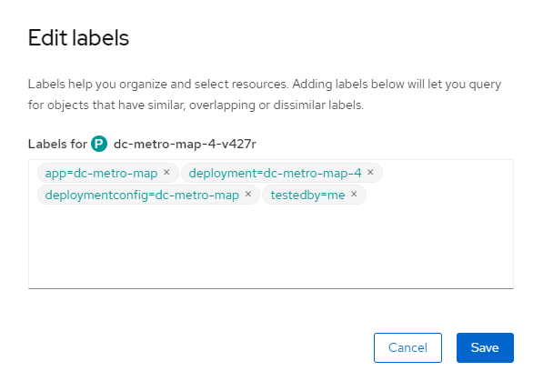
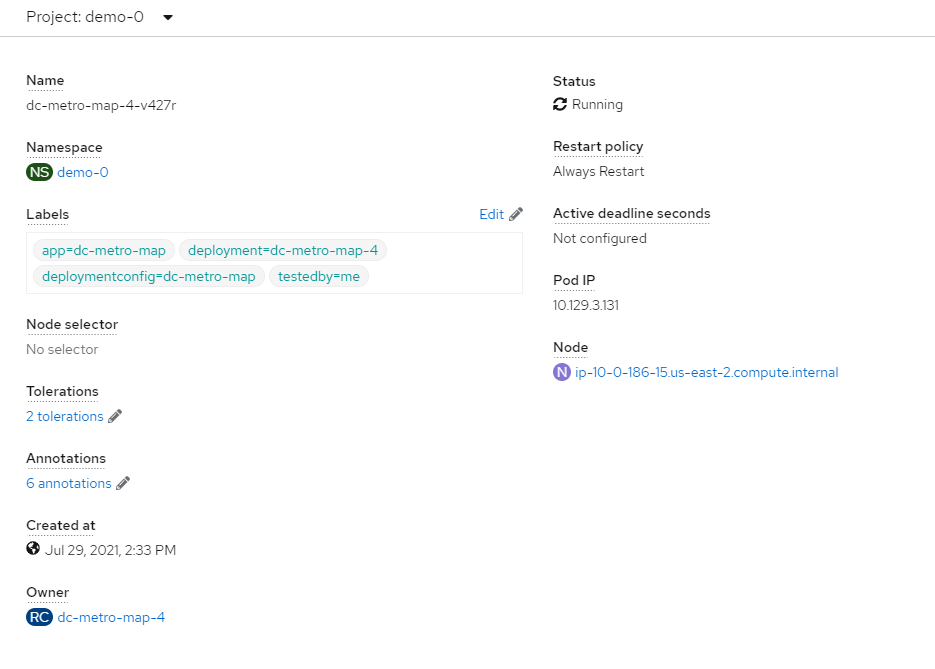

summary: Lab 7 Openshift 4 101 w/Dynatrace Labels (Optional)
id: redhat-lab7
categories: modernization
tags: openshift
status: Published
authors: Michael Villiger
Feedback Link: https://github.com/dt-alliances-workshops/claat-mockup

# Lab 7 Openshift 4 101 w/Dynatrace Labels (Optional)

## Labels
This is a pretty simple lab, we are going to explore labels.  You can use labels to organize, group, or select API objects. 

For example, pods are "tagged" with labels, and then services use label selectors to identify the pods they proxy to. This makes it possible for services to reference groups of pods, even treating pods with potentially different docker containers as related entities.

## CLI Steps (Optional)

### Labels on a pod
In a previous lab we added our web app using a S2I template.  When we did that, OpenShift labeled our objects for us.  Let's look at the labels on our running pod.

- Goto the terminal and try the following:

    ```bash
    $ oc get pods
    $ oc describe pod/dc-metro-map-4-v427r | grep Labels: --context=4
    Namespace:    demo-0
    Priority:     0
    Node:         ip-10-0-186-15.us-east-2.compute.internal/10.0.186.15
    Start Time:   Thu, 29 Jul 2021 19:33:13 +0000
    Labels:       app=dc-metro-map
                deployment=dc-metro-map-4
                deploymentconfig=dc-metro-map
    Annotations:  k8s.v1.cni.cncf.io/network-status:
                    [{
    ```

You can see the Labels automatically added contain the app, deployment, and deploymentconfig.  Let's add a new label to this pod.


1. Add a label

    ```bash
    $ oc label pod/<POD NAME> testyear=2021 testedby=me
    ```

1. Look at the labels

    ```bash
    $ oc describe pod/<POD NAME> | grep Labels: --context=4
    Namespace:    demo-0
    Priority:     0
    Node:         ip-10-0-186-15.us-east-2.compute.internal/10.0.186.15
    Start Time:   Thu, 29 Jul 2021 19:33:13 +0000
    Labels:       app=dc-metro-map
                deployment=dc-metro-map-4
                deploymentconfig=dc-metro-map
                testedby=me
                testyear=2021
    ```

## Web Console Steps (Optional)

### Labels on a pod
In a previous lab we added our web app using a S2I template.  When we did that, OpenShift labeled our objects for us.  Let's look at the labels on our running pod.

1. Click "Workloads", click on "Pods", then click on the three vertical dots next to the "Running" pod.  Consider filtering for Status "Running".

    
1. Click "Edit Labels"

    
1. Here, at the top, you can see the labels on this pod

1. Add 'testedby=me' and click "Save"

    
1. Your updated label will show up in the running pods.

1. Select Workloads -> Pods -> dc-metro-map (Running POD), then scroll down to "Labels"

    

## Summary

That's it for this lab. Now you know that all the objects in OpenShift can be labeled.  This is important because those labels can be used as part of your CI/CD process.  An upcoming lab will cover using labels for Blue/Green deployments. Labels can also be used for running your apps on specific nodes (e.g. just on SSD nodes or just on east coast nodes).  


