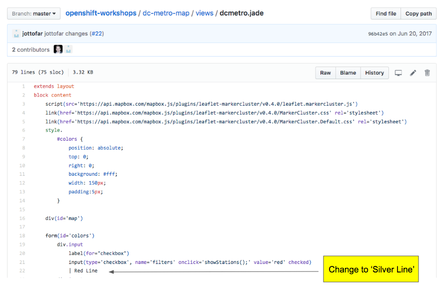
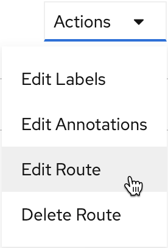
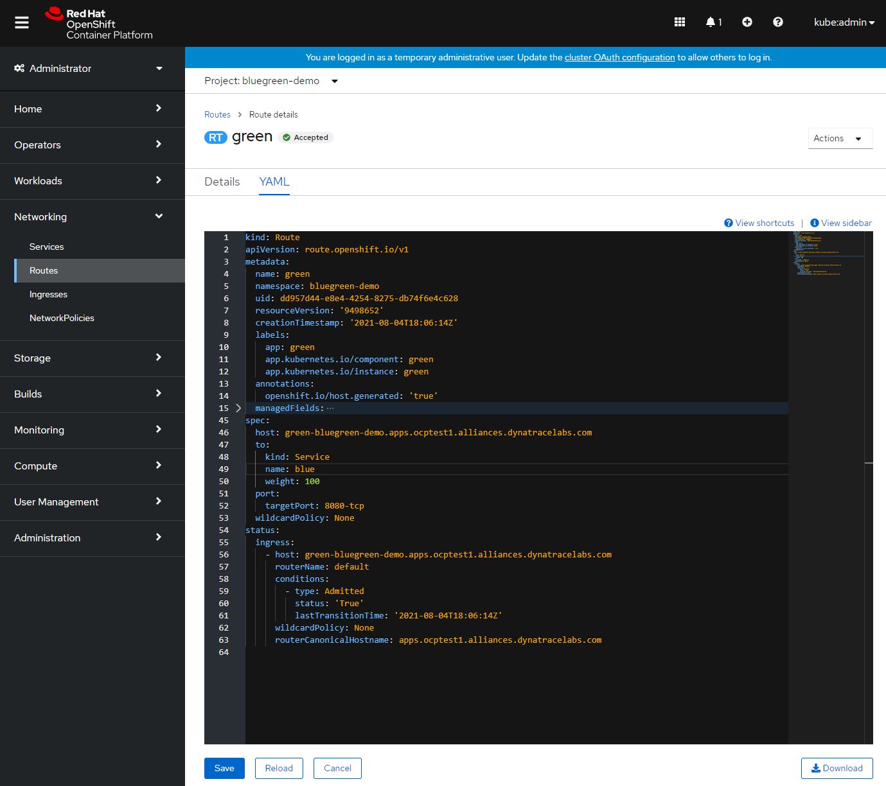

summary: Lab 8 Openshift 4 101 w/Dynatrace Blue | Green Deployment (Optional)
id: redhat-lab8
categories: modernization
tags: openshift
status: Published
authors: Michael Villiger
Feedback Link: https://github.com/dt-alliances-workshops/claat-mockup

# Lab 8 Openshift 4 101 w/Dynatrace Blue | Green Deployment (Optional)

## Blue | Green Deployments

When implementing continuous delivery for your software one very useful technique is called Blue/Green deployments.  It addresses the desire to minimize downtime during the release of a new version of an application to production.  Essentially, it involves running two production versions of your app side-by-side and then switching the routing from the last stable version to the new version once it is verified.  Using OpenShift, this can be very seamless because using containers we can easily and rapidly deploy a duplicate infrastructure to support alternate versions and modify routes as a service.  In this lab, we will walk through a simple Blue/Green workflow on OpenShift.

## Lets deploy an application
To demonstrate Blue/Green deployments, we'll again use the DC Metro application and adjusting some of the text elements on the page. Using your GitHub account, please fork the following [https://github.com/RedHatGov/openshift-workshops](https://github.com/RedHatGov/openshift-workshops) project.

You should be comfortable deploying an app at this point, but here are the steps anyway, this lab uses the same forked project from lab 5

- Goto the terminal and type these commands:

    ``` bash
    $ oc new-project bluegreen-demo
    $ oc new-app --name=green https://github.com/your-github-uid-goes-here/openshift-workshops --context-dir=dc-metro-map
    $ oc expose service green
    ```
    _Note that we exposed this application using a route named "green". Wait for the application to become available, then navigate to your application and validate it deployed correctly._

## Release a new version of our app and test it in the same environment
What we'll do next is create a new version of the application called "blue". The quickest way to make a change to the code is directly in the GitHub web interface. In GitHub, edit the dc-metro-map/views/dcmetro.jade file in your repo. 



We can change the text labels indicated by name of a color. If you want to change the label for the "Red Line", change line 22 from "Red Line" to  "Silver Line". These changes will be easily viewable on the main screen on the upper right of the application. 

Use the same commands to deploy this new version of the app, but this time name the service "blue". No need to expose a new route -- we'll instead switch the "green" route to point to the "blue" service once we've verified it.

- Goto the terminal and type these commands:

    ``` bash
    $ oc new-app --name=blue https://github.com/your-github-uid-goes-here/openshift-workshops --context-dir=dc-metro-map
    ```

Wait for the "blue" application to become available before proceeding.

## Switch from Green to Blue
Now that we are satisfied with our change we can do the Green/Blue switch.  With OpenShift services and routes, this is super simple.  Follow the steps below to make the switch, since this is a short exercise both CLI and Web Console based methods are outlined below, choose the one you prefer.:

## CLI Steps

1. Goto the terminal and type the following:

    ``` bash
    $ oc edit route green
    ```

1. This will bring up the Route configuration yaml. Edit the element "spec:". On the "to:" "name:" line, change its value from "green" to "blue":<br>  

    #### Example Before:
    ```bash
    spec:
        host: green-bluegreen-demo.apps.ocptest1.alliances.dynatracelabs.com
        port:
        targetPort: 8080-tcp
        to:
        kind: Service
        name: green
        weight: 100
        wildcardPolicy: None
    ```

    #### Example After:
    ```bash
    spec:
        host: blue-bluegreen-demo.apps.ocptest1.alliances.dynatracelabs.com
        port:
        targetPort: 8080-tcp
        to:
        kind: Service
        name: blue
        weight: 100
        wildcardPolicy: None
    ```

## Web Console Steps

1. As "Administrator", in the "bluegreen-demo" project, navigate to "Routes", and select "green"

    
1. In the Route detail page, click on Actions > Edit:<br>

    
1. Edit the Route: change the "spec:" -> "to:" section "name:" from "green" to "blue", and click "Save"

    


## Summary
Pretty easy, right?

If you want to read more about Blue/Green check out [this post](http://martinfowler.com/bliki/BlueGreenDeployment.html) with a longer description as well as links to additional resources.


